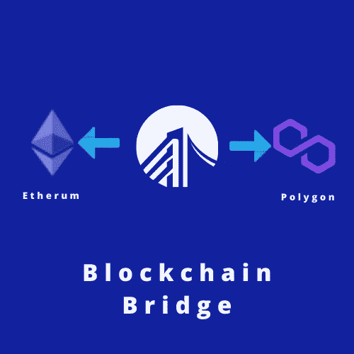
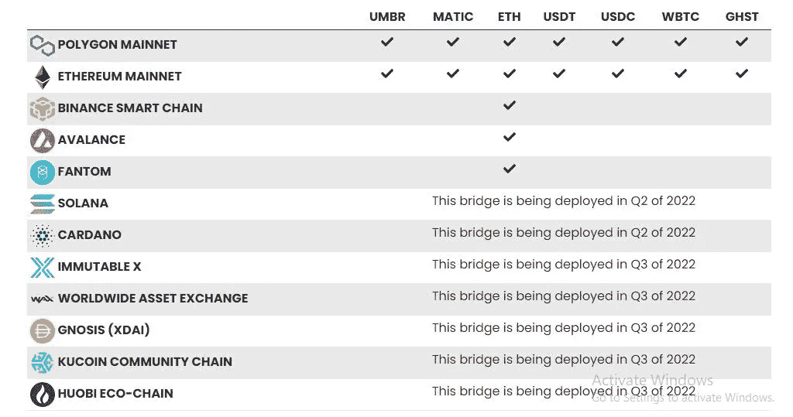

# 跨链桥的未来

> 原文：<https://medium.com/coinmonks/the-future-of-cross-chain-bridge-d4100f5f4bfa?source=collection_archive---------17----------------------->

**什么是跨链桥？**

跨链桥是一种允许用户在不同区块链网络之间转移资产和数据的系统——例如，[以太坊](https://ethereum.org/en/)和[波尔卡多](https://polkadot.network/)或[多边形](https://polygon.technology/)和[雪崩](https://www.avax.network/)。

**为什么跨链桥接在加密领域至关重要？**

随着许多加密货币在全球范围内推出，区块链面临的最大问题是无法协同工作。默认情况下，独立的区块链无法相互通信。每个网络使用不同的算法、地址格式和体系结构。

例如，如果你有 ETH，但你想与建立在 Solana 上的 dApp 进行交互，你必须在一个集中的交换平台上把 ETH 转换成 SOL，比如比特币基地的[或者币安的](https://www.coinbase.com/)[然后把结果令牌发送到你的 Solana 钱包地址。](http://binance.com/)

**什么是跨链桥？**

这是一个允许用户通过在不同的区块链中启用令牌转移、智能合约和数据交换进行转移而不损害安全性的系统。

**波尔卡多特桥**

Polkadot 被设计为一种底层基础设施，以实现多链未来所需的可扩展性、互操作性和安全性，允许不同的第 1 层副链在生态系统内相互交互和通信。但是 Polkadot 也允许 parachains 和外部网络，如比特币或以太坊，通过桥梁进行互操作。已经开发了或正在开发几个桥来连接 Polkadot 和这样的外部网络。因为 Polkadot 被设计成最小化数字系统中的中介，所以在生态系统中通常更喜欢无信任桥。

**翁布里亚纳尔尼桥**

[Umbria Narni bridge](https://umbria.network/) 是一个跨链资产桥，支持加密货币网络之间的资产迁移。用户可以使用 Narni bridge 的流动性桥接模型无缝地跨链移动他们的资产。与验证器驱动的桥相比，桥接非常快，费用也非常低。

建立在 Polygon 基础上的 Umbria 生态系统有三个主要协议:

1.  **一座跨链资产桥**:实现在原本不兼容的区块链和加密货币网络之间快速、廉价的资产转移。
2.  **赌注池**:用户可以通过向纳尼桥提供流动性来赚取他们加密资产的利息
3.  **去中心化交易所(DEX)** :一个自动化的流动性协议，由一个恒定的产品公式驱动，使用智能合约部署，完全由链上管理。提供快速廉价的令牌交换

Narni 桥支持不同网络上的不同资产

**为什么翁布里亚纳尼桥是最便宜最快的跨链桥？**

[Umbria Network 的 Narni bridge](https://umbrianetwork.medium.com/the-cheapest-and-fastest-cross-chain-bridge-narnis-liquidity-lending-protocol-8bdfa6d57f2e) 是一种资本高效的多链资产桥，支持在不同区块链之间快速、廉价、轻松地迁移加密资产。它目前促进以太坊 Mainnet 和币安智能链、Polygon、Avalanche (AVAX)和 Fantom (FTM)之间最快和最便宜的双向桥接；Arbitrum、Solana 和 Cardano 即将上线，更多的第 2 层网络和以太坊扩展解决方案正在筹备中。

*   与传统的验证器驱动的铸造/燃烧、锁定/解锁桥相比，流动性借贷协议有助于降低链之间转移资金的成本。
*   每小时一次，费用奖励会自动添加到流动性提供商的赌注余额中。这导致赌注余额自动复利，并随着时间的推移累积总池费奖励的更大比例。

***关键外卖:-***

交叉链增长迅速，因为它们有助于解决不同区块链通信之间的可扩展性问题。

此外，像 Umbria 这样的项目将通过进一步的合作继续增强其在该领域的影响力。它的最新合作伙伴(下面将详细介绍)支持 Narni Bridge，并将其推广到他们的社区，用于桥接加密。

***参考文献:-***

1.  [https://www . prnewswire . com/news-releases/online-区块链-PLC-umbria-network-partners-with-polygon-alliance-to-support-NFT-and-defi-projects-301479033 . html](https://www.prnewswire.com/news-releases/online-blockchain-plc-umbria-network-partners-with-polygon-alliance-to-support-nft-and-defi-projects-301479033.html)
2.  翁布里亚网络[白皮书](https://umbria.network/assets/Umbria_Network_Whitepaper.pdf)
3.  案例研究；- [桥](https://umbrianetwork.medium.com/how-to-bridge-eth-from-ethereum-to-polygon-matic-1a9ec5552842) ETH 从以太坊到多边形

> *加入 Coinmonks* [*电报频道*](https://t.me/coincodecap) *和* [*Youtube 频道*](https://www.youtube.com/c/coinmonks/videos) *了解加密交易和投资*

# 另外，阅读

*   [Bookmap 点评](https://coincodecap.com/bookmap-review-2021-best-trading-software) | [美国 5 大最佳加密交易所](https://coincodecap.com/crypto-exchange-usa)
*   最佳加密[硬件钱包](/coinmonks/hardware-wallets-dfa1211730c6) | [Bitbns 评论](/coinmonks/bitbns-review-38256a07e161)
*   [新加坡十大最佳加密交易所](https://coincodecap.com/crypto-exchange-in-singapore) | [购买 AXS](https://coincodecap.com/buy-axs-token)
*   [红狗赌场评论](https://coincodecap.com/red-dog-casino-review) | [Swyftx 评论](https://coincodecap.com/swyftx-review) | [CoinGate 评论](https://coincodecap.com/coingate-review)
*   [投资印度的最佳密码](https://coincodecap.com/best-crypto-to-invest-in-india-in-2021)|[WazirX P2P](https://coincodecap.com/wazirx-p2p)|[Hi Dollar Review](https://coincodecap.com/hi-dollar-review)