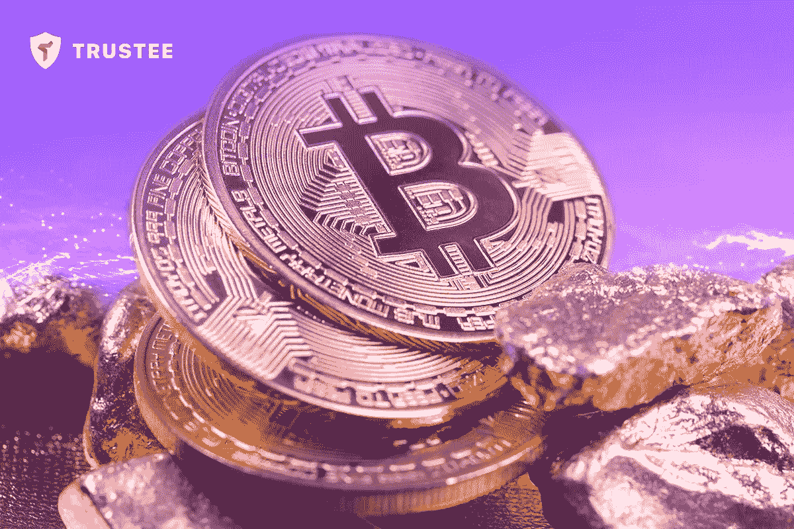

# 2022 年加密货币的未来

> 原文：<https://medium.com/coinmonks/the-future-of-cryptocurrency-in-2022-92b96e4444ac?source=collection_archive---------28----------------------->

2022 年加密货币的未来看起来很乐观。你想知道为什么吗？阅读这篇文章，了解加密货币市场的未来。我们还描述了几种有前途的硬币和代币

自 2016 年以来，关于加密货币市场的前景一直存在无休止的争论。一些人认为这都是泡沫，而另一些人则对独特的投资机会充满信心。不幸的是，我们无法准确预测未来比特币和其他加密货币的价值。

但是我们确实知道主要的去中心化数字硬币是如何在其存在期间价格上涨了几万个百分点的。秘密投资让成千上万的人变得富有。这个市场的潜力还没有被挖掘出来。你想知道更多吗？我们为您准备了一篇关于 2022 年加密货币未来的文章。

# 加密货币的未来预测

在十多年的时间里，加密货币市场起伏了几千个百分点。现在，分散代币在全球金融市场上的波动性最高。这是因为这类资产没有监管者或发行者。

汇率完全是由市场条件决定的。当需求减少时，代币的价值下降，当需求恢复时，价值又上升。因此，如果对数字货币的需求上升，你可以肯定你的加密货币投资将为你带来实际收入。

2022 年应该投资加密货币的原因有很多:

*   通货膨胀的持续增长(特别是，即使在经济最发达的国家，如美国和欧盟，也能观察到通货膨胀)；
*   全球经济危机的风险；
*   军事和政治风险；
*   从全球投资基金和投资者那里寻找被动收入和风险分散的替代来源。

在加密货币诞生之前，投资工具是公司股票、原材料和各种证券。结果，数十亿自由资本流入股票和商品市场。

然而，石油、天然气、股票和证券过于依赖政治和经济因素。此外，现在还有加大资本管制的趋势。这意味着投资者需要以纳税义务和法律难题的形式支付额外费用。

由于缺乏监管机构，加密货币消除了这些缺点。此外，特定代币的创建者最初将有限数量的发行放入系统中。因此，硬币的数量总是有限的，消除了任何通货膨胀和投机的可能性。

*加密货币的优势有:*

*   以电子形式免费分发；
*   增加了使用代币购买日常商品的方式；
*   最大限度的安全(匿名和加密)；
*   易于购买、出售和交易加密货币(特别是，您可以使用功能受托人с加密货币钱包进行交易)

**了解区块链系统为数字货币的所有者提供最大的安全性是很重要的。**同时，客户获得保密性和匿名性。您无法从区块链系统中找到硬币发送者或接收者的个人信息。

正因为如此，许多企业家和投资者将他们的部分资本转移到这一货币体系，特别是为了尽可能减少纳税义务。毕竟，如果你把钱存在银行，你就无法隐藏它。所以，你只需要选择最好的加密货币来购买。

# 加密货币会在金融市场上取代黄金吗？

**金融市场的趋势导致加密货币将成为未来价值的衡量标准，就像黄金一样。**这是因为加密货币具有黄金的属性。所以，它有一个根本的价值，在现代社会它不能降到零:

*   与黄金一样，加密货币在世界不同地区“开采”，不受任何特定机构或国家的控制。
*   大多数加密货币都是限量发行的。
*   购买力仅仅基于自由市场参与者的协议。
*   代币可以产生被动收入(例如，您可以通过在受托人加密货币钱包中下注获得额外收入)。
*   代币可以是一种匿名支付方式。
*   在结算过程中不需要使用中介。

2021-2022 年，出现了相当多的加密算法得到改进的“更快”的加密货币。这一趋势将继续下去。**在未来，数字代币不仅可以被用户和公司使用，也可以被国家和政治联盟用于全球交易。**

# 未来最有价值的加密货币

关于未来最有价值的加密货币有很多争论。一些人认为，比特币将保持其领导地位，仍然是最有价值的去中心化货币。然而，一些专家认为加密货币的未来有些不同。毕竟，越来越多基于更精简、技术更先进的区块链的代币正在涌现。

我们分析了不同的加密货币，并准备了未来最有前途的硬币的描述:

> 1.以太坊。
> 
> 2.比特币。
> 
> 3.创。
> 
> 4.涟漪。
> 
> 5.莫内罗。

根据专家和用户的说法，这些加密货币在未来具有最大的增长前景。这是因为它们受到独特的共识算法和加密技术的保护。因此，这些硬币未来可能在加密货币投资者中具有一贯的高流动性和价值。

# 2022 年的安全投资、加密货币持有和交易

仅仅了解未来最有前景的加密货币是不够的。您还需要注意如何安全地购买、交换和出售代币。使用安全的加密货币钱包，如 [Trustee](https://trusteeglobal.com) 。这种加密货币钱包的主要优势是能够在 APY 上赚钱，佣金低，并支持不同的支付系统。很方便！这使得加密货币在今天和未来更容易获得。

# 简历

分散硬币有缺点。但随着技术和数字化的发展，它们在逐渐减少。所以，你可以 100%确定这种金融工具会增值。最有信誉的机构投资者和专家预测了乐观的加密货币未来预测。我们建议现在就开始研究这个市场，投资最有前景的硬币。这会让你将来变得富有。但是你需要使用一个可靠安全的加密货币平台来做到这一点。受托人使加密货币交易更有利可图。

> *加入 Coinmonks* [*电报频道*](https://t.me/coincodecap) *和* [*Youtube 频道*](https://www.youtube.com/c/coinmonks/videos) *了解加密交易和投资*

# 另外，阅读

*   [Bookmap 评论](https://coincodecap.com/bookmap-review-2021-best-trading-software) | [美国 5 大最佳加密交易所](https://coincodecap.com/crypto-exchange-usa)
*   最佳加密[硬件钱包](/coinmonks/hardware-wallets-dfa1211730c6) | [Bitbns 评论](/coinmonks/bitbns-review-38256a07e161)
*   [新加坡十大最佳加密交易所](https://coincodecap.com/crypto-exchange-in-singapore) | [购买 AXS](https://coincodecap.com/buy-axs-token)
*   [红狗赌场评论](https://coincodecap.com/red-dog-casino-review) | [Swyftx 评论](https://coincodecap.com/swyftx-review) | [CoinGate 评论](https://coincodecap.com/coingate-review)
*   [投资印度的最佳密码](https://coincodecap.com/best-crypto-to-invest-in-india-in-2021)|[WazirX P2P](https://coincodecap.com/wazirx-p2p)|[Hi Dollar Review](https://coincodecap.com/hi-dollar-review)