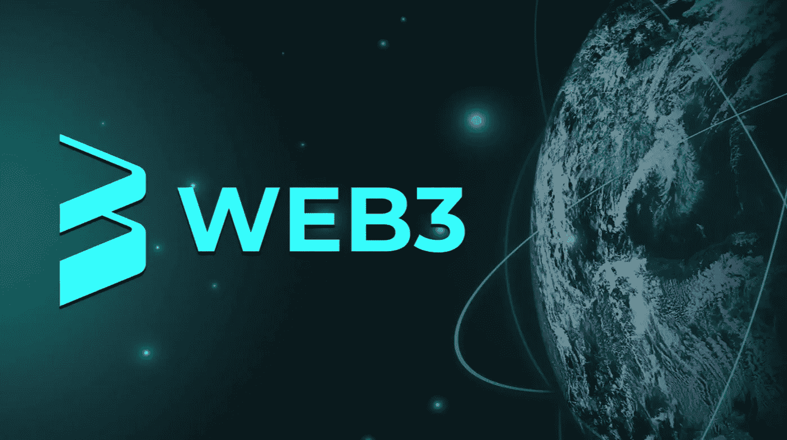
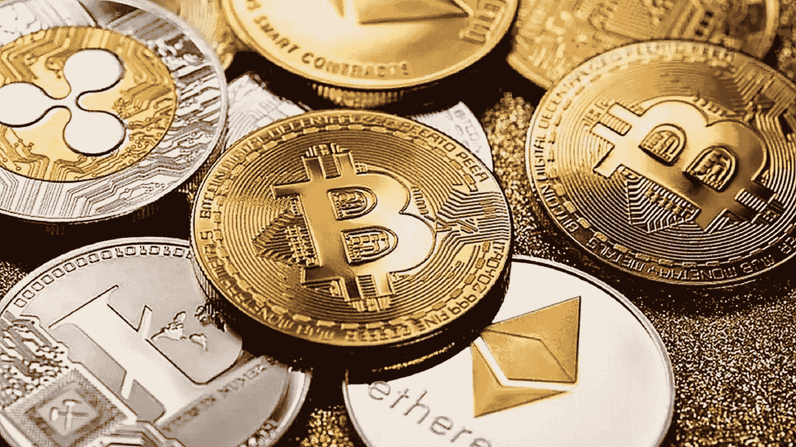

# 我们所知的货币未来:加密货币、区块链和网络 3

> 原文：<https://medium.com/coinmonks/the-future-of-currency-as-we-know-it-crypto-currency-block-chain-and-web3-130b3fc9c229?source=collection_archive---------37----------------------->

## 作者:Iliyan Moloo

Web 2.0 是我们都很熟悉的当前版本的互联网(一个经常与 Web 互换使用的术语)，而 Web 3.0 代表了它的下一个阶段( [Investopedia](https://www.investopedia.com/web-20-web-30-5208698) )下一阶段是什么？好吧，下一个阶段将是区块链。区块链是一个记录信息的系统(如在线交易、确认、工作证明、在线等)。)的方式，使得改变、侵入或欺骗系统变得困难或不可能。区块链的主要卖点之一(最终也是它赢得“Web3”称号的原因)是区块链如何安全地保存您的信息。

麻省理工学院的研究人员进行了一项实验，试图证明脸书的安全薄弱且存在缺陷。研究人员还试图证明“社交媒体用户容易受到泄露的影响，因为他们在网上过度分享信息。”([团队密码](https://teampassword.com/blog/facebook-hacks-a-history-of-security-breaches-at-facebook))研究人员开发了一种可以下载公开发布信息的脚本。2005 年 12 月发生的第一起已知的脸书安全漏洞就是这次实验的结果。安全墙的漏洞让互联网用户对 Web2 感到恐惧。

好了，现在我们知道了为什么人们想离开 Web2，让我们看看 Web3 的一些特性，特别是区块链。我们大多数人都听说过加密货币，但我们都知道它是什么吗？下面是一个快速运行:“加密货币是一个加密的数据字符串，表示一个货币单位。它由一个名为“区块链”的点对点网络进行监控和组织，该网络还充当交易(如购买、出售和转移)的安全分类账([趋势科技](https://www.trendmicro.com/vinfo/us/security/definition/cryptocurrency))加密货币的一些例子有:

*   以太坊
*   莱特币
*   卡尔达诺
*   波尔卡多(点)
*   比特币现金(BCH)
*   恒星(XLM)
*   Dogecoin (DOGE)
*   币安硬币(BNB)

因此，当你购买一种加密货币时，区块链会记录交易历史，这样我就可以准确地追踪它的来源。这使得某人很难伪造或破解加密货币。鉴于互联网的无国界性质，我可以在世界任何地方买卖加密货币，使其成为一种国际货币。有一些值得信赖的交易平台可以用来买卖加密货币。它们包括:

*   [比特币基地](https://www.coinbase.com/partner/brand-v3?utm_source=google_search_b&utm_medium=cpc&utm_campaign=16219887790&utm_content=131228224257&utm_term=coinbase&utm_creative=582208283668&utm_device=m&utm_placement=&utm_network=g&utm_location=1001976&gbraid=0AAAAADG_HHUcjoM6DIUw3RxU936QdmDqL&gclid=CjwKCAiAprGRBhBgEiwANJEY7E9ALBaiEaEgwwdGugHI43tNhoB0ci2L5iW3Tu3j4Vw1HCRCvvbXOBoCW4kQAvD_BwE)
*   [罗宾汉](https://robinhood.com/us/en?utm_source=google&utm_campaign=8140492048&utm_content=84157066037&utm_term=397570358802__robinhood__e&utm_medium=cpc&gbraid=0AAAAADNGvrP6G5Aj_0eCBIBl1kB7UmXT5&gclid=CjwKCAiAprGRBhBgEiwANJEY7CqXm_SzE3xGWIDwxYtUhG8nwuEMNYun_YWJFRq_ezvKqLSgsMdbIxoCHmkQAvD_BwE)
*   [双子座](https://www.gemini.com)
*   [现金 app](https://cash.app)
*   [Bisq](https://bisq.network)
*   [币安](https://www.binance.com/en)

考虑到你现在可以使用加密货币购买从披萨到汽车的任何东西，以及比特币在某些国家(见萨尔瓦多)开始被接受为官方法定货币，我认为 Web3 和加密货币正在迅速成为主流。但是让我问你，Web3 会像 Web 2.0 一样无处不在吗？你会买加密货币吗？如果你真的买了，你相信哪一个？哪个会失败？时间会证明一切。

> *加入 Coinmonks* [*电报频道*](https://t.me/coincodecap) *和* [*Youtube 频道*](https://www.youtube.com/c/coinmonks/videos) *了解加密交易和投资*

# 另外，阅读

*   [3 商业评论](/coinmonks/3commas-review-an-excellent-crypto-trading-bot-2020-1313a58bec92) | [Pionex 评论](https://coincodecap.com/pionex-review-exchange-with-crypto-trading-bot) | [Coinrule 评论](/coinmonks/coinrule-review-2021-a-beginner-friendly-crypto-trading-bot-daf0504848ba)
*   [莱杰 vs n rave](/coinmonks/ledger-vs-ngrave-zero-7e40f0c1d694)|[莱杰 nano s vs x](/coinmonks/ledger-nano-s-vs-x-battery-hardware-price-storage-59a6663fe3b0) | [币安评论](/coinmonks/binance-review-ee10d3bf3b6e)
*   [Bybit 交易所评论](/coinmonks/bybit-exchange-review-dbd570019b71) | [Bityard 评论](https://coincodecap.com/bityard-reivew) | [Jet-Bot 评论](https://coincodecap.com/jet-bot-review)
*   [3 commas vs crypto hopper](/coinmonks/3commas-vs-pionex-vs-cryptohopper-best-crypto-bot-6a98d2baa203)|[赚取加密利息](/coinmonks/earn-crypto-interest-b10b810fdda3)
*   最好的比特币[硬件钱包](/coinmonks/hardware-wallets-dfa1211730c6) | [BitBox02 回顾](/coinmonks/bitbox02-review-your-swiss-bitcoin-hardware-wallet-c36c88fff29)