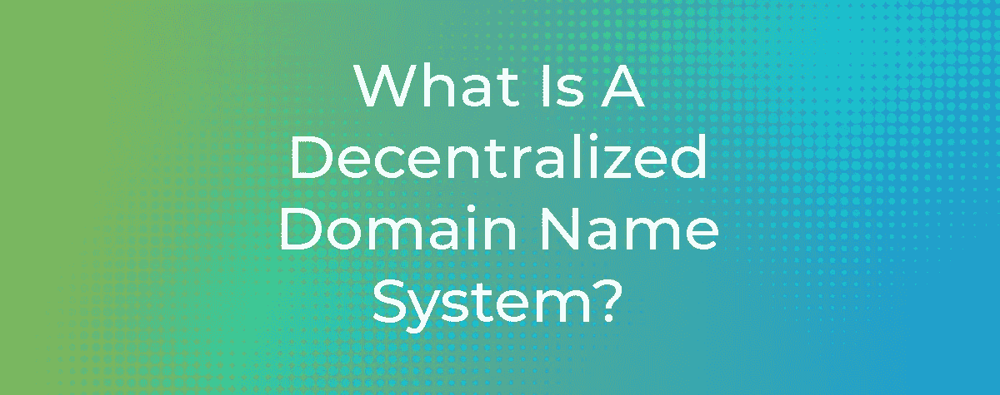
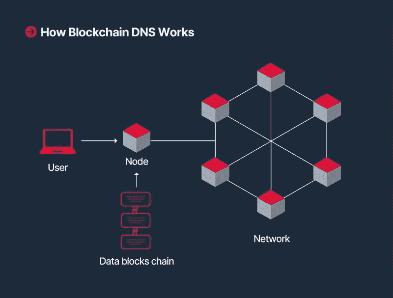

# 分散式名称服务的未来

> 原文：<https://medium.com/coinmonks/the-future-of-decentralized-name-services-4ebf2eb28fc4?source=collection_archive---------15----------------------->

虽然有些人可能知道什么是域名，但更多的人可能不知道它们到底是什么。在我们进入这篇文章之前，让我们做一个小练习。本文托管在 Medium 上。如果你试图复制这篇文章的链接，它会弹出这样的内容:“*https://****medium.com****/@ africablockchain institute/Solana-v-the-scalability-tri lema-67 e 59 ee 92 f 77*”。我们的重点是文本中突出显示的部分:*medium.com*。这是一个域名的例子。其他域名扩展包括。组织，。网，。gov，。博客，。edu。新闻，。co 和许多其他公司。我们可以说域名是互联网上房子的地址。Medium 作为*medium.com*的所有者，有权使用它，编辑它的内容，并简化它对用户的服务。

**从 Web 2.0 到 Web 3.0**

识别网站并不总是这么容易。在此之前，网站只能通过 IP 地址来识别。IP 地址看起来像这样:192.158.1.38。想象一下，如果你想访问你最喜欢的博客时，你必须记住这串数字。那会很麻烦。现在，在这些随机 IP 地址的地方，每个人，包括不懂技术的人，都可以识别互联网上的网站。要拥有一个域名，必须从域名注册提供商那里购买，然后由域名注册提供商向互联网名称与数字地址分配机构(ICANN)注册。域名价格从几美元到几千美元不等。域名的受欢迎程度和可用性决定了价格。

虽然这项技术自 2009 年以来就已经完全为人所知，但区块链技术仍然是新颖的，具有类似的发展和公众接受度，就像处于早期阶段的互联网一样。有了它，一个新的互联网时代出现了。许多倡导者称这个新时代为 web 3.0。Web 3.0 是现有互联网技术与区块链优势的结合。web 2.0 使用集中的域名注册提供商和地址运行，而 web 3.0 则引入了去中心化。先是比特币，然后是去中心化应用(DApps)。一起看看 [PoolTogether](https://app.pooltogether.com/deposit?network=polygon) 感受一下 DApp 的样子。DApps 的功能类似于传统的 web 应用程序，主要区别在于后端是建立在一个分散的服务器上，而不是一个集中的服务器上。以太坊是一种分散式服务器，本质上是 DApps 的发源地。DApps 最大的好处之一是它们不归任何人所有，并且由于其分散化的特性，几乎没有停机时间。

**什么是分散式名称服务？**

在 web 3.0 应用程序的新世界中，分散式名称服务将成为域名服务器的新形式。2017 年，[以太坊名称服务(ENS)](https://ens.domains/) ，首个去中心化名称服务器，由 Nick Johnson 和 Alex Van de Sande 创立。就像域名服务器一样，ENS 的目标是简化 web 3.0 中的访问和功能。根据其文档，“ENS 的工作是将' alice.eth '等人类可读的名称映射到机器可读的标识符，如以太坊地址、其他加密货币地址、内容哈希和元数据。”

使用 ENS，用户有机会创建 web 3.0 域名，这些域名可以与各种个人信息相关联。这可能包括各种加密货币的钱包地址、头像、用户名所有者的描述、web 2.0 域名服务、Twitter 帐户、Telegram 帐户、Reddit 帐户和其他几个领域。ENS 仅支持。eth 域名扩展。ENS 用户名的一个例子是 *bob.eth.* 要向 bob 发送加密货币，所需要的就是这个已经链接到他的地址的用户名，而不是一个令人困惑的地址，如:3 fzbgi 29 cpjq 2 gjdwv 8 eyhujjnkltktzc 5。除了汽油费，ENS 名称注册费如下:

*   5+性格。eth 名称:每年 5 美元。
*   4 性格。eth 名称:每年 160 美元。
*   3 性格。瑞士联邦理工学院每年的学费是 640 美元。

域名必须每年或在费用到期后更新。ENS 将域名注册提供商排除在外，代之以智能合同。这样，任何人都可以直接购买用户名，而不需要这些中介。用户也可以把他们域名的子域名直接卖给那些想购买它们的人。子域示例是: *pay.bob.eth* 。但是，用户不可能将该用户名用于除域名销售之外的任何其他目的。ENS 和星际文件系统(IPFS)之间的伙伴关系将实现分散网站的梦想。

ENS 为去中心化的名称服务铺平了道路之后，其他的也开始兴起。目前， [Bonfida](https://bonfida.org/#/) 已经执行了一个类似于 ENS 的命名服务，它是建立在 Solana 之上的。与。ENS 上支持的 eth 域名，Bonfida 为注册人提供。sol 名称。收购带来的好处。使用 Bonfida 解决域名问题包括较低的汽油费，以及对所有购买域名的无过期政策。汽油费可以低至 0.1 美元。由于大量购买域名的可能性很高，该平台具有拍卖功能。当用户发起注册交易时，这将在 7 天的拍卖中公布，其他用户可以对该用户名进行投标。无人挑战的最高出价者获得这个名字。用户还可以通过这项服务将加密货币钱包地址替换为他们的 Twitter 手柄。

除了 ENS 和 Bonafida，还有允许用户使用的[不可阻挡域名](https://unstoppabledomains.com/?ref=a3eabd527256482)。zil，。加密。比特币，。钱包，。nft，。道域名。用户可以将这些名称链接到他们的加密地址、分散的网站，也可以选择成为域名卖家。

**分散式名称服务在未来的可行性如何？**

首先，这些域名本质上是不可替代的令牌(NFT)。转移. eth 域名类似于将 NFT 从一个钱包转移到另一个钱包。分散的名字也可以在各种 NFT 市场上买到，如 Open Sea 和 Rarible。域名抢注已经呈上升趋势。在炒作之后，许多个人购买名人和流行品牌的用户名，并在市场上列出。例如，一个名为 *nintendo-us.eth* 的任天堂域名已经被注册，并以一个荒谬的价格在公海上列出。不能保证这个名字是任天堂自己注册的。耐克的. eth 域名也已注册，并在本文撰写时在[上市](https://opensea.io/assets/0x57f1887a8bf19b14fc0df6fd9b2acc9af147ea85/58229628887636044882372953174745135299233155338052253949785372330985740196460)，价格为 270 万美元。这个清单还在继续。那么，是否可以说，到分散域名服务成为主流时，这些流行品牌将不得不从这些个人手中购买这些用户名的权利？

此外，可能还有隐私问题。分散式名称服务为选择注册它们的用户提供了一系列元数据。虽然这种信息的归属是基于个人的偏好，但它们仍然使用户暴露在窥探的目光之下。例如，在 ENS 网站上查看. eth 域名详细信息会泄露注册人的钱包地址。使用像 Etherscan 和 BlockExplorer 这样的工具，可以跟踪该地址的帐户余额以及从其结束时发生的每一笔交易。这些数据也可以以汇总的形式呈现，并且可以在几个月的时间内监控钱包行为。对于新用户来说，这种可能性听起来有多大吸引力？

**下一步是什么？**

不可否认的是，分散的域名服务将对区块链技术中反复出现的匿名问题有很大帮助。握手、名称币和区块链等其他发展带来了解决方案，彻底改变了域名服务的功能，并最终改变了 ICANN 本身。目前，ENS 已经迁移成为一个分散的自治组织(DAO ),早期用户有机会通过治理令牌 ENS 对协议规则进行投票。这项创新将如何发展，在很大程度上取决于监管用户行为的措施，就像今天监管互联网的方式一样。我们只能希望它能实现自己的目标，不被滥用。

*请不要忘记访问 https://africablockchain.institute/**并与我们保持联系*

***来源:** [*ENS 文档*](https://docs.ens.domains/) *，* [*什么是以太坊名称服务(ENS)？*](https://decrypt.co/resources/ethereum-name-service-ens-explained-guide-learn)*[*【索拉纳名字服务简介】*](https://bonfida.medium.com/an-introduction-to-the-solana-name-service-5e0134dbf56e)**[*ENS 名字终极指南*](/@eric.conner/the-ultimate-guide-to-ens-names-aa541586067a#:~:text=Registrant%3A%20can%20set%20the%20controller,day%20operations%E2%80%9D%20of%20the%20domain.) *。*****

> **加入 Coinmonks [电报频道](https://t.me/coincodecap)和 [Youtube 频道](https://www.youtube.com/c/coinmonks/videos)了解加密交易和投资**

# **另外，阅读**

*   **[比特币基地僵尸程序](/coinmonks/coinbase-bots-ac6359e897f3) | [AscendEX 审查](/coinmonks/ascendex-review-53e829cf75fa) | [OKEx 交易僵尸程序](/coinmonks/okex-trading-bots-234920f61e60)**
*   **[如何在印度购买比特币？](/coinmonks/buy-bitcoin-in-india-feb50ddfef94) | [WazirX 评论](/coinmonks/wazirx-review-5c811b074f5b)**
*   **[隐料斗替代品](/coinmonks/cryptohopper-alternatives-d67287b16d27) | [HitBTC 审查](/coinmonks/hitbtc-review-c5143c5d53c2)**
*   **[CBET 评论](https://coincodecap.com/cbet-casino-review) | [库科恩 vs 比特币基地](https://coincodecap.com/kucoin-vs-coinbase)**
*   **[折叠 App 审核](https://coincodecap.com/fold-app-review) | [Kucoin 交易机器人](/coinmonks/kucoin-trading-bot-automate-your-trades-8cf0ca2138e0) | [Probit 审核](https://coincodecap.com/probit-review)**
*   **[如何匿名购买比特币](https://coincodecap.com/buy-bitcoin-anonymously) | [比特币现金钱包](https://coincodecap.com/bitcoin-cash-wallets)**
*   **[币安 vs FTX](https://coincodecap.com/binance-vs-ftx) | [最佳(SOL)索拉纳钱包](https://coincodecap.com/solana-wallets)**
*   **[比诺莫点评](https://coincodecap.com/binomo-review) | [斯多葛派 vs 3 commmas vs trapanta](https://coincodecap.com/stoic-vs-3commas-vs-tradesanta)**
*   **[Capital.com 评论](https://coincodecap.com/capital-com-review) | [香港数字加密贷款平台](https://coincodecap.com/crypto-lending-hong-kong)**
*   **[如何在 Uniswap 上交换加密货币？](https://coincodecap.com/swap-crypto-on-uniswap) | [A-Ads 点评](https://coincodecap.com/a-ads-review)**
*   **[WazirX vs coin dcx vs Bitbns](/coinmonks/wazirx-vs-coindcx-vs-bitbns-149f4f19a2f1)|[block fi vs coin loan vs Nexo](/coinmonks/blockfi-vs-coinloan-vs-nexo-cb624635230d)**