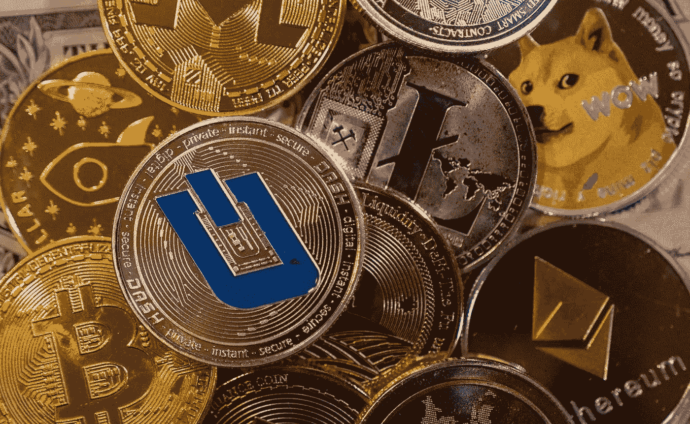

# 货币的未来

> 原文：<https://medium.com/coinmonks/the-future-of-money-546c5d1f450c?source=collection_archive---------109----------------------->

> "没有任何力量能够阻止时机成熟的想法。"
> 
> ***维克多雨果***

在一个拥有手机的人比拥有传统银行账户的人多的世界里，数字货币无疑是一个这样的想法。

金钱被认为是人类最伟大的发明之一，仅次于火和轮子。一些印刷纸张可以用来交换土地、食物或纤维等具有深层内在价值的东西，这一事实令人难以置信。认为几块低级金属值得辛苦一天的累死累活的观念不亚于上帝本身的观念。虽然货币自文明开始以来就一直存在，但研究它在 21 世纪的走向是一件有趣的事情。

和周围的一切事物一样，在互联网时代，金钱也变得数字化，这已经不是什么新闻了。然而，在这个时代，**的金融体系仍然基于一个被称为中央银行的中央权力机构的存在。几乎每个国家都有这样的银行，像印度储备银行，美国联邦银行，英国英格兰银行等等。此外，位于瑞士巴塞尔的国际清算银行是中央银行的中央银行。这些中央机构的任务基本上是决定货币政策、汇率和货币世界中的一切。这是一个高压、不透明、中央集权的系统，它傲慢地决定谁能以什么样的代价获得资金。不用说，就像所有其他政治事务一样，这个系统也会很快变得相当不公平。日益扩大的收入不平等、苦苦挣扎的经济的永久死亡螺旋、严重的学生贷款以及富裕国家在履行贸易协议方面的虚伪，都是这一体系令我们绝大多数人失望的显著标志。因此，**需要建立一个替代系统**，最好是**去中心化**，再清楚不过了。**

**数字货币是建立这种新时代去中心化金融系统的一步。除了去中心化，它的基本原则是绝对透明。在该领域目前正在探索的几种技术中，**区块链**无疑是最有前景的一种。为了理解区块链，考虑下面的例子。**

有一群朋友 A、B 和 C，他们之间经常交换金钱。他们指定一个朋友 A 作为账户管理人。每当 B 把 100 卢比转给 C 时，就会发生以下情况:

1.  100 卢比被记入 B 账户的借方，100 卢比被记入 C 账户的贷方。
2.  A 的作用是确保只有 100 卢比从各自的账户中借记和贷记。
3.  此外，A 确保 B 的账户上至少有 100 卢比。否则，交易将无法完成。

在这种情况下，A 的角色类似于中央银行，因为只有 A 有权验证交易。如果付款人的余额少于要求，银行可以选择给他贷款。同样，它也可以选择不这样做。在任何情况下，A 都比 B 和 c 更强大。这种力量的不平衡正是区块链科技所要解决的。**通过区块链技术，每一笔交易在完成之前都将经过每个参与者的验证**。没有一个单独的朋友 A、B 或 C 会负责验证和维护帐户余额，但他们所有人都会负责。同时。让我解释一下这是如何工作的。

1.  B 转账 100 卢比给 C，100 卢比将从 B 的账户借记到 C 的账户贷记。
2.  初始和最终账户余额将不仅针对参与成员(在本例中为 B 和 C)进行验证，而且针对所有 3 个成员，即 A、B 和 C。
3.  帐户验证和维护将不会只由一个成员来完成(就像 A 以前做的那样),而是由所有三个成员来完成。

你可以把它想象成一份资产负债表，由每一个参与成员而不仅仅是一个成员来维护、核实和更新。如果有新成员加入，他不仅会变得平等参与；负责所有后续交易，但也有权访问之前完成的所有交易。实际上，没有一个参与者比其他人更有权力，每个人的地位都是平等的。一个真正去中心化的系统。

这只是区块链技术如何工作的一个表现，它的表现和应用远远超出了数字货币的世界。几种数字货币，包括加密货币，如比特币、以太币、Ripple 等，都使用区块链操作。但是理解我为什么分别提到数字货币和加密货币是很重要的。

**数字货币是一个总称**，不仅包括比特币等加密货币，还包括央行支持的数字货币，通常称为**央行数字货币(CBDC)** 。但我们刚刚谈到了分权。那么 CBDC 听起来是不是有点矛盾？技术上来说是的。

CBDC 基本上是一种由中央银行发行的货币，但只是数字形式的。理解它就像印度储备银行印刷的卢比，但不是印刷钞票- RBI 只是创造了一个数字令牌。比如你的 PayTm 余额。没有实物存在但和实物货币一样好做交易。因此，CBDC 和实物货币完全一样，只是它只是以数字形式存在。这是数字货币**非去中心化**的一个例子。但是为什么央行想要进入这个数字货币的领域呢？因为这是他们在未来几十年保持对全球货币供应控制的唯一希望。全球加密货币市场已经价值 2 万亿美元，这些银行远远落后于形势。

根据国际清算银行的一份研究报告，世界上 86%的中央银行对 CBDC 表现出兴趣。少数如中华民国中央银行已经发行了 CBDC 的电子人民币(电子 CNY)。CBDCs 的最高卖点是促进金融普惠，这是事实。但与此同时，它们也有能力侵犯个人用户的隐私。此外，他们将如何使用区块链技术来促进去中心化；透明度尚不明朗。

印度政府曾计划在去年的雨季会议上提出“**加密货币和官方数字货币监管法案 2021”**，但一场激烈的议会会议使其成为不可能。通过这项法案，政府试图绕过最高法院 2018 年的一项判决。在这项判决中，最高法院推翻了印度储备银行禁止在印度进行任何形式的私人加密货币交易的决定。这实质上意味着印度的任何人都可以在不违反法律的情况下交易私人加密货币，如比特币、以太币等。这是印度储备银行不想要的。显而易见的原因是，如果私人加密货币市场增长超过极限，RBI 将最终失去对印度货币供应的控制。然而，快进到 2022 年的**预算演讲，我们尊敬的财政部长现在宣布**

*“…。转让虚拟数字资产的所得，税率为 30%*

有了这些话，我们的 FM 做了在去年的季风会上不能做的事。外交部长不仅暗示了印度税收制度的未来，还赤裸裸地强调了印度政府处理这种不可避免的未来货币的严肃意图。同样的可能后果值得认真关注。

【2021 年《加密货币和官方数字货币监管法案》试图宣布印度所有的私人加密货币都是非法的。此外，它还提议以电子卢比的形式推出 T2 CBDC。部长女士，在她的预算演讲中，**用“ *30%税级*”**取代了“*非法”*，并确保了 RBI 发行 CBDC 的想法的连续性。这种变化/连续性的优点和缺点是显而易见的。征税的私人加密货币和 RBI 发行的 CBDC 将促进金融包容性，防止逃税，扰乱黑钱的流动，并使货币市场的数据更加真实。在一个影子经济(只有现金)规模很大的国家，最后一点最为重要。因为货币政策的有效性取决于它们所依据的数据。因此，在现实情况下，印度储备银行的降息/加息并没有产生与美国联邦银行相同的效果。因此，在印度这样的经济体中，CBDC 是受欢迎的一步。拟议中的税收制度也可能是一个充满希望的开端。但是也有另一面。

如果所有的私人加密货币在印度都被课以如此高的税率，这只会将它们推向地下，进入非法交易和黑暗网络的领域。很像什么奢侈品；黄金就像 1991 年自由化改革之前一样。臭名昭著的歹徒**达乌德·易卜拉欣**曾有一句名言

*即“不再有黄金货币”，当时的财政部长马杜·丹达瓦特**废除了**、**黄金管制法案，并将黄金进口税从 20%降至 0%。哈瓦拉的黄金价格和官方的黄金价格持平，使得走私者失业。加密货币的高税收制度将迫使投资者转向暗网，就像高额进口税将买家变成走私者一样。这不仅会增加印度的网络犯罪，还会让印度在未来的金融技术上落后。***

*第二，政府什么时候会推出 CBDC——它将如何把它教给二三线城市的印度人，尤其是年轻人以外的人。*

*第三，将发行多少数量的中央银行衍生债券。今天，卢比纸币的印刷考虑到了货币供应和通货膨胀。在“铸造”这种数字货币时，需要记住哪些参数？流通中的两种法定货币将如何决定货币政策？*

*第四，我们如何保护人们的生活储蓄免受勒索软件的攻击？作为一个社会，我们是否有足够的技术装备和教育来应对即将打开的网络攻击的闸门？还有更多这样的问题，我们现在可能还无法理解。*

*未来的货币确实会与现在的货币不同。今天的全球金融体系与二战后一样，站在同一个十字路口。虽然印度在 1945 年布雷顿森林会议上微不足道，没有任何发言权，但现在形势已经发生了变化。随着美元霸权的衰落和中国的荣誉受到质疑，这对于印度来说是一个再好不过的时机了。但是我们足够聪明去行动吗？这是个问题。*

*PS-如果你喜欢你所读的，你可以在 [**咖啡&可卡因**](https://coffeeandcocaine.in/) **阅读更多。***

> **加入 Coinmonks* [*电报频道*](https://t.me/coincodecap) *和* [*Youtube 频道*](https://www.youtube.com/c/coinmonks/videos) *了解加密交易和投资**

# *另外，阅读*

*   *[Bookmap 评论](https://coincodecap.com/bookmap-review-2021-best-trading-software) | [美国 5 大最佳加密交易所](https://coincodecap.com/crypto-exchange-usa)*
*   *最佳加密[硬件钱包](/coinmonks/hardware-wallets-dfa1211730c6) | [Bitbns 评论](/coinmonks/bitbns-review-38256a07e161)*
*   *[新加坡十大最佳加密交易所](https://coincodecap.com/crypto-exchange-in-singapore) | [购买 AXS](https://coincodecap.com/buy-axs-token)*
*   *[红狗赌场评论](https://coincodecap.com/red-dog-casino-review) | [Swyftx 评论](https://coincodecap.com/swyftx-review) | [CoinGate 评论](https://coincodecap.com/coingate-review)*