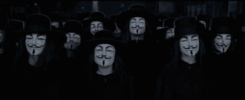
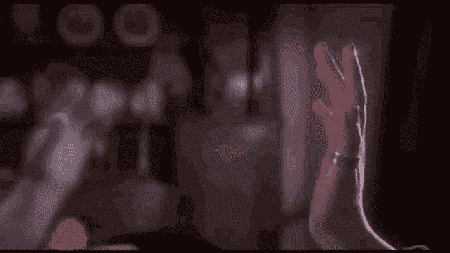
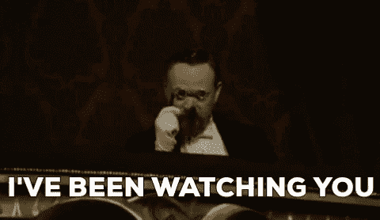
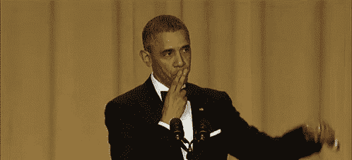
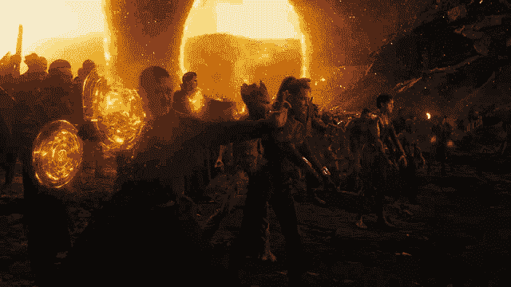

# 从朋克 6529 看 NFTs 和元宇宙的未来

> 原文：<https://medium.com/coinmonks/the-future-of-nfts-according-to-punk-6529-5bf9b519cc51?source=collection_archive---------9----------------------->

## 我们创造了改变游戏规则的技术，引领我们走向新的信息时代——区块链及其不可替代的标志。

Photo by ["My Life Through A Lens"](https://unsplash.com/@bamagal?utm_source=medium&utm_medium=referral) on [Unsplash](https://unsplash.com?utm_source=medium&utm_medium=referral)

## **简介**

以下是我有幸听到的那次伟大采访的摘要。由拉乌尔·帕尔主持的[播客](https://www.realvision.com/shows/raoul-pal-adventures-in-crypto/videos/the-world-according-to-punk-6529-mXg5)让听众深入了解了由太空中最伟大的头脑之一——朋克 6529——所讲授的 NFTs 的思想。让我们对我们生活的世界和即将发生的变化有一个 OG 级别的理解。

让我们拥抱和建设未来。

以下文章完全基于对朋克 6529 的采访。所有的想法和例子都是基于采访，除非另有说明。

作者写的例子和补充都标有星号“*”。

## **TL；博士**

纵观历史，人类见证了技术的巨大飞跃和社会的重大变革。交通运输的发展、大众媒体的传播或互联网的出现；所有这些事件都极大地改变了世界和社会。

关于人与人之间交流的另一个步骤，以及作为个人或特定社区成员表达自己的能力，我们正处于(r)进化的边缘。

不可替代代币技术(NFT)不仅仅是个人资料图片和质量可疑的收藏品。我们仅仅触及了使用非功能性测试的表面，只有少数人有足够的经验和投入来看到它可能带来的前景。

[*https://tenor.com/53ZN.gif*](https://tenor.com/53ZN.gif)

## **比特币**

*想象一下，生活在一个个人之间的所有金融转账都不能在周末进行的世界里。听起来怎么样？乍一看，这似乎不那么费力，但当你想到这一点时，大约 30%的时间——周末和银行假日——你无法转移资金，即使是在迫切需要的时候。

*看来您使用和转移资金的方式毕竟是有限制的。

第一次意识到比特币可以成为什么的时刻发生在一个周六的下午，当时 6529 和他来自另一个大陆的朋友用比特币做了一笔交易。这笔交易只需几分钟就能到达收款人手中，成本只是银行转账费用的一小部分，而且是在周六下午完成的。

一些人声称比特币是对通货膨胀的对冲，因此受到欢迎并有所增长。在讨论比特币的用途时，这是一个常见的说法，尤其是在上次牛市期间。事实上，还有其它波动性小得多的通胀对冲工具，因此更适合作为投资。

无论是在技术上还是在社会上，比特币都有更多的含义。

据称，比特币已经解决了源于博弈论和分布式系统领域的拜占庭普遍问题。简而言之，拜占庭综合问题描述了这样一种场景，在这种场景中，所有相关方必须就一个单一策略达成一致，以避免失败或失败。整个问题围绕着相关方之间的有限信任或未经确认的可靠性问题。

*比特币的拜占庭式普遍问题涉及验证和传递未存储在中央数据库中的信息。这是一个分散的挖掘者和验证者网络，他们通过工作证明机制来确保区块链的功能。这些个体不必彼此认识；信任是通过他们对网络的承诺和获得回报而建立的。

## **数据库**

如今每个公民的生活都是由成千上万的数据库组织起来的。您使用的银行系统、医院、酒店甚至出租车都有自己的数据库来运行提供所有必要服务所需的整个基础设施。

这不是一夜之间的变化。它是通过使用互联网等新的基础设施慢慢逐步建立起来的——记住这一点非常重要。在互联网出现之前，数据库在社会中并不是一件大事，也不是我们今天所拥有的形式。所有信息都存储在文件、纸张或其他存储记录的方式中。

如今，数据库已经与社会密不可分。

> **世界依靠数据库生存和发展。**

使用数据库的一个最重要的特点是需要信任某人所提供的信息。有成千上万的 TTP——值得信赖的第三方——我们每天都将数据委托给他们。我们如何确保未来不会发生数据泄露，或者托管数据不会被滥用？我们不能，这是必须接受的残酷事实。然而，为了成为现代社会的一员，我们不得不信任一些交易对手。

运行数据库和共享信任的基本例子可以在日常生活中找到，比如我们每天使用的货币、公民特权或对特定财产的权利。

所有这些数据库都在集中式系统中运行，这是一个不错的解决方案，因为由于提供了安全性，一切都运行良好。

*给所有完全分权的追随者一个简短的说明；并不是所有的事情都应该去中心化。集中式和分散式系统各有优缺点。事实上，当考虑到当今社会的需求时，集中的系统可能是比分散的系统好得多的解决方案。

crypto 早期的问题是——现在仍然可能是——普遍相信和习惯于信任和使用集中式数据库以获得更高的安全性。在 Amazon Web Services 上运行事物并对每秒的事务数量感到惊讶的常见概念缺少一个重要的点；这个问题的社会含义是什么。

在 AWS 上运行东西的社会含义是，你必须相信有人会提供你的数据。

作为一个社会，我们变得越数字化，我们信任的大型实体就越少，变得越来越集中和依赖。

## **新媒体**

互联网的出现打破了人们以前无法克服的障碍；物质存在的障碍或分配的障碍一旦被打破，许多人就可以把他们的技能和想法提升到另一个水平。突然间，人们意识到你不必成为《纽约时报》的在线发布者，也不必成为沃尔玛的网上销售者。

[*https://tenor.com/q6dp.gif*](https://tenor.com/q6dp.gif)

媒介的变化导致了发达国家小型企业的巨大增长。接入互联网的事实打开了只有少数人想象中存在的大门。

然而，[幂律分布](https://www.sciencedirect.com/topics/mathematics/power-law-distribution)适用于一切，所以互联网，在其核心，倾向于集中化。这是一些人可能不同意或者可能没有意识到的事实。然而，由于互联网，我们看到数字世界的巨大寡头垄断正在建立和扩大。类似的趋势也适用于大数据或机器学习等技术，这些技术也可能在不久的将来变得集中化。

> **规模经济、数据经济、范围经济；都导致集权。**

在某个时候，一项新发明进入了舞台——比特币。

就像每一项新技术一样，我们最终会看到一群远见卓识者看到其他人一开始无法理解的可能性。革命需要时间。这就是为什么比特币不是一夜之间进化出来的，也不是一个快速致富的方案。比特币是一种理念，如果使用得当，在未来 30-40 年内，它可能会重塑社会的大部分。

## **消费化**

新技术何时消费化？

当试图解释每秒可以在 Solana 上执行多少事务(TPS)以及在 Ethereum 上可以执行多少事务时，会发生这种情况吗？我对此表示怀疑。

讨论一下安全措施怎么样？差远了。

人们通过科技的镜头讨论 Instagram 吗？

哦，看！这是刚刚发布的一些不错的 Python 脚本，让我们试试吧。

> **一旦我们不再谈论技术本身，技术就变得消费化了。**

2020 年的 DeFi 夏季导致与去中心化金融相关的代币估值飙升。人们在谈论项目、实施和现金流；他们在谈论技术和数字，而核心问题和想法却被抛在脑后或几乎没有提及。

DeFi 的实施还没有触及核心的社会问题。它需要时间来成长和发展，以满足需求并变得广泛消费化。

使用 NFTs 的乐趣和方便性使得 crypto 的消费化成为可能，而无需谈论技术。

## **朋克 6529 的开始**

当朋克 6529 决定探索这个地区，看看是否有任何发展潜力时，即使是宇宙中真正的巨怪，对 NFTs 最初的看法是什么？

*那是一些愚蠢的事情。让我们回到真正的工作上来；建设项目，写智能合同或什么的。*

到 2020 年底，蜘蛛侠的感觉让朋克 6529 更深入地挖掘 NFT 的世界，尽管他最初对加密 og 有所了解。这种预感最终成为揭示 NFT 技术可能性的火花。

[*https://tenor.com/bJoXf.gif*](https://tenor.com/bJoXf.gif)

一个人不做就不能理解某事，因为最好的学习是通过实践。这就是为什么朋克 6529 决定漫游 OpenSea，购买廉价的 NFT，只是为了获得玩和拥有它们的感觉。探索太空和玩它被证明是有趣的，所以进一步的调查开始了。

下一步是让他的朋友拥有并玩 NFT，方法是将它们发送到不同的钱包，并检查在这一点上还可以用它们做什么。

使用和拥有 NFT 的感觉开始增长，不仅在朋克 6529，而且在整个加密社区也导致了一种趋势的增长，这种趋势可以永远改变加密世界。

## **扭曲的影像**

通过 NFTs 的加密消费化至少有一个主要的失败点——集中化。

当我们不关心技术的时候，我们也不关心基础设施是集中的还是分散的。最终用户关心的是应用程序的漂亮外观、体面的 UX 和低交易费用。NFT 是否存放在集中保管的钱包中并不重要。

最大胆的猜测可能是，硅谷和 Crypto Twitter 的大多数人都将他们的大部分密码存储在比特币基地的托管或其他中央实体中。这种行为的原因之一可能是，他们中的大多数人将比特币视为一种金融投资，而不是一种组织事物的方式；重建社会。

比特币、Web3 和 NFTs 的扭曲形象来自于试图通过理论而非实践来理解它。所以，我来重复一下朋克 6529 的话。

> 一个人不去做就无法理解某事。

## **激励**

想象一下，你是一家在市场上拥有既定地位的知名公司。你创造非功能性食物的动机是什么？

答案是货币化。

[*https://tenor.com/Wkoy.gif*](https://tenor.com/Wkoy.gif)

杜嘉班纳(DolceGabbana)是世界知名品牌，以奢华的服装和化妆品闻名。相关职位、客户群、社会无形资产以及与穿着 DolceGabbana 相关的生活方式或社会地位；一切都在那里，等待被货币化。

最大的品牌，尤其是时尚和生活方式行业的品牌，已经开始在数字空间建立自己的地位，它们的影响力只会在接下来的几个月和几年里增长。最近耐克[收购 RTFKT](https://news.nike.com/news/nike-acquires-rtfkt) 只是证明了这个论题。*另一个例子可能是最近普拉达[宣布](https://decrypt.co/101620/prada-joining-top-luxury-brands-in-web3-with-ethereum-nfts)通过区块链以太坊进入 NFTs 的世界。这是一个循序渐进的过程，但每个人都在慢慢地发展自己的 NFT。运动队将为他们的粉丝分发 NFT，大学为他们的校友群分发 NFTs 可能的例子之多令人震惊。

*制造 NFT 的动机不仅限于像 DG 或 Nike 这样的生产品牌。个人品牌的重要性近年来一直在蓬勃发展，在社交媒体领域创造了“大牌”，如 MrBeast 或 Peter McKinnon。然而，通过社交媒体进入“大牌”联盟的人既不是唯一也不是第一个与加密品牌合作的人。沙盒[大约在一年前与史努比·多格(Snoop Dogg)达成合作](/sandbox-game/the-sandbox-partners-with-snoop-dogg-to-bring-legendary-rapper-into-the-metaverse-e064e866ed40)，用一个来自“传统”世界的知名个人品牌丰富了这个空间。就在最近，币安[与克里斯蒂亚诺罗纳尔多签订了一份协议](https://twitter.com/Cristiano/status/1539972040291061765?ref_src=twsrc%5Egoogle%7Ctwcamp%5Eserp%7Ctwgr%5Etweet%7Ctwtr%5Etrue)，为这项运动带来了另一个知名度很高的人。在未来几年，我们将看到许多强大的个人品牌进入这个领域，要么创建自己的 NFT，要么与 crypto 品牌合作。

> **NFT 技术让我们有可能表达想法，具体的想法。**

大公司制造的非功能性贸易不一定是 PFPs 的形式，而且肯定不会是。那么他们如何使用 NFT 呢？唯一的限制是创造力。用作预售门票的 NFT、现实世界中的可兑换商品、社会地位标志、带有可兑换 NFT 的二维码、表示我们是该品牌的狂热用户的标志等。可能性数不胜数。

## **骨料等级**

一个公开可读和可写的数据库是建立一个社区的重要因素，这个社区有兴趣在空间中建立自己的位置，不是作为个人，而是作为一个独特的群体。

看一看像朋克持有者这样已经建立起来的社区的心理人口统计数据，我们可能会在个人层面上看到适用于大多数成员的特定特征。此外，我们可以看看志那都红豆或 BAYC(无聊猿游艇俱乐部),也发现个人层面的共同特征。

每个社区都各不相同。朋克与志那都红豆的不同，BAYC 持有者与朋克不同，天主教会成员与路德教会成员不同。

> 每个人都属于某个团体。

在个人层面上，作为两个不同甚至对立社区的成员，我们可能非常相似。然而，如果我们从总体水平来看，差异将会非常明显。

志那都红豆持有者将在总体水平上分享一套共同的特征，就像围绕 NFT 项目建立的任何其他社区一样。因此，给某个群体贴上一组特定特征的标签是可能的。然而，在个人层面上，一个志那都红豆社区的成员和一个 BAYC 持有者之间的区别是难以区分的。

> **作为个体，我们可能是相似的，但作为一个群体，我们是不同的。**

[*https://tenor.com/bsPKw.gif*](https://tenor.com/bsPKw.gif)

## **发行**

论文——NFTs 将颠覆美术发行。

在曼哈顿 SoHo 区生活近 20 年可能有助于培养对美术的爱好。漫步于博物馆、美术馆和类似的地方，你会发现自己沉浸在艺术中，这是一种随着时间的推移而积累起来的体验。突然之间，你可能会梦见自己买了一个安迪沃霍尔的汤罐头。

一旦你开始考虑购买艺术品，你有什么选择？常识告诉我们应该去参观美术馆。

如果想要的艺术品在那里，一切都很好。然而，如果不是呢？

至少可以说，艺术品的发行和销售过程是不令人满意的。开始的时候，你必须去参观这个地方，询问特定的艺术作品以及它们的可用性。如果你想要的画现在还没有，你必须确保一旦这幅画在你谈过的美术馆的范围内，你会得到通知。然而，你怎么能确定没有人会出价高于你呢？在这种情况下，你将会在等待可用性通知的过程中浪费时间。

鉴定这幅画的过程呢？你怎么能确定你买的不是赝品呢？你可能会得到一些回应，比如“这是作者的签名”，“我们会给你真品证书”，然后你会看到证书在你面前被打印出来。这是什么样的确认？绝对不是你期望从一个著名的艺术画廊购买一幅价值不菲的画。

如果你想买朋克，会发生什么？让我们再来一遍这个过程。

不需要亲自去那个地方；你不必去参观美术馆或类似的地方。你唯一需要的是一个互联网连接和一个 Metamask 钱包。

你怎么能确定价格是公平的？在任何时候，你都可以访问全球订单簿，查看每一笔转让、每一笔销售、出价和要价。你可以竞拍任何你想拍的作品，即使它是非卖品。完全透明是标准。

艺术品分销正在从互联网出现之前的商业模式向后互联网商业模式转型。有人会说，很久以前你就可以在网站上购买艺术品了。然而，实际上，运输成本、订购程序和完成购买所需的时间对于大量潜在客户来说是令人望而生畏的。

> 易贝并不是宾夕法尼亚州一家小古董店的替代品；它成为这类商品的全球市场。

优秀的美术馆不会消失或被取代。去美术馆购买艺术品的纯粹乐趣是一种无价的体验。然而，事情会随着时间的推移而发展和变化。

## **科技民主化**

如果你必须去日内瓦、迈阿密、纽约或伦敦旅行，你会买达明安·赫斯特的 [*货币*](https://niftys.com/events/the-currency) 画吗？如果你能在几秒钟内从你的沙发上购买它会怎么样？

事实是，达明安·赫斯特在这两种情况下都会很好。他只需要再等一会儿就可以卖掉他收藏的一万件艺术品。最显著的变化发生在光谱的另一端，这是我们应该关注的地方。

作为一名来自田纳西州诺克斯维尔的热情的蝴蝶摄影师，你几乎没有机会将你的作品货币化或获得显著的认可。让我们现实一点，你没有机会靠你的照片谋生。假设你能找到一个卖照片的地方，你每月能卖出多少张照片？

如果我们把非功能性思维考虑进去，事情就变了。走向公众并出售你的照片要容易得多。更大范围的观众让你有更大的机会找到一群真正喜欢你的风格并会购买你的照片的人。

你不会有和达明安·赫斯特一样的平等机会，现实一点吧。分销优势将或多或少地消失，然而其他优势如全球认知度将不会那么容易实现；但这是一个很好的起点。

对于所有从事创造性职业的人来说，进入全球市场和全球观众是一个游戏规则的改变者。当我们，作为一个社会，将获得体面的技术来转移无形资产时，艺术和创造力的传播将大大加速。

## **生活方式 NFTs**

几乎每一件现存的 NFT 都可以归为三大类:艺术品、收藏品或私人收藏。在所有的集合中，有一些是不容易分配的。其中之一是无聊猿游艇俱乐部收藏。

BAYC 是艺术吗？是收藏品吗？它可能是一个 PFP，但不是它的预期用途。那么什么是 BAYC 呢？

答案是——生活方式。

[*https://tenor.com/bDS6D.gif*](https://tenor.com/bDS6D.gif)

如果你想进入麦当劳的特许经营，你必须自己去争取。花时间和金钱在麦当劳的一个教育场所接受教育，并根据标准和规定被慷慨地授予使用特许经营权的许可。

BAYC 也是这样吗？一点也不；作为一个 BAYC NFT 的持有者，你可以自由使用特许经营权，甚至可以根据你拥有的 Ape 创建自己的品牌。这是一个改变游戏规则的想法，因为你不是唯一负责发展你的品牌。

想象一下，你是 10k BAYC 持有者中的一员，用自己的猩猩创造了自己的品牌。一个人的品牌越壮大，BAYC 系列就越受欢迎。同样的事情反过来发生；BAYC 特许经营越受欢迎，各个品牌就越受认可，越有价值。现在让我们假设一半的所有者决定使用 BAYC 特许经营权来创建他们自己的品牌。它给了我们五千个独特的商业想法，涵盖了所有的服务和商品。

这就是社区在全球范围内扩展的方式。

在接下来的 3 到 5 年里，我们将看到由 NFT 系列打造的全球品牌，随之而来的是新的商业模式的出现。创作者要考虑的两件事之一是授予持有者商业权利或发布 CC0(创作共用零)方法。

为了说明这种商业模式有多么重要，我们应该看看朋克的遭遇。直截了当地说，从宇迦[买下朋克 IP](https://cointelegraph.com/news/nifty-news-yuga-labs-buys-cryptopunks-1inch-wallet-supports-nfts-and-more) 并将其转化为 BAYC 商业模式的那一刻起，朋克就完蛋了。如果你对一个项目无能为力，你就无法让它变得有竞争力。

如今，我们看到了使用特许权的不同方法。BAYC 持有者遵循的方式类似于 Web3 的想法，而 mfers 可以自由地使用他们的 NFT。

*确定更好的方法可能是短视和不明智的，因为从 NFT 收藏开始建立社区的趋势还没有过去多长时间。空间必须扩大，经验必须积累，事情必须随着时间的推移而发展。

## **视觉艺术**

几十年来，音乐和视觉艺术哪个在文化上更重要？

结论可能相当主观，但根据朋克 6529，社会和文化主要受音乐影响，把视觉艺术抛在后面。

今天的非传统艺术是主要的视觉艺术，但是音乐也可以并且几乎肯定会发生各种各样的事情。创造一个连锁和非连锁音乐的混合体只是一个时间问题。音乐 NFTs 的引入将导致类似的现象，即创建与作者直接相关的收藏、社区和利基，从美学的角度来看，这将为消费者创造完全不同的体验。

下一步将是游戏世界。近年来，目前的游戏已经转向在线体验和多人游戏。*更不用说电竞行业的现象及其对整个游戏世界的影响。正如任何其他行业一样，游戏也在随着时间的推移而演变，每个时代都有其可识别的特征和特点。这就是为什么在接下来的几年里拥有下一代游戏的假设看起来并不非理性。

虽然我们看到了创造区块链游戏的方法，但这些都是旨在赚钱的趋势，而不是建立一个持久的游戏的闲置努力。你让每个人都创建自己的 10k NFT 收藏，并将其与一些半生不熟的游戏相结合，这种商业模式既不会持续多年，也不会吸引玩家。

制作真正好的游戏就像拍电影一样。这个过程需要时间和金钱，也需要极有才华的人。这比把一个随机的 NFT 收藏放进一些低质量的游戏要复杂得多。

## **社会无形资产**

如前所述，一旦技术允许转移社会无形资产，社会的很大一部分也会改变。

[*https://tenor.com/bm85W.gif*](https://tenor.com/bm85W.gif)

但是什么是社会无形资产呢？嗯……这些东西我们可以用我们的思想来把握，但不能用我们的手。美国，自由女神像，美国国旗，自由的土地和勇敢者的家园，美国梦；所有这些都是社会无形资产。我们怎么能赋予它价值呢？公平的价格是多少？

*一旦我们谈论价格和对事物的估价，就会有人声称这只是世界金融化的又一步。贪婪的资本家只想赚更多的钱。然而，让我们从不同的角度来看这个问题。让我们考虑世界是如何变化的，我们作为一个社会将走向何方。

*自动化基础设施取代了各行业不同分支的人员。未被锁定的劳动力必须在世界上找到一个新的位置，并保持生产力，以便社会发展。沿着创造性表达的道路前进的人数将比我们任何人想象的都要多。

在过去的二十年里，科技行业吸收了大部分人的潜力，因为它是有用的，而且在经济上是有回报的。它青睐某一类具有特定特征的人，就像任何其他行业青睐不同类型的人一样。值得问的问题是，一旦创意产业开始获得更多的关注，什么类型的人、什么样的技能和特质将会受到需求？

人权，通用汽车，美国。这些东西都不存在。这些只是允许我们以一致的方式组织人员和资源的框架。这就是你如何从 150 人的社会发展到数百万人的社会。

耐克的理念可以用三个简单的词来表达——*。这三个字给公司增加了多少价值？如果没有加班加点烤出来的无形创意和叙事，耐克有可能达到同样的销售目标和价格吗？*

*人类生来就是在叙事中生活和思考的。这是个人和社会组织自己的方式。我们看到的是，叙事从中央集权的政党转移到个人手中。叙事逐渐被社区化。*

*一个随机的公司不可能凭借漂亮的 logo 和高质量的商品与耐克竞争。它需要创造自己的叙事和人们可以认同的无形资产。一旦无形资产在一个没有许可的系统中在人们之间流通，耐克就会失去无形资产的优势。然而，耐克仍将拥有其他优势，如营销优势或世界认知度。*

*总会有一些优势是不平等的。*

> ***饥饿的艺术家是一只虫子，而不是一部电影。在一个每年越来越多的事情实现自动化的世界里，非物质文化提供者应该得到高薪。***

**

*[*https://tenor.com/bIJKh.gif*](https://tenor.com/bIJKh.gif)*

## ***媒介***

*媒介是一种信息。*

> ***信息随媒介而变化；近年来，媒体发生了巨大的变化。***

*你可以设定新的文化和社会标准的时间是有限的。这个时期就是现在，在未来 10 年内，它将会固化。在接下来的 20 年里，将会有别的东西，媒介的另一次变化，和另一次进化。*

**不断更新和变化的过程已深入我们的生活。*

*一个有电视的社会和一个没有电视的社会是不同的，正如一个有互联网的社会和一个没有互联网的社会是截然不同的。*

*所有的媒介都以某种方式改变了社会。任何具有人类互动特征的事物都在改变着社会。互联网的引入和广泛的消费化改变了社会。之后，其他形式的大众媒体如推特、脸书和 Instagram 也被引入。然而，不仅仅是大众媒体塑造了社会。优步利用 AirBnB 引入的住宿空间或*实现出租车和运输基础设施系统现代化的想法，以及抖音最近的趋势，对社会产生了重大影响。*

> ***每一次新技术或服务被消费化，我们最终都会得到一个略有不同的社会。***

## ***社会建构***

*有人可能会问，这难道不是一种社会建构吗？*

*告诉我，什么不是社会结构？*

*你房子的地契不是社会建构吗？你每天用的法币呢？城堡主义赋予你权利射杀任何怀着不良意图进入你财产的人，这难道不是一种社会建构吗？纸张有意义的唯一原因是，作为一个社会，我们在很久以前就同意了它。在几十年和几个世纪的过程中，它固化了太多，我们甚至不再意识到潜在的社会协议。*

*与 NFTs 有什么不同吗？如果你拥有 ERC-721 标准中的令牌 6529，我们都同意你是朋克 6529 的所有者。这与同意你拥有一栋房子或一处房产没有任何不同。唯一的不同可能是多年来为僵化社会协议而制定的新法律。这一切都是同样编造的。*

*房子本身是很有形的，但住在里面的权利不是；现在，我们正在慢慢开发可以让我们移动无形资产的技术。称之为巨大的变化可能是一种保守的说法，因为我们还没有探索它。*

*可能性的表面几乎还没有被触及。*

## ***真正的元宇宙***

*我们大多数人都会将元宇宙的想法与类似于 [Second Life](https://secondlife.com/) 的某种应用联系起来，你可以使用虚拟现实眼镜访问该应用。*

*这可能很有趣，但这不是元宇宙。*

*真正的元宇宙是我们将在不久的将来看到的互联网。视觉质量将会变得更好，为用户提供各种新的可能性。电话会议可能是一个很好的例子，因为现在我们大多数人都有变焦电话，我们可以通过相机镜头看到对方。视觉效果的改善将使我们能够使用全息图并参与对话，就好像我们和我们的对话者在房间里一样。*

*增强现实将永远伴随着我们。在我们的谈话中，我们会谈论一些事情，并把它展示在我们面前。支持 AR 访问的眼镜和其他配件将变得非常方便和用户友好，从而变得几乎与其他日常生活物品密不可分。*

**

*[*https://tenor.com/UYah.gif*](https://tenor.com/UYah.gif)*

*相反的观点可能是，人们不会一直戴眼镜或类似的配件。然而，我们不是全天候都带着智能手机吗？我们中有多少人声称不会一直把手机放在口袋或包里？*

*在改善视觉效果之后，下一步将是数据可扩展性和可传输性的创新。互联网上充斥着大量数据。每个应用程序和每个平台都有丰富的各种数据；Twitter 或 Instagram 每分钟都在上传和处理海量数据。一个关键点是，现在我们需要某种 API 密钥来访问所需的信息，这可能会成为平滑元宇宙用户体验的一个重大障碍。*

**这并不意味着 API 将永远消失，访问权限将在没有任何验证程序的情况下授予。这意味着纯粹的过程将变得平滑，用户将能够在使用 AR 技术进行对话的同时几乎即时地访问或显示数据。*

## *【Web2 的问题*

**将脸书更名为 Meta 激起了许多人的兴趣，也让他们更加担忧。*

*脸书自己的元宇宙的建立与分散化的元宇宙的梦想正好相反。像脸书这样的中央集权的公司没有意图或动机为自己的元宇宙建设一个分散的基础设施。另一方面，在集中式服务器上运行创建的元宇宙提供了对新元宇宙的方向和规则的控制和代理。*

> ***整合的生态系统受限于创造者公司的意志。***

*Meta 的案例和它对集中式平台的设想并不是创造者的意志起决定性作用的唯一例子。撇开政治情感不谈，坚持纯粹的事实，我们已经看到一个非常知名的人美国总统[从推特上被移除。第一修正案不适用于私营公司；然而，如果一家公司的平台已经成为全球信息工具、地缘政治辩论的场所和政治趋势的创造者，那会怎样？在这种情况下，创造者的意志有多强大？](https://blog.twitter.com/en_us/topics/company/2020/suspension)*

*Twitter 可能不希望有人使用它的平台，这是一个完全明智的商业决定。没有偏见或感情，纯粹的业务。问题是，一旦你被禁止使用 Twitter 这样的平台，你就被切断了与全球短信中心的联系。这不仅仅是一个商业决策，更有意义。*

*谁应该为做出这样的判断负责？谁没有偏见，没有能力承担做出正确决定的责任？*

## ***现代流亡者***

*如果我们想要应用撤销对电子邮件协议的访问的特性，会怎么样呢？上市公司呢？如果有一天你被取消了在某个城市打车或在某个连锁商店购物的权利，那该怎么办？*

*十年后，我们的元宇宙比今天的 Twitter 要大得多，在社会中的根基也更深。*它将包括我们生活的方方面面，从购物到医疗保健。它会变得不可分割。*

*如果有人决定不允许您使用元宇宙并取消您的访问权限，该怎么办？你不仅仅会像今天这样与社交媒体隔绝；你与整个社会及其提供的所有服务隔绝了。切断某人元宇宙的行为等于被关在数字监狱里。*

**

*[*https://tenor.com/F2Wt.gif*](https://tenor.com/F2Wt.gif)*

*如果不利用哪怕是元宇宙的一小部分，我们将无法生活在现代社会中。一旦我们被禁止进入元宇宙，与朋友社交、找工作和使用基本服务都将变得不可获得。*

**我们将成为社会的幽灵，不受欢迎，挣扎于基本需求。我们将一无所有，但仍有责任按照社会制定的规则生活。*

## ***残局***

*论文——终极目标是增强现实。*

**增强现实是如何工作的？它会在你的视野或所用配件的视野范围内扫描环境。扫描必须连续进行，因为它必须用数字数据的叠加来更新你所看到的。想象一下，走进一家餐厅，只要看着桌子，你就可以看到展示在你面前的整个菜单，以及你想尝试的每一道菜和每种饮料的额外视觉效果。听起来很神奇，不是吗？*

*每个硬币都有两面。*

*让配件不断扫描我们的视野可能会导致一个可疑但明智的假设，即有一家公司用上帝的眼睛观察我们的整个生活。我们看的每一样东西，做的每一项活动，说的每一句话都会被持续监控、分析和记录。我们遇到的所有人，我们的家人，孩子，未婚妻，所有的人都被不断地记录和分析。*

**

*[*https://tenor.com/1ROv.gif*](https://tenor.com/1ROv.gif)*

*该公司可能会引入严格的隐私政策，并向每个人保证不会泄露任何信息，一切都将在严格的监督下进行。然而，该公司仍有可能以任何方式使用这些数据。*

**在这个充斥着从数据泄露到身份盗窃等各种网络攻击的世界里，那些从未参与数据泄露的人是有福的。尽管相信这些保证，但是要尽最大努力保护好你的隐私。如果你没什么可隐瞒的，不要担心，或者他们是这么说的。*

*这里的问题不是前面提到的个人和他们的意志。这是它赖以建立的系统的缺陷。任何能够让上帝的眼睛看着人们的系统都不会被国家所容忍，因为它太有影响力和强大而无法独立存在。在某个时候，该公司要么被关闭，要么被某种政府机构控制。*

*中国正在建设和使用的社会信用体系与元宇宙可能的样子出奇地相似。抛开视觉效果不谈，使用的机制和可能性惊人地相似。监控公民生活、分析他们的行为以及在必要时授予或取消特权的能力，类似于未来 AR 元宇宙的主干。*

*中国制度的残酷是人们经常谈论的话题，但他们似乎没有意识到这个制度的基础就在他们眼前。朋克 6529 并没有声称建造这个系统是为了达到控制公民的目的，他的意思是我们正在建造一个能够执行这种程序的系统。*

## ***CBDC 的力量***

*是否应该以一种 CBDCs 的形式在网上提供国家主权货币？在实施 CBDCs 之后，是否应该废除现金，从而创建无现金社会？*

*在纽约，你如何阻止一个人乘坐出租车？你必须逮捕这个人。否则，你既没有权力也不可能合法地阻止别人打车。当我们使用 CBDCs 引入和推广元宇宙时，在几秒钟内，我们将能够扳动开关，取消特定区域的出租车使用权限或整体服务。这将是剥夺人民宪法权利的最廉价的方式。*部分基础设施已经实施，我们已经看到一些类似的[先例](https://www.marketwatch.com/story/canadian-banks-restrict-funds-to-trucker-protest-groups-11645115277)正在北半球的一些国家发生。*

**国际清算银行、欧洲银行、美联储和许多其他银行已经在讨论并逐步实施 rails 以引入 CBDCs。他们对结局的想法和愿景可能不同，但将他们联系在一起的是建立一个货币体系，在这个体系中，每笔交易都将受到监督，任何不良交易都将被审查或撤销。*

*如果一些与央行有联系的有抱负的极权主义者决定增加获胜几率，并开始取消他的对手的基本特权，如购买一个腐烂的西红柿或租用特定的集会场所，会发生什么？*

*即使是我们有史以来见过的最极权的政权也无法有效地阻止他们的对手在这个国家的其他地方购买和做某些事情。很难阻止人们用现金进行交易。跟踪和监督他们的交易更加困难。然而，一旦 CBDC 被实施，现金被废除，你需要做的就是运行一个特定的算法来限制你的对手。*

*每一个关于法律和秩序的决定都是私人犯罪和公共犯罪之间的权衡。这就是为什么我们有宪政民主。如果我们有一个永远正确的国家，我们就不需要任何公民权利，因为根据定义，这个国家的所作所为是绝对正确的。*

## ***1 亿人的非正规金融服务***

*如前所述，像 DolceGabbana 或 Nike 这样的品牌和大学这样的机构都会发放 NFT。他们所要做的就是数字化他们的无形资产。当他们发行 1 亿张 NFT 时，用户网络将开始扩散，产生滚雪球效应；再过几年，我们将会看到 10 亿人使用 NFT，其中一些人甚至没有意识到这一点。*

*在接下来的几年里，我们将会看到越来越多的品牌和机构发行 NFT。即使是现在，我们也能看到阿迪达斯在 OpenSea 上发布 NFTs 的例子，以及 Meta 创建他们自己的 T2 元宇宙平台 T3 的例子。*

*危险在于基础设施。人们会关心他们的非功能性桌面存储在集中的还是分散的钱包里吗？*

**人们追随潮流和易用性。如果 Meta 创建了具有惊人的用户体验的 NFTs，而分散平台将专注于为分散基础设施带来安全性，而忽略了 UX，那会怎样？人们会追随技术还是追随使用平台的体验和乐趣？我想答案是显而易见的。*

*加密世界的主要追求是在最短的时间内使用户体验尽可能好。当 NFTs 成为一种东西，而在比特币媒体占主导地位的时代它并不那么重要时，为什么现在它很重要？下面的陈述就是答案。*

> ***对 NFT 默认的做法是使用它；而比特币的默认设置是什么都不做。***

**

*[*https://tenor.com/FgGg.gif*](https://tenor.com/FgGg.gif)*

## *UX——我们正在招人！*

*在过去的两年中，NFT 空间的快速变化和增长使得 UX 开发商的需求量很大。已经发生的错误和灾难的数量对社区和加密空间的整体看法造成了损害，留下了不安全和不适合客户需求的标记。*

*在过去的几十年里，汽车行业的重大转变导致了责任叙事的变化。汽车制造商从声称“事故是用户的错误”到“事故是我们的错”，这随后转化为汽车使用安全性的显著提高。*

*如果 NFT 领域没有类似的转变，我们就无法期待技术的增长和消费化。用户必须确保他的资金和 NFTs 是安全的，即使他的技术知识有限。交易必须容易进行，并且识别和防止每个潜在用户的错误。在多区块链的世界里，为了减少甚至消除用户之间的界限，必须建立共同的标准。*

**在 UX、用户界面以及某种程度上的安全性方面，我们慢慢看到了变化。我们还可能发现的是，在 NFTs 出现之前，集中式平台已经照顾用户很长时间了。因此，时间是非常重要的，因为从长远来看，那些更好地照顾用户并在空间中建立自己的人将会获胜。*

## ***与机构的博弈***

*政府在和我们作对，而不是和我们合作。*

*欧盟在 Web2 之战中输给了美国人，现在成了美国数字帝国的数字附庸。欧盟有机会通过关注 Web3 的发展和普及来扭转局面。这样的举措将极大地限制美国技术寡头的权力，并赋予欧盟成为未来 Web3 世界决定性参与者的权利。*

> *如果我们在 90 年代初对互联网保持和现在对 Web3 一样的态度，互联网就不会变成今天这个样子。*

*从监管者的角度来看，分散金融(DeFi)领域存在缺陷，即不确切了解交易对手。因此，DeFi 可能会变得非常难以实施，至少对美国公民来说是如此。*

*DeFi 和 NFTs 的区别在于有一个个人交易对手，从法律和监管的角度来看，这使得 NFT 协议的实施容易得多。很有可能我们会在大型市场上结束 KYC(了解你的客户)程序，但至少这种增长不会因为购买和使用 NFTs 成为非法而受到限制。*

## ***零知识***

**近年来密码技术的发展带来了[零知识证明](https://research.aimultiple.com/zero-knowledge-proofs/#what-are-zero-knowledge-proofs-zkps)的概念，这可能不仅会彻底改变密码空间，还会改变我们今天所知道的世界。简而言之，ZK 证明是一种在不暴露信息本身的情况下验证所提供信息的真实性的数学技术。*

**对于一些人来说，这可能是一个遥不可及的想法，但毫无疑问，零知识证明的概念一旦实现，将为各行各业带来巨大的好处，并可能成为人类历史上的又一个里程碑。*

*如今，各种机构收集了大量的用户数据。水电费账单、身份证、驾照这份清单似乎没有尽头；收集的数据量不仅会减慢完成工作的过程，还会因为处理过多的数据而危及用户，当受到攻击或意外时，会有数据泄露的风险。在行政和机构领域实施 ZK 证明将大大降低与错误处理或滥用所提供信息相关的风险。*

**零知识证明是当今密码领域面临的许多问题的解决方案，特别是从机构的角度来看，因为它将极大地限制犯错误或无法提供我们在该领域内的行为和财务收益的有意义证明的风险。*

**你不能对你看不见的东西征税。以下声明是一把双刃剑，为一些市场参与者提供了避免对其财务收益征税的方法。另一方面，避税和积极寻找新的方法向国税局隐瞒利润只会使加密空间更难成为可靠的投资场所。*

## ***撞击***

*这个领域的一些人，比如朋克 6529，已经足够老了，可以回忆起过去的互联网时代，让他们发现并分析新出现的模式。*

*在 Twitter 的早期，有一个关于 Twitter 应该是一个协议还是一个服务的讨论。当时看似正常的商业决定，在接下来的几年里塑造了社会和世界的很大一部分。过去的决定对现在产生了巨大的影响，不容易逆转或改变。*

*我们今天所能产生的影响可能会为未来几代人和 NFT 的技术奠定基础。因此，我们不能在小社区内独自玩游戏；否则，我们将成为一个被遗忘和忽视的小众群体。*

> ****聚集并改变空间需求，因为动力一旦失去，就很难重建。***

**

*[*https://tenor.com/bJHSp.gif*](https://tenor.com/bJHSp.gif)*

*我们已经看到了该领域不同的商业模式，从基于陆地的平台到 BAYC 的想法实验方式。值得注意的是，宇迦实验室[在大约 12 个月](https://thedefiant.io/yuga-labs-otherside-nfts/)的时间里从零成长为一个价值数百万美元的社区。*我们还进行了不同的实验，如智力游戏 NFT，它们在视觉上没有成功，以及那些太小而无法做出任何重大改变的实验。然而，我们需要像 BAYC 这样的多个社区和项目来试验和创造新事物，来发现和重新发现想法。*

*另一个步骤是将文化图标转移到分散的空间，并对它们拥有真正的所有权。我们需要多名 NFT 和密码本地人来产生影响，经营不同的基金，风险资本，以及创造和塑造这个空间。*

> *从某种意义上来说，广告牌、体育场赞助甚至酒店房间都将成为 NFT。*

*想象一下在纽约的办公室工作一整年。当你终于有了一周的假期，你可能想去地中海，但是所有的地方和酒店都已经被预订了。你会再等一年这样的机会出现吗？你可以打电话给酒店，乞求空房间或尝试在已预订的房间之间进行一些转移，但酒店的数据库太分散在不同的连锁店和设施之间，无法进行任何更改。最终，你会在一个好地方度过你的假期，但仍然会被自己躺在地中海海滩上的景象所困扰。*

*酒店房间是 NFTs 的场景看起来要好得多。*

*当你打电话给酒店预订房间时，接待员会检查是否有剩余的房间，或者会告诉你我们可以通过他们的网站核实房间的可用性。该网站允许您查看哪些房间已预订，并联系预订房间的人。你发现一个房间已经被一对老年夫妇预订了，他们很可能已经退休了，他们不介意将假期推迟一两周。毫不犹豫地，你向他们出价 700 美元买一个价值 300 美元的房间，他们似乎很乐意接受这个提议。*

*这对你们双方来说都是一个双赢的局面，我们所需要的只是联系到另一个人的可能性。*

*酒店、美术馆和许多其他商品和服务提供商的数据库分散在世界各地。通过 NFT 技术将它们联系起来将会改变许多行业的游戏规则，因为我们将能够将类似的解决方案应用到几乎所有的非连锁业务中。*

*NFT 可以代表任何不可替代的链外资产，并将其移动到元宇宙。因此，我们可以在外部世界和内部世界之间搭建桥梁。*

## ***最简单的策略***

**如果我在 2013 年才知道比特币，我今天可能已经是百万富翁了。**

**

*[*https://tenor.com/bsYm1.gif*](https://tenor.com/bsYm1.gif)*

**很有可能，你不会。声称“如果他们知道就好了”的人似乎没有考虑到这样一个事实，即在特定的时刻，他们仍然不知道未来会发生什么。让我们假设今天有一个项目将在未来几年增加 x1000。为什么你现在不把你的钱投资进去呢？是什么阻碍了你？不确定性？*

*如果我们回顾过去，就很容易选出赢家。谁都可以做。真正的辉煌是选择明天的赢家。*

*成千上万在 2013 年投资比特币的人仍然损失了大部分或全部资金。*为什么？因为他们没有在这里长期存在，他们只是路人，没有任何活跃在市场上的知识或经验，加密资产的价格波动甚至可以卷走最有经验的参与者。第二个原因是对比特币作为一种技术和投资缺乏远见和理解。*

**一个关键的注意事项是，投资比特币和投资 altcoins 不是同一个游戏。我非常重视的一个加密土人曾经说过“购买替代硬币的目的是出售它”。这句话的简单性是长期持有高信心资产和仅仅因为缺乏知识和经验而经历巨大收益和急剧亏损之间的区别。*

*我们现在看到的 NFTs 似乎与早期的 altcoin 市场很相似。许多项目正在经历高估值，甚至那些是不合标准或荒谬的。因此，大多数 NFT 收藏将归零。这是一个严酷的事实，但我们都必须牢记在心。*

*另一方面，通过选择正确的 NFT，我们将体验到投资组合的惊人增长，并成为一个长期存在的社区的一部分。*

> *买一枚硬币或 NFT，假设它会归零。*

*下面的态度会让你在市场的艰难时期保持冷静，并阻止你做出你以后会后悔的决定。*

*把你的时间投入到教育中，一步一步地体验这个空间。你在这个领域做得越多，你就会变得越好越聪明。*

> ***智慧来自经验。你不能让它短路。***

*如果你找不到足够的时间来自学，通过设定一个优先策略，把重点放在比特币和以太坊等主要项目的平均成本(DCA)上。此外，你可以买一些好玩的 NFT，在这个空间里积累你的经验。*

**在没有事先制定策略的情况下进行 DCA 与在市场上赌博没有任何不同，因为对于什么时候买什么或者卖什么，你没有任何界限。建立一个策略，并确保你会坚持下去，然后进入市场。*

*秘密空间缺少人，但有丰富的想法。如果你能转移或修改你已经拥有的技能，以便在这个领域发挥作用，你的收费率将会显著增长。*

*没有什么比在一个慢慢萎缩的行业工作更痛苦的了。你和其他人一样努力，但你无法战胜整个市场。经济不断发出信号，我们所要做的就是保持警惕，观察世界，并在时机到来时做出改变。*

## ****有界灵魂***

**以下两段不是朋克 6529 访谈的一部分。*

*《魔兽世界》无疑是一个全球性的现象，各种不同的游戏内特性影响着游戏及其机制。游戏中实现的一个想法是灵魂绑定令牌的概念，它在社区中根深蒂固，顾名思义，它绑定到灵魂，即玩家的角色。*

*它是如何工作的呢？灵魂绑定物品背后的机制非常简单，一旦获得，就不能出售或转让给任何人。该物品对获得它的角色永远有效。*

*大多数灵魂绑定物品需要完成相当高难度的任务或杀死强大的怪物才能获得绑定物品作为奖励。换句话说，如果你不克服道路上的重大障碍，你就无法获得灵魂绑定物品。除了给你特别的奖励，它也可能意味着一个玩家的经历或他对游戏的投入和经历的挑战。*

*如果我们把灵魂绑定物品和非功能性物品结合起来会怎么样？*

*想象一下，去参加一个以太坊会议，获得一个灵魂绑定令牌，证明你是该活动的积极参与者。另一方面，那些只是被动参与者的人将会得到一个灵魂绑定的令牌作为奖励，让他们出席活动。不管怎样，你作为一个积极的参与者或者仅仅是一个听众去参加会议的努力将会得到回报。获得 soulbound 令牌后，任何人都可以看到你参加过什么样的活动，你作为以太坊爱好者有多投入，或者只是验证你是否支持以太坊早期的说法。*

*想象一下，当你从大学毕业时，你的个人资料中会增加一个灵魂绑定的 NFT，证明你的毕业和你一路走来取得的所有成就。*

*作为一个社区的活跃成员收集灵魂绑定的 NFT 怎么样；任何人都可以在任何时候查看你的个人资料，例如你的成就、你参加过的赛事、其他球员和许多其他人授予的荣誉徽章。*

*灵魂绑定 NFTs 的想法将很快在各种社区中被广泛讨论，而不仅仅是 crypto。记住我的话。*

*作为补充阅读，我强烈建议你阅读下面的文章中的[,这篇文章提出了 Vitalik Buterin 写的灵魂绑定令牌的概念。](https://vitalik.ca/general/2022/01/26/soulbound.html)*

## ****收尾工作***

*传播 NFT 技术的简化过程可能如下所示:*

*第一阶段——让 1 亿人使用任何形式的非功能性测试。*

*第二阶段——在创造网络效应的同时，传播 NFTs 将带来的可能性。*

*第三阶段——开始考虑现代社会及其数字化未来的社会辩论。*

*第四阶段——在元宇宙用 JPEGs 格式彻底改变世界。*

*让下面的引文总结一下你刚刚读过的文章。让它深入人心。让我们记住并关注这个想法，而不是那些来来去去、起起落落的项目。遵循这个想法，并在此基础上建立世界。*

**

*[*https://tenor.com/Hdna.gif*](https://tenor.com/Hdna.gif)*

> *我们被告知要记住想法，而不是人，因为一个人可能会失败。他可以被抓，可以被杀，可以被遗忘，但 400 年后，一个想法依然可以改变世界。*
> 
> *~V 代表仇杀*

*下次见！*

*~法医。*