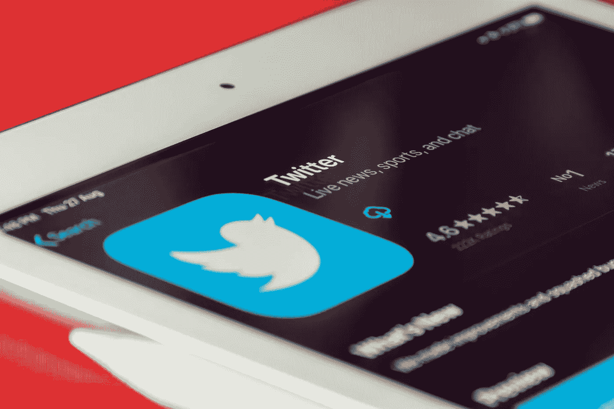
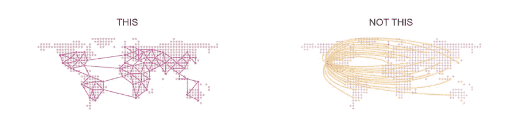

# 社交媒体的未来

> 原文：<https://medium.com/coinmonks/the-future-of-social-media-598600740eba?source=collection_archive---------39----------------------->

加密货币| NFT——在线所有权革命将如何影响社交媒体

Photo by [Souvik Banerjee](https://unsplash.com/@rswebsols?utm_source=unsplash&utm_medium=referral&utm_content=creditCopyText) on [Unsplash](https://unsplash.com/s/photos/twitter?utm_source=unsplash&utm_medium=referral&utm_content=creditCopyText)

# **数字革命——在线所有权**

加密货币、NFT 和分散金融之间的共同点是什么？

它们都是数字革命的要素，使用户能够**可验证地** **拥有** **在线内容和数据**。这是互联网历史上第一个我可以声称拥有数字内容，证明所有权，并与他人进行交易的时代。

这是革命性的，因为它允许互联网用户相信数字拥有的东西完全是他们的，并使陌生人能够相互交易，而不需要第三方来验证另一方是否在说真话。

今天，数字所有权有两个主要领域:

*   **1)加密货币:**如果我在我的[“数字钱包”](https://www.youtube.com/watch?v=GSTiKjnBaes)中拥有一种类似比特币的加密货币，我就可以**用我的[“私钥”](https://bitzuma.com/posts/six-things-bitcoin-users-should-know-about-private-keys/)用数字证明我是比特币的所有者**，并与我想交易的任何人进行交易。

价值:无缝在线持有和转移资金，无需中间人。交易和访问金融服务，无需向第三方托管人(银行)存款。

*   NFT 的:如果我的数字钱包里有一个 NFT，我可以用数字方式证明这个 NFT 是我的，就像我用比特币一样。

价值:可验证地证明/转让在现实世界(房子)中的资产所有权，证明技能或经验，表明从属关系，并获得进入一个专属社区(查看 [Bored Ape Yacht Club](https://opensea.io/collection/boredapeyachtclub?tab=activity) )和其他潜在的效用。

在这个新的网络时代，用户是他们数字资产的钥匙的所有者。然而，在**主流** **社交媒体**的世界里，用户**并不拥有任何东西**。

在用户拥有的数字革命正在进行的背景下，让我们看看社交媒体目前的状况，以及用户拥有的社交媒体的潜力。

# **今日社交媒体**

从现在开始，让我们把 Twitter 当作传统社交媒体来讨论。

Twitter 的结构是什么？

有三个主要参与者

*   平台——提供一个数字空间，使用户能够相互交流。
*   生产用户-在 Twitter 上发布。
*   消费用户——阅读、转发和评论帖子。

首先也是最重要的是，需要一个平台(Twitter ),让生产和消费用户能够参与进来——类似于买卖双方进行交易的市场。

一旦平台存在，人们需要彼此分享想法——这意味着需要有用户产生和参与的内容，以便 Twitter 有任何价值。

只有一个用户的 Twitter 是没有价值的，因为这个用户没有人可以参与。拥有 100 个用户的 Twitter 对这个人来说更有价值，因为他可以与其他人分享和接收想法。你知道这是怎么回事了。随着 Twitter 用户群的增长，这个平台变得越来越有价值。

这就是所谓的 [*网络效应*](https://www.investopedia.com/terms/n/network-effect.asp#:~:text=Multiple%20network%20effects%20have%20occurred,revenue%20for%20social%20media%20websites.) *:* “网络效应是一种现象，通过这种现象，越来越多的人或参与者提高了商品或服务的价值。”

## **克服网络效应的困难**

一旦建立起来，网络效应对竞争者来说是极难克服的。主要的困难是说服用户离开目前为其用户提供大量价值的 Twitter，并加入尚未受益于强大网络效应的新版本。

例如，Parler 一直试图让人们远离 Twitter，声称 Twitter 是一个“言论自由蓬勃发展的平台”，但你可能从未听说过他们，或者自从前总统特朗普最初在 Twitter 上被禁后他们短暂走红以来，你就没有听说过他们。

更具体地说，网络效应造成进入壁垒的原因如下:

*   **生产用户离开的动机低:**对于拥有许多粉丝的人来说，转移到一个平台的成本很高，他们必须在那里重建他们拥有的粉丝数量。
*   **消费用户离开的动力低:**消费用户想要内容最好的平台。如果使用 Twitter 平台的人比竞争对手多 10000 倍，那么没有意识形态动机的普通用户不会选择离开。
*   **惯性:**用户习惯了 Twitter，当他们不得不花费精力去学习像 Parler 这样的新平台如何工作时，他们不倾向于转换。
*   转向新平台的用户会觉得他们错过了 Twitter 上的内容。

## **滥用市场力量的社交网络**

网络效应的力量和平台的价值使得 Twitter 能够利用它的用户，因为他们知道他们不会离开另一个对他们来说“没那么有价值”的平台。这种市场力量，加上 Twitter 对用户数据的所有权，意味着他们可以随心所欲地使用用户的数据，尽管这违背了用户的利益。

一些例子:

*   [**出售用户数据-**](https://www.washingtonpost.com/technology/2021/08/29/facebook-privacy-monopoly/) 获取用户习惯、兴趣等敏感信息，出售给第三方。
*   [**不健康的算法促进平台的更多使用**](https://www.technologyreview.com/2021/10/05/1036519/facebook-whistleblower-frances-haugen-algorithms/) **:** 使用算法促进过度消费和两极分化——操纵用户心理，造成有害的精神和社会问题。
*   **无利润分享:**尽管用户在为平台提供价值方面发挥了重要作用，但 Twitter 不会与其用户分享任何利润。

这里有什么问题？

与传统市场不同，在传统市场中，做市商从买方和卖方之间的交易中抽取一定比例的佣金，而买方和卖方则拥有交易的其余部分。想象一下，易贝从其网站上拍卖的商品中抽取 10%的份额，买家带着一件商品离开，卖家带着剩下的 90%离开。

就社交媒体平台而言，**生产和消费的内容(对 Twitter 的价值)都不归用户所有**。

用户对他们在 Twitter 上的数据拥有**不** **权利**而 **Twitter 通过出售或使用用户数据将用户创造的全部价值**据为己有。

网络效应的力量使 Twitter 能够继续从其用户数据中获利，并使其难以与之竞争。

## Web3(用户拥有的)社交媒体平台能为用户转换创造足够强大的激励吗？

需要明确的是，新的社交媒体公司要超越传统媒体公司显然希望渺茫。也就是说，任何事情都是可能的，随着 Web3 和在线所有权带来的新的激励结构，如果在几年后，用户拥有的平台获得很大的吸引力，我不会感到惊讶。

我将回顾目前正在研究的两种不同的变体，并讨论它们的激励结构如何能够提供足够的社会和经济激励来激励消费和生产用户迁移到他们的网站。

## **1)非令牌化的用户自有平台:**

[**散居**](https://diasporafoundation.org/) (est。2010)是一个类似于传统社交媒体的社交媒体平台，但它是开源的、分散的，用户可以拥有自己的数据。Diaspora 的运作方式是让许多独立的豆荚(由用户运行)相互协作，形成一个网络。目标是分散社交媒体，用户可以创建和运行他们自己的豆荚，拥有他们在豆荚中发布的内容，并决定他们想连接到哪个豆荚。

**用户:** 859，000+

[https://diasporafoundation.org/about](https://diasporafoundation.org/about)

**用户切换激励:**

*   **信任**:用户高度不信任社交媒体网站处理数据，其中[脸书(Meta)的不信任度最高，为 73%。](https://www.washingtonpost.com/technology/2021/12/22/tech-trust-survey/)为了拥有自己的数据，用户可能会被激励去分散的平台。除此之外，还有一个分散的平台，没有任何一方可以将自己的价值观强加给用户。
*   **销售数据**:如果用户能够通过向第三方销售来赚钱，那么他们转换平台可能是值得的，既可以从消费/共享内容中受益，也可以通过使用平台赚钱。

**挑战:**

*   **没有强烈的经济动机促使人们移动:**其他人当时在出售数据(这让许多人不习惯)，截至目前，没有其他经济动机促使用户开发平台，这使得克服网络效应变得非常困难。
*   **平台很原始，用户体验很差:**归根结底，除非竞争平台是无缝的，否则用户不会切换，即使有激励措施。像 Diaspora 这样的平台必须改善用户体验才能有任何竞争机会，当它们被构造成几乎没有利润时，这就更难了。
*   **非法内容:**他们在 2014 年爆出丑闻，ISIS 开始在他们的平台上发帖(他们最终设法删除了这些帖子)。

## **2)令牌化**用户自有平台:

[**DeSo**](https://www.deso.org/) (原为 Bitclout，est。2021)处于通过区块链分散社交媒体的前沿。它的功能类似于传统的密码货币，但是为了在他们的平台上发布，你必须使用他们的 DeSo 币。这使得用户能够分享平台的所有权，并由于张贴的成本而激励用户张贴更有意义的内容。

**用户:** 1.5M+

**用户切换激励:**

*   信任:用户非常不信任社交媒体网站处理数据。更容易相信代码而不是个人做出正确的决定。
*   **德索币的经济学**:随着德索币被越来越多的人采用，德索币的所有者将从需求增加中受益=德索币持有价值的增加。
*   **社交代币:**平台上受欢迎的用户可以生产和销售社交代币，帮助其他用户在平台上投资。前提是内容创作者可以从金钱上激励他们的追随者“投资”他们，记住随着内容创作者变得更受欢迎，社交令牌将更有价值(有可能分享利润/经验奖励)。
*   **主要参与者正在投资空间:**随着越来越多的知名投资者向空间投入资金，随着用户体验的改善，人们会对空间中涉及的品牌名称感到更舒服:

[Stani kule chov(AAVE 首席执行官)宣布他们将投资一种去中心化形式的 Twitter](https://decrypt.co/76278/defi-project-aave-to-release-ethereum-based-twitter-alternative-this-year) ，并表示“我们认为内容创作者应该以一种无许可的方式拥有他们的受众，任何人都可以通过使用相同的链上社交图和数据来建立新的用户体验。”

[亚历克西斯·奥哈尼安(Reddit 联合创始人)与索拉纳基金会合作，向建立在索拉纳·区块链基础上的社交媒体平台投资 1 亿美元。](https://investorplace.com/2021/11/sol-crypto-news-8-things-to-know-about-alexis-ohanians-100-million-web-3-0-bet/)

**挑战**

*   社交互动货币化:说服人们与围绕金钱的社交媒体互动可能很难。人们上 Twitter 是为了想法、联系朋友、新闻，不一定是为了钱。要让人们相信他们需要付费才能在令牌化版本的 Twitter 上发帖是非常困难的。此外，人们可能会对社交活动的货币化失去兴趣，因为在社交活动中，越有钱的人越受欢迎。这看起来就像电影**中反乌托邦世界的一个版本。**
*   ***优化平台的激励会让用户付出代价**:像推特这样的网站被激励优化用户体验，以便让你尽可能长时间地留在平台上，他们可以从广告中获利。然而，没有一个集中的软件工程师大军会被激励去长期持续改进用户体验，除非用户不断地向他们支付费用。如果工程师没有被令牌所激励，他们就不会关心平台上的优化。*

***外卖:***

*可核实的在线所有权正在接管互联网。这已经在主流隐货币和 NFT 货币中看到，并创造了大量的金融、职业和社会机会。*

*由于用户对传统社交媒体平台上的数据缺乏所有权，用户正在被利用，网络效应使得新平台极难竞争。*

*分散、开源和用户拥有的社交媒体网站有可能在长期内改变社交媒体。他们也许能够通过允许用户拥有和分享利润来克服网络效应的障碍。*

## *个人论文(半信半疑)*

*的汇合*

*   *密码变得更加主流*
*   *通过令牌化平台向用户提供的激励*
*   *用户在线所有权的有形隐私利益*
*   *推动更多在线隐私的社会运动*
*   *传统平台继续滥用市场力量*

*最终会导致*

*   *A)转向分散的社交媒体平台(不一定是上述平台)。*

*或者*

*   *b)传统平台通过将控制权和利润让给用户来保持人气——或许埃隆·马斯克会将推特引向这个方向，因为他拥有超过 9%的公司股份，并且是他们的董事会成员。*

*请随意伸出手来讨论更多内容:)*

> *加入 Coinmonks [电报频道](https://t.me/coincodecap)和 [Youtube 频道](https://www.youtube.com/c/coinmonks/videos)了解密码交易和投资*

# *此外，请阅读*

*   *[如何在 FTX 交易所交易期货](https://coincodecap.com/ftx-futures-trading) | [奥凯克斯对币安](https://coincodecap.com/okex-vs-binance)*
*   *[共贷款审核](https://coincodecap.com/coinloan-review) | [您需要贷款审核](/coinmonks/youhodler-4-easy-ways-to-make-money-98969b9689f2) | [BlockFi 审核](https://coincodecap.com/blockfi-review)*
*   *XT.COM 评论 | [币安评论](https://coincodecap.com/xt-com-review)*
*   *[SmithBot 评论](https://coincodecap.com/smithbot-review) | [4 款最佳免费开源交易机器人](https://coincodecap.com/free-open-source-trading-bots)*
*   *[比特币基地僵尸程序](/coinmonks/coinbase-bots-ac6359e897f3) | [AscendEX 审查](/coinmonks/ascendex-review-53e829cf75fa) | [OKEx 交易僵尸程序](/coinmonks/okex-trading-bots-234920f61e60)*
*   *[如何在印度购买比特币？](/coinmonks/buy-bitcoin-in-india-feb50ddfef94) | [瓦济克斯审查](/coinmonks/wazirx-review-5c811b074f5b)*