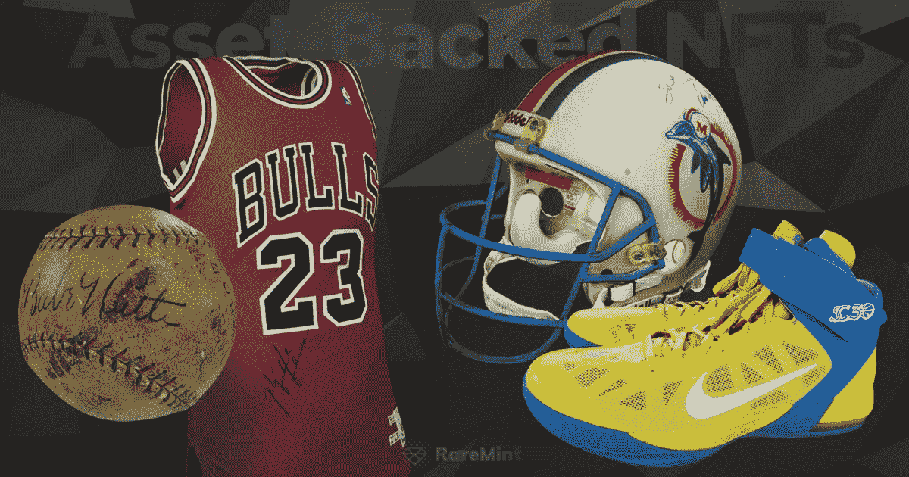

# 体育收藏品的未来；资产支持的非金融资产|稀有货币

> 原文：<https://medium.com/coinmonks/the-future-of-sports-collectibles-asset-backed-nfts-raremint-995d5daa32d5?source=collection_archive---------2----------------------->

## **简介**

体育收藏品市场是一个古老的爱好。毕竟，市场的基础是寻找历史文物，并试图保持它们的原样，而它们变得越来越稀有，价值也在上升。几十年来，这种传统思维一直是体育收藏品世界的特征，尽管体育本身已经进入了数字时代。但事情即将改变，因为新的数字能力将改变体育收藏品行业的经营方式。

在即将到来的变革中，处于最前沿的是不可替代的代币，即 NFT。通过将这项新技术的优势与稀有体育纪念品的内在价值相结合，全新的体育收藏品世界将能够为潜在的买家和卖家提供更多的资产价值。实物资产作为储存和保护价值的手段有许多优势，但它们为此付出的代价是流动性、安全性和可获得性的妥协。

与此同时，纯数字资产，如加密货币和 NFT，也有自己的困难。尽管它们具有灵活性和收益，但它们容易受到波动性、投机性和周期性回报模式的影响。他们往往被孤立在自己的生态系统中，不容易进行平台外的价值交易。

是时候开始应对体育收藏品市场和数字资产领域的一些挑战了。那么，将 NFT 与实物资产(比如一件纪念品)联系在一起有什么好处呢？碰巧的是，作为资产支持的非金融资产，非金融资产和实物大事记在许多方面相互促进。

## **价值、市场稳定性和风险缓解**

今天的投资者渴望找到可靠的替代资产类别，作为保护自己免受通胀和其他影响其传统资产的外部因素影响的手段。随着时间的推移，体育纪念品具有稳定的价值，并且像传统货币一样受外部因素的影响较小。它们在可获得性和可转让性方面可能会受到挑战，但如果选择得当，它们通常在保值方面表现出色，同时具有升值潜力。相比之下，艺术 NFT 和备受瞩目的加密货币等数字资产容易受到波动的影响，因为任何新生市场都会吸引投机买家。

然而，尽管存在这些单独的挑战，通过结合这两种类型的资产，还是有可能在价值方面实现两全其美。通过创建与物理对象不变关联的数字令牌，有可能基于物理资产的价值牢固地建立、维护甚至增加这两个项目的价值。

## **流动性**

虽然很难对高价值收藏品的潜在价值提出异议，但由于交易它们的困难，利用这种价值是非常困难的。这个市场的交易通常会收取高额费用和最低交易金额，而且卖方可能缺乏透明度。这种流动性的挑战可能会成为许多潜在的体育收藏品卖家和买家进入市场的障碍。毕竟，如果联系买家和转让所有权成为销售的障碍，即使是最高价值的资产的实际价值也会下降。

NFT 技术可以帮助今天的买家和卖家弥合这一差距。通过将 NFT 不变地附加到资产上，卖家和买家可以使用 NFT 作为商品的代理，并利用数字世界中的流动性和多种市场选择。在这个系统中，购买 NFT 将相关物品的所有权授予买方，提高了转让的速度和便利性，这样任何两个感兴趣的当事人都可以进行交易。

这些资产支持的非金融交易的数字化方面也为所有者开辟了一个全新的流动性方面。通过利用 NFT 附带的可能的赌注和贷款机会，该项目成为真正的金融工具，即使不进行交易也能获得资产的价值。

## **资产安保和安全**

虽然体育收藏品往往对外部市场力量有相当大的抵抗力，也往往以相当可预测的方式保值增值，但它们确实有一个主要的弱点。因为它们是实物，它们可能会因保存条件和年龄而受到损坏。与任何实物一样，使用、接触和暴露在自然环境中的次数越多，面临的风险就越大。出于这些原因，将资产保存在安全、受控的环境中对于保护其价值非常重要。这种需求总是与一些流动性问题直接相关，因为交易资产通常需要将其从仓库中取出并交给卖方。

输入 NFTs。通过将原本脆弱的资产与数字“双胞胎”或资产支持的 NFT 配对，可以在不接触原始商品或将其从仓库中取出的情况下进行销售。在最好的情况下，实物资产被保存在一个受保护的环境中，如气候控制的保险库，永远不需要离开它，即使所有权发生变化。存储的资产不仅有存储设施的保护，还可以投保和保护免受其他潜在的损害来源，同时依靠可信的权威机构来保证藏品的安全。

## **无障碍**

体育收藏品市场的物理性质，以及所涉及的利基知识，有时会让外人觉得它不是一个创造财富的地方。与其他金融工具不同，收藏品通常不会被普通人看到，也不会看起来容易买到。将这些资产放在可见的市场上不仅会扩大人们的兴趣，还会通过增加库存和活动来使所有相关人员受益。许多体育收藏品的物理性质和高价格也意味着许多人可能会因价格过高而退出市场，部分所有权是不可能的。

尽管数字经济有局限性，但它承诺了很多有形体育收藏品市场没有的好处。数字化和去中心化金融不仅提供了可访问性和进入的便利性，它还具有无与伦比的社区感，以及一天或一周的任何时间都可用的优势。此外，网上开放的各种市场意味着将有过多的地方进行二级和第三方交易。数字金融还有望提供许多进入市场的新途径，尤其是在高价商品方面。合伙投标已经变得很普遍，在这种情况下，一群朋友或同事联合起来购买他们任何一方都无法单独负担的资产。这让他们不仅能拥有通常他们拿不到的东西，还能一起分享获得这些东西的快乐。在一个更大、更正式的层面上，去中心化的数字经济也让群体形成 Dao(去中心化的自治组织)成为可能，Dao 可以对高端资产行使更大的购买力。对于希望进入市场但没有重量级人物购买力的个人而言，数字金融还允许“切片”，即创建资产的一部分进行出售，并为市场带来新的所有权水平。随着数字市场的发展和传统金融体系的形成，很明显，非金融交易正处于构建如何感知和收购有价值资产的下一次变革的最前沿。

当我们为体育收藏品创建资产支持的 NFT 时，我们让体育收藏品世界可以获得数字金融的所有好处和格式，反之亦然。体育收藏品不再被锁在人们的房子里，而是可以成为动态数字经济的一部分，为全球广大观众带来刺激、乐趣和巨大的价值。与此同时，将数字资产与实物资产相结合也有助于加密投资者获得传统金融的一些好处，包括稳定性和拥有稀有物品的兴奋感，这种物品只有一种。随着这一独特资产类别的发展，最优秀的参与者也将提供融合这两种金融系统的方法，提供传统的支付方式，为这两个类别带来更多的参与者和交易量。

## **认证**

体育纪念品市场的传统挑战之一是确保给定的资产是真实的。假冒商品是任何此类资产类别的明显问题之一，不仅适用于体育收藏品，也适用于葡萄酒、奢侈品、古董和珠宝。每次一件物品被拍卖或转手时，认证过程都是该过程中一个至关重要且有时非常耗时的方面。

一般来说，鉴定不仅要求最初确定该物品是真实的，而且还要求通过控制它的每一组手来追踪其来源。在传统世界中，这可能很难做到，因为在资产的所有权路径中有许多缺口，并且必须重复建立真实性。

与此同时，纯粹的数字世界可能存在不同类型的真实性问题。数字市场通常允许任何任意实体进入市场，注册、创建和分发作为艺术品的数字资产。没有任何实际措施来保护品牌产品或资产来源的完整性或验证其真实性。但事实并非如此。数字技术提供了一个不可变的和可靠的所有权链，只要它已经被认证为某个在先点，就可以被用来验证物品的真实性。

在为体育收藏品创建资产支持的 NFT 时，铸造方可以创建一个 NFT，记录和存储一个独特的“指纹”或一组不能被更改或伪造的识别细节。通过创建大小、形状、缺陷、瑕疵、角度和其他识别方面的每个细节的详细数字记录，资产的所有者可以制作防伪的在线资产，确保相关物理物品的身份和出处。然后，这些记录被存储在一个数字区块链上，确保它不会被篡改。因此，一旦一件重要的大事记经过检查并被证实是真实的，NFT 就会确保它的出处是不容置疑的，而资产会安全地存放在一个保险库里。

## **结论**

尽管体育收藏品市场在过去几十年中没有太大变化，但数字资产类别的到来，尤其是 NFT，将对该类别产生巨大影响。通过以资产支持的 NFT 形式将实物收藏品与数字资产相关联，卖家和收藏家将能够从数字世界中获得大量好处，同时保留原始收藏品的抗通胀性、稳定性和兴奋性。与此同时，热切的加密和数字金融投资者可以进入实物商品市场，享受经认证的实物资产的所有相关好处，同时仍然在数字优先的去中心化环境中运营，为参与者提供一个充满数字体验、增强功能和迷人历史的世界。体育收藏品本身可能是过去的文物，但资产支持的 NFT 是该类别的未来。

## 保持联系

在 [twitter](https://twitter.com/RareMint_nft) 和 [Discord](http://discord.gg/raremint) 上关注我们最新的稀有更新。

请务必在 [RareMint](http://raremint.com) 查看我们最新的市场列表！

> 加入 Coinmonks [电报频道](https://t.me/coincodecap)和 [Youtube 频道](https://www.youtube.com/c/coinmonks/videos)了解加密交易和投资

# 另外，阅读

*   [Bookmap 评论](https://coincodecap.com/bookmap-review-2021-best-trading-software) | [美国 5 大最佳加密交易所](https://coincodecap.com/crypto-exchange-usa)
*   最佳加密[硬件钱包](/coinmonks/hardware-wallets-dfa1211730c6) | [Bitbns 评论](/coinmonks/bitbns-review-38256a07e161)
*   [新加坡十大最佳密码交易所](https://coincodecap.com/crypto-exchange-in-singapore) | [收购 AXS](https://coincodecap.com/buy-axs-token)
*   [红狗赌场评论](https://coincodecap.com/red-dog-casino-review) | [Swyftx 评论](https://coincodecap.com/swyftx-review) | [CoinGate 评论](https://coincodecap.com/coingate-review)
*   [投资印度的最佳加密软件](https://coincodecap.com/best-crypto-to-invest-in-india-in-2021)|[WazirX P2P](https://coincodecap.com/wazirx-p2p)|[Hi Dollar Review](https://coincodecap.com/hi-dollar-review)