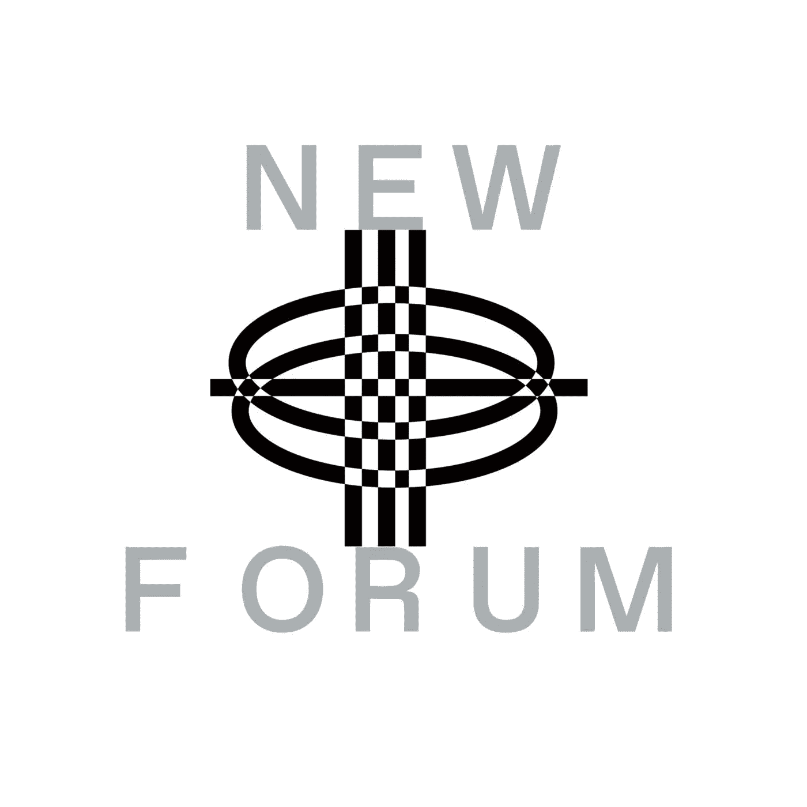

# 当谈到 AR 和 VR 时，可穿戴性的未来

> 原文：<https://medium.com/coinmonks/the-future-of-wearability-when-it-comes-to-ar-and-vr-d6eb21ee3eee?source=collection_archive---------33----------------------->

Zuzana Bastian 戴着她创办的 Jevels 公司的华丽数字耳环，优雅地出现在 NEWFORUM 上。Jevels 是一家专注于分发可穿戴 NFT 和共同创建元宇宙的公司。你会惊讶地发现，祖扎纳学的是药学，目前在那个部门工作。她分享说，她一直对时尚感兴趣，并认为有必要为时尚产业对我们星球的影响做点什么。

> “我开始想办法让时装业变得更可持续。2020 年疫情期间，我发现了数字时尚的概念；后来我再也睡不着了，因为我发现它太有吸引力了……”——祖扎娜

Zuzana 把自己定义为一个相信只要态度正确一切皆有可能的人。激励她的三件事是对学习新事物的好奇心、致力于创新(制药和时尚)以及激励她周围的人、她的朋友和她的家人。

Zuzana 带着正确的态度来到 NewForum，看到她在整个面试过程中的微笑，情况发生了变化。

我们愉快地讨论了她对数字时尚与数字时尚的看法，传统珠宝品牌进入元宇宙的利弊，以及时尚人士未来是否会接受或适应数字时尚作为他们日常生活的一部分。

> “Jevels 是一个 NFT 平台或空间，所有的设计都可以通过 AR 或 VR 穿戴。”—祖扎纳

Jevels 与来自世界各地的设计师合作，将他们的设计/虚拟珠宝和/或实体珠宝或时尚配饰带入元宇宙。

那么为什么 Zuzana 决定追求数字珠宝而不是数字时尚呢？

Zuzana 认为珠宝是每件衣服的惊叹号。她解释说，当你戴上一件漂亮的珠宝时，它会让一切都更漂亮。此外，珠宝在我们的生活中有情感的一面；我们都有自己喜欢佩戴的珠宝，我们觉得那些给了我们超能力的人给了我们一些超能力。

> “我认为这种力量可以转移到我们现在花费最多时间的虚拟空间，这就是 Jevels 的目标。”—祖扎纳

Zuzana 很期待看到增强现实(AR)和虚拟现实(VR)的可穿戴性在未来会是什么样子。

> “我认为增强现实将会发展，我们将会在日常生活中使用增强现实并混合现实，我们可能会戴上一些眼镜或镜头，我们将会看到世界通过这些技术得到改善……”—Zuzana

观看她的完整采访，看看她通过过滤器展示她美丽的 Jevels 珠宝系列。

Zuzana 补充说，我们通过技术实现了许多可能性来增强 IRL。

> “我认为许多人只关注元宇宙和虚拟空间，但我认为 AR 也有光明的未来，我期待着在物理空间中穿着虚拟服装走出家门，穿着正常。我不认为我们会完全停止生产实物，但我们不需要那么多，因为；它们将是增强的技术；AR 或混合现实……”—Zuzana

Zuzana 还讨论了让没有加密经验的广大公众进入 Web3 空间和 NFT 所面临的挑战。她解释说，她与所有使用他们平台的设计师密切合作，因为对一些人来说，这是他们第一次在虚拟空间创作 NFT 并接触他们的第一批顾客。

Zuzana 指出，传统珠宝品牌对 Web3 来说是新的，因此，在回答诸如什么是 NFT 这样的问题的第一次对话中，需要更多的教育。你是怎么铸造的？什么是煤气费，为什么我需要它们..？Jevels 还为每个设计提供了 GLB 文件。根据 Zuzana 的说法，许多设计师在了解区块链的力量之前都有点犹豫。Zuzana 认为，教育顾客和设计师都是必不可少的。

Zuzana 补充说，她将他们平台上的客户分为两类；用加密钱包购物的加密土人和第一次拥有 NFT 的人。

加入我们的社区，观看 Zuzana Bastian 的完整采访，了解更多关于 Jevels 与多元化设计师和客户团队合作的方法。在谈到 Jevels 的愿景和使命后，Zuzana 还讨论了她对 AR 和 VR 可穿戴性未来的看法。她向不熟悉 Web3 和 NFT 的设计师和客户讨论了 Jevels 的入职方法。Zuzana 分享了她对元宇宙的定义，它如何影响她的工作，以及传统品牌如何进入元宇宙。我们还谈到了 Zuzana 关于时尚如何通过去中心化变得更加多样化的观点。最后，Zuzana 描述了物理时尚以及它如何在未来成为规范。

[加入社区](https://twitter.com/newforum_nco)了解 [@jevels_virtual](https://twitter.com/Jevels_virtual) 并发现 web3 社区中的其他创作者！

✨follow·祖扎纳·巴斯蒂安！Twitter:[@ jevels _ virtual](https://twitter.com/Jevels_virtual)insta gram:[@ jevels . NFT](https://www.instagram.com/jevels.nft/)LinkedIn:[祖扎纳-巴斯蒂安](https://www.linkedin.com/in/zuzana-bastian-5934505b/) Linktree: [jevels](http://linktr.ee/jevels) 不和: [jevels](https://discord.com/invite/7WeS9YjrMs) 网站:[jevels.com](http://jevels.com/)

# new forum # web 3 # digital fashion # VR # ar # Mr # NFT #可持续发展# digitalaccessories #区块链

爱 x 新论坛

# Twitter @newforum_nco

不和谐[@加入](https://discord.gg/DHepA4WTkN)

# 新论坛

[NEWFORUM](https://newforum.notion.site/newforum/Welcome-to-NEWFORUM-48f9661398ec4ec6a1af37fcc96dc926) 由 [Newcoin Foundation](https://newcoin.org/) 提供支持，专注于促进去中心化社交应用的扩展，也被称为 Social 3.0，形成一个生态系统和一个由远见者、创造者和投资者组成的社区。它为思想者提供了一个安全的交流、传播和分享思想的空间，以确保一个新网络的自觉和道德发展，嵌入关怀、自由和创造力的价值观。✨每周新集！在 [Twitter](https://twitter.com/newforum_nco) 、 [Newlife](https://newlife.io/) 、 [Youtube](https://www.youtube.com/channel/UCWvHyau1nIJBffmaaj6FmbQ) 和 [LinkedIn](https://www.linkedin.com/showcase/newforum/) 上关注我们，了解 web3 的更多信息，认识生态系统！加入生态系统[不和](https://discord.gg/DHepA4WTkN)！

> 加入 Coinmonks [电报频道](https://t.me/coincodecap)和 [Youtube 频道](https://www.youtube.com/c/coinmonks/videos)了解加密交易和投资

# 另外，阅读

*   [AscendEx 保证金交易](https://coincodecap.com/ascendex-margin-trading) | [Bitfinex 赌注](https://coincodecap.com/bitfinex-staking) | [bitFlyer 点评](https://coincodecap.com/bitflyer-review)
*   [Bitget 回顾](https://coincodecap.com/bitget-review)|[Gemini vs block fi](https://coincodecap.com/gemini-vs-blockfi)cmd |[OKEx 期货交易](https://coincodecap.com/okex-futures-trading)
*   [AscendEx Staking](https://coincodecap.com/ascendex-staking)|[Bot Ocean Review](https://coincodecap.com/bot-ocean-review)|[最佳比特币钱包](https://coincodecap.com/bitcoin-wallets-india)
*   [霍比评论](https://coincodecap.com/huobi-review) | [OKEx 保证金交易](https://coincodecap.com/okex-margin-trading) | [期货交易](https://coincodecap.com/futures-trading)
*   [网格交易机器人](https://coincodecap.com/grid-trading) | [Cryptohopper 审查](/coinmonks/cryptohopper-review-a388ff5bae88) | [Bexplus 审查](https://coincodecap.com/bexplus-review)