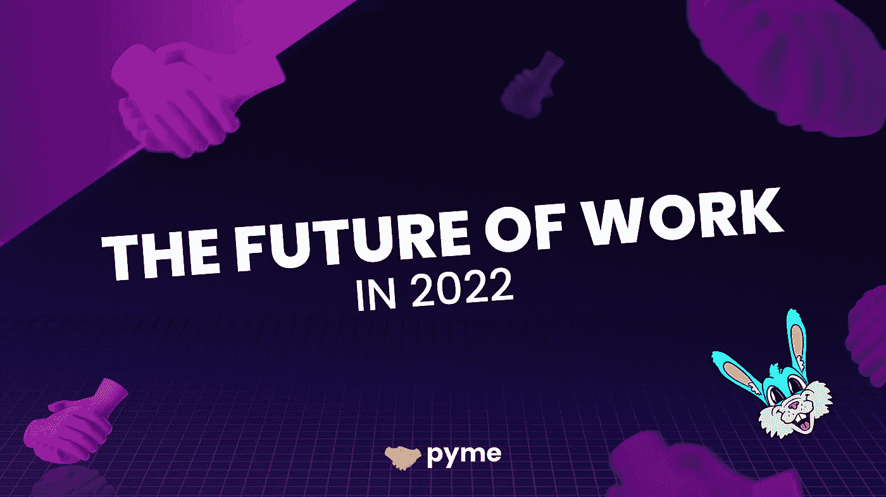

# 网络工作的未来 3

> 原文：<https://medium.com/coinmonks/the-future-of-work-in-web3-6908cd911d11?source=collection_archive---------68----------------------->

我将在这篇文章的开头声明，任何告诉你他们知道工作的未来、web3 的未来和密码的未来的人都是在胡说八道。当然，这只是我的视角；请在五年后在推特上随意辱骂我，因为我是多么的疯狂。然而，我在 Pyme 团队的帮助下将这些放在一起，因为它塑造了我们今天正在建立的公司以及我们*相信*人们将来会需要的产品。

在 Pyme，我们的使命是让招聘变得更好。我将在以后的许多文章中谈到为什么我们认为招聘被打破，以及我们如何计划实现我们的使命，但首先，我认为解释我们如何看待未来是很重要的。十多年前，我的一位导师告诉我，想象我们想要生活的未来，然后努力工作，让这个世界充满生机。理想主义，当然。然而，它给了我一种目标感，让我每天醒来都相信我正在努力建设一个更美好的明天。

所以现在开始。我认为未来的工作将围绕以下 4 个关键领域展开:

1.  **远程第一**
2.  **2。链上加密和本地加密**
3.  **3。自由职业者，受工人激情的驱使**
4.  **4。分散和社区所有**

# 远程优先

不需要火箭科学家就能理解新冠肺炎·疫情是如何加速向远程工作转变的。随着在家、在海滩或在森林里工作被广泛接受，我们看到越来越多的人选择独立于公司所在地生活。

借助 Slack、concept、Discord 和 Zoom 等工具，成为团队的一员而不在同一个物理位置变得前所未有的简单。我不是说这很容易。远非如此，这也是我们在 Pyme 团队中每天都在努力改进的地方。团队一半位于神奇的格鲁吉亚第比利斯(the country)，另一半分布在世界各地。然而，在 9 个国家生活过之后，我个人看到了能够与我信任的团队一起工作，同时又能灵活调动的吸引力。

我可以毫无疑问地说，在过去的 12 个月里，我已经大大改变了我的想法。一年前，在建立我的前一家公司时，我清楚地记得告诉我们的人力资源主管，我无法想象一个除了在办公室之外还有人从事任何有成效的工作的世界。我们有希望远程工作的潜在员工，但我们拒绝了，因为我们认为办公室工作是唯一的方式。

我个人偏好还是坐办公室；我喜欢人们工作、努力变得更好、想要创业的忙碌。但我知道很多人不知道。能够灵活地与家人在一起，按照适合他们的不同时间表工作，旅行，或者住在更适合他们想要的生活的地方。

我受到了 GitLab 等公司的启发，他们在雇佣全球人才方面做得非常出色，以远程优先政策为先导，制定所有政策和文档，最重要的是，*他们如何*让远程优先为他们工作。此外，随着最近从 400 万美元 ARR 到 1 亿美元 ARR 的单年增长，Deel 等公司表明对远程员工的需求从未如此之高。

今天，我的观点变了。我非常重视拥有一个拥有不同背景、教养和文化的团队。它给了我们不同的思想、观点和意见，但它也让我们能做出更好的产品。随着人口迅速接近 80 亿，世界上充满了难以置信的人才，他们努力工作，建设更美好的生活，并为他们所相信的社区做出贡献。我看到了一个未来的世界，工人们首先要求远离。我看到一些公司理解远程和多元化团队的价值。

# 链上和加密本机

如果你在 2022 年 4 月读到这篇文章，那么你很有可能已经非常清楚链上和加密原生意味着什么。虽然这与区块链所涉及的技术关系不大，而与 Pyme 一个月大的关系更大，但它凸显了我们在建设未来工作世界方面的早期程度。

我第一次接触比特币是在 2012 年；我在英国曼彻斯特生活和工作，为一家托管公司工作。每周花很多时间阅读 Techcrunch，我一直在阅读这项技术将如何成为金钱的未来。天真、目光短浅、健康的中产阶级家庭教育，我的任何闲钱都用来买了一套公寓，这意味着我从未按照自己的愿望去拥有这笔未来的神奇财富。

然而，当 2017 年的加密泡沫滚滚而来时，我坚信，不仅所有的加密赌博都是加密赌博，而且它注定要失败，变为零。谢天谢地，2021 年底的一次美国之行帮助我认识到了我的想法的愚蠢，除了花余生试图发明时间机器之外，我认为是时候以清晰的头脑和全新的视角学习更多了。

我不会用日复一日、周复一周地掉进兔子洞来烦你，但我会与你分享发生了什么变化。理解数字证明所有权的能力让我的思维循环了几个星期。这个单一的想法是，通过使用区块链建立的技术，如以太坊和 NFTs 的力量，有人可以证明他们拥有资产，如果他们能做到这一点，他们可以证明资格，技能，甚至他们的工作经验。

于是皮姆诞生了。我们非常热衷于帮助塑造一个人们可以证明自己技能的世界。一个技能、教育和经验环环相扣的世界。在一个 web3 的世界里，最好的工人得到了工作，可以立即在 Crypto 中获得报酬，并可以建立一个证明他们经验的档案。

在面试之前，公司可以在几秒钟内核实员工是否具备某个职位所需的技能、教育和经验。招聘由简历驱动的日子将一去不复返，这种简历奖励那些最擅长自我推销的人，带有巨大的内在偏见，或者社交媒体档案已经成为自我夸大和虚假虚张声势的回音室。

今天的工作平台让雇佣者失望，他们低估了员工的价值。向工人收取 20%的费用是对工人征收的税，在雇佣了数百名自由职业者之后，我还没有遇到一个人不反感向他们收取的费用。缓慢的支付时间，缺乏支持，以及平台对提高股东回报的不断增长的需求意味着是时候改变了。

这就是为什么我们让 Pyme 免费雇佣。自由工作。我们的存在是为了帮助这个世界做他们喜欢的工作。由于区块链的性质，工人们一完成项目就能立即拿到工资。不再收取 20%的雇佣和工作费用。不再有 14 天的支付时间或向申请工作的工人收费。

这可能很难看出，尤其是如果你像我一样怀疑了很多年。然而，我今天不能更有信心，在未来，绝大多数工人将支付加密和他们的经验验证链。

# 自由职业者，被工人的激情所驱使

作为一个在英格兰北部长大的孩子，我记得听说过人们从 16 岁离开学校一直工作到退休的故事。他们被奖励了一个挂在壁炉架上的金钟，作为对他们一生奉献工作的感谢。幸运的是，在 2022 年，这种情况已经发生了变化，但我可以预测，在接下来的五年里，我们将会看到比过去五十年更加戏剧性的转变。

美国劳工统计局在 2020 年进行的一项研究显示了这种转变有多么巨大。55 岁至 64 岁的工人(9.9 年)为同一家公司工作的时间是 25 岁至 34 岁的工人(2.8 年)的三倍多，可以肯定地说，这一趋势可能会继续下去。如今，员工在工作地点、工作时间和为谁工作方面有更多的灵活性和自由度。此外，按需零工经济的兴起、Upwork 和 Fiverr 等自由职业平台的增加，以及 work、web3 和社交媒体等新行业的出现，导致越来越多的工人选择非传统的工作方式。

虽然今天的工人有更多的自由，他们也有更多的意识。领导层透明度、企业和社会责任，以及公司的价值观和信念现在决定了为谁工作。我预计这种趋势将继续下去，未来的工作将会出现，员工们将自己与他们相信的使命和他们希望帮助成长的社区更加紧密地联系在一起。

千禧一代不努力的神话被数据推翻。千禧一代和 GenZ 愿意非常努力地工作，但这必须是为了他们相信的事业，认为他们可以做出贡献，并公平地奖励他们的投入。Crypto、DAOs 和 web3 社区的出现只会加速这一进程。

在 Pyme，我们设想这样一个未来:工人们为他们相信的社区和项目工作，而不是为他们工作，这有助于他们成长，并激励他们为更广泛的目标做出贡献，无论这是什么目标。在这个世界中，员工同时从事多个项目，通常是在不同的兴趣领域。一个工作者可能在一个项目中扮演主要开发人员的角色，同时在另一个项目中扮演社区发展的角色。

# 分散和社区所有

代币将会是我们看到的未来工作的大门。组织一群受激励为公司发展做出贡献的人的力量正在从根本上改变公司运营、管理和分配工作负载的方式。我们相信 DAOs 的力量，虽然还有许多事情需要解决，但一个人们的贡献得到公平回报的世界不仅会给世界各地更多的人带来更多的平等，还会给他们带来更多的财富。不幸的是，工作民主化的想法感觉像是一个网络流行语，已经被过度使用到了极点。然而，就目前而言，工作民主化是总结我们希望实现的目标的简单方法。

我已经提到了工人追求满足他们激情的项目的权力。然而，在 Youtube 课程的世界里，信息从未如此自由地获得，而且这种情况只会继续下去。开源技术项目并不是一个新概念；然而，结合分散所有权*和*工作令牌经济学的力量，越来越多的项目将决定通过尽早转移到社区所有权可以更快地构建社区。

我认为未来的平台用户需要去中心化、开源和社区所有权，而不是当前的过度索引股东而不是社区、用户和贡献者的模式。虽然我目前认为公司需要启动平台，但我们相信首先要建立社区，并有一个清晰的 DAO 结构、令牌发布和开源平台的路线图。我毫不怀疑，比我聪明得多的人会找出改进道操作、道工具和激励结构所需的工具。

我相信 Pyme 可以通过将世界上更多的地方连接在一起，帮助工人找到他们想要成为其中一员的社区，并支持社区找到他们需要的人来塑造未来。

以上观点是我自己的，所以如果其中一些被证明是疯狂的浪漫或完全错误的，那是我的错，不是皮姆的错。在推出 Pyme 一个月后，我承诺在 100 天内每天写一篇文章。首先，作为一种公共建设的方式，但最重要的是(希望)帮助更多的人看到 web3 工作的美好未来。

我很想知道你的想法；你对未来的工作有什么预测？在推特上给我打电话，让我知道！

在 Pyme，我们正在为未来的工作搭建一个平台。这将包括工作，奖金，实习，以及更多在 web3，因为我们努力改善招聘。技能和经验的链证明将验证资格。我们是一个小团队，总是需要帮助；联系我们[不和谐](https://discord.gg/eecfRVsHRh)的任何一个 Pyme 团队，并随时告诉我们你能提供什么帮助。

# TL；速度三角形定位法(dead reckoning)

*   工人们想要在他们想去的地方以他们想去的方式生活和工作的自由。
*   验证技能和经验将有助于最适合这份工作的人得到这份工作。
*   目前的平台收费太高，所以我们让 Pyme 免费雇佣和工作。此外，在 Crypto 中，员工可以立即获得报酬。
*   未来的工人希望为他们所信仰的事业做出贡献，并为他们的贡献得到公平的回报。
*   DAOs 和开源是以代币为网关*和*为报酬的 web3 的组织。

*最初发布于*[*https://pyme . team*](https://pyme.team/article/future-of-work-web3)*。*

> 加入 Coinmonks [电报频道](https://t.me/coincodecap)和 [Youtube 频道](https://www.youtube.com/c/coinmonks/videos)了解加密交易和投资

# 另外，阅读

*   [Bookmap 评论](https://coincodecap.com/bookmap-review-2021-best-trading-software) | [美国 5 大最佳加密交易所](https://coincodecap.com/crypto-exchange-usa)
*   最佳加密[硬件钱包](/coinmonks/hardware-wallets-dfa1211730c6) | [Bitbns 评论](/coinmonks/bitbns-review-38256a07e161)
*   [新加坡十大最佳加密交易所](https://coincodecap.com/crypto-exchange-in-singapore) | [收购 AXS](https://coincodecap.com/buy-axs-token)
*   [红狗赌场评论](https://coincodecap.com/red-dog-casino-review) | [Swyftx 评论](https://coincodecap.com/swyftx-review) | [CoinGate 评论](https://coincodecap.com/coingate-review)
*   [投资印度的最佳加密软件](https://coincodecap.com/best-crypto-to-invest-in-india-in-2021)|[WazirX P2P](https://coincodecap.com/wazirx-p2p)|[Hi Dollar Review](https://coincodecap.com/hi-dollar-review)