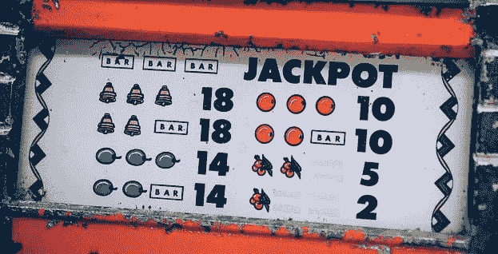
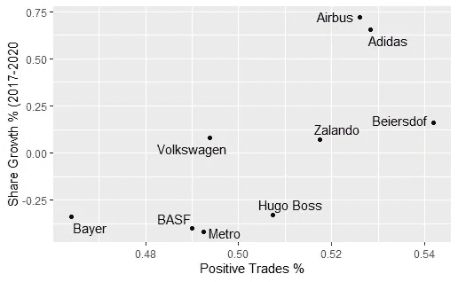

# 股票中的赌徒谬论:当股票上涨时买入，当股票下跌时卖出

> 原文：<https://medium.com/coinmonks/the-gamblers-fallacy-in-stocks-buy-when-stocks-go-up-sell-when-stocks-go-down-961e0364a2ac?source=collection_archive---------33----------------------->

Only because you lost the last twenty times, doesn’t mean that you have to win now.

尽管我知道“赌徒谬误”,但我真的不相信它也适用于股票。对我来说，不受任何或可忽略的人为影响的重复事件，如掷骰子或掷硬币，应该在每次重复时具有相同的结果概率，而不管之前的任何掷骰子或掷硬币结果。这意味着在我下一次翻转时，仍然有百分之五十的机会是反面，即使我已经连续翻转了五次反面。然而，股票并没有完全脱离之前的发展，或者至少我是这样认为的。我认为，仍有足够多的投资者更有可能投资上涨的股票，而不是下跌的股票，他们没有意识到这一谬论，或者过于依恋下跌的股票。随着越来越多像 Robinhood 这样的平台让更广泛的公众可以进行交易，我认为会有足够多的“趋势跟踪者”在市场中创造这样的动态。然而我错了…

为了分析结果(股票上涨或下跌)是否独立于之前的发展，我想出了一个简单的策略想法，可以利用这种发展。每当股票连续上涨两个时间间隔，我就买入，每当股票下跌一个时间间隔，我就卖出。为了尽可能简单地模拟这种交易策略，我使用交易日作为时间间隔，并使用每个交易日的收盘价来评估我的策略是盈利还是亏损。

> 策略:如果股票连续两天上涨，我就买入，一旦下跌，我就卖出。

当我根据 2017 年至 2020 年的数据为最初的几家公司模拟这一策略时，我意识到我的总交易中只有略高于 50%的交易会盈利。对于我的潜在假设来说，这本身似乎已经没有什么希望了。一旦我增加了几个这些年来总价值也在下降的公司，我的策略的估计值甚至低于 50%，这表明如果我投资这些股票，我的亏损次数将会超过综合策略的盈利次数。在所有的样本股票中，我会获得适度的利润，然而整个市场也是如此，仅仅投资于一个指数，并且三年内不再看它，可能会更容易获得更多的利润，因为费用更低。一旦我把这三年的价值增长(百分比)作为控制变量，我的策略的回报高度依赖于这些股票的总体发展，而不是增加回报的灵丹妙药(r = >.8)。

Percentage of Trades my strategy would have worked (> 50% Juhuu, <50% Umm)

尽管我没有找到一个有利可图的策略，但我获得了新的见解，如果不是亲眼所见(或在现有研究中)，我也不会认为这是真的。如果股票上涨或下跌似乎主要独立于其先前的发展，因此仅仅根据先前的趋势做出投资决定是没有意义的。毕竟，即使面对不同个人做出的许多投资决定，赌徒谬误似乎也成立。

*我绝不是芬兰的专家，只是一个喜欢学习、实验和调查的好奇的人。请让我知道是否有有价值的额外信息，是否有推理错误，或者您是否度过了愉快的一天。谢谢你让我和你分享这个！*

> *加入 Coinmonks* [*电报频道*](https://t.me/coincodecap) *和* [*Youtube 频道*](https://www.youtube.com/c/coinmonks/videos) *了解密码交易和投资*

# 此外，请阅读

*   [bookapp Review](https://coincodecap.com/bookmap-review-2021-best-trading-software)|[美国 5 大最佳加密交易所](https://coincodecap.com/crypto-exchange-usa)
*   最佳加密[硬件钱包](/coinmonks/hardware-wallets-dfa1211730c6) | [Bitbns Review](/coinmonks/bitbns-review-38256a07e161)
*   [10 新加坡最佳密码交易所](https://coincodecap.com/crypto-exchange-in-singapore) | [购买 AXS](https://coincodecap.com/buy-axs-token)
*   [红狗赌场点评](https://coincodecap.com/red-dog-casino-review) | [Swyftx 点评](https://coincodecap.com/swyftx-review) | [CoinGate 点评](https://coincodecap.com/coingate-review)
*   [在印度投资的最佳密码](https://coincodecap.com/best-crypto-to-invest-in-india-in-2021)|[waz rix P2P](https://coincodecap.com/wazirx-p2p)|[Hi-Dollar Review](https://coincodecap.com/hi-dollar-review)
*   [加拿大最好的加密交易机器人](https://coincodecap.com/5-best-crypto-trading-bots-in-canada) | [库币评论](https://coincodecap.com/kucoin-review)
*   [用于 Huobi 的加密交易信号](https://coincodecap.com/huobi-crypto-trading-signals) | [HitBTC 审核](/coinmonks/hitbtc-review-c5143c5d53c2)
*   [如何在 FTX 交易所交易期货](https://coincodecap.com/ftx-futures-trading) | [OKEx vs 币安](https://coincodecap.com/okex-vs-binance)