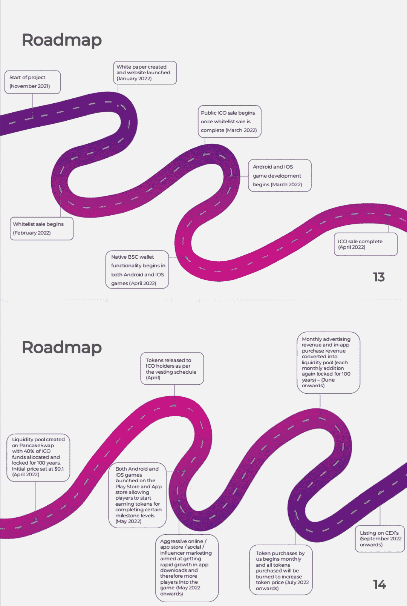
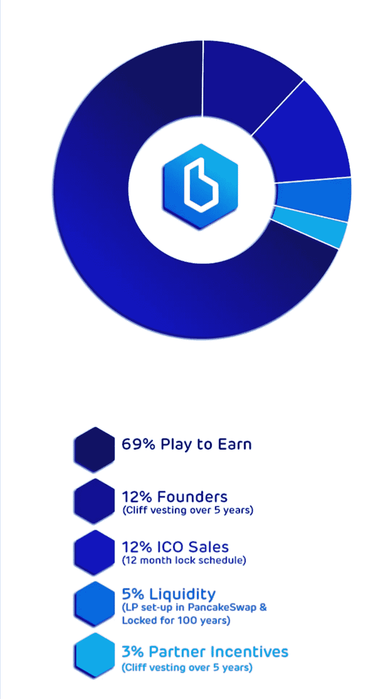

# 人民的游戏——布雷津抢劫

> 原文：<https://medium.com/coinmonks/the-game-for-the-people-brayzin-heist-c7b5e91024f4?source=collection_archive---------25----------------------->

**简介**

你对《T2》第三场比赛的益智游戏《T3》有什么看法？

没错。我说过你现在可以轻松赚外快了吗？哦，我刚刚开始写作。

那你应该留下来。以防你有太多的好奇心， [Brayzin Heist](http://Brayzin.io) 是上述问题的答案。怎么会？又一个问题。

我 9 岁的表弟，出于某种原因，已经知道如何导航国际足联；事实上，他也邀请我和他一起玩 PuBG。毕竟，他是个聪明的孩子。但是，现在不是每个孩子都很聪明吗？

想象一下，对他来说，玩第三场智力游戏会是什么样子。如果是我来回答，我会说“超级简单”

**布雷津海斯特&玩赚(P2E)**

术语“P2E”指的是基于区块链技术的奖励游戏。这个概念一点也不新鲜，因为目前有太多的 P2E 游戏。

布雷津海斯特是一个比赛 3 益智 P2E 区块链游戏。

在这个领域，玩游戏赚钱一直是人们讨论的话题。然而，不管你怎么看，它们有时包括一些非加密/区块链/游戏人员可能难以适应的技术层面。

然而，Brayzin Heist 的“非常简单”的设置有助于它脱颖而出。允许玩家几乎什么都不做就获得奖励(在我看来)。Brayzin Heist 允许玩家混合乐趣和奖励。

有了这个简单的基于奖励的游戏系统，你几乎可以保证你会很好地利用白天的时间。那几个小时/几分钟尴尬的无所事事将被完全抹去，因为你可以利用这段时间通过 Brayzin Heist 获得一些额外的奖励。

**让我们来一次深潜**

考虑糖果粉碎的游戏，但这一次有奖励。那么，这到底意味着什么呢？

Brayzin Heist 旨在奖励玩家在游戏中完成各种级别。对于玩家达到的每个奖励标记级别，玩家有权获得游戏系统预先确定的奖励。因为一切都是在区块链完成的，没有隐藏的诡计。

考虑到游戏的易玩性，它完全包含了所有类型的用户。来自世界各地任何社会阶层的任何人都可以参与游戏。

与其他游戏不同，Brayzin Heist 的盈利可能不需要绝对的专注。玩家甚至不需要成为任何方面的专家；他们所要做的就是享受比赛。想象一个简单的游戏，你可以在等火车或公共汽车的时候玩，还能赚钱。在我看来，这将是惊人的。

**怎么拿工资？**

好吧，你可能打算整个周末都粘在手机上玩 Brayzin Heist。你很可能有一个关于如何和在哪里花钱的策略。但你甚至还没想好如何得到报酬。别担心，这就是我写这篇文章的原因:给你提供你需要的信息。

因为游戏是建立在区块链技术上的，而且开发者仍然致力于改进 DeFi 的功能，玩家将获得加密货币奖励。

布雷津大劫案将有自己的经济和奖励系统，这将是基于布雷津令牌(BRZN)。该硬币是基于币安智能链(bsc)制造的，用户将能够使用 bsc 钱包并获得奖励。

玩家可以将他们的奖金兑换成稳定的硬币，这些硬币可以用于其他基于加密的支付和交易，也可以简单地兑换回法定货币。

玩家现在可以完全控制利润，并可以决定如何处理这些利润。

这个项目不仅仅让游戏玩家受益，代币持有者可以根据他们拥有的代币数量每月获得被动奖励。Dev 确保每个人都是赢家。

Backed by increasing cash reserves

**你需要知道的事情**

你可能会问，游戏如何拉动收入？

用户可能会被敦促进行应用内购买，以增强他们的游戏体验(这是非常可选的，因为你可以选择不进行任何购买)。与传统游戏一样，应用内购买可以让用户获得非付费玩家所没有的功能。Brayzin Heist 的开发商也将在游戏中向非付费玩家展示广告，为游戏筹集资金。

大部分的 BRZN 代币只能通过游戏来获得。随着玩家玩游戏的势头越来越大，这可能会帮助 BRZN 获得价值。一旦更多代币发行，代币生态系统中的流动性就会增加。

由于可获得的代币总数主要由游戏的参与度和经济性决定，可以肯定地说，代币是为了给游戏增加价值而设计的，而不仅仅是另一个没有特定用途的随机代币。

在项目的首次公开募股(ICO)后，团队可能不需要额外的资金，因为[ICO 收益的 20%将留作运营费用](https://brayzin.io/wp-content/uploads/2022/03/Brayzin-whitepaper-15-Feb-2022-v1.pdf)，这将包括营销和项目中其他以增长为导向的举措。

**我为什么要玩布雷津海斯特？**

简单入门:参与游戏很容易。它不会在你的手机上占据很大的空间，也不需要任何复杂的安装。从您打开应用程序的那一刻起，您可能会在不到一分钟的时间内开始玩游戏。

手机友好型:为手机设计的 p2e 并不多。Brayzin Heist 的目的是在不使用任何复杂设备的情况下奖励移动用户。游戏的安卓版和 T2 版 iOS 版都可以在测试模式下玩。

维持流动性:来自应用内销售/交易的所有收入的 80%将被存入游戏的流动性池。这将有助于维持流动性和稳定的代币价格。

免费游戏:这是一款免费游戏，与其他 P2E 游戏不同，它需要某种投资才能盈利。

建立在 bsc 链上:bsc 链是一个受欢迎的链，允许游戏接触到更多的观众，并提高参与度。该连锁店促进友好的天然气费和密码简单上船。

效用:BRZN 令牌用于运行游戏的经济，允许玩家获得一个可以增值的全功能效用令牌。

**令牌组学**

Brayzin Heist token 最大供应量 1.5 亿，不可修改。这种硬币被设计成一种免税代币，是在币安智能链(BEP-20)上开发的。

分发:

3%作为合作伙伴奖励，将在 5 年内授予。

5%将作为流动资金。然而，在 PancakeSwap 建立的流动性池被锁定了 100 年。

11%归创始人所有。它也将在 5 年内被授予。

12%将用于 ICO 销售。

69%设定为游戏的玩法赚取经济/奖励系统。

Brayzin Tokenomics

[网站](http://Brayzin.io) | [脸书](https://m.facebook.com/Brayzintoken)|[insta gram](https://instagram.com/brayzintoken?igshid=YmMyMTA2M2Y=)|[Twitter](https://twitter.com/Brayzintoken?t=zxyrBBe3R2aEP1V9jVnaKQ&s=09)|[LinkedIn](https://www.linkedin.com/mwlite/company/brayzin)|[Telegram](https://t.me/brayzintoken)|[PlayStore](https://play.google.com/store/apps/details?id=com.shine.brayzinheist)|[app store](https://apps.apple.com/us/app/brayzin-heist/id1622159262)|[Medium](/@brayzin_token)

> 加入 Coinmonks [电报频道](https://t.me/coincodecap)和 [Youtube 频道](https://www.youtube.com/c/coinmonks/videos)了解加密交易和投资

# 另外，阅读

*   [分散交易所](https://coincodecap.com/what-are-decentralized-exchanges) | [比特恩斯 FIP](https://coincodecap.com/bitbns-fip) | [宾邦评论](https://coincodecap.com/bingbon-review)
*   [用信用卡购买密码的 10 个最佳地点](https://coincodecap.com/buy-crypto-with-credit-card)
*   [加拿大最佳加密交易机器人](https://coincodecap.com/5-best-crypto-trading-bots-in-canada) | [Bybit vs 币安](https://coincodecap.com/bybit-binance-moonxbt)
*   [阿联酋 5 大最佳加密交易所](https://coincodecap.com/best-crypto-exchanges-in-uae) | [SimpleSwap 评论](https://coincodecap.com/simpleswap-review)
*   购买 Dogecoin 的 7 种最佳方式 | [ZebPay 评论](https://coincodecap.com/zebpay-review)
*   [最佳期货交易信号](https://coincodecap.com/futures-trading-signals) | [流动性交易所评论](https://coincodecap.com/liquid-exchange-review)
*   [火币加密交易信号](https://coincodecap.com/huobi-crypto-trading-signals) | [Swapzone 审查](/coinmonks/swapzone-review-crypto-exchange-data-aggregator-e0ad78e55ed7)