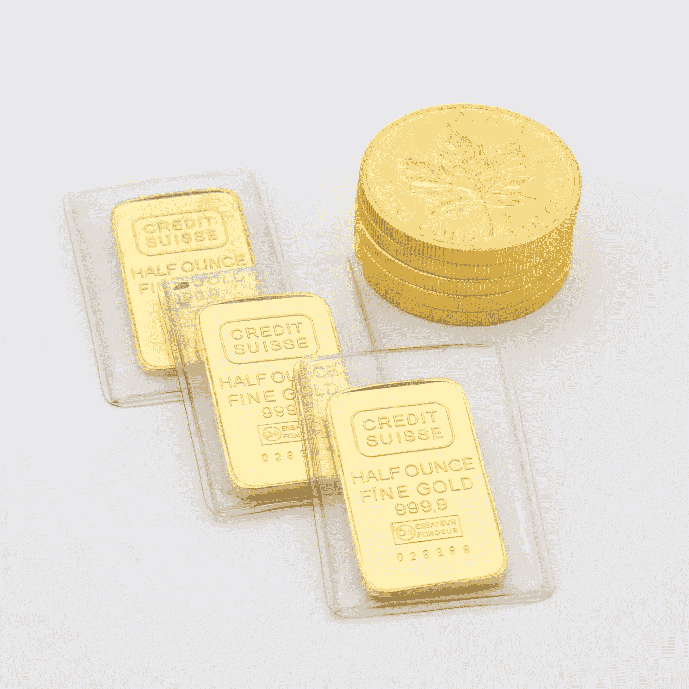
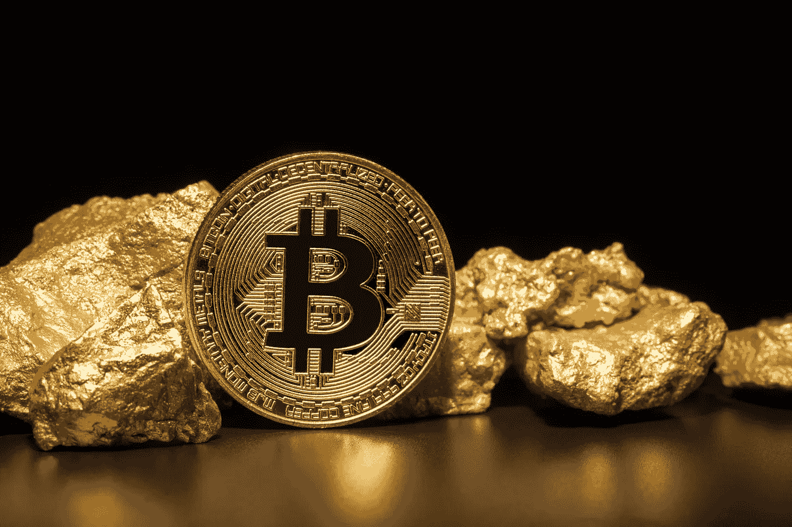
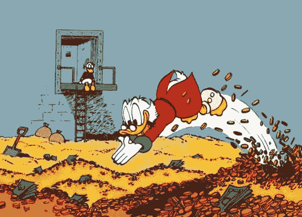
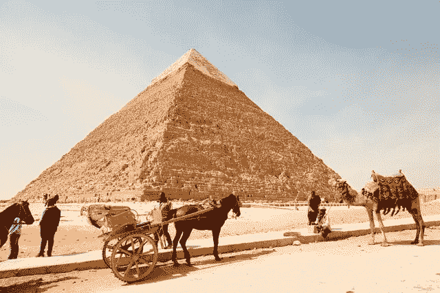

# 黄金死亡的一代

> 原文：<https://medium.com/coinmonks/the-generation-where-gold-died-11e59ac4d150?source=collection_archive---------26----------------------->

请不要再有闪亮的石头了。

Photo by [Sabrianna](https://unsplash.com/@sabrinnaringquist?utm_source=unsplash&utm_medium=referral&utm_content=creditCopyText) on [Unsplash](https://unsplash.com/s/photos/gold?utm_source=unsplash&utm_medium=referral&utm_content=creditCopyText)

> **黄金的欲望不是为了黄金。它是为了自由和利益的手段。――拉尔夫·瓦尔多·爱默生**

**在此全面披露:**我仍然认为黄金是**酷**，但随着时间的推移，最终作为货币对冲或价值储存毫无用处。尽管使用了几千年，但从现在开始，它会慢慢衰退。

虽然不可否认，它在阳光下闪耀的方式有一些原始和迷人的品质，但作为一个 30 岁的人，当你考虑今天市场上的其他选择时，我仍然不会想把我的储蓄储存在黄金中。

千禧一代和 Z 世代放弃黄金有充分的理由:

*   它很慢
*   难以储存
*   兑换回现金更加困难
*   比以往任何时候都有更多有价值的选择

我相信，数字资产、网络、生活方式和实用物品都将很容易取代黄金，成为我这一代人和下一代人的“对冲通胀”和“价值储存手段”。但是这到底是什么意思呢？

**数字资产**

Usually, Bitcoin is NOT this shiny. ([Source](https://etorox.com/news/opinions/gold-bitcoin-or-gold-bitcoin-part-2/))

在不久的将来，**数字资产**将和实物资产一样真实。

这一点现在在加密货币领域表现得再明显不过了，加密货币的市值一直在 8000 亿至 1 万亿美元之间波动。比特币统治着加密领域，所有迹象都表明它将继续上升，数据显示，千禧一代购买比特币作为避险投资的可能性是黄金的两倍。为什么？

也许这与它每年持续超过 200%的回报率有关。或者可能是因为没有限制你可以把它给谁，或者有多种方法来安全地存储它，并且只需一个密码就可以访问它。对于在智能手机上长大并不断接入互联网的一代人来说，你的价值储存也应该是数字化的，这难道不合理吗？

比特币的美元平均成本[背后有积极的数学因素](https://nathan-simone.medium.com/you-cant-afford-not-to-dca-into-bitcoin-c831bc4fa6f4)，比特币 PoW 系统及其周围不断扩大的社区也是如此。为了进一步证明比特币超越黄金(和许多股票)的优势，看看金融机构、电子商务平台甚至国家的采用指数增长。

所有加密货币都有风险和波动性，但将 100 万美元安全地储存在比特币中要简单得多，因为它相当于黄金(尤其是在没有第三方的情况下)。有趣的是，对于加密货币中所有可怕的骗局和疯狂，任何在 2021 年大牛市之前购买了备受指责的 Dogecoin 的人仍然比黄金更有希望回归。他们所要做的就是等待尘埃落定。

黄金是闪亮的石头*，Dogecoin 是可爱的柴犬，上面贴着一些数字。两者都一样没用，但后者是一种资产类别，未来将继续增长和发展。黄金现在是，而且将永远停留在过去。

**网络**

Did Scrooge McDuck hire a lifeguard? ([Source](/the-coffeelicious/swimming-in-my-money-like-scrooge-mcduck-fc2140e78ee))

正如许多人常说的那样，**你的人脉就是你的净资产。**

这既是字面上的，也是隐喻上的，因为很明显你不像你的朋友或同事那样拥有金钱或资源。但是，仅仅通过与成功和富有成效的人交往，你就给了自己无数次利用的机会。

就投资组合而言，那些在将钱转化为黄金之前成功积累了大量资金的个人可能拥有很高的净资产，但如果他们身边没有人与你一起追求梦想和创造性的途径，你不会比史高治·麦克老鸭过得更好。在装满钱的堆里游泳的梦想由来已久，但是[冒像霍华德·休斯](https://www.therichest.com/most-popular/top-10-rich-and-famous-recluses/)或者更糟的风险不值得。

当你扩大你的关系网，把你的兴趣包括进来，然后遇到那些直接增强或支持这些兴趣的人，你很快就会开始想为什么有人会把一个无生命的物体看得比人际关系更重要。

**生活方式**

Photo by [Dino Reichmuth](https://unsplash.com/@dinoreichmuth?utm_source=unsplash&utm_medium=referral&utm_content=creditCopyText) on [Unsplash](https://unsplash.com/s/photos/van-life?utm_source=unsplash&utm_medium=referral&utm_content=creditCopyText)

黄金通常被吹捧为对抗通货膨胀的对冲工具，这样你就可以在退休后继续保持目前的生活方式(当你最终卖掉它的时候)。但是如果你不喜欢现在的生活方式呢？

从货车生活到公共生活，似乎很多年轻人厌倦了不得不跟上庞大的房地产支出或追逐传统的“大时代”之路。如今，当你的整个生活因一个 Tik Tok 视频或 Instagram 帖子而改变时，这又意味着什么呢？

不想去好市多买 32 包杏仁黄油并不意味着你是个坏人，尤其是当你对其中一包很满意的时候。“生活就是为了活着”这一观点可能有点牵强，但这个问题需要重复:如果你没有入不敷出，你的生活方式可以让你收获更多回报，储存黄金永远无法触及的难以置信的价值。

**效用对象**

The OTHER gold bar… ([Source](https://www.toptenz.net/10-foods-that-basically-never-expire.php))

围绕黄金的一个有趣的话题是，人们总是带着某种灾难性的或即将到来的厄运形势来出售黄金。从预科生到股票经纪人，你会听到一个常见的信息:“当*其他一切*都走下坡路时，人们会想要黄金。”真的吗？

在缺乏政府或适当的金融市场流动性的情况下(或者仅仅是一个可能给你现金或贵重物品的当铺)，你将如何适当和公平地交换你的黄金？这个问题似乎永远得不到答案，我当然也不知道在任何一种物物交换的情况下需要多少黄金。当你开始思考如何在没有测量系统或适当执法的情况下准确分割金条时，头痛仍在继续，直到很明显**实用物品**更受欢迎，而且在心理上更容易接受。

当有人试图主动**卖给**你一些不能兼作**效用对象**的东西时，你应该一直质疑。就效用对象而言，我将物品定义为具有另一种重要用途的东西，同时也是一种内在的价值储存手段。枪支几乎总是有价值的，可以用于打猎和个人防卫。服装，即使不合身，也可以适应多种用途，给不合身的人心理上的安慰。这个清单上有很多有价值的东西，尤其是当你想到什么对你现在的生活最有意义，什么是你不想失去的时候。

食物，尤其是 Twinkies(也可以储存为“金条”)，是现代社会中我们常见的鄙视对象。美味的卡路里和充满问题的防腐剂，它们现在可能没有事情变得更糟时那么有价值。但是如果你三天没吃东西，你会拒绝一块夹馅面包吗？你愿意试着咬一根金条吗？

诸如此类的简单问题说明了黄金在许多负面情况下是如何迅速变得无用的。当谈到世界末日的预测时，无论是金融上的还是物理上的，都不是特别重要。人们只是想要能提高他们生活质量的东西，而且实际上能被普通人日常使用。

**不能带走**

Photo by [Fynn schmidt](https://unsplash.com/@fysc?utm_source=unsplash&utm_medium=referral&utm_content=creditCopyText) on [Unsplash](https://unsplash.com/s/photos/egyptian-tomb?utm_source=unsplash&utm_medium=referral&utm_content=creditCopyText)

无论你最终决定如何储存价值并代代相传，最终都要知道这一点:你不能把它带走，也绝对不能保证你的遗产或临终遗愿会得到尊重。

如果你想要这方面最好最具体的例子，看一眼古埃及人就能提供你所需要知道的一切。尽管坚定不移地相信能够在来世享受他们所有的财富和持续的权力，考古学家仍然发现了大量的宝藏和个人财产，它们仍然安全地保存在地球上。

防范通货膨胀的最好办法是量入为出，并时刻为未来做好准备。创造高投资回报率的最简单的方法是聪明地(努力地)工作。最宝贵的财富是你的技能、独特的知识和改善你周围世界的意愿。

与其纠结于黄金，不如专注于让自己成为那个发光的人。无论那一刻太阳恰好在哪里。

*我不是财务顾问，不能合法地提供财务建议，即使是在加密货币的狂野西部市场领域。你投资金钱所冒的任何风险都应该被视为一种风险。这包括随着时间的推移损失一部分甚至全部投资。在与你的血汗钱分道扬镳之前，请你自己做研究，咨询多个专业观点！*

*   *严格来说，黄金是一种金属(和矿物)，但把它想象成一块闪亮的石头更有趣。*

> 加入 Coinmonks [电报频道](https://t.me/coincodecap)和 [Youtube 频道](https://www.youtube.com/c/coinmonks/videos)了解加密交易和投资

# 另外，阅读

*   [如何在势不可挡的域名上购买域名？](https://coincodecap.com/buy-domain-on-unstoppable-domains)
*   [印度的秘密税](https://coincodecap.com/crypto-tax-india) | [altFINS 审查](https://coincodecap.com/altfins-review) | [Prokey 审查](/coinmonks/prokey-review-26611173c13c)
*   [Blockfi vs 比特币基地](https://coincodecap.com/blockfi-vs-coinbase) | [BitKan 评论](https://coincodecap.com/bitkan-review) | [期货交易机器人](/coinmonks/futures-trading-bots-5a282ccee3f5)
*   [南非的加密交易所](https://coincodecap.com/crypto-exchanges-in-south-africa) | [BitMEX 加密信号](https://coincodecap.com/bitmex-crypto-signals)
*   [如何在 WazirX 上购买柴犬(SHIB)币？](https://coincodecap.com/buy-shiba-wazirx)
*   [MoonXBT 副本交易](https://coincodecap.com/moonxbt-copy-trading) | [阿联酋的加密钱包](https://coincodecap.com/crypto-wallets-in-uae)
*   [MoonXBT vs Bybit vs 币安](https://coincodecap.com/bybit-binance-moonxbt) | [硬件钱包](/coinmonks/hardware-wallets-dfa1211730c6)
*   [雷米塔诺审查](https://coincodecap.com/remitano-review)|[1 英寸协议指南](https://coincodecap.com/1inch)
*   [十大最佳加密货币博客](https://coincodecap.com/best-cryptocurrency-blogs) | [YouHodler 评论](https://coincodecap.com/youhodler-review)
*   [KuCoin vs 币安](https://coincodecap.com/kucoin-vs-binance) | [Bitrue 点评](https://coincodecap.com/bitrue-review) | [Jet-Bot 点评](https://coincodecap.com/jet-bot-review)
*   [买 PancakeSwap(蛋糕)](https://coincodecap.com/buy-pancakeswap)|[matrix export Review](https://coincodecap.com/matrixport-review)