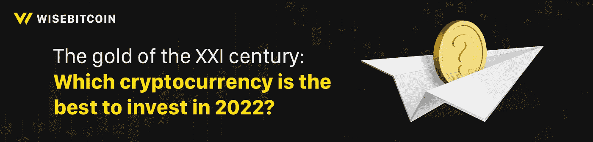

# 二十一世纪的黄金:2022 年投资哪种加密货币最好？

> 原文：<https://medium.com/coinmonks/the-gold-of-the-xxi-century-which-cryptocurrency-is-the-best-to-invest-in-2022-cc9075625b0b?source=collection_archive---------85----------------------->

[Top 5 cryptocurrencies to invest in 2022](https://www.wisebitcoin.com/newsroom/blog/best-cryptocurrency-to-invest-in-2022)

***黄金*** *是人们最早作为货币使用的资产。直到第一次世界大战，所有的货币都是以“金本位”为基础，纸钞作为拥有黄金的***的凭证。在二十一世纪的***中，我们注意到永久储备的巨大变化——现在的* ***加密货币*** *备受推崇。它的价格越来越高，以目前的技术，只需点击几下鼠标，就可以换成* ***菲亚特*** *。****wise bit coin****决定将* ***最好投资的数字资产*********2022****。******

****密码**行业经历了忙碌的 2021 年。我们是比特币跌宕起伏、在萨尔瓦多成为合法支付手段以及在中国取消**加密货币**使用的真正见证人。除了疫情和其他对我们打击最大的事件之外。**

**我们已经[提到过](https://www.wisebitcoin.com/en/newsroom/blog/crypto-tokens-utility-and-applications)加密货币**的巨大价值**以及它们在日常生活中的实际工作方式。然而，了解哪些数字资产有望在 2022 年得到投资也很有趣。让我们找到好的和繁荣的硬币，它不仅会给你带来**投资**的快乐，还会给你带来真正的利润！**

***随视角，请记住，* ***交易*** *，购买或交换任何一种赠送的* ***加密货币*** *都可能导致风险；这就是为什么这只是你个人的选择。我们的列表是一个信息参考，有助于做出更明智的决策。***

****比特币(BTC)****

**不意外，但仍然是透视！**比特币**，拥有大约 840，100 亿美元**市场** **资本化**，仍然是市场上最主要和最有前景的货币。比特币由匿名神秘的中本聪于 2009 年创建，基于区块链技术，该技术使用“分散式会计系统”保存交易记录。它同时提供了透明性、匿名性和安全性。目前，大约 90%的比特币已经被开采出来——差不多有 1900 万枚！**

**总的来说，谈到这些事件，**比特币**在 2021 年和 2022 年初经历了很多。美国美联储的行动、美国的监管政策、美国证券交易委员会的行动、地缘政治因素，特别是俄罗斯联邦和乌克兰之间的紧张关系，以及中国和哈萨克斯坦等国当局与采矿有关的行动都影响了股价，导致股价下跌。**比特币**进入负平走势；然而，这只是另一次上涨之前的一次调整。**

**同时，我们要记住**比特币**是领先的**加密货币**，而**市场**作为“灯塔”跟随它。意味着其他币的涨跌取决于比特币的涨跌。比特币似乎是中大型投资者进行风险对冲的合适资产，因为机构主义者和鲸鱼的兴趣不减。此外，购买和投资公司的**比特币**表明它有巨大的前景。**

**此外，分析师评论说，比特币的负持平是很符合逻辑的，尤其是在价格飙升之后。许多其他加密资产也发生了完全相同的情况，所以这意味着这是一种规律性。**

**2021 年，**比特币**的价值创下历史新高，几乎达到每枚 7 万美元。具体来说，目前比特币的价格为 45758 美元。相比经典的 **S & P 500** 指数在 2021 年上涨不到 24%，**比特币**涨幅高达 125%！还不错。**

****以太坊****

**继**比特币**之后的第二种**加密货币**是另一种有利可图的资产——**以太坊**，拥有 4750 亿美元**市值**。**以太坊**和**比特币**的主要区别在于，这种**加密货币**的发射是不受限制的，可以通过无限挖掘获得新的硬币。**以太坊**是比特币杂志创始人维塔利克·布特林(Vitalik Buterin)在 2013 年作为一个概念，在 2015 年作为一个现成的网络创建的。**

**今年和去年，**以太坊**的价值增长了 540%以上，这是因为投资者认为**以太坊**将成为分散融资的关键。**

**以太坊的主要功能是自动化交易，因为它的智能合约允许双方在没有中介的情况下进行交易，交易延迟低，安全性高。它让用户基于智能合约创建分散的基于区块链的在线服务。如今，你可以购买汽车、房产，甚至在工作会议间隙支付午餐费用。**

**以太坊有助于创建新的商业模式和分散的应用程序，并增强这一资产的增长潜力。自 2021 年初以来，**以太坊**的估值约为 3443 美元；然而，到了年底，硬币价格几乎达到了 5000 美元。专家预测，到 2022 年底，该资产将增长到 8000-10000 美元。他们说这将会发生，因为**以太坊**到 2.0 版本的重要更新和 2022 年项目的伟大路线图。让我们看看。**

****波尔卡多(圆点)****

****Polkadot** 是一家拥有 270 亿美元**市场** **资本总额**的资产，其多链切分协议能够增加“副链”中的交易数量，即并行跨越多个链。这种能力增加了网络的可扩展性。换句话说，它是一个平台，让**加密货币**被创建并包含在一个单一的网络中。**

**DOT 是由瑞士 Web3 基金会创建的，其目标是实现一个开源的、功能齐全的、用户友好的分散式 Web 项目。创始人是 Gavin Wood 博士、Robert Habermeier 和 Peter Chaban。顺便说一下，加文·伍德是以太坊的创始人之一。**波尔卡多特**的诞生是因为**以太坊**无法规模化。将于 2020 年发行的 **Polkadot** 在 2017 年 10 月的首次硬币发行中可以获得 1.443 亿美元。**

**Polkadot 网络可以说是安全、灵活和敏感的。它产生的信息交换就好像是在智能手机上的应用程序的帮助下完成的一样。 **Polkadot** 可以自动启用，不用叉子就可以引入新功能或者去除 bug。**

**自 2021 年初以来，DOT 达到了 28 美元的大关，融资 247%。目前，**波尔卡多特**售价 22.2 美元。**

**它的特性和巨大的扩展潜力可能使**波尔卡多特**几乎成为**以太坊**的“追随者”甚至是“杀手”。专家认为，parachains 的持续推出将增加 Polkadot 的价值，并在 2022 年将其价格提高到 40-60 美元。让我们看看它是否会成真！**

****宇宙(原子)****

****Cosmos** 是一个**区块链**，市值**超过 50 亿美元**，可以真正被命名为“**区块链** 3.0”。人们这么说是因为 Cosmos 是一个跨链项目，它允许其生态系统内的所有**区块链**彼此互动，并与外部网络互动——比特币**和以太坊**互动。******

**如今，“T36]Cosmos 项目”在其网络上推出了 250 个分散应用程序，其资本总额**超过 700 亿美元，被列入最有希望投资的 50 个项目。此外，Cosmos 基础设施甚至被币安智能连锁使用！****

**ATOM token ICO 发生在 2017 年，公开发售回合 30 分钟后结束！整个发行的 75%以 1700 万美元售出。当时 ATOM 的成本是 10 美分。如今，ATOM 的价值为 29.4 美元，比最初上涨了 15，000%。对于 2021 年**宇宙**硬币提高到 31%。**

**专家们认为“**宇宙**项目”吸引人的原因有三个:**

1.  **它为实际问题提供了解决方案；**
2.  **它有高**大写**；**
3.  **它在媒体上广为流传。**

**他们表示，2022 年，ATOM 的价格将升至 40-50 美元。好吧，看看会不会发生一定很有趣！**

****索拉纳(SOL)****

****索拉纳**于 2020 年出现在**市场**，成为**密码**领域最有前途的硬币之一。拥有超过 420 亿美元的**市场** **资本总额**，它几乎被包括在最好的**加密货币**的每一个顶级投资中。而且很值得！**

****索拉纳**诞生于 2017 年阿纳托利·亚科文科撰写的白皮书，提出了一种叫做历史证明的新技术，这种技术可以让**区块链**的速度提高一万倍。**

**它具有吸引投资者和其他市场参与者的巨大优势:**

1.  **数据处理速度快；**
2.  **相对适中的生产成本；**
3.  **项目的效用。**

**公用事业意味着加快分散网络内部的交易过程，但成本比其主要竞争对手**以太坊**更有利可图。**

**如今，**索拉纳**的价值约为 129 美元，总的来说，在 2021 年，它获得了 500%的涨幅。增长潜力是不可避免的，因此我们将密切关注它！**

****总而言之****

**一切都取决于你和你的决定。这样或那样的投资会给你带来什么样的结果？什么样的资产最适合你投资？**

**然而，我们试图展示目前在**加密货币**市场上有哪些相关的具体优惠。我们希望**二十一世纪的**新**黄金**会让你感兴趣，不亚于原来的那个，你会发现**加密货币**会让你的生活变得更好！**

**在我们的 **Wisebitcoin** **平台上，**你可以找到投资**加密货币**所需的一切。我们为用户提供最好的服务和最好的工具来获得他们想要的东西。这就是为什么我们邀请您访问我们的网站，阅读关于我们的**交易平台**的更多信息，并创建一个个人帐户，这样您就可以从我们的博客中快速了解您认为最适合您的工具的更多信息。**

****总结一下**，为了不错过 **Wisebitcoin** 的新资料，也为了更好的了解公司，跟随[这个链接](https://www.wisebitcoin.com/en/)。**

***原载于 2022 年 4 月 18 日*[*【https://www.wisebitcoin.com】*](https://www.wisebitcoin.com/newsroom/blog/best-cryptocurrency-to-invest-in-2022)*。***

> **加入 Coinmonks [电报频道](https://t.me/coincodecap)和 [Youtube 频道](https://www.youtube.com/c/coinmonks/videos)了解加密交易和投资**

# **另外，阅读**

*   **[加密货币储蓄账户](/coinmonks/cryptocurrency-savings-accounts-be3bc0feffbf) | [YoBit 审核](/coinmonks/yobit-review-175464162c62)**
*   **[Botsfolio vs nap bots vs Mudrex](/coinmonks/botsfolio-vs-napbots-vs-mudrex-c81344970c02)|[gate . io 交流回顾](/coinmonks/gate-io-exchange-review-61bf87b7078f)**
*   **[CoinFLEX 评论](https://coincodecap.com/coinflex-review) | [AEX 交易所评论](https://coincodecap.com/aex-exchange-review) | [UPbit 评论](https://coincodecap.com/upbit-review)**
*   **[AscendEx 保证金交易](https://coincodecap.com/ascendex-margin-trading) | [Bitfinex 赌注](https://coincodecap.com/bitfinex-staking) | [bitFlyer 审核](https://coincodecap.com/bitflyer-review)**
*   **[Bitget 回顾](https://coincodecap.com/bitget-review)|[Gemini vs block fi](https://coincodecap.com/gemini-vs-blockfi)cmd |[OKEx 期货交易](https://coincodecap.com/okex-futures-trading)**
*   **[AscendEx Staking](https://coincodecap.com/ascendex-staking)|[Bot Ocean Review](https://coincodecap.com/bot-ocean-review)|[最佳比特币钱包](https://coincodecap.com/bitcoin-wallets-india)**