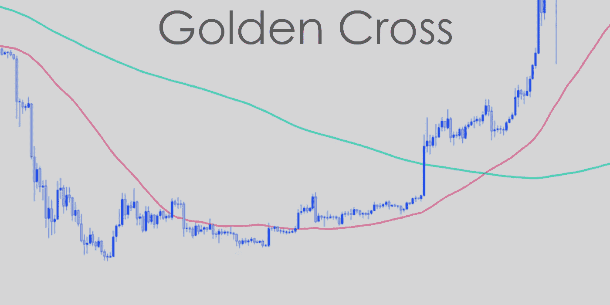
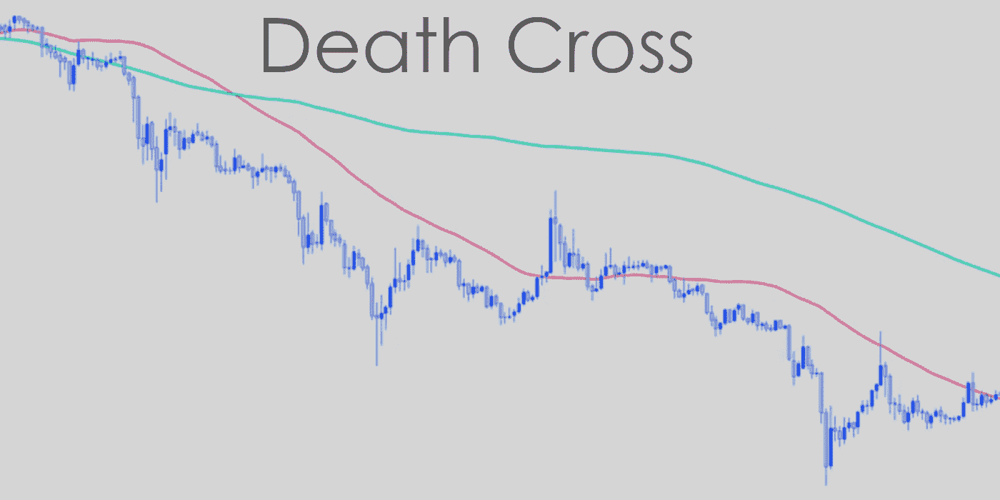

# 黄金十字架和死亡十字架

> 原文：<https://medium.com/coinmonks/the-golden-cross-and-the-death-cross-86fad8c36397?source=collection_archive---------8----------------------->

The Golden Cross and The Death Cross

使用统计评估进行买卖选择是技术分析的核心。[技术分析](https://cryptoworldfinace.blogspot.com/search/label/trading%20Analysis)利用大量数据，有规律地以图表的形式，[分析股票和市场](https://cryptoworldfinace.blogspot.com/2021/11/technical-analysis-and-read-candlestick.html)。有时，时尚在这些图表上的痕迹以塑造形状的方式弯曲和交叉，经常被赋予幽默的名称，如“带手柄的杯子”、“头和肩”和“双顶”技术商人通过研究来理解这些频繁的模式，以及它们对一个库存或市场的未来整体表现可能预示着什么。

你可能已经读过了:“[什么是上升三角形态交易分析](https://cryptoworldfinace.blogspot.com/2021/12/what-is-ascending-triangle-patterns.html)”、“[使用支持和阻力进行交易加密](https://cryptoworldfinace.blogspot.com/2021/12/uses-support-and-resistance-for-trading.html)、“[加密泵和转储方案](https://cryptoworldfinace.blogspot.com/2021/11/crypto-pump-and-dump-schemes.html)。黄金十字架和死亡十字架是特定的对立面。黄金交叉显示长期牛市，而死亡交叉警告长期熊市。两者都是指对长期流行的强烈肯定，通过在基本的长期移动平均线上出现一个瞬间转移的普通交叉点。

*   一个黄金交叉暗示着一个长期的[牛市](https://cryptoworldfinace.blogspot.com/2021/12/bullish-and-bearish.html)即将到来，而一个死亡交叉暗示着一个长期的[熊市](https://cryptoworldfinace.blogspot.com/2021/12/bullish-and-bearish.html)。
*   当伴随着过度的买卖[交易量](https://cryptoworldfinace.blogspot.com/2021/12/what-is-volume-in-cryptocurrency-trade.html)时，任何一种交叉都被认为是更大的。
*   一旦交叉发生，长期移动共同线被视为从该因素开始的市场的重要引导度(在黄金交叉的情况下)或[阻力](https://cryptoworldfinace.blogspot.com/2021/12/uses-support-and-resistance-for-trading.html)阶段(在死亡交叉的情况下)。
*   这两种走势都可能是趋势变化的信号，但是它们更多的是对已经发生的趋势进行坚定的确认。

# 黄金十字勋章

当一个短暂的普通转移穿过一个主要的长期转移时，黄金就开始了，分析师和商人认为这是市场明确向上翻转的信号。基本上，非永久性的共同特征比长期平均值上升得更快，直到它们交叉。

黄金十字有三层:

*   随着促销力度的减弱，下跌趋势迟早会结束
*   第二阶段，较短的转移线穿过较长的移动平均线
*   最后，持之以恒的上升趋势，乐观地主要是更大的价格

Golden Cross

在许多情况下，金叉还可以被视为看涨信号。怎么会这样思路很简单。我们知道，转让公用衡量的是资产在其绘制长度内的公用费用。从这个意义上说，当一个暂时的移动平均线在一个长期的移动平均线之下时，与长期的移动平均线相比，非永久的移动是看跌的。

现在，当瞬时平均值超过长期平均值时会发生什么？非常任共同汇率高于长期共同价格。这显示了市场趋势路线的一个可行的转变，这就是为什么金叉被认为是看涨的。

在传统的解释中，黄金的走势需要越过 200 日均线之上的 50 日均线。然而，黄金分割背后公认的思想是，一个短暂的移动平均值跨越了一个长期的移动平均值。从这个意义上来说，我们可能希望在不同的时间框架(15 分钟、1 小时、4 小时等)上额外出现黄金交叉。).尽管如此，更大的时间体警报往往比减少的时间体信号更可靠。

到目前为止，我们已经看到了一个金色的 go 和一个被称为容易转移的 common (SMA)。然而，没有其他著名的方法来计算被称为指数移动平均值(EMA)的移动平均值。这利用了一个独特的公式，更强调更大的最新行动率。

EMAs 还可以用于看涨和看跌交叉，包括黄金交叉。由于 EMAs 对当前利率变动的反应非常迅速，它们产生的交叉指标也可能不太可靠，是当前额外的错误信号。即便如此，均线交叉作为一种判断风格反转的工具在商人中很有名。

> 阅读:[加密交易中的布林线](https://cryptoworldfinace.blogspot.com/2022/01/bollinger-band-in-crypto-trading.html)
> 
> [QFL 密码交易策略](https://cryptoworldfinace.blogspot.com/2021/12/qfl-strategy-for-trading-crypto.html)

# 死亡十字架

死亡十字架本质上与黄金十字架相反。这是一个图表样本，在长期均线下，一个瞬间均线穿过的地方。例如，50 日均线穿过 200 日均线的下方。因此，死亡交叉通常被认为是一个看跌信号。

典型地，死亡交叉发生在三个阶段:

*   在上升趋势的某一点，瞬间移动平均线高于长期移动平均线。
*   风格反转，临时 MA 在长期 MA 下交叉。
*   当瞬间移动平均线停留在长期移动平均线之下时，下跌趋势就开始了。

Death Cross

既然我们理解了什么是黄金 go，那么理解为什么生命损失是一个熊市信号就很容易了。非常规货币正在穿越长期均线下方，这表明市场前景看跌。

在历史上，如 1929 年或 2008 年，生命损失 go 比重要的货币低迷更早地提供了一个看跌信号。但是，它可能会额外授予错误信号，例如在 2016 年。

# 黄金十字架与死亡十字架——有什么区别？

我们已经提到了它们中的每一个，所以它们之间的区别并不难理解。他们肯定是彼此截然相反的两个人。黄金交叉也可能被视为看涨信号，而死亡交叉则是看跌信号。

这两者都可以通过买卖量过大的手段来验证。当在交叉上下文中搜索时，一些技术分析师还可能额外测试不同的技术警告信号。常见的例子包括移动平均收敛发散(MACD)和相对强弱指数(RSI)。另外需要考虑的是，移动平均线是滞后的警告信号，没有预测能力。这种能力，每一个交叉通常会提供一个已经发生的风格反转的有力证明——现在不是一个正在进行的反转。

# 如何交易黄金十字架和死亡十字架

这些模式背后的主要概念非常简单。如果你知道交易者如何使用 MACD，你会毫不困难地认识到如何改变这些交叉信号。

当我们谈论传统的黄金分割和生命损失交叉时，我们通常在逐日图表中搜索。所以，一个简单的方法可能是在黄金十字路口买入，在死亡十字路口卖出。事实上，在最后的几年里，这将是比特币的一个非常有利可图的方法——尽管在这个过程中有许多错误的指标。因此，盲目追随一个信号通常不是高质量的策略。因此，当涉及到市场评估技术时，你可能希望考虑不同的因素。

如果你想研究一种简便的方法来建立一个长期的头寸，试试我们解释的成本平均法。

上面提到的交叉方法完全基于每日 MAs 交叉。但是不同的时间段呢？黄金十字架和死亡十字架表现的完全一样，商人可以从中获利。

然而，与大多数图表评估技术一样，较长时间范围内的警报比较短时间范围内的指标更有优势。当你在每小时的时间框架内研究死亡交叉时，一次黄金旅行可能会额外发生在每周的时间体上。这就是为什么缩小并看起来像是在图表上更大的图像是持续有益的，考虑到几个读数。

许多商人在买卖黄金十字架和生命损失十字架时，额外需要的是买卖量。与不同的图表模式一样，范围可以是一个可靠的确认工具。因此，当数量峰值伴随交叉信号时，许多商家将更加确信签名是有效的。一旦金叉发生，长期均线也可能被视为一个可行的支撑区域。相反，一旦死亡交叉发生，它也可能被认为是一个可行的阻力区。

交叉指标还可以与不同技术指标的指标进行交叉检查，看起来是为了合流。Confluence 商家将几个警报和警告标志混合到一个买卖方法中，努力使交换警报更加可靠。

# 特殊考虑

对于究竟是什么构成了这种重大转变的普通跨界车，有一些不同的看法。一些分析师将其概括为 100 天移动平均值与 50 天移动平均值的交叉；其他人将其概括为 200 天均线与 50 天均线的交叉。此外，分析师们还会关注下跌时间体图上的交叉，这是对一个强劲的持续趋势的肯定。不管特定定义中的变体或所应用的时间体，时间段总是指主要长期移动平均线上的非永久移动公共交叉点。[阅读更多](https://cryptoworldfinace.blogspot.com/2022/01/the-golden-cross-and-death-cross.html)。

> 加入 Coinmonks [电报频道](https://t.me/coincodecap)和 [Youtube 频道](https://www.youtube.com/c/coinmonks/videos)了解加密交易和投资

## 也阅读

 [## 杠杆代币[多头代币]终极指南

### 杠杆化令牌是具有杠杆化风险敞口的 ERC20 令牌，不考虑保证金、要求、管理…

medium.com](/coinmonks/leveraged-token-3f5257808b22)  [## 最佳加密交易所| 2022 年十大加密货币交易所| CoinCodeCap

### 哪一个是最好的加密交换？在本文中，我们将根据多种加密货币列出 10 大加密货币交易所

coincodecap.com](https://coincodecap.com/crypto-exchange)  [## 2022 年最佳加密交换平台| CoinCodeCap

### 随着时间的推移，我们大多数人将转向 dex 以获得更好的安全性和隐私。因此。在这里，我们将讨论…

coincodecap.com](https://coincodecap.com/best-swap-platforms)  [## 10 大最佳在线赌场|赢得并赢取免费 BTC 2022 | CoinCodeCap

### 接收、支付和赚取加密货币| |有各种各样的最佳在线赌场可供选择，有可能…

coincodecap.com](https://coincodecap.com/best-online-casinos)  [## 2021 年最佳加密借贷平台| 6 大比特币借贷平台

### 获得比特币和其他加密货币的最佳贷款利率

medium.com](/coinmonks/top-5-crypto-lending-platforms-in-2020-that-you-need-to-know-a1b675cec3fa)  [## 2021 年 6 大最佳硬件钱包|顶级加密硬件钱包[更新]

### 最好的加密货币硬件钱包是绝对必要的。我们将在 NGRAVE、Ledger Nano X 和…

medium.com](/coinmonks/the-best-cryptocurrency-hardware-wallets-of-2020-e28b1c124069)  [## 加密交易机器人——19 款最佳免费加密交易机器人

### 2022 年币安、比特币基地、库币和其他密码交易所的最佳密码交易机器人。四进制，位间隙…

medium.com](/coinmonks/crypto-trading-bot-c2ffce8acb2a)  [## 最佳 4 个加密交易信号电报通道

### 这是乏味的找到正确的加密交易信号提供商。因此，在本文中，我们将讨论最好的…

medium.com](/coinmonks/best-crypto-signals-telegram-5785cdbc4b2b)