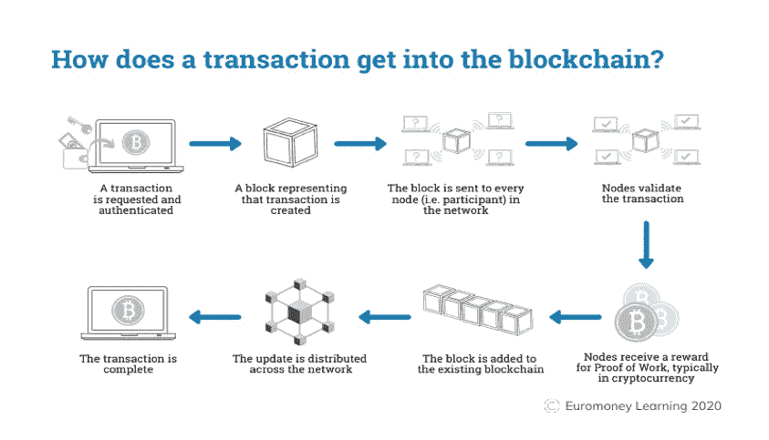

# 帖子 2:区块链基础知识

> 原文：<https://medium.com/coinmonks/the-good-the-bad-and-the-value-of-layer-1-networks-de5884c71022?source=collection_archive---------14----------------------->

*按市值对精选的顶级区块链进行高层次分析*

这是一系列帖子的第二部分，旨在从高层次了解是什么让每个选定的第一层加密货币有价值。 [**第一部分**](/@danielmtz_25212/the-good-the-bad-and-the-value-of-layer-1-networks-f03167d2e02e) 是对分析中涵盖的加密货币的介绍；但是，您可以在这里 **访问完整的 PDF 报告 [**。**](https://bit.ly/3GQNUU6)**

虽然摆脱骗子或不太知名的项目至关重要，但认识到第 1 层区块链协议在推动这个新的数字时代方面的相关性也同样重要。让我们深入了解一些基本的区块链基础知识:

**什么是加密货币，为什么与加密货币相关？**加密货币是分散的数字货币，基于其自身的区块链进行安全保护。它们之所以相关，是因为它们已经成为政府发行的标准法定货币的替代支付和价值来源。

**什么是区块链(第一层协议)？**区块链是一个共享的公共数字数据库，记录所有交易，不可更改或操纵。为了区块链的繁荣，它需要是安全的、可扩展的和分散的。

**为什么与区块链相关？**公共区块链允许其所有数据的验证和可追溯性。通过去中心化，没有中央公司或中介控制或存储您的个人信息。它可以帮助避免易受数据泄露或黑客攻击的中央公司。通过可伸缩性，组织可以改进内部流程并降低总体成本(例如，在金融领域，银行可以使用区块链来降低结算风险)。除了其安全性、可伸缩性和分散性，区块链令牌化还催生了新的创新用例，如分散金融(DeFi)、Web3、GameFi，以及通过 NFTs 和元宇宙在艺术和音乐领域的文化转变。

区块链是如何工作的？
比特币例子:下图由 Euromoney 制作，从最基本的层面举例说明了比特币区块链是如何工作的(例如，如何将比特币从一个账户转移到另一个账户)。

Source: [https://www.euromoney.com/learning/blockchain-explained/how-transactions-get-into-the-blockchain](https://www.euromoney.com/learning/blockchain-explained/how-transactions-get-into-the-blockchain)

**Polkadot，一个更复杂的例子:** Polkadot 增加了比特币的区块链功能，因为它允许创建多个独立的区块链，称为副链。除了副链之外，它还可以像以太坊一样与外部区块链进行连接和交易。

哪些是最常见的共识机制？**区块链的去中心化性质需要一种共识机制来处理和验证所有新的交易，同时保持节点参与者有动力去做这些工作。最常见的共识机制是工作证明(PoW)和利益证明(PoS)。**

****PoW:** 被称为矿工的节点相互竞争将下一个包含新事务的块添加到链中的权利。比赛包括运行一个试错算法，旨在解决一个复杂的数学加密问题。为了完成这项工作，矿工们通常会得到区块链本地加密货币的奖励。比特币目前为每一个通过验证的新区块奖励 6.25 个比特币。每四年，奖励金额减半。**

**这里的挖掘器被称为验证器。为了参与共识算法，验证者必须将区块链本地加密货币作为抵押品。如果验证者行为不当，区块链可以保留部分或全部股份。此外，不是竞争成为第一个解决复杂数学问题的人，而是通过一种算法来选择验证者，该算法基于每个验证者下注总额的比例进行选择(即，你下注越多，被选中的几率越高)。**

**在接下来的帖子 3 和 4 中，我将概述不同的区块链在分析中使用的共识机制的类型，以及它在去中心化、安全性和可伸缩性之间扮演的角色。**

****与区块链加密货币相关的常见层有哪些？请记住，我们处在一个不断发展的行业中，对于什么构成了加密生态系统，有各种各样的解释。****

****第 1 层:**实际的区块链拥有自己的原生加密货币。作为整个分散式乐高积木系统的基础。例子:比特币、以太坊、卡尔达诺等。**

****第 2 层:**这些是构建在第 1 层之上的应用程序，有助于提高区块链性能(即可伸缩性、互操作性等)。)示例:多边形、链环等。**

****第 3 层:**承载分散式应用(dApps)、分散式自治组织(DAOs)等的应用层。示例:用于交换令牌的 Uniswap 等。**

****第四层:**通常指用于与 dApps 连接和交易的钱包。这是链上应用程序的真正用户体验开始的地方。示例:元遮罩、幻影等。**

****待续……****

**下一篇文章，post 3，将涵盖对选定的遗留第一层加密货币(比特币、莱特币、Ripple、Dogecoin 和以太币)的分析。**

**希望你喜欢进入秘密兔子洞。**

> **加入 Coinmonks [Telegram group](https://t.me/joinchat/Trz8jaxd6xEsBI4p) 并了解加密交易和投资**