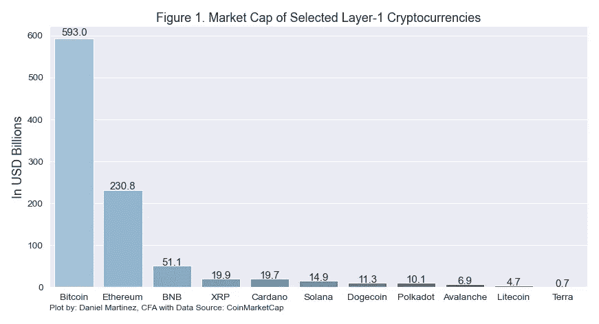
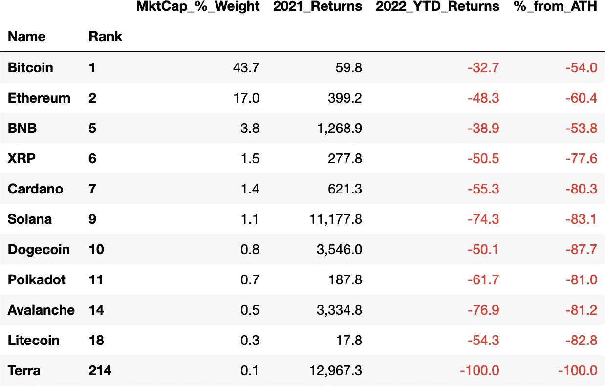

# 第 1 层网络的优点、缺点和价值

> 原文：<https://medium.com/coinmonks/the-good-the-bad-and-the-value-of-layer-1-networks-f03167d2e02e?source=collection_archive---------29----------------------->

*按市值对精选的顶级区块链进行高层次分析*

***岗位 1:简介***

几个月前，我暂停了固定收益交易，进入了加密兔子洞。围绕加密货币有很多炒作、噪音和波动。

为了让事情更容易消化，我会在不同的帖子里分解分析。但是，您可以在此访问 [**完整的 PDF 研究论文。**](https://bit.ly/3GQNUU6)

这一分析的目的是提供一个高层次的理解是什么使每一个选定的第一层加密货币有价值。我将进一步挖掘一些(虽然不是详尽的清单)，围绕每个区块链议定书的好的和坏的特点。为此，我们将根据他们的 mainnet 启动日期设定一个渐进的时间表。最后，除了获得一个总的看法，我们将试图回答以下问题:**一个区块链最终会统治他们吗？而且，对于有这么多加密货币可以投资的投资者来说，能否实现多元化？**

根据 CoinMarketCap 的数据，截至 2022 年 6 月 1 日，全球加密市场由超过 1 万项上市数字资产组成，总市值约为 1.29 万亿美元。投资菜单由众所周知的流动加密货币和代币组成，如比特币 BTC 和柴犬 SHIB，以及机会主义的泵和转储导向，如鱿鱼游戏代币，以及介于两者之间的一切。

对于不相信 crypto 的人来说，crypto 的广阔前景是为犯罪分子准备的，让人想起过去的市场狂热，比如 20 世纪 90 年代末的互联网泡沫。对于信仰者(包括我自己)来说，我们仍然处于目睹传统行业(如金融)被颠覆的早期阶段，而且由于非金融交易和数字货币，社会文化也发生了变化。

**图 1** 显示了我的完整 [**PDF 报告**](https://bit.ly/3GQNUU6) **中涵盖的所选区块链(第一层)加密货币的市值。**值得注意的是，全球加密市场的市值权重如何严重偏向比特币&以太坊，以及价值约 9630 亿美元的少数区块链本土加密货币如何代表加密市场的本质(约占总市值的 71%)。

Market Cap of Large & Mid Cap Crypto Assets as of June 1, 2022

**为什么使用当前市值？**

首先，它为确定哪些 cryptos 当前代表市场的本质铺平了道路。

其次，尽管过于简单，但一些市场参与者喜欢推断加密货币的市值。

如果“粉红先生”值 X，那么“金发先生”可以值 y。

正如加密怀疑论者和采纳者所观察到的那样，自比特币向最新玩家推出以及 Terra 最近倒闭以来，区块链技术及其用例的发展不仅仅是夸张的壮观。

在**表 1** 中，我们可以看到 Terra-Luna 完全繁荣和萧条的价格行为。

**表 1**

Market Cap Weight, From All Time High (ATM) and 2022 YTD returns as of June 1, 2022

如**表 1** 所示，2021 年的牛市产生了一些最惊人的加密回报。它还强调了早期定位另类投资的重要性(例如，Solana 或 Luna 2021 天文回报，因为它们从新兴的另类投资转向蓝筹股)。

2022 年熊市已经削减了超过一半的 crypto 总市值，并将 Terra 送进了坟墓。

未完待续……

下一篇文章，第 2 篇，将介绍一些区块链的基本知识。

希望你喜欢进入秘密兔子洞。

> 加入 Coinmonks [Telegram group](https://t.me/joinchat/Trz8jaxd6xEsBI4p) 并了解加密交易和投资