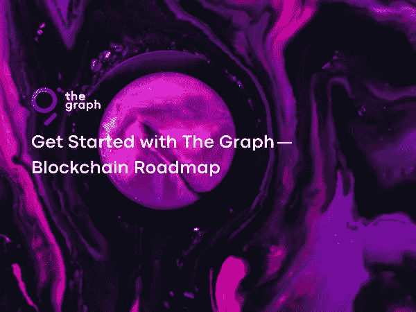

# 从图表开始—区块链路线图

> 原文：<https://medium.com/coinmonks/the-graph-blockchain-roadmap-b114201458e9?source=collection_archive---------1----------------------->

Photo by [Danny Lines](https://unsplash.com/@dannylines)on [Unsplash](https://unsplash.com/?utm_source=medium&utm_medium=referral)

图形协议是一个中介，充当 DeFi 产品和外部世界之间的桥梁。虽然功能不同，但总的来说是一个古老的 DeFi 生态系统 Chainlink 非常相似。任何 DeFi 产品都可以在其构建的 DeFi 平台(以太坊)上稳定工作，但有时这些产品也需要连接到自己的区块链之外。

事实上，智能合约是 DeFi 产品的基础。智能合约自动执行编码任务。为了让它成为一个触发器，它需要明白已经创造了正确的条件。如果这个被触发的信息是在区块链，交易会更容易。但是如果信息是外部的，那么就需要连接到外部世界。在这里，称为甲骨文的信息源从非区块链世界获取这些信息，并将其转化为一份有效的合同。在这个意义上，神谕充当了外部世界和区块链之间的桥梁。
Graph 是一项服务，提供有关区块链或其 DeFi 产品性能的信息和分析。它具体做的是收集和索引由区块链创建的信息，并向请求它的人(DeFi 服务、投资者或投资者顾问等)提供信息。).该图不能是一个完整的 oracle，因为服务于 oracle 服务的外部代理(oracle 节点)将它们从外界接收的信息传输到智能合约。但是，在图中，它的工作方式略有不同，即，来自区块链的信息变得有意义，然后分发给链内和链外索赔者。

由于 DeFi 的世界是一个全天候工作的生态系统，所有信息几乎都是实时的。通常，如果在 DeFi 领域需要这样的信息，就必须与开发团队一起开发这些所需的工具。在这一点上，图表提供了一个平台，允许您以所需的格式获取任何区块链的信息，并以您想要的方式进行分析，它可以在任何时间或按您想要的频率进行分析。它采用现收现付的模式，其最大的优势是以一种分散的、更可靠的方式来实现。

 [## 主页| Uniswap 协议

### 交换，赚取，并建立在领先的分散加密交易协议。在最大的……

uniswap.org](https://uniswap.org/) 

Uniswap 是 DeFi 应用程序的先驱之一，已经在其上执行了超过 420 万次交易。所有这些过程都是在 Uniswap 内超过 167 个不同的储存库中进行的。考虑到每个池的交易、数量和动态，有数百万条信息可以处理和分析。如果您想要在特定日期范围内即时或定期分析这些事务和池的状态，可以使用图形系统。

bayc 和 mayc 的 Abi 用图表创建

 [## GitHub-outsource-Dao/bayc-graph-service:bored ape yatch club

### token search(text:){ id tokenID contentURI collection 眼睛背景帽子嘴巴衣服毛皮耳环} } { tokens(…

github.com](https://github.com/outsource-dao/bayc-graph-service)  [## 无聊猿游艇俱乐部

### 无聊猿游艇俱乐部是一个 10，000 独特的无聊猿 NFTs-独特的数字收藏品生活在…

boredapeyachtclub.com](https://boredapeyachtclub.com/) 

Graph foundation 团队正试图使系统尽可能去中心化，因为很明显，像 Chainlink 这样的系统是高度集中的，尽管它们的客户是去中心化的 DeFi 平台。另一方面，图是一个更加分散的系统，也就是说，输入/输出不需要任何许可，一切都是自动发生的。
跑图系统运营的，主要是网络上的独立行动者。参与者是收集数据、编制索引、提取所需分析并确保数据准确性的人。

Graph 团队已经开发了一个名为 Graph Explorer 的 dApp，可以准确地向索赔者提供显示的指数或分析。最佳质量的索引应该由策展人制作，因为它们将被请求者看到和使用，并且参与者(策展人、索引器)将会获利。尽管系统的原始数据保存在一个称为 IPFS 的分散协议中，但是 Graph Explorer 中的索引和分析信息保存在一个中心位置。正在努力在未来以分散的方式提供这种服务。此外，尽管团队在开始时对索引器提供的错误信息等问题做出决策，但这将在以后的协议管理下进行。

 [## 图表浏览器

### 查看 Graph Network 上正在发生的事情，并作为委托人、管理员、索引员或开发人员参与其中。

thegraph.com](https://thegraph.com/explorer/subgraph?id=0x89fddab2f93417182cdcdb0b8b3322b93ab3a192-0&view=Playground) 

该图使用当前炒作的利害关系证明系统。解释一下，比特币使用了名为 Proof-of-Work 的安全系统，也就是最大的批评来源，'它消耗了大量的能量，是矿工工作的结构。以太坊目前正在使用相同的系统，但计划在未来几年内切换到利益证明机制。那些确保股权证明系统安全性的人将通过提供自己的资产作为抵押品来保证这一点。这个体系，以前是靠矿工的体力，也就是劳动力来保护的，现在会靠财富，也就是资本来保护。在 Graph 协议中，这是一个分散的服务提供者，一个大的工作落在运行系统的参与者身上。

**演员**

**索引器** 在图系统中，索引器构成了网络的节点。他们以有组织的方式保存有关区块链的信息，当这些信息被搜索时，他们有权获得索引报酬和搜索费。

 [## 索引器|图形浏览器

### 查看图表协议中的所有索引器。

thegraph.com](https://thegraph.com/explorer/participants/indexers) 

**授权者** 为了成为一名索引者，有必要展示一些 GRT 抵押品。如果无法提供担保品，授权人就会介入。这些人，有 GRT 但不想做索引/搜索等繁重工作的投资者，将他们的 GRT 交给工作出色的索引员。作为这一交易的回报，他们会获得一些奖励或费用。

 [## 删除器|图形浏览器

### 查看图表协议中的所有委托人。

thegraph.com](https://thegraph.com/explorer/participants/delegators) 

**策展人**
策展人代表了聪明的阶层。策展人所做的是预测哪些分析会对哪些信息源产生影响。当他们在他们的信息源中发现一颗宝石时，他们立即锁定它，以便从分析中获利。如果分析成立，他们有权获得一部分回报。在这里，找到快速和高质量的分析非常重要，谁发现得早，谁就赢了。任何看到质量和潜力分析的人都是在投资，指数公司做的是更受欢迎的分析。先发现并投资的人收益好，后加入的人收益少。

 [## 策展人|图形浏览器

### 查看图表协议中的所有策展人。

thegraph.com](https://thegraph.com/explorer/participants/curators) 

开发者
Uniswap，DeFi 世界的重要应用，使用 Synthetix 图形模型。对于 dApps 开发人员来说，现收现付模型比图模型更有用，可以组建团队，租用服务器。

 [## 图表文档

### 本指南将带你快速了解如何初始化、创建和部署你的子图

thegraph.com](https://thegraph.com/docs/en/developer/quick-start) 

由于系统是去中心化的，任何人都可以进入系统，成为索引器、委托器或策展人。特别是，索引器可以失去所有的投资，如果涉及到提供虚假信息或指数。他们会因为长期提供担保而受到处罚，即使这些信息后来被发现是虚假的。策展人和代表不会因为不提供信息而受到惩罚，但如果他们选择了错误的分析或索引，他们在撤回投资时需要支付费用。与 GRT 交易的另一个原因是寻找高质量的指数，而不是破坏整个系统的声誉。
图是迄今为止索引和搜索/查询中最著名的分散模型。最著名的集中式服务，其竞争对手在 DeFi 领域是众所周知的，是 Dune Analytics、Glassnode 和 Nansen，以及亚马逊 Redshift 等一般搜索服务。

 [## 仪表板

### 仪表板和查询？借助 Dune Analytics，任何人都可以免费对区块链数据创建 SQL 查询。结果是…

沙丘. xyz](https://dune.xyz/browse/dashboards)  [## 链上玻璃节点市场智能

### Glassnode 让每个人都可以访问区块链数据。我们收集并仔细分析链上数据，以提供…

glassnode.com](https://glassnode.com/)  [## Nansen - Surface 区块链数据中的信号

### 南森分析了 1 亿多个贴有以太坊标签的钱包及其活动。所以你可以从噪音中分离出信号…

www.nansen.ai](https://www.nansen.ai/)  [## Bulut Veri Ambarı亚马逊红移-亚马逊网络服务

### 亚马逊红移 Herkes I in kolay analizlerle verilerden saniyeler I Inde ngrüler elde et meye odaklan n . Veri ambar…

aws.amazon.com](https://aws.amazon.com/tr/redshift/) 

然而，在所有的中央服务中，除了可靠性问题之外，还会出现不能完全获得所需服务的问题。区块链产生令人难以置信的数据，在这个过程中获得正确的有意义的数据是非常重要的。虽然中央服务处理更多的固定数据，但是当投资者想要对新出现的区块链进行分析时，他无法在中央服务中找到他想要的东西。从这个意义上说，图表可以提供他们想要的信息流和分析。

在这个领域中，正如在每个领域中一样，在集中式平台的快速和用户友好的界面与分散式平台的不太有用但灵活和分散的结构之间的竞争中，哪些平台将脱颖而出？

Graph 背后有一个非常强大的投资者大军，并取得了非常好的象征性价值增长，目前并不高于其主要竞争对手。而且在去中心化方面，领先于这些竞争对手，还有很长的路要走。很可能该图将继续在价值方面支持投资者，但该产品将在满足其最重要的标准分散化的程度上获胜。

下一篇文章中的你…

> 加入 Coinmonks [电报频道](https://t.me/coincodecap)和 [Youtube 频道](https://www.youtube.com/c/coinmonks/videos)了解加密交易和投资

# 另外，阅读

*   [密码本交易平台](/coinmonks/top-10-crypto-copy-trading-platforms-for-beginners-d0c37c7d698c) | [Coinmama 审核](/coinmonks/coinmama-review-ace5641bde6e)
*   [印度的加密交易所](/coinmonks/bitcoin-exchange-in-india-7f1fe79715c9) | [比特币储蓄账户](/coinmonks/bitcoin-savings-account-e65b13f92451)
*   [OKEx vs KuCoin](https://coincodecap.com/okex-kucoin) | [摄氏替代品](https://coincodecap.com/celsius-alternatives) | [如何购买 VeChain](https://coincodecap.com/buy-vechain)
*   [币安期货交易](https://coincodecap.com/binance-futures-trading)|[3 comas vs Mudrex vs eToro](https://coincodecap.com/mudrex-3commas-etoro)
*   [如何购买 Monero](https://coincodecap.com/buy-monero) | [IDEX 评论](https://coincodecap.com/idex-review) | [BitKan 交易机器人](https://coincodecap.com/bitkan-trading-bot)
*   [CoinDCX 评论](/coinmonks/coindcx-review-8444db3621a2) | [加密保证金交易交易所](https://coincodecap.com/crypto-margin-trading-exchanges)
*   [红狗赌场评论](https://coincodecap.com/red-dog-casino-review) | [Swyftx 评论](https://coincodecap.com/swyftx-review) | [CoinGate 评论](https://coincodecap.com/coingate-review)
*   [Bookmap 评论](https://coincodecap.com/bookmap-review-2021-best-trading-software) | [美国 5 大最佳加密交易所](https://coincodecap.com/crypto-exchange-usa)