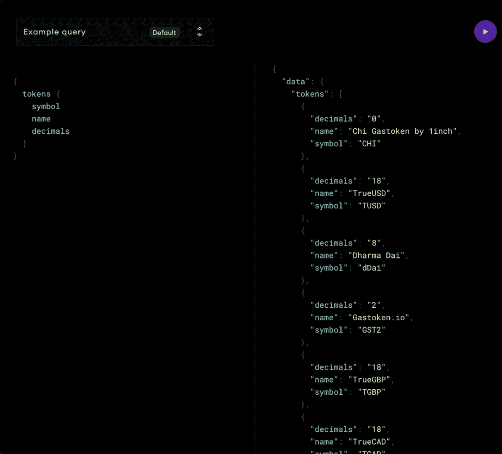
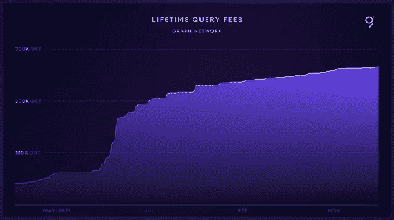
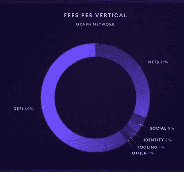
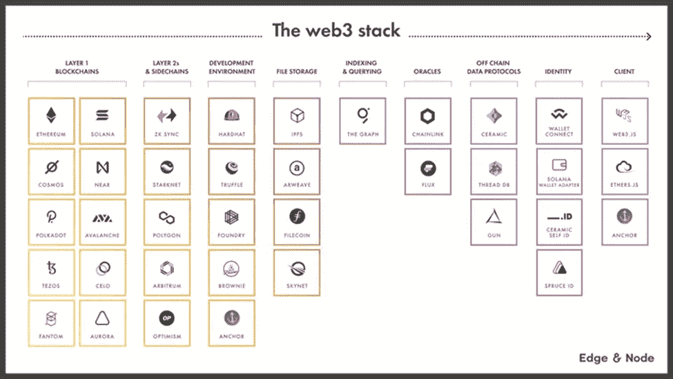

# 图表(GRT)

> 原文：<https://medium.com/coinmonks/the-graph-grt-9e224c8ed8d9?source=collection_archive---------5----------------------->

为什么它对 Web3 生态系统如此重要？

## **什么是图形？**

该图是一个用于查询和索引来自区块链的数据的分散协议，从以太坊开始。使得难以直接查询的数据查询成为可能。

根据定义，区块链是一个以数字格式存储电子信息的数据库。现在，你所说的与数据库相关的查询和索引是什么意思？

查询只是从数据库中请求数据或信息，这样您可以更容易地对其进行分析。区块链是一个存储了无数数据的复杂数据库。这个数据库有可能发现复杂的运动和动作，但是这种能力只能通过查询来使用。本质上，图表让你释放这种潜力。

索引是处理查询时优化数据库性能的一种方式。它是一种数据结构技术，用于快速定位和访问数据库中的数据。这使你可以随时获取这些信息。

谁真正需要访问这些详细的信息？

在 web2 生态系统中，通过分析用户数据，企业可以做出明智的决策，在未来改进产品，以获得最高的投资回报。在 web3 生态系统中，dApps 和开发者为他们提供关于“构建”什么的见解。图网络上的节点通过称为子图的 API(应用程序编程接口)以简化的方式向其消费者(dApps &开发者)提供这些信息。类似于谷歌在关键词搜索后给你返回结果。你在 Graph Network 上搜索的“关键词”是用一种叫做 GraphQL(图形查询语言)的语言编写的。下面是 Uniswap 子图的一个简单查询，它向您显示了加密货币交易所中列出的所有令牌:

Sample Query using GraphQL; Source: [https://towardsdatascience.com/graphql-walkthrough-how-to-query-crypto-with-uniswap-defi-e0cbe2035290](https://towardsdatascience.com/graphql-walkthrough-how-to-query-crypto-with-uniswap-defi-e0cbe2035290)

**关于记号组学的一点知识……**

图形令牌(GRT)是一个工作令牌。图形网络由 4 个参与者组成:

1.消费者:为查询付费的最终用户

2.索引器:通过标记 GRT 提供索引和查询服务。GRT 押得越多，他们就能赚得越多。提供糟糕的查询将导致他们的股份被削减

3.委托人:将他们的 GRT 与索引器挂钩，赚取一定比例的索引器费用

4.管理员:将他们的 GRT 令牌锁定/绑定到特定的子图，以通知网络接下来应该检索什么数据。

截至 2021 年 12 月中旬，终身查询费用约为 265，000 GRT，其中大部分费用来自 DeFi & NFTs。

The Graph Statistics as of December 17, 2021; Source: [https://twitter.com/graphprotocol/status/1471910052458123269](https://twitter.com/graphprotocol/status/1471910052458123269)

**结论**

该图提供了除以太坊之外的多个区块链的索引和查询费用，并集成了大多数领先的 L1 和 L2，即 Polygon、Avalanche、Arbitrum、Near Protocol、optimission 和其他一些工具。这本身就表明了这个图表对于 web3 生态系统的重要性。还有，你猜怎么着？就竞争而言，没错，没有之一！

The Graph stands alone under the Indexing & Querying web3 stack

— — —

***参考文献***

*图形文档；*[*https://thegraph.com/docs/en/about/introduction/*](https://thegraph.com/docs/en/about/introduction/)

*GraphQL 演练:如何查询 Crypto(带 uni swap&DeFi)；*[https://towardsdatascience . com/graph QL-walk through-how-to-query-crypto-with-uni swap-defi-e0cbe 2035290](https://towardsdatascience.com/graphql-walkthrough-how-to-query-crypto-with-uniswap-defi-e0cbe2035290)

*图协议 Twitter*[*https://twitter.com/graphprotocol*](https://twitter.com/graphprotocol)

— — —

> 加入 Coinmonks [电报频道](https://t.me/coincodecap)和 [Youtube 频道](https://www.youtube.com/c/coinmonks/videos)了解加密交易和投资

# 另外，阅读

*   [3 商业评论](/coinmonks/3commas-review-an-excellent-crypto-trading-bot-2020-1313a58bec92) | [Pionex 评论](https://coincodecap.com/pionex-review-exchange-with-crypto-trading-bot) | [Coinrule 评论](/coinmonks/coinrule-review-2021-a-beginner-friendly-crypto-trading-bot-daf0504848ba)
*   [莱杰 vs n rave](/coinmonks/ledger-vs-ngrave-zero-7e40f0c1d694)|[莱杰 nano s vs x](/coinmonks/ledger-nano-s-vs-x-battery-hardware-price-storage-59a6663fe3b0) | [币安评论](/coinmonks/binance-review-ee10d3bf3b6e)
*   [Bybit Exchange 审查](/coinmonks/bybit-exchange-review-dbd570019b71) | [Bityard 审查](https://coincodecap.com/bityard-reivew) | [Jet-Bot 审查](https://coincodecap.com/jet-bot-review)
*   [3 commas vs crypto hopper](/coinmonks/3commas-vs-pionex-vs-cryptohopper-best-crypto-bot-6a98d2baa203)|[赚取加密利息](/coinmonks/earn-crypto-interest-b10b810fdda3)
*   最好的比特币[硬件钱包](/coinmonks/hardware-wallets-dfa1211730c6) | [BitBox02 回顾](/coinmonks/bitbox02-review-your-swiss-bitcoin-hardware-wallet-c36c88fff29)