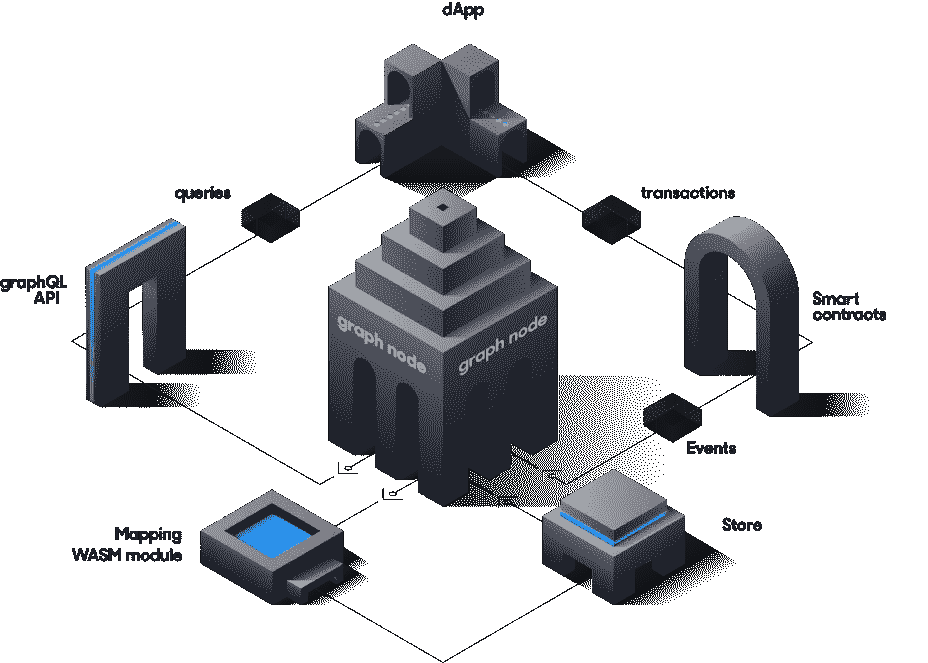

# 图表:“区块链的谷歌”

> 原文：<https://medium.com/coinmonks/the-graph-the-google-of-blockchains-56a753b605bd?source=collection_archive---------2----------------------->

为什么“图表”对 Web3 生态系统如此重要，并从背后推动了 DApps 的开发过程。

Web3 革命刚刚开始，消除了集中式 Web 2.0 的不规则性。

Web2 和 Web3 的主要区别是去中心化。Web3 的建设者们从底层开始重新设计互联网，将 T2 的所有权还给参与者。这样一来，一家公司就无法控制我们并为我们做出重要决定。通过让 Web3 开发者的生活变得更容易，图形已经成为开发去中心化应用的重要部分。

Web 3.0

# **没有图的 Web 3.0**

开发分散式应用程序(dApp)的主要障碍之一是查询和使用区块链数据的复杂性。

让我们想象一下，一个开发者正在基于 Web3 构建一个赌博游戏。他想显示输/赢的游戏总数，并在有人再次玩时更新它。用传统的方法做并不困难。比如说，他想只显示某个特定玩家的输赢金额。嗯，我们运气不好。在这种情况下，他需要部署一个新的契约来存储和获取这些值。一个旨在改变这种情况的项目是图表。通过索引和制作子图，它使开发人员更容易开发 dApps。

Traditional way vs with The Graph protocol

# **什么是图形？**

**该图是一个具有分散能力的索引协议**。它是 Web3 不可或缺的一部分，考虑到它是为分散式应用程序(DApps)提供无缝数据所必需的重要补充。

为了理解图协议，我们必须理解索引，图背后的主要思想。索引**减少了查找特定信息**所需的时间。

它就像一本书的索引。为了找到一个概念，我们可以在索引中更快地找到它，而不是一页一页地浏览整本书。该页面按字母顺序排序并包含对实际页面的引用。

数据库索引在计算机科学中做着同样的事情，通过索引整个数据库来减少搜索时间。

The Graph: Working process

# **区块链的谷歌**

随着 Web3 用例的增长，记住 Web3 与集中式 Web 的区别很重要，这样我们就不会重复过去的错误。Dapps 必须运行在完全分散的协议上。任何一个中心化的点都可能会被滥用来锁定人们并获得市场优势。

该图作为分散式互联网应用程序的使能器发挥作用，这些应用程序将完全由公共基础设施推动。

为了构建一个分散的应用程序**，索引层也必须是分散的**。你可以有一个分散的区块链，但是如果一个用户通过一个集中的服务与它交互，你现在已经重新引入了集中。现在，您可以让其他公司围绕信息的状态以及哪些信息是真实的做出决策。

根据该图的联合创始人**亚尼夫塔尔**，“运行该图的**节点都是去中心化的，它们运行的智能合约也是去中心化的，索引器也是去中心化的**”。然而，它的技术已经支撑了从最流行到最有前途的一系列加密应用。

想象一下，你今天正在**构建谷歌—** 这张图也在做类似的事情。它正在收集所有这些区块链的公共信息。谷歌和 Graph 的区别在于,**Graph 是完全开源和去中心化的。**

# 结论

Graph 协议创建**全球公共信息网格的能力**有助于**消除项目开发和操作专有索引服务器的需要**。使用该图可以节省时间和金钱，通常花费在工程和硬件资源上。因此，开发者可以**提供下一级的分散式应用程序，这些应用程序具有惊人的能力**，将超越用户通常的期望。

> 加入 Coinmonks [电报频道](https://t.me/coincodecap)和 [Youtube 频道](https://www.youtube.com/c/coinmonks/videos)了解加密交易和投资

# 另外，阅读

*   [3 商业评论](/coinmonks/3commas-review-an-excellent-crypto-trading-bot-2020-1313a58bec92) | [Pionex 评论](https://coincodecap.com/pionex-review-exchange-with-crypto-trading-bot) | [Coinrule 评论](/coinmonks/coinrule-review-2021-a-beginner-friendly-crypto-trading-bot-daf0504848ba)
*   [莱杰 vs n rave](/coinmonks/ledger-vs-ngrave-zero-7e40f0c1d694)|[莱杰 nano s vs x](/coinmonks/ledger-nano-s-vs-x-battery-hardware-price-storage-59a6663fe3b0) | [币安评论](/coinmonks/binance-review-ee10d3bf3b6e)
*   [Bybit 交易所评论](/coinmonks/bybit-exchange-review-dbd570019b71) | [Bityard 评论](https://coincodecap.com/bityard-reivew) | [Jet-Bot 评论](https://coincodecap.com/jet-bot-review)
*   [3 commas vs crypto hopper](/coinmonks/3commas-vs-pionex-vs-cryptohopper-best-crypto-bot-6a98d2baa203)|[赚取加密利息](/coinmonks/earn-crypto-interest-b10b810fdda3)
*   最好的比特币[硬件钱包](/coinmonks/hardware-wallets-dfa1211730c6) | [BitBox02 回顾](/coinmonks/bitbox02-review-your-swiss-bitcoin-hardware-wallet-c36c88fff29)