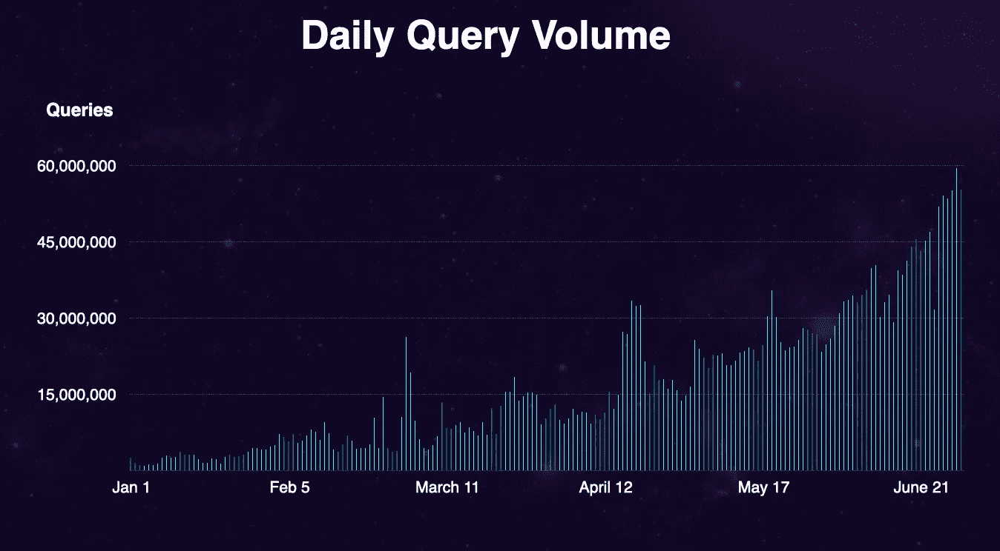

# 图表:web 3.0 的谷歌

> 原文：<https://medium.com/coinmonks/the-graph-the-google-of-web-3-0-7d285565b949?source=collection_archive---------13----------------------->

> 令牌用于 web 3.0，而静态页面用于 web 1.0

随着项目和创新在区块链行业的兴起，web 3.0 项目的采用也越来越多。

开发人员需要毫不费力地搜索数据，而没有或几乎没有压力。这就是“图表”概念出现的原因。

## 图表是什么？

Graph ( GRT)于 2020 年 12 月推出。Graph 是一个去中心化和开源的索引协议，它可以帮助开发人员通过简单的查询来交互和搜索以太坊数据。

该图使得在开放或封闭系统中访问数据的整个过程比看起来容易得多。

这使得该图成为 web 3.0 的强大支柱和区块链数据库的重要链接。

统计数据显示，2020 年 6 月超过 10 亿次搜索查询，对图表使用的兴趣持续增长。

Source: [The Graph search queries](https://thegraph.com/blog/one-billion-monthly-queries)

## 图表的历史

早在 2017 年，Graph protocol 的联合创始人 Yaniv Tal 和他的同事在试图建立新的以太坊 [dApps](https://www.investopedia.com/terms/d/decentralized-applications-dapps.asp) 时遇到了一个问题。

他们意识到以太坊没有查询或索引软件。他们意识到区块链开发者要经历寻找和收集他们自己的数据来构建以太网应用的痛苦。

> 需要索引软件或区块链的谷歌

这个想法促使 Tal 和他的同事们开发了一个应用程序，使得数据检索对开发者和整个密码社区来说更加容易。

塔尔和他的同事创造了世界上第一个也是最有效的区块链索引软件，名为“The Graph”。

## 图表是如何工作的？

该图有一系列“子图”,在区块链上被称为 API(应用编程接口)。

API 帮助您的计算机与其他服务进行通信和交互，而无需构建新的连接基础架构。

把 API 想象成一份餐馆菜单。给你一份菜单，你可以选择你和你的朋友想吃的和想喝的，而不用去餐厅厨房。无论你和你的朋友选择什么，他们都不会知道厨房里发生了什么。

API 就像菜单一样，我们通过互联网查询它，从数据库中获取信息。API 使数据检索变得容易。

子图就像 API，它们通过使用自己的开源查询语言 GraphQL (QL 代表查询语言)来工作。

GraphQL 是 Graph 搜索引擎的后端。在子图的帮助下，开发人员可以提取记录列表，并定义他们想要使用的确切记录和数据。

数据检索从来都不容易，我们今天生活的世界对数据如此重视。该图肯定会成为区块链工业中的一个项目。

我希望你喜欢这个作品，你可以留言或问好。

> 加入 Coinmonks [电报频道](https://t.me/coincodecap)和 [Youtube 频道](https://www.youtube.com/c/coinmonks/videos)了解加密交易和投资

# 另外，阅读

*   [最佳密码交换平台](https://coincodecap.com/best-crypto-swap-platforms) | [最佳密码交易所](https://coincodecap.com/crypto-exchange)
*   [购买比特币印度](/coinmonks/buy-bitcoin-in-india-feb50ddfef94) | [Pionex 评论](/coinmonks/pionex-review-exchange-with-crypto-trading-bot-1e459d0191ea) | [加密交易机器人](/coinmonks/crypto-trading-bot-c2ffce8acb2a)
*   [n rave ZERO Review](/coinmonks/ngrave-zero-review-c465cf8307fc)|[phe MEX Review](/coinmonks/phemex-review-4cfba0b49e28)|[PrimeXBT Review](/coinmonks/primexbt-review-88e0815be858)
*   最佳[区块链分析](https://bitquery.io/blog/best-blockchain-analysis-tools-and-software)工具| [赚比特币](/coinmonks/earn-bitcoin-6e8bd3c592d9)
*   [Cloudbet 赌场评论](https://coincodecap.com/cloudbet-casino-review) | [点火赌场评论](https://coincodecap.com/ignition-casino-review)