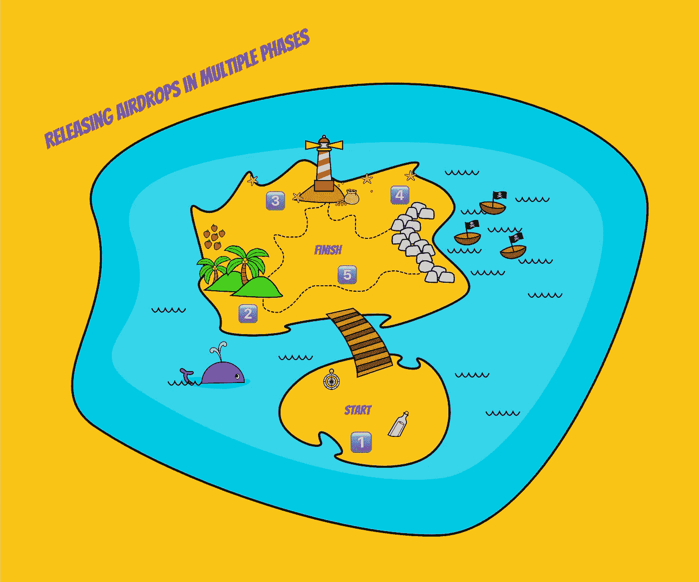
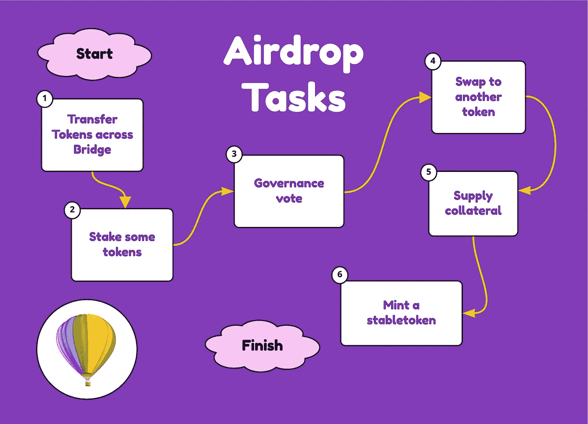
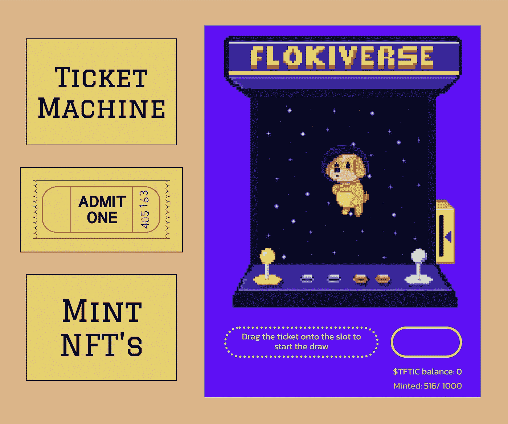
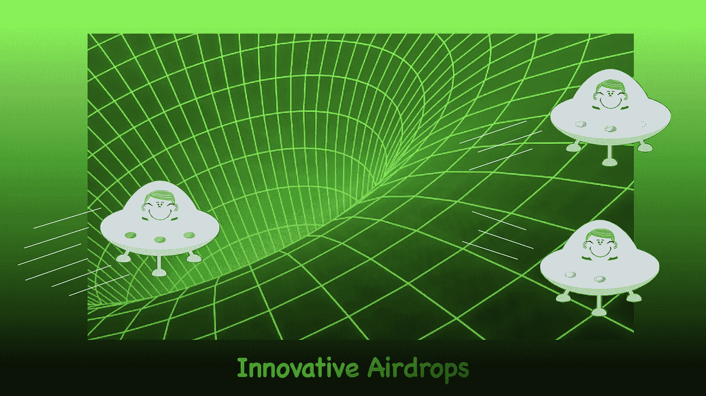

# 空投大辩论

> 原文：<https://medium.com/coinmonks/the-great-airdrop-debate-432762d8de4d?source=collection_archive---------6----------------------->

## **新的空投冒险**

当我踏上另一个陌生领域的旅程时，我回想起我参加过的最好和最差的空投。Arbitrum Odyssey 刚刚拉开序幕，这似乎是一个超级令人兴奋的事件，跨越八周和多个 NFT 空投。这会是一个成功的空投系列吗？在这个不断发展的生态系统中，它能满足构建者和用户的期望吗？老实说，我迫不及待地想知道；尤其是，因为我没有探索过以太坊及其第二层协议和 dApps。如果您有兴趣加入这个 Odyssey，我在文章下面的源代码部分留下了链接，让您可以开始。

## **最佳空投**

毫不奇怪，作为一个狂热的实验者，我已经参与并接受了近百次空投。在这个过程中，我列出了一个简短的清单，列出了什么是成功的令牌空投(可替换的或不可替换的)。

这是:

*   该协议或 dApp 已经定义、传达并支持空投分发标准
*   发行版支持协议的未来价值
*   空投旨在避免“出售和丢弃”代币事件
*   在释放空投时，在协议或 dApp 中存在功能
*   空投接收方应被要求参与区块链、协议或 dApp。

为什么我支持为你的货工作？为什么不广而告之呢？因为，那些事件构成了我参加过的最差空投的短名单。

## **最糟糕的空投**

以下是我认为可以被遗忘的空投事件的清单:

*   空投标准沟通不畅
*   在发布通告通信之后，空投标准被改变
*   空投伴随着贿赂，对另一个建造者团队或用户群产生负面影响
*   空投的代币一次全部释放
*   协议或 dApp airdrop 功能不起作用或崩溃
*   拥塞和交易延迟会导致挫败感
*   使用白名单(借用今天的词，这只是一个“可怕”的名字，它体现了错位的排他性)
*   当空投被释放时，在协议或 dApp 中没有效用。
*   空投带有标桩要求；然而，在随后的几个月里，没有从协议或 dApp 中引入用例。

所有这些类型的事件不可避免地导致空投代币的价格在极短的时间内迅速上涨，随后长期下跌。用户参与度会随着代币的价值迅速消失。

相反，让我们来看一些空投类型的例子，我认为这些空投非常酷，非常有趣，给用户和建设者带来了积极的体验。

## **分阶段空投**

分成不同阶段的空投非常有效。他们让用户一次又一次地回来与 dApp 互动。这种方法还可以确保代币不会一下子受到大量卖出压力的冲击。

我亲身经历过的最成功的事件是那些将接收空投的一部分与协议上的 dApps 的具体启动、分阶段实现的新功能或达到的里程碑联系起来的事件。例如，我见过许多 DeFi 协议使用以下方法:

*   第一阶段—启动令牌并启用锁定
*   第二阶段—开放交换功能
*   第三阶段——开放流动性池
*   第四阶段——开始激励农业。

当然，如果这些阶段之间的时间间隔过长，效果会被稀释，用户参与度也会减弱。

## **面向任务的方法**

我真的很喜欢这种空投，因为为免费代币工作是确保用户参与产品的方式。

面向任务的方法的具体例子包括:

*   通过桥转移代币
*   用木桩支撑一些代币
*   参与治理投票
*   将一些空投令牌换成另一个与区块链、协议或 dApp 交互的令牌。
*   向贷款 dApp 提供抵押品。
*   制造一个马厩。

作为一名用户，我想执行多项任务，因为这样我才能真正了解协议是如何工作的，以及该技术的可能性。通常，它还会引导我尝试其他产品，注入额外的资金，或增加我的参与度。

## **先实现效用**

我最讨厌的一件事是在空投中收到代币，然后兴奋地去 dApp 看有什么提供，然后发现…没什么！

你们都知道自己是谁:幽灵链、正在构建的协议，以及漂浮在加密宇宙中的隐形 dApps，它们只有令牌，别无其他。如果您不准备好并首先部署实用程序，那么发布令牌有什么意义呢？

新的建筑商，你能确保在投放空投物资的时候已经实施了公用设施吗？如果这看起来令人生畏的话，我已经看到许多连锁店推出了测试网，在测试网上空投令牌，获得了大量的用户交互，解决了所有的错误，并随后在 mainnet 上成功地向更广泛的受众推出。

## **NFT 滴**

没有什么比新的 NFT 项目更让我困惑了，这些项目通过惊人的营销活动产生了大量的社区参与，推出了一个成功的带有漂亮设计的创世纪 NFT 系列，却沉默了几个月，什么也没做。

为什么不利用这种兴奋感，在 genesis 坠落后的几周或几个月内准备好部署多种附加功能和产品呢？我见过很多关于这个概念的很棒的空投点子，包括:

*   向创世纪 NFT 所有者空投辅助收藏品
*   空投战利品 NFT 的创世纪 NFT 业主
*   让 NFT 在游戏中解锁机会
*   启动第二次收集，并使用相同的空投策略
*   使用 NFT 空投给在 dApps 中执行任务的用户。

由于我是那些独家“预约名单”的坚定反对者，这里有另一个我认为非常成功的想法。推出一个代币，NFT 的潜在所有者可以购买、持有和耕种它，以便获得铸造活动的门票。有了售票机，谁还需要“排除名单”？

然后就是奖励 NFT 的整个概念正在发展，就像我们所说的那样。这些 NFT 也可以空投，但随着时间的推移，代币会作为奖励收到，直接与 NFT 挂钩。

## **新颖的方法**

我认为，那些提出了最独特的通过空投让令牌流通的方法的协议是最成功的。

除了上面提到的例子，我还遇到了其他(更复杂的)例子，包括:

*   要求代币被绑定和养殖
*   授予具有稳定奖励流的代币
*   锁定承诺未来奖励的代币
*   根据锁定期的长短，支付越来越多的奖励
*   提供流动衍生代币以换取赌注代币。

所有这些方法都确保了协议的寿命和令牌的稳定性。

## **成功执行**

当我开始一个新的冒险，一个再次涉及空投的冒险，我想和你们分享一些我对这个问题的想法。显然，这不是一个详尽的清单，我很想听听你还参加过哪些有效的空投。

在如何成功执行空投的问题上，有许多不同的观点，就像加密宇宙中有许多协议一样。因此，我怀疑关于空投的大辩论将会继续下去。但是，下一次当你参与空投无用的代币时，你知道该怎么做。那些确实有用的，鼓励你学习一些意想不到的东西，体验一些独特的东西，并让你与世界各地的人接触的人，他们是守护者。

希望我能够在这次辩论中分享一些有价值的观点；与此同时，我期待着探索 Arbitrum 的奥德赛，并有一些很酷的 NFT 空投给我，作为对我热情参与的奖励。

他在门口喊——Opa。

## **资料来源、参考文献和进一步阅读**

介绍 Arbitrum Odyssey 的文章—[https://medium . com/offchainlabs/the-Arbitrum-Odyssey-87d6e 11171 D5](/offchainlabs/the-arbitrum-odyssey-87d6e11171d5)

银河计划“进入奥德赛”——[https://galaxy.eco/arbitrum/campaign/GCCNzUtQiW](https://galaxy.eco/arbitrum/campaign/GCCNzUtQiW)

仲裁法庭—[https://arbitrum.io/](https://arbitrum.io/)

阿尔比特鲁姆生态系统—【https://portal.arbitrum.one/ 

Arbitrum Odyssey 事件跟踪器—[https://dune . com/spring Zhang/arbitrum-Odyssey-Event-tracking](https://dune.com/springzhang/arbitrum-odyssey-event-tracking)

> 加入 Coinmonks [电报频道](https://t.me/coincodecap)和 [Youtube 频道](https://www.youtube.com/c/coinmonks/videos)了解加密交易和投资

# 另外，阅读

*   [加密复制交易平台](/coinmonks/top-10-crypto-copy-trading-platforms-for-beginners-d0c37c7d698c) | [Coinmama 审核](/coinmonks/coinmama-review-ace5641bde6e)
*   [印度的加密交易所](/coinmonks/bitcoin-exchange-in-india-7f1fe79715c9) | [比特币储蓄账户](/coinmonks/bitcoin-savings-account-e65b13f92451)
*   [OKEx vs KuCoin](https://coincodecap.com/okex-kucoin) | [摄氏替代品](https://coincodecap.com/celsius-alternatives) | [如何购买 VeChain](https://coincodecap.com/buy-vechain)
*   [币安期货交易](https://coincodecap.com/binance-futures-trading)|[3 commas vs Mudrex vs eToro](https://coincodecap.com/mudrex-3commas-etoro)
*   [如何购买 Monero](https://coincodecap.com/buy-monero) | [IDEX 评论](https://coincodecap.com/idex-review) | [BitKan 交易机器人](https://coincodecap.com/bitkan-trading-bot)
*   [CoinDCX 评论](/coinmonks/coindcx-review-8444db3621a2) | [加密保证金交易交易所](https://coincodecap.com/crypto-margin-trading-exchanges)