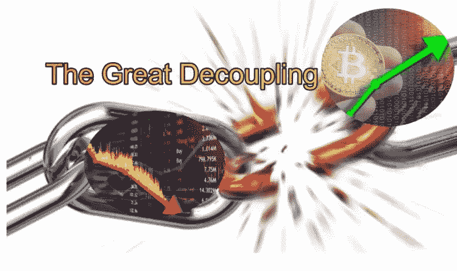

# 大脱钩

> 原文：<https://medium.com/coinmonks/the-great-decoupling-ab04f7c8ea2?source=collection_archive---------44----------------------->

鉴于过去几周市场的波动性，我在这里大胆预测，在不太遥远的将来，我们将看到比特币与主要市场指数(如道琼斯、纳斯达克)的波动脱钩。今天，2012 年 5 月 24 日，我一觉醒来，就听到社交媒体宠儿 Snap 股价在开盘时暴跌 40%，脸书(Meta)和谷歌(Google)等公司也跟着下跌。这是明智的投资，退出了早已过时的监控广告商业模式。

我个人认为，尚未推出新颖商业模式的 NFTs 将很快从社交媒体广告中夺取大量市场份额。随着时间的推移，我相信这将极大地影响数字营销者依赖搜索和社交广告活动来提高品牌知名度以销售商品和服务的长期流行趋势。

当然，我没有大脱钩的确切时间，但我敢打赌，到 2024 年下一个[比特币减半](https://www.investopedia.com/bitcoin-halving-4843769)的时候，你会看到一个与今天比特币 3 万的可笑低价大不相同的场景。我的推理如下:

1.  [工作证明与利益证明。](https://www.investopedia.com/terms/p/proof-stake-pos.asp#:~:text=What%20Is%20Proof%2Dof%2DStake%20vs.,new%20blocks%20to%20the%20blockchain.)

关于“比特币”的工作证明(PoW)和其他许多“股份证明”( PoS)的区块链，一直存在大量争论。Terra Luna 是基于 PoS 的，尽管它有部分比特币支持。最终，这是一个不基于已经完成的工作的算法解决方案。Terra Luna 由于这个被利用的特殊 PoS 系统中的缺陷而崩溃。这是 PoW vs PoS 大辩论的一个重大胜利。尽管我确实相信一些 PoS 区块链仍然对交易速度和其他应用程序有很大的用处。最终结算应该基于 PoW 或比特币。这使得前进变得容易得多，因为我们知道如何继续将比特币作为金融稳定的基础，以及所有其他区块链最终都建立在这个基础上。这为开发者和企业家提供了一条更清晰的道路。

2.开发者继续开发

尽管对于比特币和区块链项目来说，这几周总体来说是糟糕的几周，但区块链经济的发展势头和投资正以惊人的速度前进。上个季度，我们看到 100 亿美元的投资进入区块链发展。就在上周，N [3twork 工作室宣布筹集 4600 万美元制作 web 3 游戏。](https://venturebeat.com/2022/05/18/n3twork-studios-raises-46m-to-make-web-3-games/)在旧金山，SF 比特币开发者小组拥有 2670 名成员。这些人思考如何让十亿人上比特币闪电网。与迈阿密、奥斯汀和卢加诺等其他城市相比，旧金山实际上落后于加密技术的发展，这只是加速采用和发展的几个城市。当然，在一个允许你在任何地方贡献和发展的世界范围的去中心化运动中，城市并不那么重要。我们还没有开始看到财政和人力资本的数量对项目的影响。允许在比特币和闪电网络上发行资产的新协议，如 [Taro](https://lightning.engineering/posts/2022-4-5-taro-launch/) ，刚刚在开发者社区发布以征求意见。这类似于成千上万的音乐家在电视上看到猫王或披头士后决定成立一个乐队。这种势头不会停止，它会继续发展，并在未来几年内改变一切，就像摇滚乐一样。

3.每天都有数以万计的比特币狂热分子和加密好奇者诞生。

再一次，保持摇滚的类比，一旦种子被种下，它最终会成长。随着像[密码男孩](https://twitter.com/spencernoon/status/1525113785605922817?s=20&t=fX91uOFk4w40HsTcRbt_-Q&utm_source=Iterable&utm_medium=email&utm_campaign=campaign_4292175)这样的朗朗上口的歌曲迅速走红，我们看到了年轻一代的成长。(这首歌很吸引人，所以在听之前要注意。)这些加密男孩和女孩将很快成为男人和女人，他们的性格形成期由加密货币塑造，就像上一代人由互联网和智能设备塑造一样。

谁也不知道“大脱钩”的确切时间。归根结底，市场是由情绪驱动的，有时要改变根深蒂固的情绪观点需要付出巨大的痛苦。但是正如鲍勃·迪伦所说的“他们正在改变的时代”是在 1964 年，当时鲍勃是一个流行的民谣歌手。到 1965 年 7 月，鲍勃·迪伦与原声音乐脱钩，转而拥抱[电音](https://time.com/3968092/bob-dylan-electric-newport/#:~:text=On%20the%20evening%20of,of%20his%20familiar%20acoustic%20guitar.)，这颠覆了他的传统粉丝基础，但通过适应时代的变化巩固了他在流行音乐中的地位。

干杯，

吉姆(人名)

> 加入 Coinmonks [电报频道](https://t.me/coincodecap)和 [Youtube 频道](https://www.youtube.com/c/coinmonks/videos)了解加密交易和投资

# 另外，阅读

*   [Capital.com 评论](https://coincodecap.com/capital-com-review) | [香港的加密借贷平台](https://coincodecap.com/crypto-lending-hong-kong)
*   [如何在 Uniswap 上交换加密？](https://coincodecap.com/swap-crypto-on-uniswap) | [A-Ads 审查](https://coincodecap.com/a-ads-review)
*   [WazirX vs CoinDCX vs bit bns](/coinmonks/wazirx-vs-coindcx-vs-bitbns-149f4f19a2f1)|[block fi vs coin loan vs Nexo](/coinmonks/blockfi-vs-coinloan-vs-nexo-cb624635230d)
*   [本地比特币评论](/coinmonks/localbitcoins-review-6cc001c6ed56) | [加密货币储蓄账户](https://coincodecap.com/cryptocurrency-savings-accounts)
*   什么是融资融券交易
*   [支持卡审核](https://coincodecap.com/uphold-card-review) | [信任钱包 vs MetaMask](https://coincodecap.com/trust-wallet-vs-metamask)
*   [Exness 回顾](https://coincodecap.com/exness-review)|[moon xbt Vs bit get Vs Bingbon](https://coincodecap.com/bingbon-vs-bitget-vs-moonxbt)