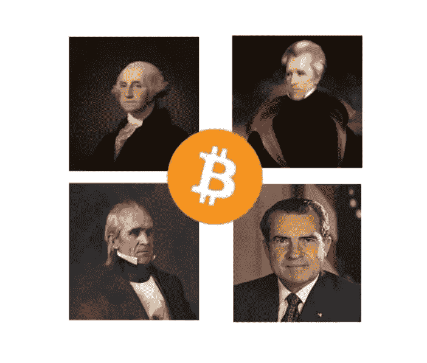
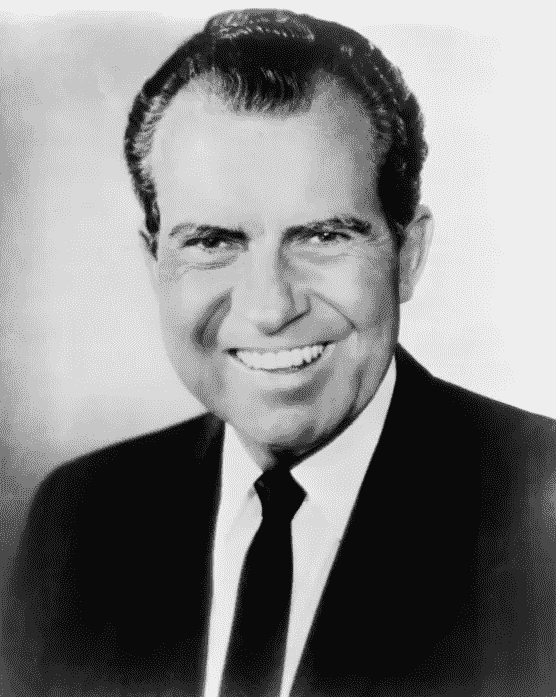
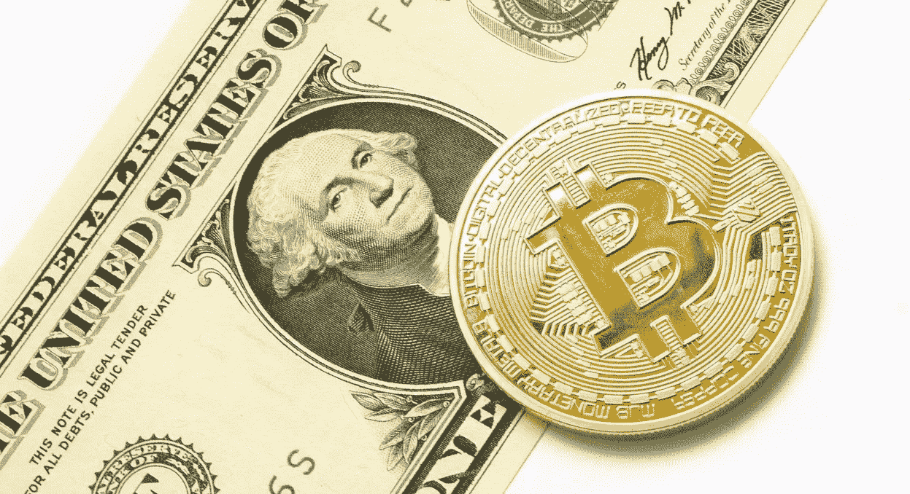
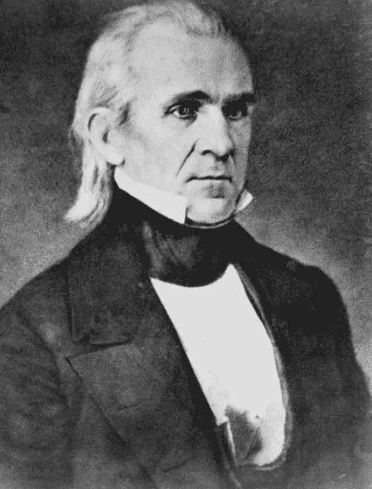
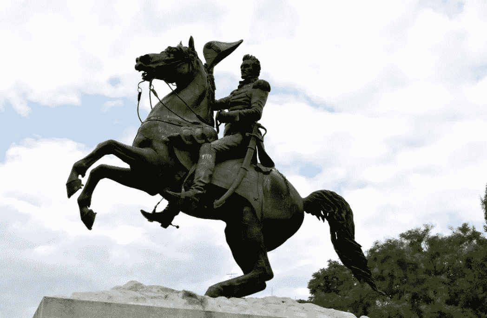

# 与波尔克、尼克松、杰克逊和华盛顿的伟大总统秘密辩论

> 原文：<https://medium.com/coinmonks/the-great-presidential-crypto-debate-with-polk-nixon-jackson-and-washington-f5327daf9524?source=collection_archive---------70----------------------->

你一定想知道我为什么召集过去的总统来思考他们会如何应对密码货币和货币分散化的美好新世界。你可能也很好奇我为什么选择这四位总统参加这个想象中的辩论。这就是他们被选中的原因，也是我认为他们会在这个活跃的论坛上谈论密码的原因。

# 参加本次辩论会的标准:

*   **理查德·尼克松:**在通货膨胀迅速的时期，他废除了货币的金本位制。听起来有点棘手，但他在 1971 年做到了。
*   **安德鲁·杰克逊，第七任总统:**杰克逊是州权的大力支持者。在他的任期内，他为普通人挺身而出，关闭了国家银行。他因其坚韧而被称为老山核桃。
*   **第 11 任总统詹姆斯·波尔克:波尔克是安德鲁·杰克逊的得意门生，安德鲁·杰克逊获得了“年轻的山核桃”的绰号，因为他们长得太像了。他经常被称为第一个黑马候选人，因为波尔克在政界之外基本上是默默无闻的。他还改革了银行系统，维护了各州的权利，降低了关税。他是一个负责任的人——他为他的政府设定了目标，并完成了所有这些目标。**
*   **乔治·华盛顿，第一任总统:**其他三任总统都有许多成就，但也有人认为他们在任期间会造成分歧。用一位非常受欢迎的总统来领导这个团队似乎是公平的。另外，正如您将在本文后面读到的，一位专家描述了为什么华盛顿会对区块链技术着迷。

# 第一轮:会见并问候总统

**主持人:**给小组一个信息。首先，我想告诉你们，我们在 2022 年聚集在这里。对你们中的一些人来说，这是通往未来的路。我已经向你们简要介绍了自你们卸任以来发生的重要事件。正如你所看到的，自你那个时代以来，发生了太多的变化——甚至是尼克松时代。

今天的讨论，我们选择了一个跨越几代人、几十年的话题。我们将讨论美国货币的变化和密码货币的出现。这应该会很生动，因为你们中的一些人——尼克松、波尔克和杰克逊都曾是律师。华盛顿是一名农民和将军，作为美国第一任总统和主持起草美国宪法的第一次大会，他获得了特别加分。

**尼克松:**在我们开始讨论之前，我想为讨论增加一些内容。

**主持人**:好的，主席先生，请继续。

**尼克松:**不管人们怎么说，我不是骗子。我的狗跳棋会为我担保。

杰克森:所以也许你不是骗子，但我没在美钞上见过*你的*脸。乔治出现在硬币和一美元钞票上。我在流行的 20 美元上，以前也在一些大钞上。詹姆斯，你也应该在钞票上，但至少你在 2009 年的总统金元上。取而代之的是，本·富兰克林现在因为出现在 100 美元钞票上而得到了所有的关注。

**华府:**不管别人怎么说，他们拍摄我的时候我没有戴假发。那都是我自己的头发。

**主持人:**很快，这可能就不重要了，因为今天我们将重点讨论为什么一种新的货币形式——加密货币——比你习惯的纸币更灵活，并最终可能取代旧的集中纸币系统。我们将讨论为什么 crypto 给人们提供了更多的自由，因为他们不仅仅受制于一个单一的货币发行者。一些州甚至可以发行自己的由资产支持的货币，比如土地。

我喜欢这个概念！可以说，这听起来像是我们新的命运。我支持我的朋友安德鲁的计划，解散美国银行，代之以分散的银行系统。这有助于给各州更多的独立性。别忘了，我早在 1846 年就建立了独立的财政部。自由。独立。它对我有用。

华盛顿:嗯……我听说了马萨诸塞州的一个地方，在那里人们使用他们自己的当地货币——伯克希尔哈撒韦——在社区购买商品和服务。这有助于建立地方认同感。我发现了另一个人们用木屑购买产品的地方。他们接下来会想到什么？在我那个时代，木屑被用来替换牙齿。我愿意付出一切来拥有瓷冠。

**主持人:**你知道你们可能都在不知不觉中为我们今天看到的大规模加密货币运动铺平了道路吗？正如我在本次辩论前的简报中提到的，加密货币是一种数字资产，依靠代码来管理和发行交易。我讨论了区块链技术是如何工作的，以及它如何利用计算机来跟踪交易。而且没有中间人介入。它变得越来越受欢迎，因为它不依赖于一个集中的发行机构。

杰克逊:那对我来说真是太好了！1883 年，当我关闭美国第二大银行国家银行时，我将资金重新分配给了各州银行。这给了公众更多的选择。当时国家银行拥有如此大的政治和经济权力，却缺乏监督，这让我很困扰。而且我一定是做对了什么，因为我摆脱了国债！我是唯一这样做的总统。

**尼克松:**该我说话了。基本上，如果我不把美元和黄金挂钩，你可能连密码都没有。对我来说，这是一个大胆的举动，我会为此而受到表扬。我这样做是为了抑制通货膨胀，并防止外国将美元兑换成黄金，使我们的体系负担过重。1971 年，它是每盎司 35 美元——现在大约是 2000 美元。当时，外国持有的美元更多，剩下的黄金不够。这些钞票不是由金币支持的，而是由我们政府的信念和信任支持的。他们信任我。他们真的信任我。我重复一遍。我不是骗子！

**主持人:**这很好，但并不是每个人都想受制于一个货币发行者。因此，拥有加密选项给他们提供了美元钞票之外的另一种选择。事实上，根据[卫报](https://www.theguardian.com/business/2021/aug/15/rise-of-cryptocurrencies-can-be-traced-to-nixon-abandoning-gold-in-1971?ref=hackernoon.com)的一篇文章，“欧元的创立、美国制造业的空心化、加密货币的到来以及央行印刷看似无限量货币的能力都可以追溯到 1971 年 8 月。”这都归功于你的努力，尼克松先生。

**尼克松:**哇！加密变得如此流行。我希望人们记住我是因为我在实现这一目标中的作用，而不是去想水门事件。

**主持人:**根据[crowdfundinsider.com](https://www.crowdfundinsider.com/2022/02/187203-cei-senior-fellow-says-george-washington-would-have-been-a-cryptocurrency-advocate/?ref=hackernoon.com)的一篇文章，竞争企业研究所(CEI)高级研究员[约翰·伯劳](https://cei.org/experts/john-berlau/?ref=hackernoon.com)说乔治·华盛顿很可能会喜欢加密货币。“作为一个保存详细账目并使用隐形墨水的人，华盛顿会(被)着迷于加密货币核心的加密账目及其相关的区块链技术，这两者都有望将交易的隐私和效率提升到新的水平。”

华盛顿:听起来不错。在我那个时代，隐形墨水就像是加密技术。我喜欢加密货币中这些属性的概念——加密、分类账和私人发行的货币。我走在了时代的前面，我为此感到自豪。毕竟，我是我们国家的国父。

*原载于 2022 年 5 月 12 日*[*【https://hackernoon.com】*](https://hackernoon.com/the-great-presidential-crypto-debate-with-polk-nixon-jackson-and-washington)*。*

> 加入 Coinmonks [电报频道](https://t.me/coincodecap)和 [Youtube 频道](https://www.youtube.com/c/coinmonks/videos)了解加密交易和投资

# 另外，阅读

*   [币安 vs FTX](https://coincodecap.com/binance-vs-ftx) | [最佳(SOL)索拉纳钱包](https://coincodecap.com/solana-wallets)
*   [比诺莫评论](https://coincodecap.com/binomo-review) | [斯多葛派 vs 3Commas vs TradeSanta](https://coincodecap.com/stoic-vs-3commas-vs-tradesanta)
*   [Capital.com 评论](https://coincodecap.com/capital-com-review) | [香港的加密借贷平台](https://coincodecap.com/crypto-lending-hong-kong)
*   [如何在 Uniswap 上交换加密？](https://coincodecap.com/swap-crypto-on-uniswap) | [A-Ads 评论](https://coincodecap.com/a-ads-review)
*   [WazirX vs CoinDCX vs bit bns](/coinmonks/wazirx-vs-coindcx-vs-bitbns-149f4f19a2f1)|[block fi vs coin loan vs Nexo](/coinmonks/blockfi-vs-coinloan-vs-nexo-cb624635230d)