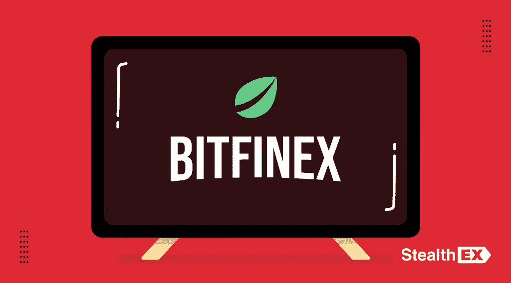
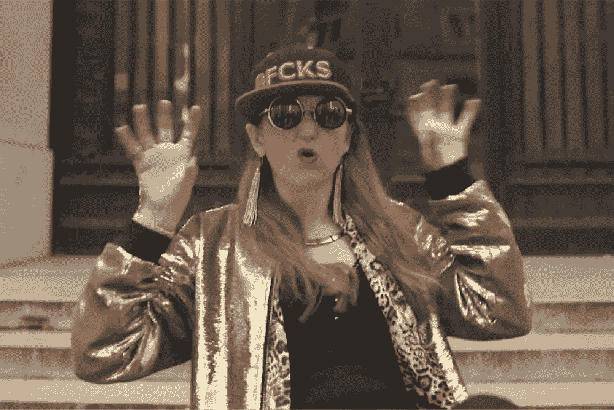

# 历史上最大的 BTC 犯罪:一部新的网飞纪录片将会讲述什么？

> 原文：<https://medium.com/coinmonks/the-greatest-btc-crime-in-history-what-a-new-netflix-documentary-will-be-about-96a16b98b677?source=collection_archive---------21----------------------->

拍摄尴尬的抖音视频，同时窃取数十亿美元。一个人能把如此多样的东西结合起来吗？这个独一无二的故事证明了一切皆有可能，尤其是如果这个人有犯罪同伙的话。

希瑟·摩根(Heather Morgan)和她的丈夫伊利亚·“荷兰”·利希滕斯坦(Ilya“Dutch”·lichten stein)盗取了大约 12 万枚比特币，但他们的罪行最近被揭露。受到这个故事的启发，[网飞决定拍摄一部关于它的系列纪录片。在新的](https://about.netflix.com/en/news/netflix-orders-doc-series-about-alleged-cryptocurrency-laundering-scheme) [StealthEX](https://stealthex.io/) 文章中阅读更多关于这个大胆的金融诈骗的信息。

# 这一切是怎么发生的？

2022 年 2 月罪犯落网，但故事本身却始于 2016 年。他们被指控从最受信任的加密货币交易所之一 Bitfinex 洗钱 119，754 个比特币。根据最近的比率，这笔钱相当于 50 多亿美元。

为了实施这一犯罪，这对夫妇对伊利亚·利希滕斯坦拥有的钱包进行了 2000 多次交易。之后有两万五千个比特币从里面转出。这对夫妇用这笔钱的一半换了菲亚特，买了 70 枚金币，一张价值 500 美元的沃尔玛礼品卡，还在 PlayStation 和优步上买了几次东西。此外，调查人员发现他们还在俄罗斯和乌克兰开设了金融账户进行洗钱。为了避免法律问题，摩根声称被盗资金是空壳公司的收入。

幸运的是，剩余的金额仍然在 Lichtenstein 最初使用的钱包中，专家们设法进入了这个账户，并恢复了超过 94，000 个比特币。

现在，这对犯罪夫妇被指控共谋洗钱和诈骗美国。这意味着他们的总刑期可达 25 年。

# 我们对伊利亚·李奇登斯坦了解多少？

伊利亚·“荷兰人”·利希滕斯坦是美国人，1987 年出生于俄罗斯。然而，今天几乎没有什么东西把他和他的祖国联系在一起了，因为他 6 岁的时候，他的家人搬到了美国。

随着年龄的增长，他显示出自己是一名企业家和领导者。2011 年，Lichtenstein 成为分析广告活动效果的公司 MixRank 的联合创始人。与此同时，他开始做项目的商业顾问，比如推销员和 500 家创业公司。

犯罪后，2018 年，他搬到纽约市，继续咨询业务，如 Endpass 和 Demand Path，并开始投资。

# 渴望成为创造者的多才多艺的生活

Ilya Lichtenstein 在这个行业工作，在他所做的事情上绝对有专长。然而，如果没有他的缪斯，他会犯下如此复杂的罪行吗？2014 年，希瑟·赖安农·摩根在为她的公司 SalesFolk 提供咨询时遇到了李奇登斯坦。

一个 31 岁的女人是一个多面的人，因为她既是记者，经济学家，博客作者，又是一个笔名为 Razzlkhan 的街头说唱歌手。然而，她最不寻常的爱好是拍摄抖音视频。她有着相当独特的表演风格，通常被称为“性感恐怖喜剧”，在她的内容中加入了许多黑色笑话。摩根从迪·安特伍德、米基·阿瓦隆甚至萨尔瓦多·达利那里获得音乐灵感。

其实她的内容与其说是聪明，不如说是独特，是愚蠢。在她的大多数视频中，希瑟表现得像个孩子，不知道如何处理自己的情绪，也不知道如何像成年人一样表现出来。有些人甚至认为有这种行为的人绝不会犯下如此严重的罪行。

# 谁将执导这部连续剧？

由于该项目刚刚开始，网飞透露只有几个人在工作。执导过《FYRE:从未发生过的最伟大的派对》的克里斯·史密斯将执导该系列，因《发明家:硅谷血战》(The Inventor:Out for Blood in Silicon Valley)和《假出名》(Fake 名家)而闻名的尼克·比尔顿(Nick Bilton)将担任执行制片人。

在 [Medium](https://stealthex-io.medium.com/) 、 [Twitter](https://twitter.com/Stealthex_io) 、 [Telegram](https://t.me/StealthEX) 、 [YouTube](https://www.youtube.com/channel/UCeES_XBesX76ge7xf1meuSw) 和 [Reddit](https://www.reddit.com/user/Stealthex_io) 上关注我们，获取 [StealthEX.io](https://stealthex.io/) 更新和关于密码世界的最新消息。对于所有请求，请通过 support@stealthex.io 给我们发消息。

*此处表达的观点和意见仅代表作者个人。每一次投资和交易都有风险。做决定时，你应该进行自己的研究。*

**非常欢迎您访问**[**StealthEX exchange**](https://stealthex.io/)**看看它有多快多方便。**

> *加入 Coinmonks* [*电报频道*](https://t.me/coincodecap) *和* [*Youtube 频道*](https://www.youtube.com/c/coinmonks/videos) *了解加密交易和投资*

# 另外，阅读

*   [Bookmap 点评](https://coincodecap.com/bookmap-review-2021-best-trading-software) | [美国 5 大最佳加密交易所](https://coincodecap.com/crypto-exchange-usa)
*   最佳加密[硬件钱包](/coinmonks/hardware-wallets-dfa1211730c6) | [Bitbns 评论](/coinmonks/bitbns-review-38256a07e161)
*   [新加坡十大最佳加密交易所](https://coincodecap.com/crypto-exchange-in-singapore) | [购买 AXS](https://coincodecap.com/buy-axs-token)
*   [红狗赌场评论](https://coincodecap.com/red-dog-casino-review) | [Swyftx 评论](https://coincodecap.com/swyftx-review) | [CoinGate 评论](https://coincodecap.com/coingate-review)
*   [投资印度的最佳密码](https://coincodecap.com/best-crypto-to-invest-in-india-in-2021)|[WazirX P2P](https://coincodecap.com/wazirx-p2p)|[Hi Dollar Review](https://coincodecap.com/hi-dollar-review)
*   [加拿大最佳加密交易机器人](https://coincodecap.com/5-best-crypto-trading-bots-in-canada) | [库币评论](https://coincodecap.com/kucoin-review)
*   [用于 Huobi 的加密交易信号](https://coincodecap.com/huobi-crypto-trading-signals) | [HitBTC 审查](/coinmonks/hitbtc-review-c5143c5d53c2)