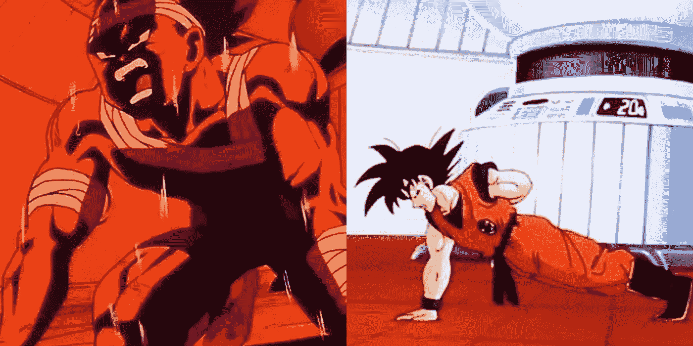
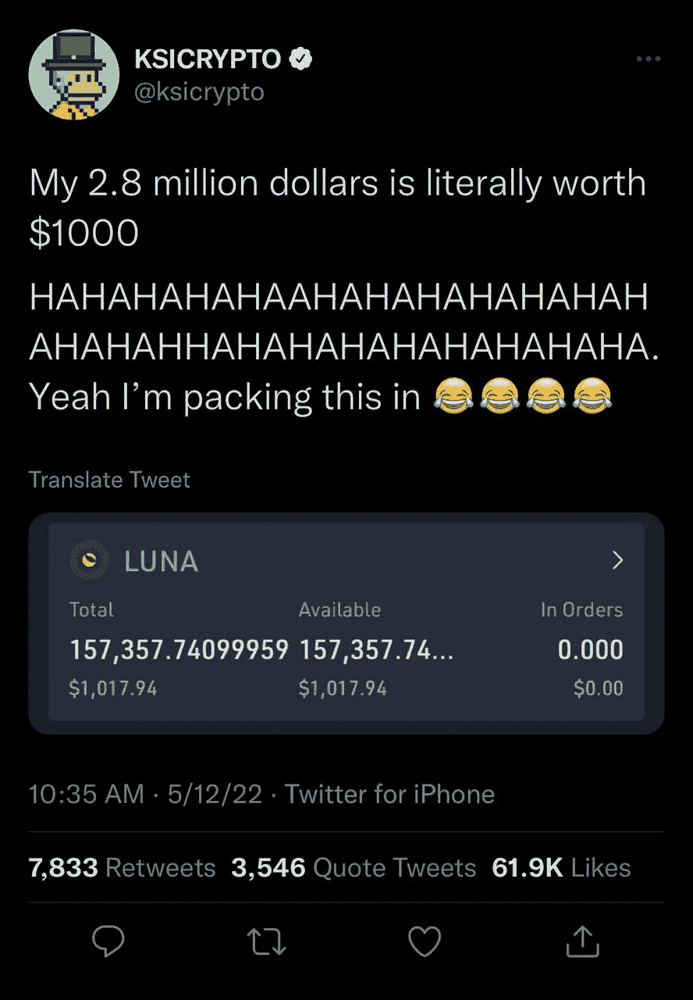
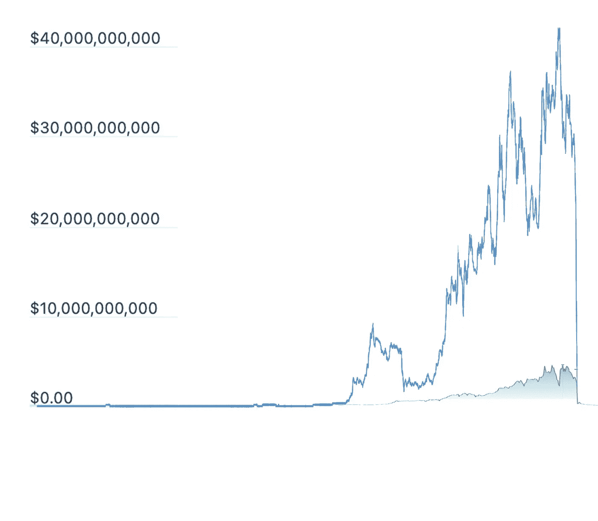
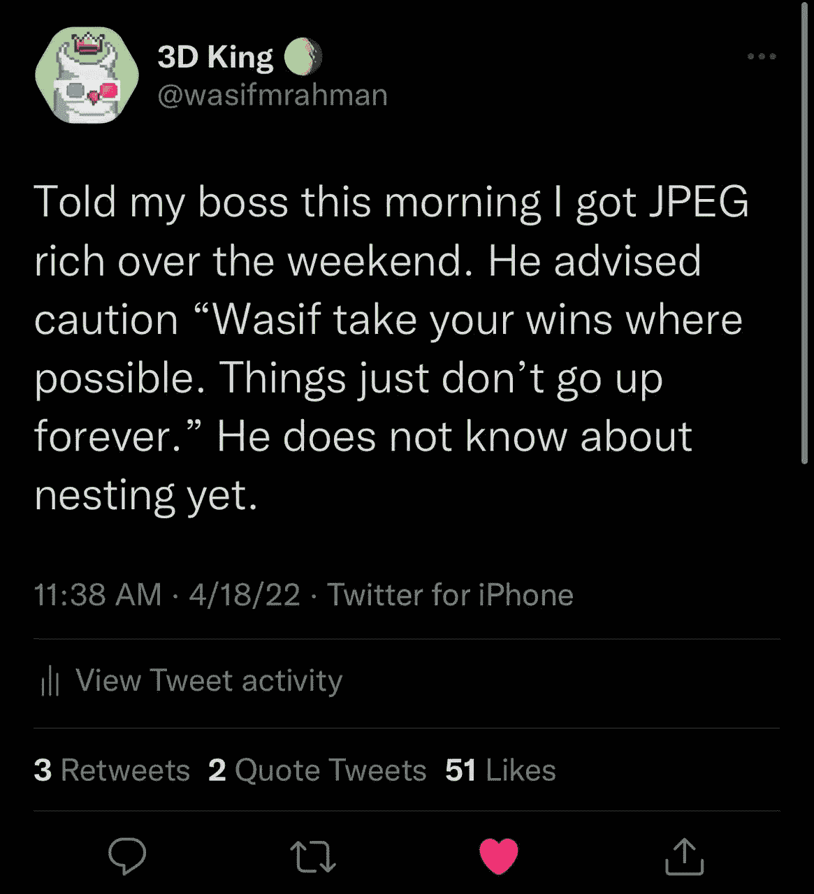

# 高潮与低谷:Web 3 的一年

> 原文：<https://medium.com/coinmonks/the-highs-and-lows-a-year-in-web-3-eed764aa6efb?source=collection_archive---------5----------------------->

我在去年 6 月 22 日买了我的第一个密码。我清楚地记得，这是自 2021 年密码市场创下历史新高以来的第一次大幅下跌。最近的这次崩溃是由于中国禁止在其境内进行地下开采。突然间，我关注了一段时间的以太坊以不到 2000 美元的低价出售了。作为一个旁观者，我目睹了那一年许多人通过交易这些投机性货币暴富，我想参与进来。像大多数美国人一样，我梦想有一天能拥有一栋房子。然而，即使我在一家著名的有影响力的营销机构担任总监级职位，我在纽约买房的可能性也很小。我本可以做很多同龄人做的事情，搬到郊区，但这是世界上最伟大的城市……我宁愿在布鲁克林租房而死，也不愿在泽西成为房主。

我和我妻子谈过了。我们已经详细讨论过这个问题了。下一次密码市场崩溃时，我会大举投资。比特币已经太贵了，我也许可以买一两个，我大幅增加投资的机会似乎有点有限。我选择以太坊是因为我那些懂技术的朋友们都在谈论它。显然，智能合约提供了某种效用。当智能合约在我头上的时候，我确实有点理解 NFT 的价值…这些以太坊上新的投机 JPEGs。我一生都在玩像口袋妖怪、游戏王和 MTG 这样的纸牌游戏。我一生的积蓄中有相当一部分是高价值的复古万智牌卡，我花了很多时间在 Ebay 这样的二级市场上交易魔法卡。我真的不太喜欢 Defi，但 NFTs 对我来说似乎很有前途。

我投了很大一笔钱，19000 美元……在输给比特币基地近 1000 美元的费用后，当时相当于 9.7 ETH(1920 美元)。费用很高。希望这行得通。第二天我醒来时，crypto 仍然在下跌。那是我第一次投资，那一刻我意识到我是一个高风险投资者，因为我在以太坊又买了 20，000 美元，双倍下注。Crypto 有起有落，在接下来的一个月里，我一直呆在比特币基地，每天都像坐过山车一样。我设定任意一个 1 万美元的利润作为我的出场点。大约一个月后的 7 月 29 日，我以每吨 2400 美元和 48000 美元的价格退出。它足够接近 10，000 美元，作为第一次投资者，我对自己非常满意。当我告诉妻子我已经找到答案时，我的脑袋里充满了内啡肽。我知道怎么给我们弄栋房子。

在我退出后，市场继续上涨。它看起来像是要飞向月球。第二周，我以每枚 3200 美元的价格回购了 ETH 的股票。一周后，我已经多花了 800 美元去买了…这感觉太疯狂了。我开始做日内交易，赚了些小钱，但总体上还是上涨了。然后我学习了资本收益税…我需要慢下来。我甚至没有考虑税收的影响。当我考虑到税收因素时，我并没有增加太多，事实上，考虑到费用、压力和所有占用的时间，收益实际上可以忽略不计。我修改了我的策略。我需要买入并等待一年。我在以太坊做了一些重要的投资，这次更加多样化，包括了 Solana、Cardano、Dot 和 Chainlink。尽管回报乏善可陈，我现在已经被加密药丸，并尽我所能了解更多关于这个行业。在轻松赚钱的诱惑下，我对白天的工作渐渐失去了兴趣，于是我决定将我的职业转向 Web 3。

2022 年 1 月，我开始在一家名为 Ex Populus 的 Web 3 游戏公司工作。我一开始对这个领域的知识非常有限。我之前交易密码的经历(你刚刚读到的)是关于我的知识范围。不用说，领导一个 Web 3 公司的营销团队让我觉得有点力不从心。需要澄清的是，当涉及到影响者营销时，我知道我的狗屎，但我的网络 3 知识并不十分到位，工作中的人一定要提醒我。

不幸的是，当人们告诉我我不合格时，他们通常会引发一场动漫蒙太奇，在那里我勤奋地训练，直到我不合格为止。我沉浸在 Web 3 和德根文化的世界中……我的早晨、下午和晚上都是在加密的 Youtube 和播客中度过的。我从《现代金融》、《无银行》、《硬币·博若》和《马克斯·梅尔》开始。当我对 NFTs 更感兴趣时，我开始看漂亮的阿尔法和布雷特·马林诺夫斯基。不到一个月，我就放弃了公司的一般管理人员，但仍然觉得我在假装，直到我能做到这一点。

在此期间，我还有幸为前 Populus 公司制作 NFT 滴剂。我领导着营销团队，虽然我们有很多地方可以做得更好，但我非常自豪地在我进入 Web 3 的头两个月就卖出了一个 NFT 系列。我购买的第一批 NFT 是我为 XP 开发的。我在追逐一个传奇造币厂时铸造了 20 张稀有卡片。当我终于铸造了我的传奇时，我知道我被迷住了。我看到了幻象。总有一天我会把 JPEGs 图片翻转成房子。似乎很合理。去年，一群人对他们无聊的猿类就是这样做的。除了无聊的猿的机会已经过去，我需要降落下一个大事情。

现在是 2022 年 4 月 6 日，我以前的主管(影响力营销)刚刚邀请我参加一个名为“月鸟”的随机 NFT 发布会。我已经准备好了……但是我现在只涉足便宜的索拉纳 NFTs。我不会把我辛辛苦苦挣来的 ETH 丢在一个昂贵的 bird JPEG 上。第二天，有人在公司 slack 上放了一个关于月鸟的链接，讨论筑巢的机制。有意思…我认识的更多的人都在谈论它。我打电话给我以前的老板，请他解释炒作的原因。他训练我销售，那天他成功地向我推销了月鸟。

这是独家报道，凯文·罗斯也参与了……格林辛迪加的贾斯汀·梅泽尔正在进行艺术创作……哦啦啦。我怎么进去？哦，等等，我需要一个 2.5 ETH 的钱包来参加抽奖，我有 25%的机会赢得 8，000 美元的 JPEG 制作特权…有趣。手弱的人不会把照片翻进屋里…所以我需要鼓起勇气。我这辈子只赢过一次抽奖，得到了一个蹩脚的蓝牙音箱…试试也无妨。第二天我查看了月鸟网站…我赢了。我告诉几个朋友……有人出价 18000 美元买我的鸟。这个假设的 JPEG 已经比蓝牙音箱值钱了…谁知道造币厂之后会怎么样…还有我的天…嵌套之后会怎么样？

登月鸟发射前的那一天非常难忘。你可以感觉到 fomo…每个人都在谈论它。然后造币厂发生了。我让我的鸟戴上他的小皇冠和 3D 眼镜，看起来很稀有。

我查看了稀有度得分:排名 946…这是排名前 10%的鸟。月鸟的价格在二级市场上浮动…几个小时内就涨到 10 美分。我的鸟大概能做两倍。我去了月鸟的发布会。能量令人欣喜若狂。那天那里的每个人都赚了很多神奇的互联网钱。那天晚上，我花了 14 英镑买了我的第二只月鸟。我改变了我的个人资料照片，开始第一次在 twitter 上发帖子…我收到了一波又一波的月鸟的关注。我在两天内就有了 1000 名粉丝。他们开始叫我 3D 之王。我在 Linkedin 上发布的 Moonbirds 帖子也获得了很多关注。有了这个鸟 PFP 突然让我一夜之间有了可信度。人们认为我要么知道早点得到我的鸟，要么花了很多钱买了它…不管怎样，感觉是我现在有很多秘密。不管是真是假，我都愿意去尝试。我妻子建议我卖掉一只 40 岁的鸟。当时大约是 12 万美元。她觉得嘲笑会很好…我没有听。

月鸟的炒作持续了整整两周。我的追随者数量减少了，生活也恢复了正常。我回到了现实…也许有了更多神奇的网络资金和 Twitter 上的一些追随者。大约在 4 月 26 日月底，我收到一个同事发来的信息。

> “我今天一直在关注魔法伊甸园发射台的一个项目。在索拉纳的淡季，它的 10k 系列在 2 小时内售罄。这个项目是“好熊”。前 2 个小时是白名单在 7.3k 的 10k。然后当它对公众开放时，剩余的马上就卖光了。”

我跳到了魔法伊甸园。销量一飞冲天。这个好熊的事情显示了一个疯狂的轨迹，已经翻转了这个领域的几个既定项目。我买了我的第一只熊。那天网络真的很差，我的大部分交易都超时了。所有看跌地板的人都在立即抛售……有大量的机器人活动，正在推动地板上涨。还有疯狂的需求，每个人都在谈论它。我一直试图购买更多的熊，并设法在两个小时内总共买到了四只。我所有的好熊都在 20 索尔以下…那天晚上，这个项目达到了 60 索尔的高点。

我的妻子告诉我把我的奖金带到那里，因为闪电不会击中两次。她不像我一样粘在熊的总体积上。在这一点上，我可能是一个闪电磁铁。我的朋友现在跟我说话，好像我对 NFTs 有所了解。有人告诉我“你不会失手”…这对我的信心有很大帮助，但我只拍了两张照片。我了解这个空间，但我不是专家。在 Web 3 中，你的 PFP 有时比你的经验更有价值。包里装着以太坊和索拉纳的顶级项目，我觉得自己站在世界之巅。我和妻子计划去波多黎各度假。我整个假期都在想如何在公关行业谋得一席之地，以节省我的资本增值税。我沉迷于我的新发现的财富，觉得它只是上升。

5 月 10 日，我从波多黎各回到家中，第二天就目睹了整个加密市场的崩溃。我真的很失望…甚至我在 NFT 的投资看起来也不那么令人印象深刻，因为 ETH 和 SOL 的价值创下了历史新低。我不是唯一一个。截至发稿时，任何在去年投资 Crypto 的人都很糟糕，很快恢复的前景渺茫。宏观经济条件看起来并不好，因为我们进入了一个可能是加密和非加密技术整体的长期熊市。

web 3 市场即将迎来一次调整，但没有人预料到会发生多么惊人的变化。上周凌晨时分，人们的手机亮起了警报灯。他们的加密投资组合在几分钟内就变得血红……一些硬币下跌了 40 %- 50 %,这可不是开玩笑的。原因是什么？作为排名前十的代币，Terra Luna 在几个小时内崩溃，因为它进入了死亡螺旋，看到硬币从一周前的 85 美元跌至不到 1 美分。发生这种情况是因为算法稳定币有根本性的缺陷，这可能使它在经济压力下容易暴跌。我的上一篇文章更详细地讨论了这种崩溃。

[https://medium . com/@ wasifmrahman/terra-luna-and-cryptos-Lehman-brothers-moment-BAF 8 a 56 fc 510](/@wasifmrahman/terra-luna-and-cryptos-lehman-brothers-moment-baf8a56fc510)

为了客观地看待这次崩盘，Youtube 名人 KSI 认为，当他在动荡的市场中低价买入 Luna 时，他是在买进。他在 Luna 的 280 万美元投资一夜之间化为 1000 美元……到现在可能更少。

Terra Luna 事件被称为 Crypto 的雷曼兄弟时刻。作为一个经历过 2008 年金融危机的人，我不会忘记这种比较。我没有接触过 Terra Luna，但那次崩盘的传染效应伤害了每个人的投资组合，因为对 crypto 的信心被严重削弱了。就在一周前，当我还有些“去你的”钱时，我突然变成了一个资产不足 1 万美元、拥有两只月鸟和四只好熊的人。我感到非常脆弱和沮丧。我在这么短的时间里赚了这么多钱，又赔了这么多钱，这对我来说就像是当头一棒。第二天早上，我不得不向妻子解释我是如何损失了这么多钱的。可以想象，她对 Crypto 中的黑天鹅事件没有什么考虑。她告诉我不断地嘲笑，我没有听她的。

这种事以前也发生在 Crypto 的人身上。有许多有战争经历的老兵。熬过漫长的严冬的人没有相位。他们知道市场会回来，但这次黑天鹅事件感觉不同。这次崩溃的规模和程度与之前任何一次都不相称。作为参考，你可以看到 Luna 与 Bit Connect 的对比市值，后者也在 2018 年内爆。

这不仅影响了市值，还影响了更多的人和生计。有些像我一样的人放弃了在 Web 2 中有前途的职业，去追逐 Web 3 的前沿。有更多的机构投资者和散户投资者在这个领域下了大赌注。失业、房屋贷款未付、人际关系被破坏、生命被夺走，所有这些都来自失去控制的神奇互联网资金。

我会康复的。我的月鸟和 Okay Bears 在熊市中表现出奇的好。我想任何选择留在 NFTs 的人都会坚持优质蓝筹股项目，而我恰好持有一些。尽管如此，我还是对这场比赛的高潮和低谷有些动摇。下一次我会更加谨慎地打球。当我得到我的 Moonbird 时，我现在的老板告诉我接受我的胜利，因为事情不会永远上涨。我在推特上开了个玩笑。

他是对的。吸取教训。在写这篇文章之前，我列出了我在 11 索尔买的第二只熊。它刚刚以 240 索尔的价格售出……这是 20 倍的利润，但是我的利润因为索拉纳的价值只有上周的一半而减少了。我现在有一些战争伤疤，但我仍然计划把 JPEGs 图片翻转成一所房子。我站在 Web 3 的前沿，我不会回头。

感谢您的阅读。

查看我的 Web 3 之旅:

[https://twitter.com/wasifmrahman](https://twitter.com/wasifmrahman)

在 LinkedIn 上关注我:

 [## Wasif Rahman -营销伙伴关系总监- Ex Populus | LinkedIn

### 查看 Wasif Rahman 在全球最大的职业社区 LinkedIn 上的个人资料。Wasif 有 4 个工作列在他们的…

www.linkedin.com](https://www.linkedin.com/in/wasif-rahman-91114a85/) 

我的 Web 3 淋浴想法:

 [## 瓦西夫·拉赫曼-中号

### 阅读瓦西夫·拉赫曼在媒介上的作品。Web 3 德根 Ex Populus 营销伙伴关系总监。每天…

medium.com](/@wasifmrahman) 

> 加入 Coinmonks [电报频道](https://t.me/coincodecap)和 [Youtube 频道](https://www.youtube.com/c/coinmonks/videos)了解加密交易和投资

# 另外，阅读

*   [分散交易所](https://coincodecap.com/what-are-decentralized-exchanges) | [比特 FIP](https://coincodecap.com/bitbns-fip) | [宾邦评论](https://coincodecap.com/bingbon-review)
*   [用信用卡购买密码的 10 个最佳地点](https://coincodecap.com/buy-crypto-with-credit-card)
*   [加拿大最佳加密交易机器人](https://coincodecap.com/5-best-crypto-trading-bots-in-canada) | [Bybit vs 币安](https://coincodecap.com/bybit-binance-moonxbt)
*   [阿联酋 5 大最佳加密交易所](https://coincodecap.com/best-crypto-exchanges-in-uae) | [SimpleSwap 评论](https://coincodecap.com/simpleswap-review)
*   购买 Dogecoin 的 7 种最佳方式
*   [最佳期货交易信号](https://coincodecap.com/futures-trading-signals) | [流动性交易所评论](https://coincodecap.com/liquid-exchange-review)