# 圣杯，一罐金子和隐藏的珠宝

> 原文：<https://medium.com/coinmonks/the-holy-grail-a-pot-of-gold-and-hidden-jewels-cfc54859c395?source=collection_archive---------8----------------------->

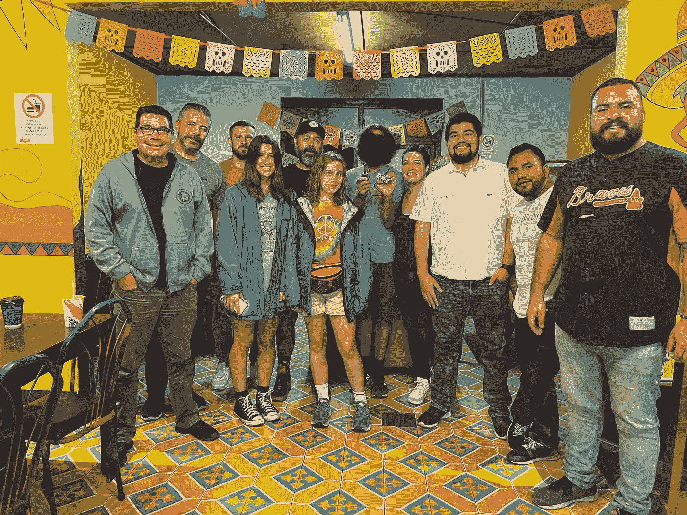

A Motley Crew Came to Bitcoin Lake to Learn about Bitcoin and Opportunity

这是一个正在进行的比特币湖系列文章。如果是刚加入，可以从这里开始[。](/coinmonks/bitcoin-lake-the-plan-a4d783113793)

5 月 9 日，我有幸带了一个随机的比特币团队来到危地马拉的 Panajachel，展示该地区潜在的投资机会。这是一个巨大的成功。由于我总是公开传达我们在比特币湖的工作进展，我也想为这次旅行提供一个更新。提供这些更新的目的是为了透明度和对经验教训的活的纪念。其次，也是越来越重要的是，它为那些想更多了解我们正在建设的东西的人提供了一个看到进展的机会。我在 2021 年 9 月开始记录我们的意图，目的是建立一个社区。我喜欢比特币社区，因为你们从世界各地站出来让这一切成为现实！谢谢。

提醒一下，你可以访问 [bitcoinlake.io](http://bitcoinlake.io) 来看看我们的整个团队——拥有不同技能和才能的跨国公司——这是一个伟大的团队。

此行的主要目的是进一步探索和验证我们的论点，即比特币开采有丰富、清洁、可再生的能源。我撒了一张大网，让商业领袖、首席执行官和随机的比特币创造者加入，尽管我非常想去的一些人不能来，但最终到达的团队和我们了解到的情况远远超出了我的预期。我总是去旅行，真的不知道会发生什么，但上帝总是提供。

这个团队由[比尔·惠特克](https://twitter.com/BillWhittaker11)和他的女儿马达凯特以及朋友凯特·罗莎[吉姆·休丘克](https://twitter.com/ShewchukJim)，里克·n 博士[维克多·佐林](https://twitter.com/TzorinVictor)，[马尔科·雷耶斯](https://twitter.com/M_Reyes5)，[塞萨尔·坦切兹](https://twitter.com/CesarTanchez)，[马里奥·萨尔盖罗](https://twitter.com/Gerente_suenos)，[胡安·丰塞卡](https://twitter.com/BitcoinBeachGT)(简单地说——谢谢)，[法布@ 69420](https://twitter.com/fabu69420)

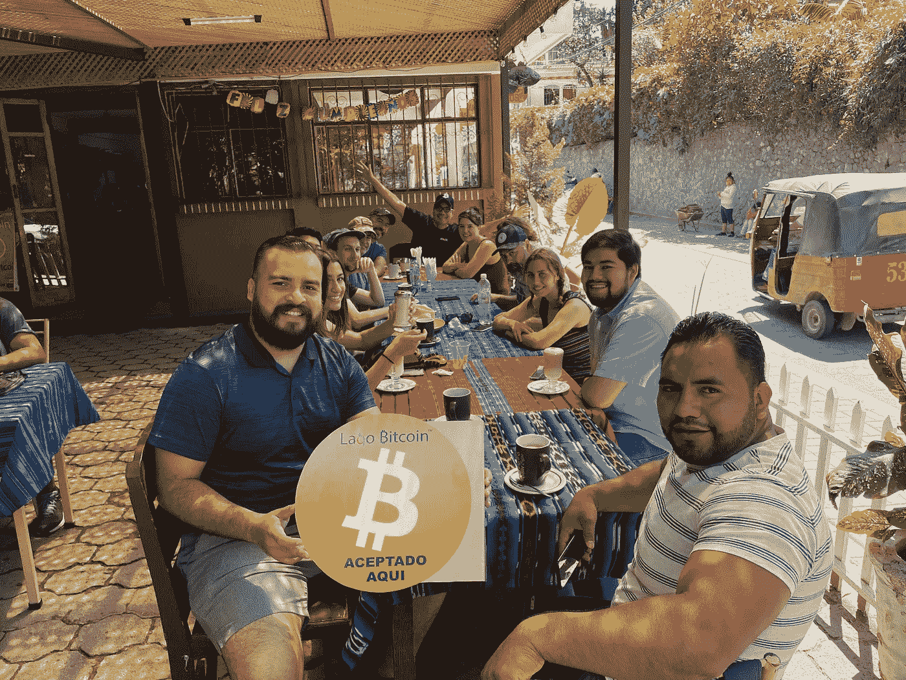

Breakfast Meeting for Networking and Sharing Ideas — paid in Bitcoin, of course.

比尔和女孩们下来实施一个使用可再生能源的比特币采矿概念验证。吉姆来自一家比特币服务公司，维克多和马可来自危地马拉埃斯昆特拉，塞萨尔、马里奥和胡安来自危地马拉城。Fabu 和 Mel 是经由哥伦比亚的瑞士人。本是一名来自纽约的自由记者，他全程和我们在一起记录我们的项目。

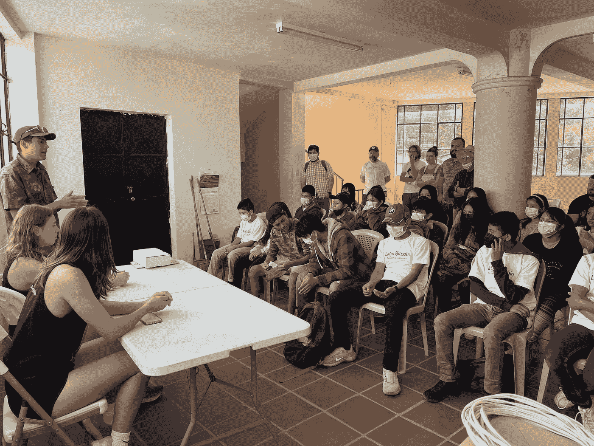

Kate (closest to view) and Madaket teaching the children at Centro Educativo Josue. Josue (farthest from view) is translating

另外， [Seedsigner](https://twitter.com/SeedSigner) 提供 Seedsigner 让我们部署在野外提供反馈。Seedsigners 是“无状态”BTC 钱包，允许创建密钥，而无需将密钥存储在设备上。这是一个非常聪明的装置，有可能成为发展中国家的冷藏解决方案。作为我们在[Centro Educativo Josue](https://www.centroeducativojosue.com/)(CEJ)正在进行的比特币教育的一部分，我们还使用了 Seedsigner 的组件，以便孩子们可以学习如何组装它们。在这个危地马拉小镇的孩子们手中看到这项新生的技术真是太棒了。一项世界上很少孩子能接触到的技术。他们正在学习一项基本的技术技能，这可能是该地区更大的比特币经济的基石。

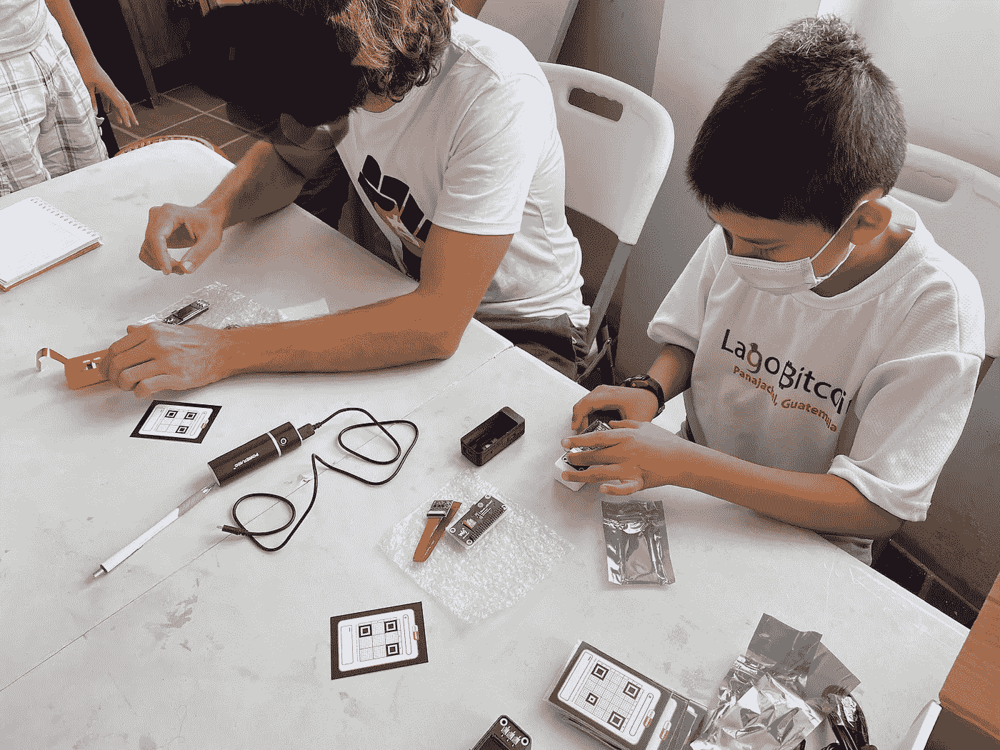

Fabu teaching the kids to assemble the seed signer

有趣的是，Victor 和 Marco 从 Cesar 那里了解了比特币湖，他们希望在埃斯昆特拉的一所学校 [Mana de Vida](https://www.facebook.com/ManadeVida) 实施类似的教育和采矿计划。Marco 在市政府工作，根据他在 Panajachel 学到的知识，他看到了埃斯昆特拉利用比特币采矿实现经济多元化的巨大机会。

事实上，在 5 月 17 日危地马拉城的一次比特币会议上，Cesar 指出，由于我们在 Panajachel 所做的事情，他设想 Panajachel 将成为危地马拉比特币活动的中心。一个崇高的想法。如果能看到这种情况，那就太好了。

南希·希福恩特斯(CEJ 的创始人)正在为我们将我们的课程正式引入危地马拉的教育系统奠定基础。

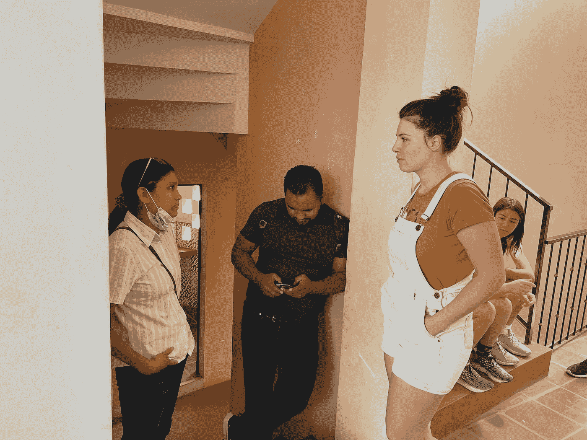

Nancy (left) and Mel discussing starting English classes at the school (Eliazar is center)

由于比特币披萨日即将到来，作为常规教育计划的一部分，我们在 5 月 18 日为孩子们举办了比特币披萨日。在真正的时尚中，来自世界各地的比特币创造者促成了这一点。他们直接把钱给了一个新的披萨小贩，我们在一周前打败了他。成为其中的一部分，拥有一个真正参与我们所做的事情的社区，这是一件非常棒的事情。

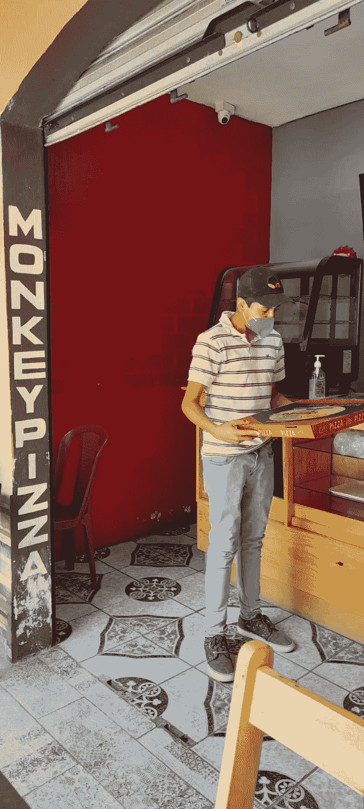

People from around the world sent satoshis to Monkey Pizza so the kids could enjoy pizza!

橙色的起球还在继续。诚然，这是一项艰苦的工作。我和 Eliazar 尽可能多地参观商店和企业。在一个看似数字幼稚的社区中介绍和教授比特币。当然，几乎每个人都可以使用电脑和智能手机，但只是作为一种实用设备，而不是旨在改变他们生活的设备。从某种意义上来说，这使得这非常“传教士”喜欢。我认为我们在推出以来的短时间内取得了巨大的成功。我必须承认，如果没有萨尔瓦多的[比特币海滩](https://twitter.com/Bitcoinbeach)和隔壁正在进行的比特币革命，我们不可能取得这样的成功。

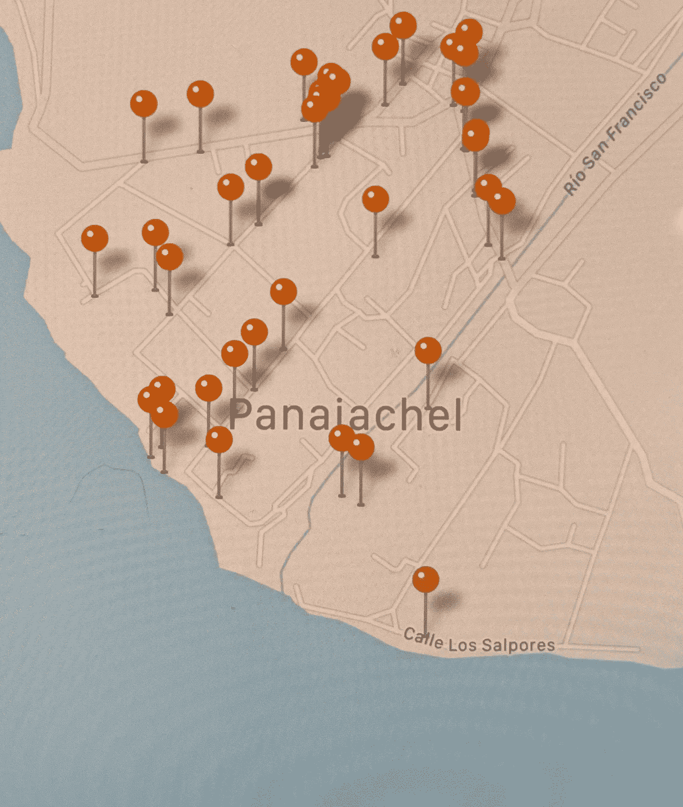

Current state of Bitcoin Adoption in Panajachel

然而，在很短的时间内(我们在 2022 年 1 月中旬开始)，你现在可以来到 Panajachel，在近 40 家企业中使用比特币。你可以来餐馆吃饭，去酒吧，买冰淇淋，纪念品，骑着嘟嘟车在城里逛，穿过湖，买杂货，住各种酒店，同时用比特币支付。在我最近的一次旅行中，我总支出的 85%是比特币。

迈克·彼得森和比特币海滩非常支持我们的努力。并且 [Galoy Money](https://galoy.io/) 对比特币海滩钱包的建议和技术帮助反应非常积极。

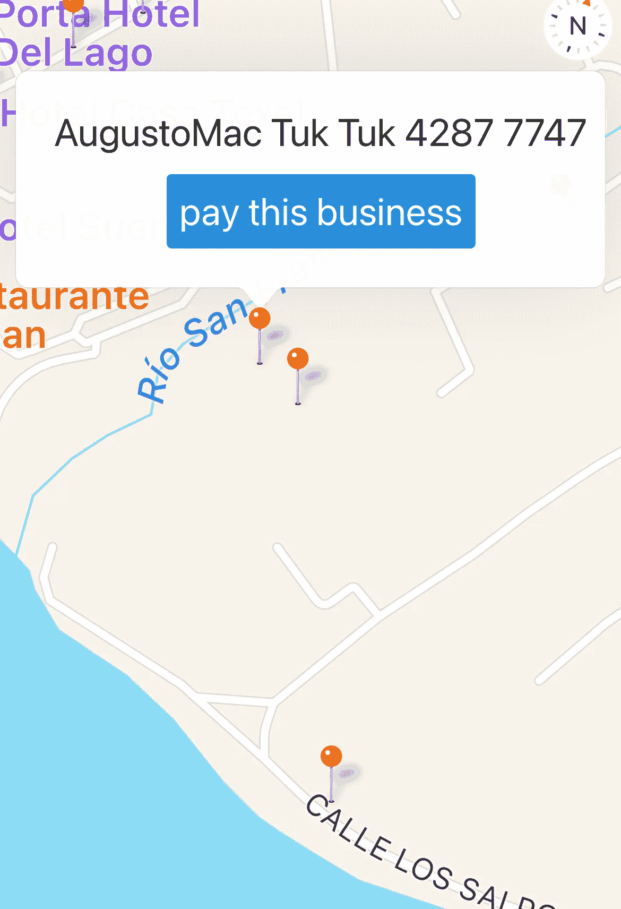

Bitcoin Beach Wallet “Hack” — telephone #’s added to tuk tuk driver pins so you can call for a BTC ride — thanks to support from BBW and Galoy

我们每次都必须解决的两个主要问题是比特币的波动性和套现问题。在此期间，比特币的价值下跌了 20%以上，Luna 的混乱局面也随之瓦解。并不是说我们促进或参与 Luna，但它提供了我们所处的环境和时机。尽管价值下跌，我们的第一批企业主之一还是热情洋溢地报告了比特币湖的进展。你可以在这里找到大约从 2 小时标记开始的录音[。对于比特币的波动性，我们总是非常坦率。正如本·韦斯在我们的采访中问的那样，“比特币洗礼的时刻是什么？”我说，“当价格像这样下降，而你仍然致力于比特币，那么你已经接受了比特币的洗礼。”我认为对于许多比特币创造者来说，一个完整的周期加上一次崩盘会让他们成为比特币最大值。我不确定我们要加入的企业是否需要经历一个完整的周期。我认为他们现在加入只会在一年左右的时间里加强我们的努力。就 Luna 而言，它有效地证明了在这样的社区中引入除比特币之外的任何硬资产的悲剧。想象一下，把露娜介绍给一个边缘化人群的社区，结果却看到他们失去了一切。](https://m.facebook.com/concriteriogt/videos/4991091921004603/?extid=NS-UNK-UNK-UNK-AN_GK0T-GK1C&ref=sharing)

# 圣杯

如果你了解比特币挖矿，你就知道圣杯是什么:免费能源。我请 Rick N .博士来描述他的技术。几个月前我知道了这件事。他当时不知道比特币和比特币采矿，他专注于开发其他能源市场。当我了解到他的技术时，我告诉他，他需要将其部署到比特币采矿领域。在审查这项技术的过程中，我想让他过来向另外两位比特币创造者描述一下:比尔和吉姆。都是比特币矿工。当他们得知瑞克的技术时，他们的眼睛都凸出来了:任务完成了！我们仍在审查这项技术，但它是圣杯。如果我们能在 Panajachel 部署它，Pana 将成为比特币挖矿天堂。非常期待看到它的发展——请继续关注。

# 彩虹尽头的金罐

如果你一直在关注我们的故事，你就会知道[我们已经在废物处理设施(WWTF)](https://bitcoinmagazine.com/business/using-poop-and-biogas-to-mine-bitcoin) 发现了一个重大问题。虽然最初的计划涉及使用太阳能作为能源，但在 Ricardo Carmona 的建议下，我们开始研究使用生物废物的可能性。我们从 1 月份开始观察 WWTF，发现尽管该设施有一个大型生物消化池，但由于生物消化池出现裂缝，它没有燃烧甲烷。甲烷是比二氧化碳更有害的环境气体。因此，我们正在积极研究解决这个问题，并利用浪费的能源来开采比特币。这是一个正在进行的项目。

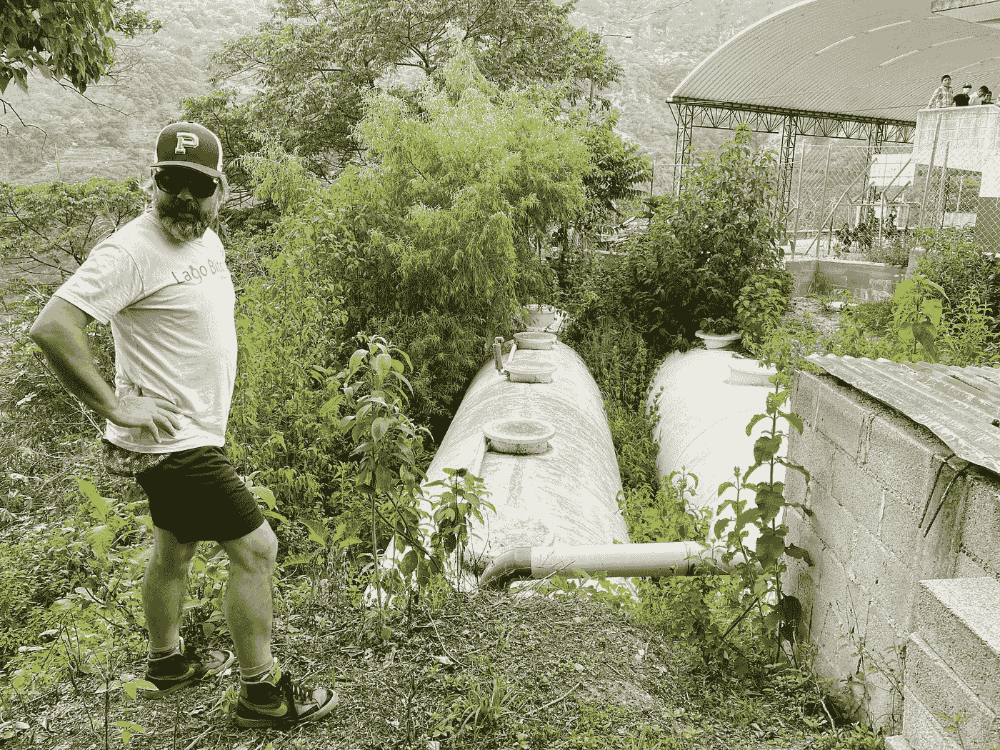

Bill Whittaker assessing essentially “NIB” Biodigesters that have never been used

然而，正如我们所想的，令人惊讶的是，比特币迫使一种分散的方法，因此我们越来越远离废物线索，以至于可能收集食物废物和有机废物，使用小型消化器产生甲烷作为开采比特币的能源。这种甲烷比来自 WWTF 的甲烷更清洁，使我们能够完全分散收集和开采。作为调查的一部分，我们与可能对新商机感兴趣的土地所有者进行了会谈。考虑到这一点，我们会见了当地社区领袖 Casper。*在与 Bill 会面的五分钟内*,他明确表示我们希望在某人的土地上建造一个生物消化器，以此作为废物变能源概念的概念证明。Casper 非常关注环境，我们完全一致。然而，值得注意的是，我们进行了大约一个小时的对话，他告诉我们，“我已经安装了三个生物消化器，但它们没有被使用。”停止表演，“暂停”我说，“我们需要马上去看这些生物消化器。”这是一个有点糟糕的时机，因为它已经是下午，我们实际上见面吃午饭，但我们需要去看看这些消化器。所以我们都上了车，开到了他的社区，看，我们看到了一罐金子。事实上，三罐黄金。有三台 10000 升以上的生物消化器，安装成本超过 30 万美元，但从未使用过！在 Casper 把它们安装好之后，接替他的人不知道如何处理它们，也没有完成这个项目。虽然旨在废水，我们认为我们可以转换这些利用有机废物生产甲烷。最棒的是，它们属于这个社区，就在一所高中旁边。我认为我们可以开始看到用比特币为社区公民创造的 UBI 的愿景，所有的钱都会留在社区里。

有了隔壁的高中，我们可以和 Centro Educativo Josue 的孩子们进行一些交叉授粉。可能性是惊人的。

在我们到达前几周，比尔和我还参加了另一项技术审查，这也是另一项有助于将废物转化为能源的惊人技术。这个能源项目需要更多的资金，但我们已经有效地发现了一个完整的路线图，从使用有机废物的分散能源生产到更加集中和资本密集型的废物变能源解决方案。这张路线图可以用来环湖“点菜”每个社区可以选择一个最适合他们的解决方案。最终目标是所有的激励措施都联合起来，减少进入湖中的废物！

# 隐藏的珠宝

5 月 17 日，Cesar，Mario & Diego 在危地马拉城组织了一次比特币聚会，庆祝比特币披萨日。因为我第二天就要离开，所以他们计划让我参加，尽管实际日期是 21 号。憋屈。塞萨尔告诉与会者(大约 20 人)，“在比特币湖的两天里，我学到的东西比我在迈阿密比特币 2022 上一周学到的还多。”哇！谢谢塞萨尔。

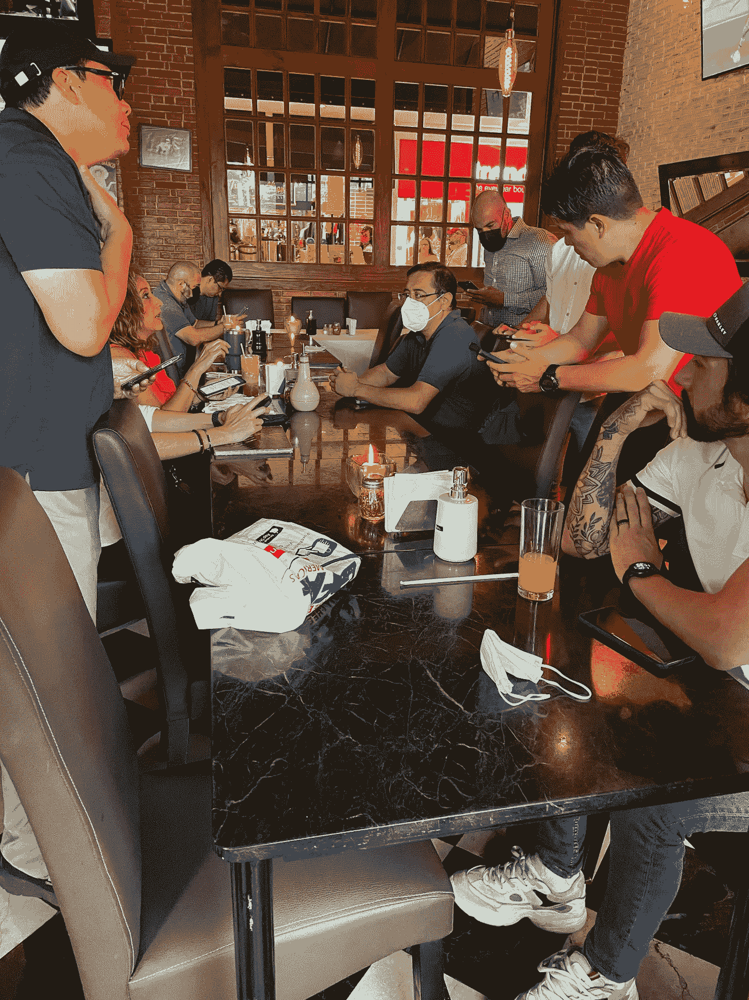

Bitcoin Pizza Day meet up in Guatemala City. Cesar Tanchez — standing (left)

这是一次很棒的会议。我分享了比特币湖的愿景。我们能够搭载 20 个新的比特币海滩钱包用户和 6 个企业！我带来了我的书，它们被用作赠品。网络太棒了。正是在这个网络中，我发现了一些隐藏的比特币采矿珠宝。我发现了更多燃烧甲烷的超大型生物消化器，一种没有被使用的轮胎热解装置，我还遇到了一个在一家超大型垃圾处理公司工作的人，他与可口可乐合作生产零碳足迹。进入，比特币挖矿。危地马拉有大量未开发的资源，可以吸引大量资本用于比特币开采。

虽然我们所有的工作都是严肃的，但对我们来说，这项工作的一个非常重要的部分是确保它的包容性和透明性。Panajachel 位于危地马拉土著社区的中心。让他们参与这一进程并从中受益是至关重要的。所以在这次旅行中，我安排了与土著社区领袖的会面。这是漫长的两个小时，我从头开始讲述比特币作为一种技术，它将如何帮助危地马拉人，以及我为什么要与他们交谈。他们问了一些尖锐的问题，比如市政当局的参与情况，做出了什么承诺等等。健康的，怀疑的问题。我认为我提出的一个问题和我的回答让他们停下来想一想，我们提出的方案与以前所有的项目都有很大的不同。他们问我承诺了什么。我只是说我不能保证什么。“我给你工具来帮助改变你的社区正在发生的事情。”人们来到这个地区，承诺用一些东西来换取另一些东西。不幸的是，他们通常会得到一些东西，而不会给予他们所承诺的东西。

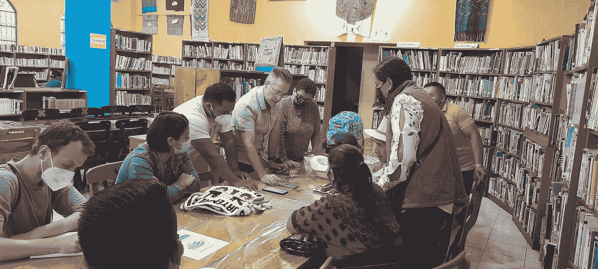

Meeting with Indigenous leaders in the public library. Ben Weiss far left corner taking notes.

我敢肯定，这是许多会议的第一次，以确保这个重要的社区成为这一进程的一部分。我们计划在 5 月 24 日再开一次会。

# 脱离木工

参加这次旅行的三个人在 Twitter 上关注这个项目，并随机询问他们是否可以参加这次旅行。是啊！吉姆、法布和梅尔来看看比特币湖是怎么回事，并成为它的一部分。我真的为投入的时间和精力感到谦卑。

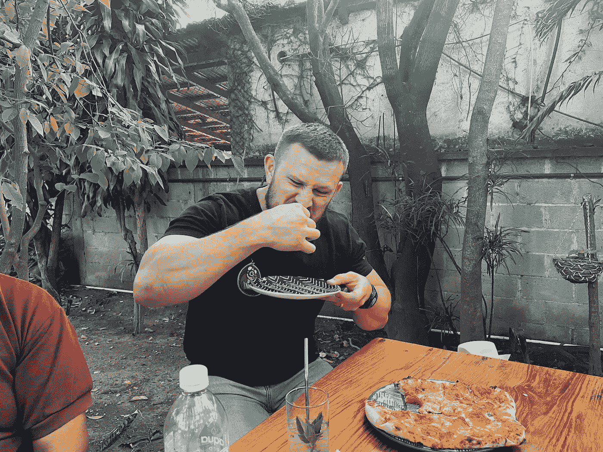

[Jim Shewchuk](https://twitter.com/ShewchukJim) — enjoying pizza at Amaranto. Paid in Bitcoin, of course.

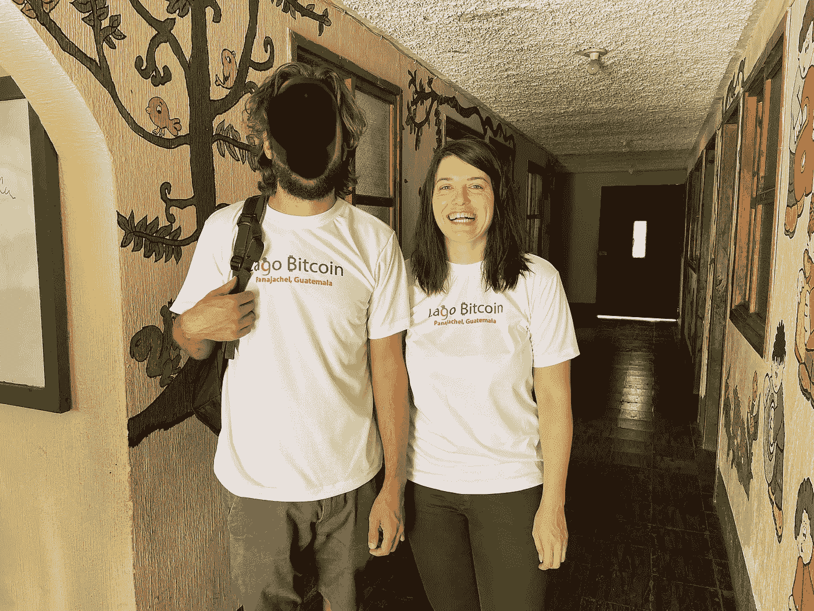

Fabu and Mel. Swiss nationals by way of Colombia.

我们将第一次有人(梅尔)为孩子们上英语课！Fabu 每周都会讲授比特币。非常兴奋能让他参与到这个级别。

我们的创始成员之一埃里克在比特币电报频道上非常活跃。由于他的努力，我们已经能够真正接待我们的第一批比特币游客了！此后不久，我们有更多的人来了。希望更多的人来到 Panajachel 并发现危地马拉这个美丽的地区只是时间问题。

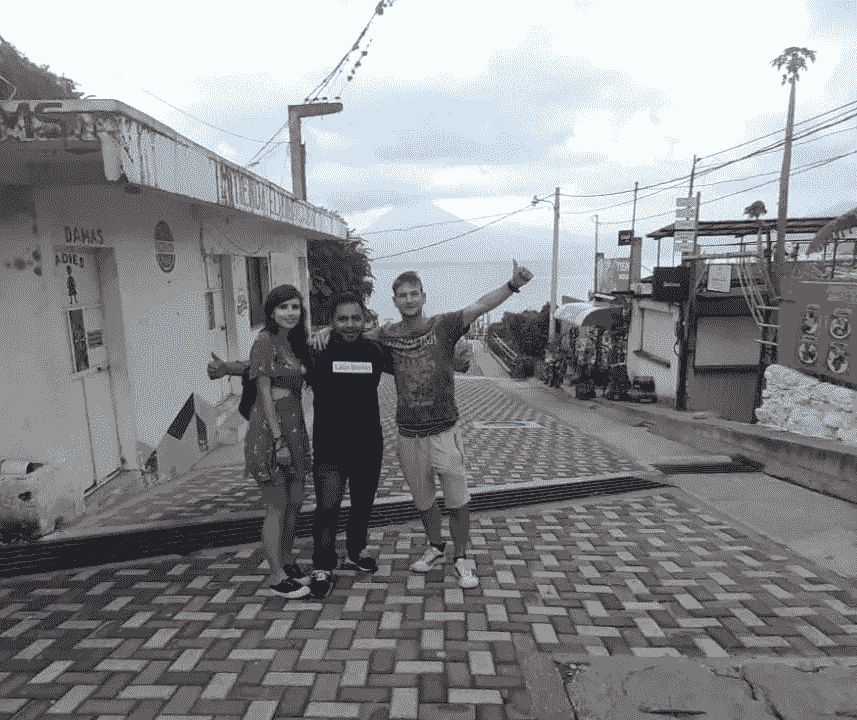

Our first Bitcoin tourists (Eliazar center)

在萨尔瓦多比特币海滩的慷慨捐赠下，我们开始在该地区增加我们的标志。这很花时间，因为我们必须先把打印店夷为平地。当我们在社区中做生意时，如果可能的话，我们希望与接受比特币的企业合作。我们还开始创建拉戈比特币/比特币湖商品——全部用比特币支付！

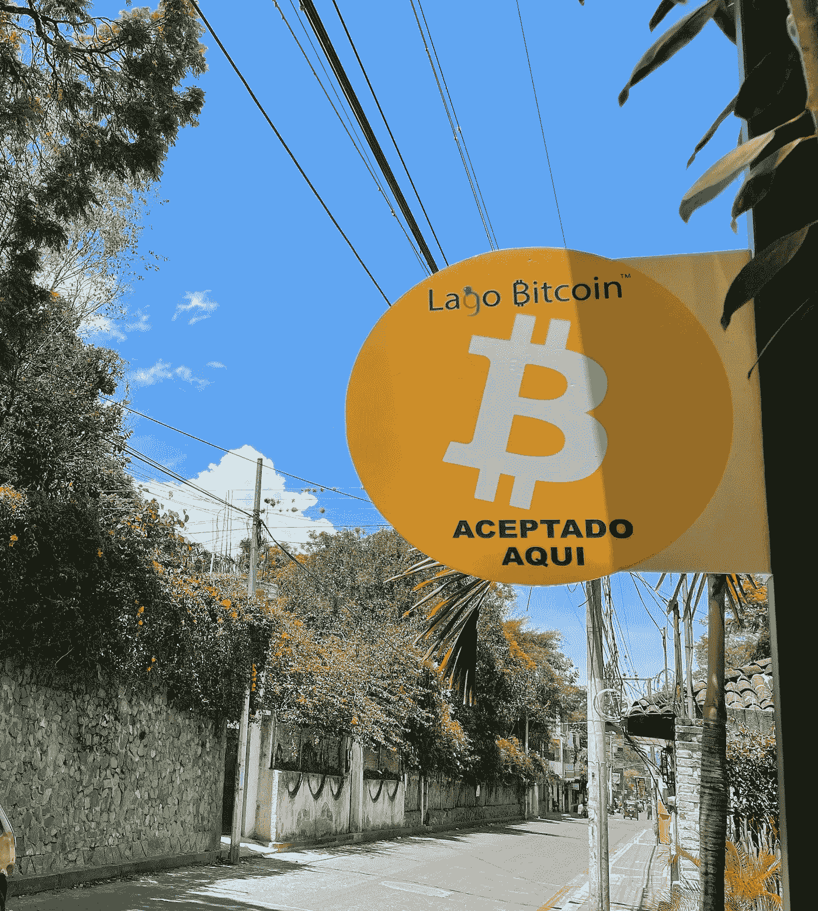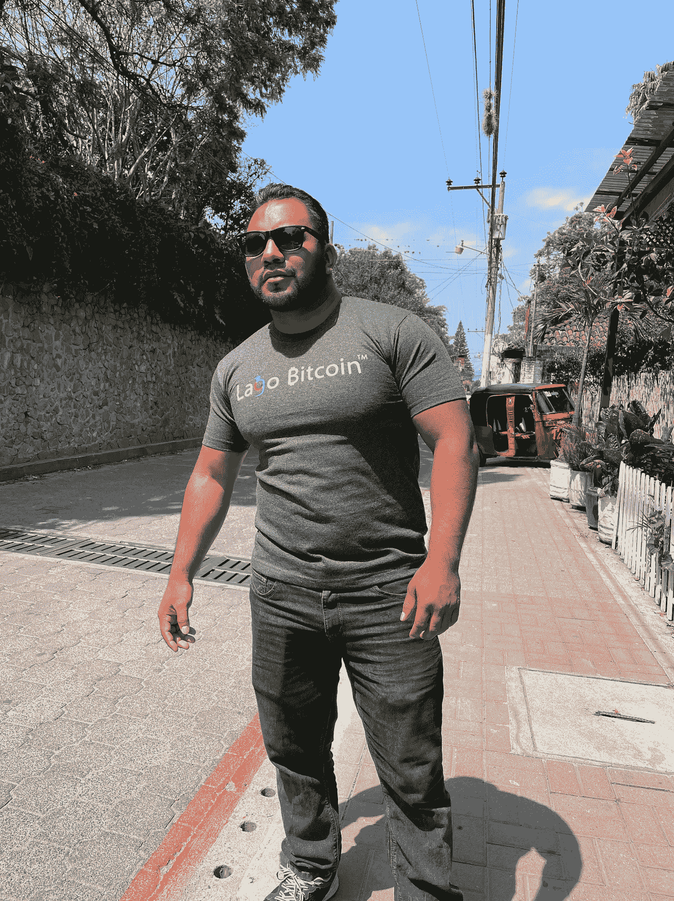

Eliazar showing off one of our Ts

南希还慷慨地允许我们使用学校的一个房间作为比特币教室。作为我们社区包容的一部分，我们希望比特币玩家在访问时前来签名。人们喜欢这个想法。

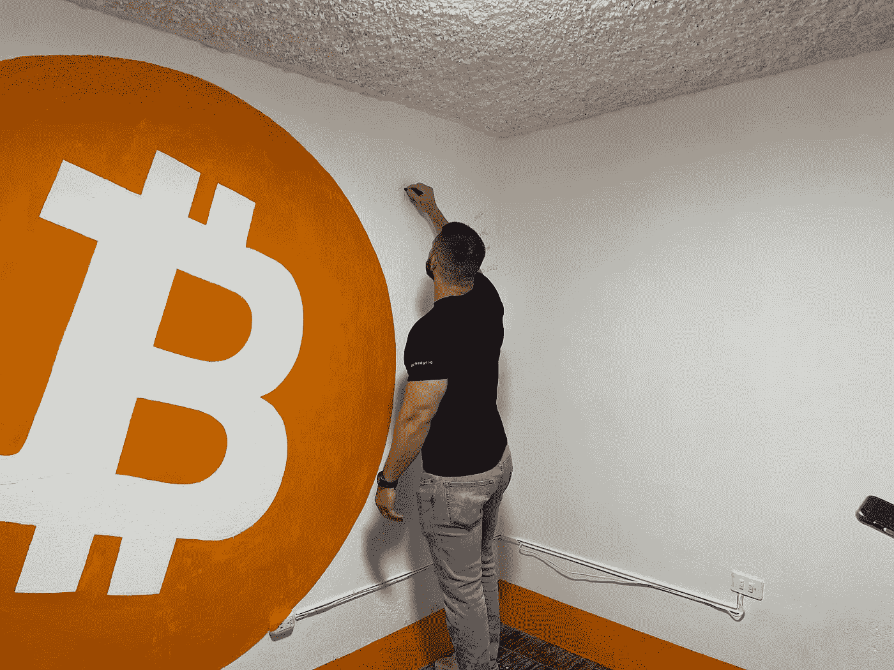

Jim signing the Bitcoin wall at the school

经过长时间的搜索，我们终于确定了一个嘟嘟车司机，可以让我们画他的嘟嘟车。他实际上是第一批来参加我一月份的教育会议的人之一。然而，在我的最后一次旅行中，我们发现有人表示有兴趣让他的嘟嘟车上漆。在油漆的前一天，他说他不能做。正如他们在危地马拉所说的那样，“这很复杂。”因此，几个星期以来，我们绞尽脑汁，接触不同的车手，看看谁可能感兴趣，然后奥古斯托走上前来，说他会这样做。希望在几周内，我们可以展示世界上第一个比特币主题的嘟嘟车！特别感谢迭戈和他在 VRC 赛车运动的工作人员让这一切成为可能。我们还对比特币海滩钱包进行了一点黑客攻击，这样嘟嘟车司机的电话号码就会出现在地图上，这样你就可以呼叫嘟嘟车，并用比特币支付。

当然，当我们在那里的时候，我会见了 Panajachel 的市长 Cesar Piedenstra。他非常支持我。我很确定，如果不是因为南希和她在社区中的地位，我们不可能以这种方式接近市长。谢谢南希。

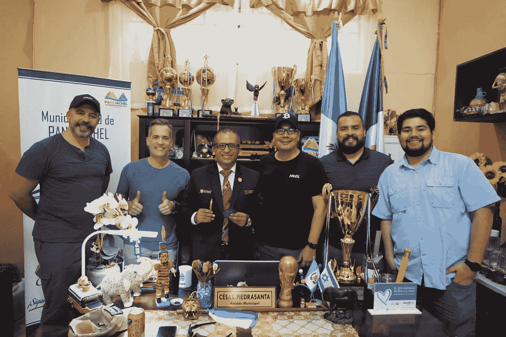

From left to right: Mario, Me, Mayor Piedrasanta, Cesar, Marco, Victor

女孩们，比尔和我也在 13 号星期五和 BTC 做了一次现场直播！这里可以抓到[。](https://www.youtube.com/watch?v=5H_Sr54KKSs)

最后，但同样重要的是，本·韦斯也跟着来了。本是一名自由记者，基本上全程跟踪我们。我期待着他的作品一旦出版——谢谢你来看这个不可思议的作品！

# 拉戈比特币和格查尔

如果你关注世界各地的各种比特币项目，就像许多人在项目中使用英语一样，例如 Beach vs. Playa。这是一个具有最广泛吸引力的伟大方法。由于危地马拉土著社区的特殊性，我们希望植根于危地马拉文化，因此我们在该国被称为 Lago(湖)比特币，我们的商品也反映了这一点。我们在拉戈的风格化“G”是一只格查尔鸟。格查尔是危地马拉的国鸟，也是官方货币的名称:格查尔或 q。

人们似乎真的很喜欢我们的小鸟！我们对此感到高兴。

只是解释一下我们的命名和标志——我们是唯一一个没有在我们的标志中使用比特币“B”形式的比特币项目。

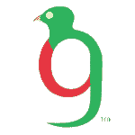

Stylized Quetzal Bird in Lago Bitcon

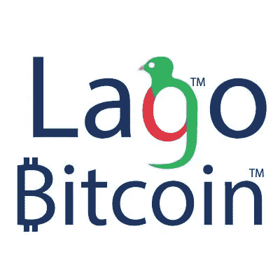

比特币湖、比特币湖、拉戈比特币、拉戈比特币和“G”标志是马里兰州帕特里克·c·梅尔德尔的商标

> 加入 Coinmonks [电报频道](https://t.me/coincodecap)和 [Youtube 频道](https://www.youtube.com/c/coinmonks/videos)了解加密交易和投资

# 另外，阅读

*   [3 商业评论](/coinmonks/3commas-review-an-excellent-crypto-trading-bot-2020-1313a58bec92) | [Pionex 评论](https://coincodecap.com/pionex-review-exchange-with-crypto-trading-bot) | [Coinrule 评论](/coinmonks/coinrule-review-2021-a-beginner-friendly-crypto-trading-bot-daf0504848ba)
*   [莱杰 vs n rave](/coinmonks/ledger-vs-ngrave-zero-7e40f0c1d694)|[莱杰 nano s vs x](/coinmonks/ledger-nano-s-vs-x-battery-hardware-price-storage-59a6663fe3b0) | [币安评论](/coinmonks/binance-review-ee10d3bf3b6e)
*   [Bybit Exchange 审查](/coinmonks/bybit-exchange-review-dbd570019b71) | [Bityard 审查](https://coincodecap.com/bityard-reivew) | [Jet-Bot 审查](https://coincodecap.com/jet-bot-review)
*   [3 commas vs crypto hopper](/coinmonks/3commas-vs-pionex-vs-cryptohopper-best-crypto-bot-6a98d2baa203)|[赚取加密利息](/coinmonks/earn-crypto-interest-b10b810fdda3)
*   最好的比特币[硬件钱包](/coinmonks/hardware-wallets-dfa1211730c6) | [BitBox02 回顾](/coinmonks/bitbox02-review-your-swiss-bitcoin-hardware-wallet-c36c88fff29)
*   [BlockFi vs Celsius](/coinmonks/blockfi-vs-celsius-vs-hodlnaut-8a1cc8c26630)|[Hodlnaut 点评](/coinmonks/hodlnaut-review-best-way-to-hodl-is-to-earn-interest-on-your-bitcoin-6658a8c19edf) | [KuCoin 点评](https://coincodecap.com/kucoin-review)
*   [Bitsgap 审查](/coinmonks/bitsgap-review-a-crypto-trading-bot-that-makes-easy-money-a5d88a336df2) | [Quadency 审查](/coinmonks/quadency-review-a-crypto-trading-automation-platform-3068eaa374e1) | [Bitbns 审查](/coinmonks/bitbns-review-38256a07e161)