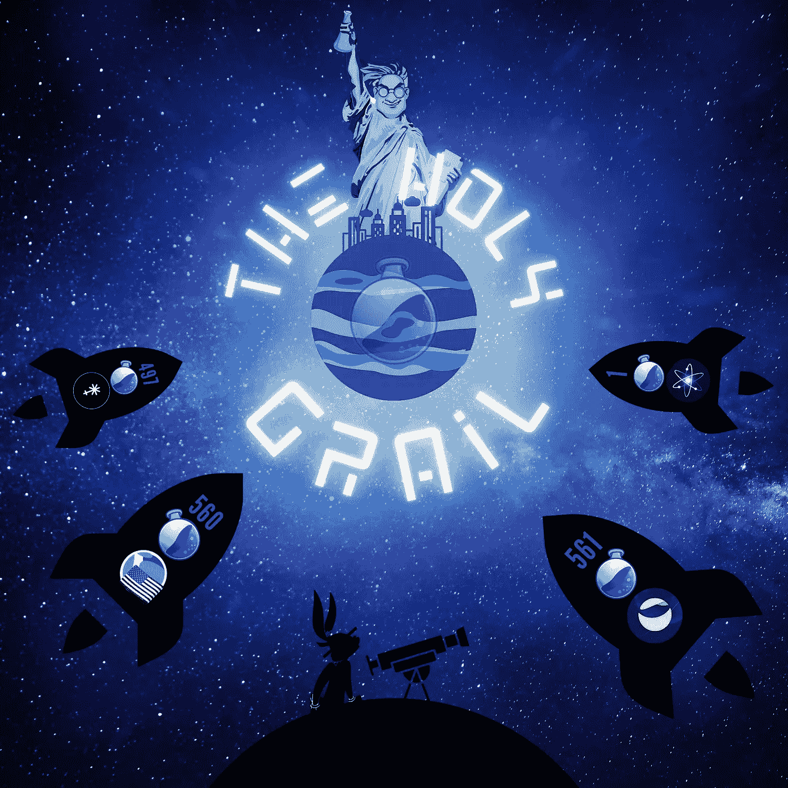
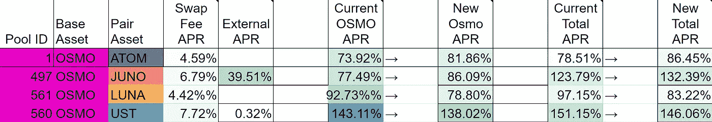
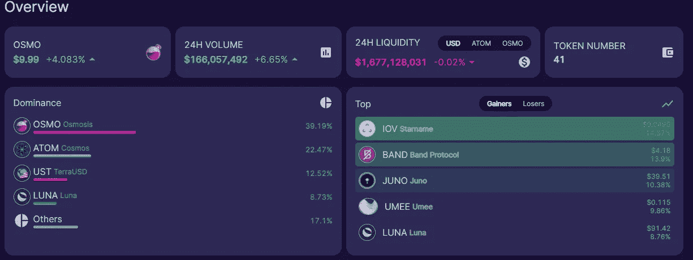
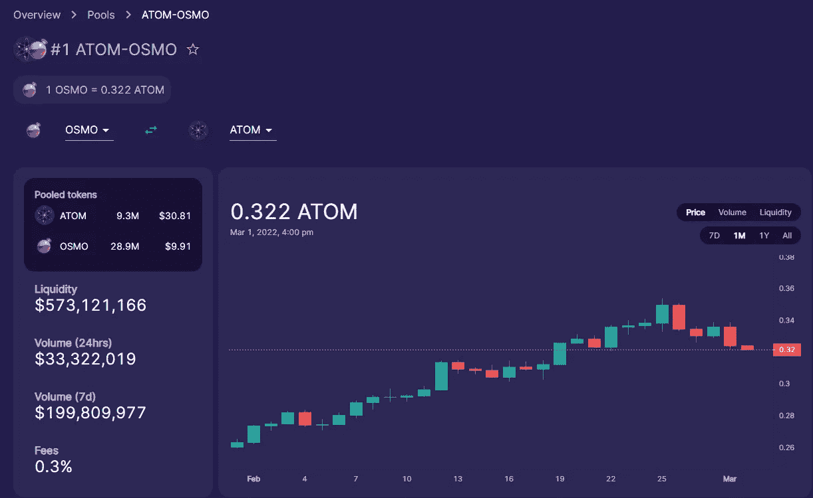
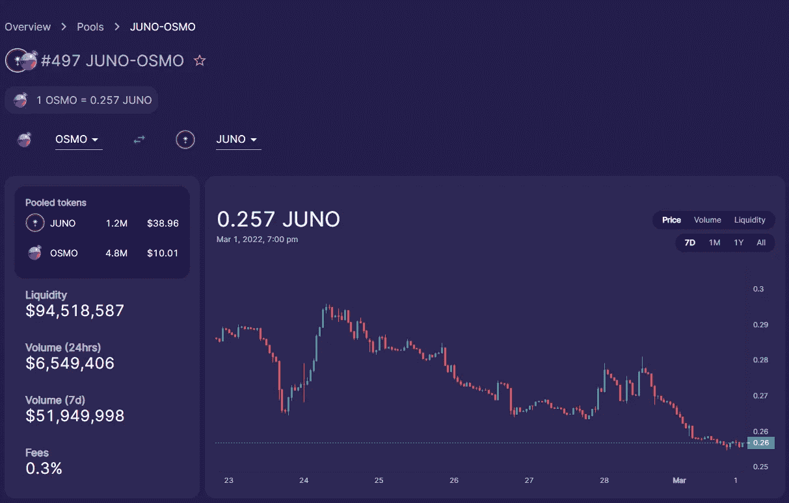
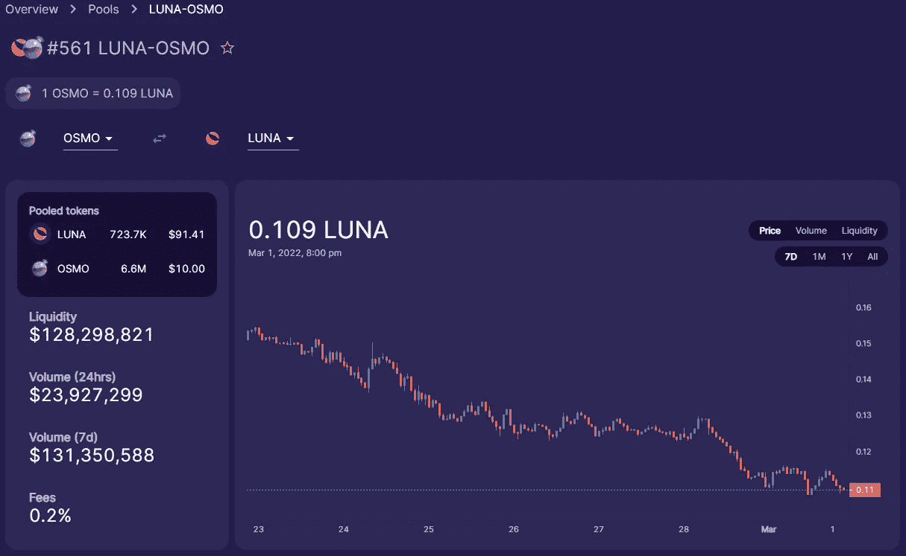
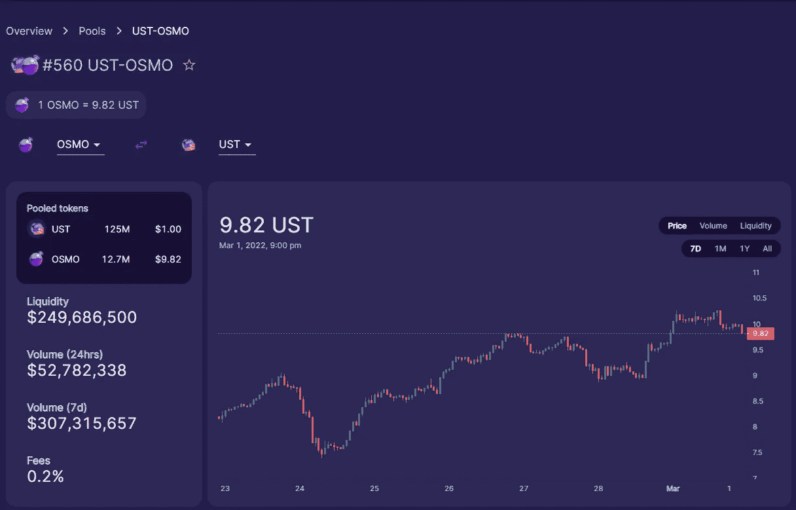
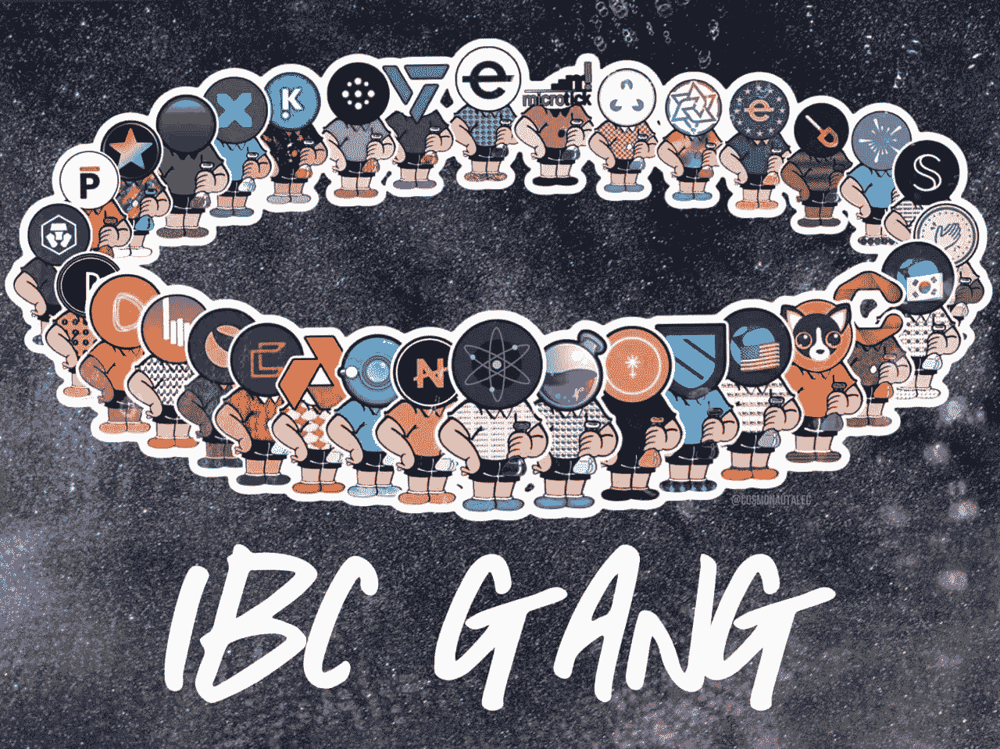

# 加密中 LP 池的圣杯

> 原文：<https://medium.com/coinmonks/the-holy-grail-of-lp-pools-in-crypto-a77219154352?source=collection_archive---------2----------------------->

[Osmosis Zone](https://app.osmosis.zone/)

如果你没有意识到$ATOM，$OSMO，$LUNA，$JUNO 和$UST 是所有市值最高的 70 种硬币中的一种。在渗透区，你可以用这些代币进入各种配对，并通过易用性、无汽油费和尊重每个时代的 APR%来潜在地改变你的生活。

# “早起的鸟儿有虫吃”

我个人比较喜欢的如下:池 1: ATOM / OSMO，池 497: JUNO/ OSMO，池 561: LUNA/ OSMO 和荣誉奖池 560: UST/OSMO。对我来说，这些是位于渗透区的顶级$OSMO 成对水池。对于 token/eco 系统的质量以及神奇的 APR%来说，这些都是显而易见的:(并不是说他们不是渗透中列出的其他人)

[Live Osmosis Spreadsheet](https://docs.google.com/spreadsheets/d/1iykeJ13ysTwo6oA-9xwQWXOZTzdiQOy6CyZFp4Vv2Ww/edit?pli=1#gid=9186761)

你可能会问，为什么是荣誉奖？嗯，就我个人而言，我不倾向于与 UST 配对，因为我太看好 IBC，我不想得到一堆 UST，以防基础资产令牌泵硬；然而，不可否认的是，UST 配对提供了灵活性和实用性，所以它不得不榜上有名。目前，在编写本报告时，渗透区内锁定的总价值为 1，677，128，031 美元。

**池#1 原子/渗透:**渗透区的第一个池；此外，所有加密中的第一个池有资格获得[超级流体赌注](/osmosis-community-updates/what-is-superfluid-staking-b771aba2dafc)。

[Pool #1](https://info.osmosis.zone/pool/1)

**Pool # 497 JUNO/OSMO:****Crypto 中第一个拥有两个令牌的 Pool 突破前 100 个令牌，而没有在集中交易所上市*。这确实是一个非凡的壮举，因为没有一个令牌在没有集中交易所上市的情况下能够进入前 100 名。《渗透地带》自 2021 年 7 月 19 日开播以来已经制作了两部。此外，该池还为另外 42 个纪元(天)提供$ Juno 外部激励。*

***免责声明:**任何代币都不会为代币在任何集中交易所上市支付或已经支付上市费或贷款。IBC 是没有许可的，所以如果有人想购买代币，然后列表，然后它是什么。*

**

*[Pool #497](https://info.osmosis.zone/pool/497)*

***561 号池 LUNA / OSMO:** Terra 无需介绍；目前在所有的加密技术中排名第七，并且随着疯子每天都在增长，即将超过$XRP 军队！在我看来，最好的还没有到来，因为他们的 UST 燃烧机制是加密中第一个真正分散的稳定硬币。真的，我坚信 **Luna 才是真正的价值储存体**。对，我说的是比特币 Maxi 的，对不起，不是对不起。*

**

*[Pool #561](https://info.osmosis.zone/pool/561)*

*最后，荣誉奖:*

***560 号池 UST /奥斯莫:**反渗透领域第二大 TVL 池，日交易量和周交易量最高，总回报率接近 146%，吸引了众多投资者。*

**

*[Pool #560](https://info.osmosis.zone/pool/560)*

***最后的想法**:很快，渗透区将会有数十亿的 TVL，平均每天超过十亿美元的交易量。尤其是当你考虑到 IBC 的快速发展时；更不用说，桥接解决方案将允许 IBC 以外的所有大公司参与最好的 AMM DEX 加密。很快、瑞士联邦理工学院、、戴、索尔、AVAX、MATIC 等将上市。*

***渗透区正在酝酿与大型集中交易所竞争。***

**

> *加入 Coinmonks [电报频道](https://t.me/coincodecap)和 [Youtube 频道](https://www.youtube.com/c/coinmonks/videos)了解加密交易和投资*

# *另外，阅读*

*   *[Bookmap 评论](https://coincodecap.com/bookmap-review-2021-best-trading-software) | [美国 5 大最佳加密交易所](https://coincodecap.com/crypto-exchange-usa)*
*   *最佳加密[硬件钱包](/coinmonks/hardware-wallets-dfa1211730c6) | [Bitbns 评论](/coinmonks/bitbns-review-38256a07e161)*
*   *[新加坡十大最佳加密交易所](https://coincodecap.com/crypto-exchange-in-singapore) | [购买 AXS](https://coincodecap.com/buy-axs-token)*
*   *[红狗赌场评论](https://coincodecap.com/red-dog-casino-review) | [Swyftx 评论](https://coincodecap.com/swyftx-review) | [CoinGate 评论](https://coincodecap.com/coingate-review)*
*   *[投资印度的最佳密码](https://coincodecap.com/best-crypto-to-invest-in-india-in-2021)|[WazirX P2P](https://coincodecap.com/wazirx-p2p)|[Hi Dollar Review](https://coincodecap.com/hi-dollar-review)*
*   *[加拿大最佳加密交易机器人](https://coincodecap.com/5-best-crypto-trading-bots-in-canada) | [库币评论](https://coincodecap.com/kucoin-review)*
*   *[火币的加密交易信号](https://coincodecap.com/huobi-crypto-trading-signals) | [HitBTC 审核](/coinmonks/hitbtc-review-c5143c5d53c2)*
*   *[如何在 FTX 交易所交易期货](https://coincodecap.com/ftx-futures-trading) | [OKEx vs 币安](https://coincodecap.com/okex-vs-binance)*