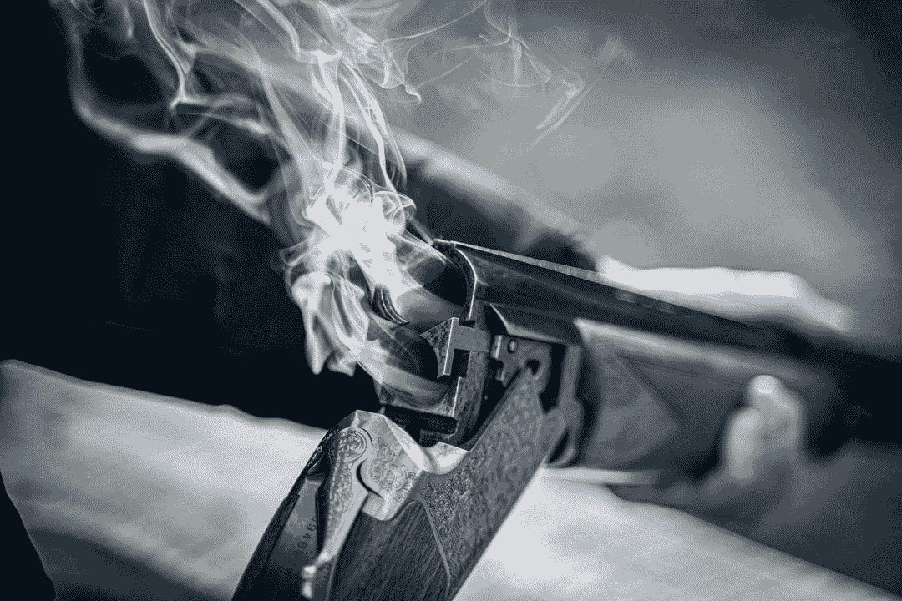
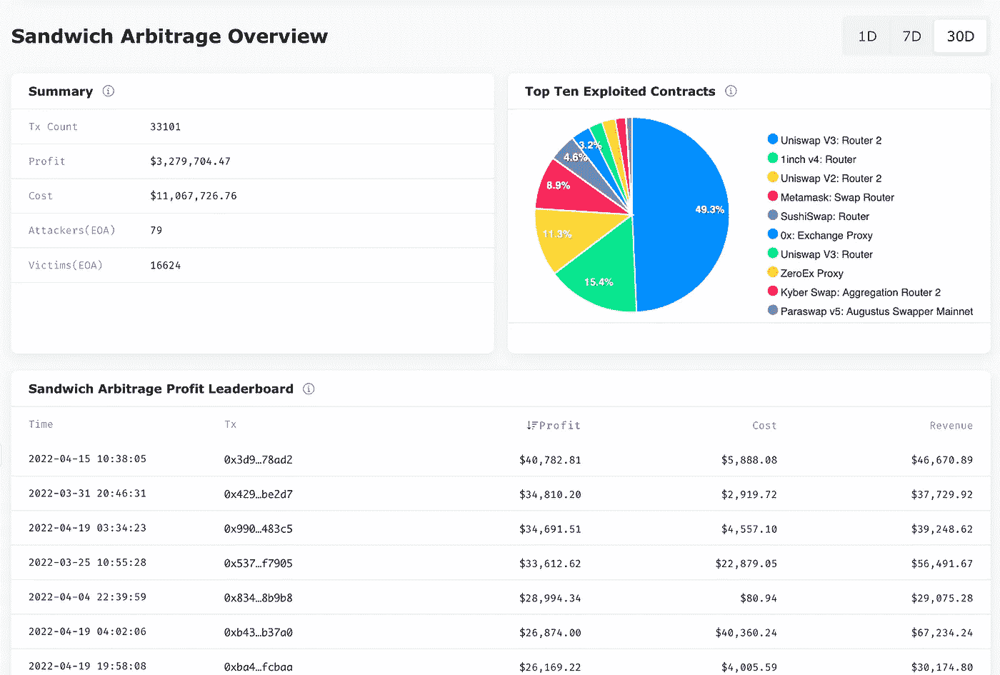
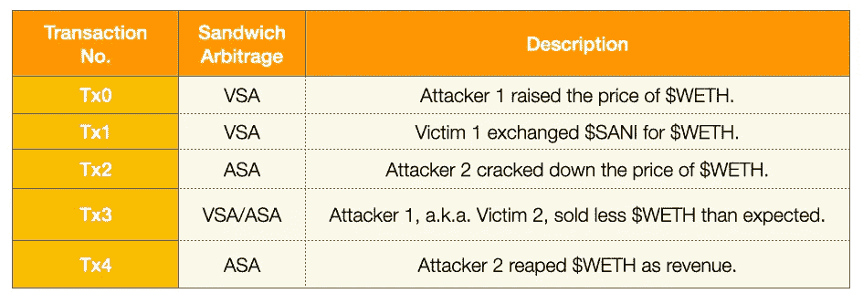
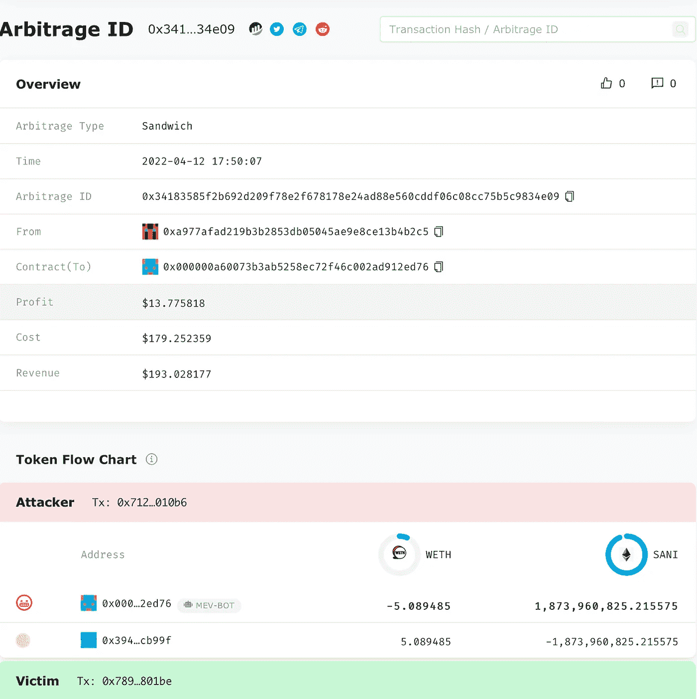
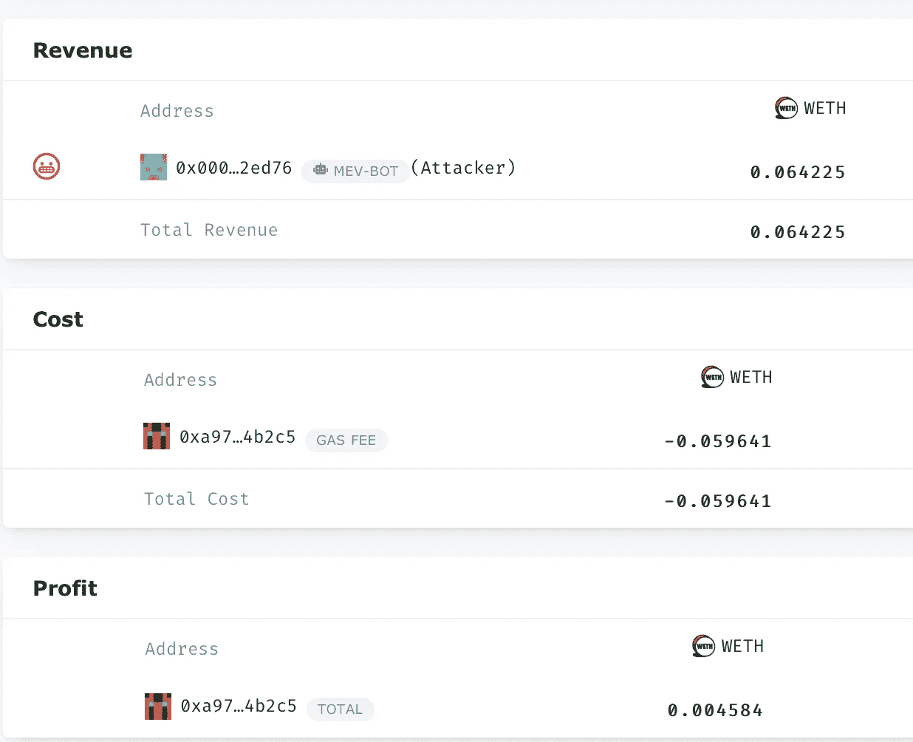
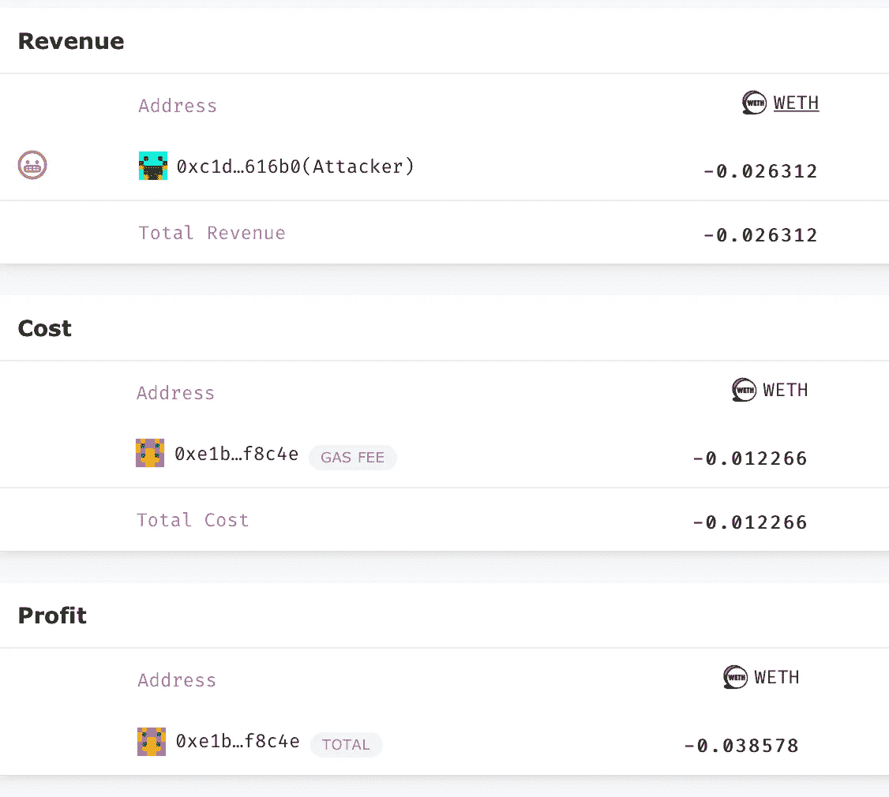
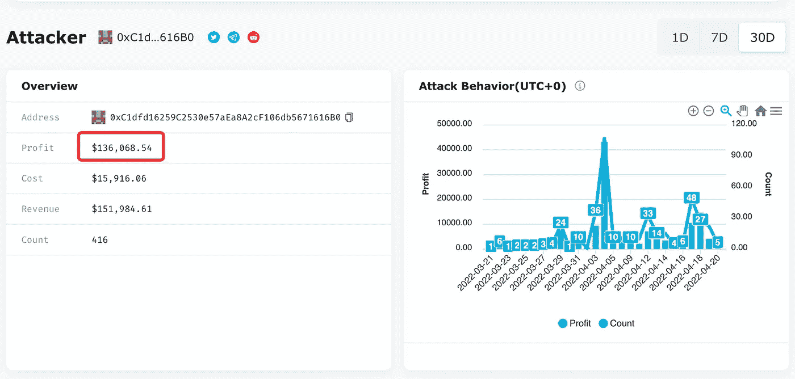
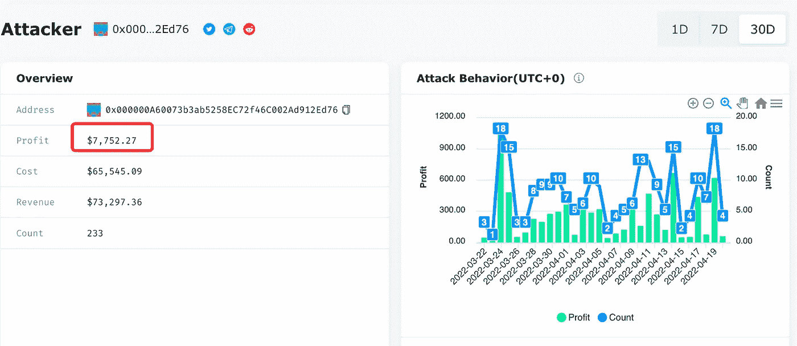
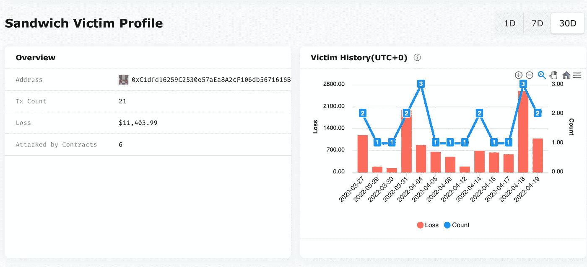

# 猎人正在被追捕:三明治袭击者之间的混战

> 原文：<https://medium.com/coinmonks/the-hunter-is-being-hunted-the-dogfight-among-sandwich-attackers-7918121b11ec?source=collection_archive---------15----------------------->

Photo by [Paul Einerhand](https://unsplash.com/@pauleinerhand) on [Unsplash](https://unsplash.com/)

# 关键要点

*   在 DeFi 中没有人能免受攻击。没有人。
*   一个正在攻击的三明治套利攻击者可以成为另一个攻击者挤压的目标。
*   油费和矿工小费是这些嵌入式三明治的原因。
*   保持利润与汽油费和矿工小费产生的套利成本之间的平衡至关重要。

在以太坊，并非所有的套利交易都是平等的。例如，空间套利、三角套利和组合套利提高了加密市场的效率。另一方面，领先套利，如华尔街的高频交易，利用日常交易者来使攻击者受益，攻击者也被称为搜索者。根据 CoinMarketCap 的报道，搜索者仅在以太坊一项就获得了近 6 . 08 亿美元。

然而，搜索者也可能成为其他搜索者的目标，换句话说，被夹在中间。

作为唯一独家的 DeFi MEV 套利大数据平台，EigenPhi 一直在积极监控并通过我们的[三明治套利模块](https://eigenphi.io/ethereum/sandwich)分享[对上述交易的见解](https://eigenphi.io/ethereum/sandwich)。在这里，您可以找到特定时间窗口的交易摘要、前 10 个被利用的合同、LP 和协议、利润套利排行榜、攻击者排行榜和受害者排行榜。

这一次，我们要告诉你一个由两个三明治套利和五个交易组成的故事，涉及三个参与者，包括两个攻击者和两个受害者，其中一个也是两个攻击者中的一个。而且这个故事的情节在以太坊上每天都在发生一两次。

让我们掀起窗帘。

## 分解三明治

以下是 https://eigenphi.io/.[和](https://eigenphi.io/.)的两个三明治套利交易

*   [受害者三明治套利](https://eigenphi.io/ethereum/tx/0x6376401651116b903218040bec913a84dd8b6b10beaeff157960d4f47d1916dc)。为了清楚起见，我们以后称它为 VSA。
*   [攻击者三明治套利](https://eigenphi.io/ethereum/tx/0x34183585f2b692d209f78e2f678178e24ad88e560cddf06c08cc75b5c9834e09)。我们以后称之为 ASA。

您可以单击两个受害者的链接来查看他们的受害者角色简介，这两个受害者是:

*   [受害者 1](https://eigenphi.io/ethereum/sandwich/victim/0xc7Fc22b468cF2Db45c60de458476d85a22CA6bE8) 想把$SANI 换成$WETH。
*   [受害者 2](https://eigenphi.io/ethereum/sandwich/victim/0xC1dfd16259C2530e57aEa8A2cF106db5671616B0) 也是攻击者，其[攻击者角色简介](https://eigenphi.io/ethereum/sandwich/attacker/0xC1dfd16259C2530e57aEa8A2cF106db5671616B0)是这里的，攻击了受害者 1。

您可以单击两个攻击者的链接来查看他们的攻击者角色配置文件，这两个攻击者是:

*   [攻击者 1](https://eigenphi.io/ethereum/sandwich/attacker/0xC1dfd16259C2530e57aEa8A2cF106db5671616B0) 就是上面的受害者 2。
*   [攻击手 2](https://eigenphi.io/ethereum/sandwich/attacker/0x000000A60073b3ab5258EC72f46C002Ad912Ed76) 就是把攻击手 1 夹在 ASA 里的那个。

下面的描述将省略一些代币交易细节，以更清楚地描述整个展览。你可以阅读我们的[三明治详细介绍](https://eigenphi.substack.com/p/introducing-sandwich-arbitrages-discovering?s=w)和[剖析一个$APE 相关三明治](https://eigenphi.substack.com/p/warning-keep-your-ape-away-from-the?s=w)套利。

下表按时间顺序显示了攻击是如何发生的。

*   这一切都始于 1 号受害者用$SANI 换$WETH 的意图。
*   在 ASA 中，攻击者 1 在[块 14573295](https://etherscan.io/block/14573295) 的内存池中发现了受害者 1 的计划，并首先部署了一个事务来利用受害者 1。我们将这个事务标记为 Tx0，将受害者 1 的事务标记为 Tx1。
*   在三明治套利中，攻击者使用两次交易来压榨受害者。因此，攻击者 1 分派了另一个事务 Tx3 来完成挤压。
*   但是攻击者 1 并不知道攻击者 2 已经在 [block 14573295](https://etherscan.io/block/14573295) 的 mempool 中看到了 Tx3，并先部署了 Tx2 来压榨 Tx3。在 Tx3 之后，攻击者 2 部署了 Tx4，完成了仲裁。

通过基于交易发生时的$WETH 价格进行计算，攻击者 2 收获了$13.775818 作为收入，扣除了$179.252359 汽油费成本。说到攻击者 1，这个可怜的家伙损失了 36.865717 美元的汽油费和价值 79.082086 美元的 WETH。

The Attacker Sandwich Arbitrage Detail Page

为什么三明治攻击者会成为三明治套利的受害者？与攻击者 2 提供的较高的汽油费/矿工小费 0.059641 $WETH 相比，攻击者 1 提供的汽油费/矿工小费 0.012266 $WETH 似乎较少。

Attacker 2’s Gas Fee.

Attacker 1’s Gas Fee

但这还不是故事的全部。

## 打了败仗却赢得了战争？

更高的汽油费策略可能有助于挤压另一个三明治攻击者一次。但从长远来看，它可能会带来更少的利润。

在 https://eigenphi.io/[的](https://eigenphi.io/)上打开攻击者 1 的[攻击者档案](https://eigenphi.io/ethereum/sandwich/attacker/0xC1dfd16259C2530e57aEa8A2cF106db5671616B0)，选择 30D 作为时间窗口；你可以看到这一时期的利润超过 13.6 万美元。416 次套利的成本是 15，916.06 美元。

另一方面，看看[攻击者 2 的攻击简介](https://eigenphi.io/ethereum/sandwich/attacker/0x000000A60073b3ab5258EC72f46C002Ad912Ed76):

在过去的 30 天里，攻击者 2 的成本在 233 次套利中已经超过 65，000 美元，从而将利润拉低至 7，752.27 美元。所以这家伙没有受害者那么有利可图！

然而，在同一时间段，在[https://eigenphi.io/](https://eigenphi.io/)上没有记录关于攻击者 2 的受害者历史。

攻击者 1 的[受害者历史](https://eigenphi.io/ethereum/sandwich/victim/0xC1dfd16259C2530e57aEa8A2cF106db5671616B0)怎么样？

原来，攻击者 1 在 21 次三明治套利攻击中损失了 11，000 美元。尽管如此，除了[输掉了嵌入式三明治战役](https://eigenphi.io/ethereum/tx/0x34183585f2b692d209f78e2f678178e24ad88e560cddf06c08cc75b5c9834e09)之外，攻击者 1 在钳形战中仍然做得更好。

那么，谁会笑到最后呢？但遗憾的是，尘埃尚未落定。

## 在黑暗的森林中，没有人是刀枪不入的

总之，在迪菲的黑暗森林里，每个人都可能成为目标，不管你是谁，甚至是三明治袭击者。为了避免被攻击，向矿工行贿可能会有所帮助。别忘了使用 [flashbots 的捆绑包](https://docs.flashbots.net/flashbots-auction/searchers/advanced/bundle-pricing)。也就是说，找到被攻击和利润最大化之间的细微差别很重要，但几乎不可能。

如果你有兴趣了解更多关于斗狗的事情，请查看我们在 https://eigenphi.io/.的[三明治套利模块](https://eigenphi.io/.)。你可以给 contact@eigenphi.com 发邮件或者发微博告诉我们你的发现。

打猎愉快！(不是被追杀！)

跟随我们通过这些来挖掘更多隐藏的 DeFi 的智慧:

*   [EigenPhi 的推特](https://twitter.com/eigenphi)
*   [EigenPhi 的推特 MEV 预警](https://twitter.com/eigenphi_alert)
*   [子栈](https://eigenphi.substack.com/)
*   [中等](/@eigenphi)
*   [Mirror.xyz](https://mirror.xyz/0xc19565163aFdEe3783FC970E4Bd0275B11848d34)
*   [电报](https://t.me/WisdomOfDeFi)
*   [不和谐](https://discord.com/invite/JXD8cyzR2a)
*   [杂志](https://www.getrevue.co/profile/EigenPhi)

> 加入 Coinmonks [电报频道](https://t.me/coincodecap)和 [Youtube 频道](https://www.youtube.com/c/coinmonks/videos)了解加密交易和投资

# 另外，阅读

*   [最好的卡达诺钱包](https://coincodecap.com/best-cardano-wallets) | [Bingbon 副本交易](https://coincodecap.com/bingbon-copy-trading)
*   [印度最佳 P2P 加密交易所](https://coincodecap.com/p2p-crypto-exchanges-in-india) | [柴犬钱包](https://coincodecap.com/baby-shiba-inu-wallets)
*   [八大加密附属计划](https://coincodecap.com/crypto-affiliate-programs) | [eToro vs 比特币基地](https://coincodecap.com/etoro-vs-coinbase)
*   [最佳以太坊钱包](https://coincodecap.com/best-ethereum-wallets) | [电报上的加密货币机器人](https://coincodecap.com/telegram-crypto-bots)
*   [交易杠杆代币的最佳交易所](https://coincodecap.com/leveraged-token-exchanges) | [购买 Floki](https://coincodecap.com/buy-floki-inu-token)