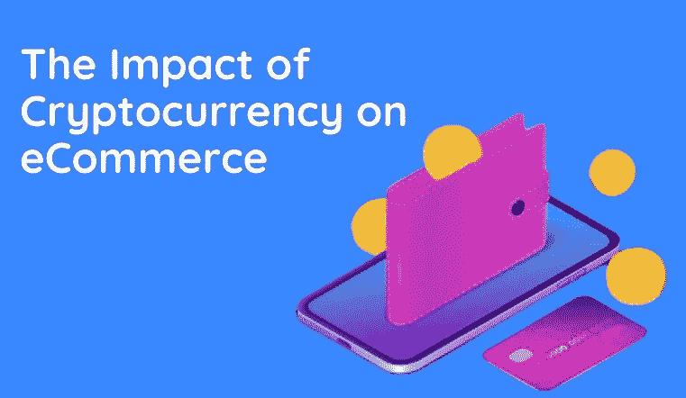

# 加密货币对电子商务的影响

> 原文：<https://medium.com/coinmonks/the-impact-of-cryptocurrency-on-ecommerce-7f95cf9681d7?source=collection_archive---------66----------------------->

> 加密货币是过去五年最热门的技术趋势之一。虽然[电子商务](https://www.zegashop.com/web/10-ecommerce-trends-for-2022/)多年来一直是数字世界的一个重要特征，但疫情大大加速了[全球](https://www.zegashop.com/web/essential-tips-for-growing-your-business/)[电子商务](https://www.zegashop.com/web/trends-that-will-change-the-ecommerce/)市场的增长(从 2019 年的 3.354 万亿美元到 2021 年的 4.981 万亿美元！).
> 被许多人戏称为**“互联网的活力二重奏”**，电子商务和加密货币占据了同一个[数字世界](https://www.zegashop.com/web/the-metaverse-and-ecommerce-how-ecommerce-engage-in-metaverse/)，它们是数字发展新时代的开端。如果你想了解更多关于加密货币和电子商务之间的联系，请继续阅读。

**加密货币改变电子商务行业的三种方式**

**市场扩张**

调整你的平台，允许人们使用他们的加密钱包进行支付，可以扩大你的目标市场，并带来新客户流量的增加。

**区块链在电子商务中的应用**

接受加密货币作为支付手段是一个有风险的步骤。然而，降低成本是区块链的一个重要特征。这就是为什么许多供应商使用区块链来避免文书工作。与传统竞争对手相比，不断增长的加密货币爱好者社区更有可能从加密货币提供商那里购买，反之亦然。

**安全性提高**

你知道你的银行信息比你的电子钱包数据更容易被窃取吗？密码是分散的，但受到保护，没有人能够攻击它们或进行某种形式的伪造。

> 如今加密货币无处不在。加密货币现在在全球交易中获得了更多的关注。电子商务零售商将受益于考虑加密货币交易的未来，因为它可能比以前想象的更近。

> *加入 Coinmonks* [*电报频道*](https://t.me/coincodecap) *和* [*Youtube 频道*](https://www.youtube.com/c/coinmonks/videos) *了解加密交易和投资*

# 另外，阅读

*   [Bookmap 评论](https://coincodecap.com/bookmap-review-2021-best-trading-software) | [美国 5 大最佳加密交易所](https://coincodecap.com/crypto-exchange-usa)
*   最佳加密[硬件钱包](/coinmonks/hardware-wallets-dfa1211730c6) | [Bitbns 评论](/coinmonks/bitbns-review-38256a07e161)
*   [新加坡十大最佳加密交易所](https://coincodecap.com/crypto-exchange-in-singapore) | [购买 AXS](https://coincodecap.com/buy-axs-token)
*   [红狗赌场评论](https://coincodecap.com/red-dog-casino-review) | [Swyftx 评论](https://coincodecap.com/swyftx-review) | [CoinGate 评论](https://coincodecap.com/coingate-review)
*   [投资印度的最佳密码](https://coincodecap.com/best-crypto-to-invest-in-india-in-2021)|[WazirX P2P](https://coincodecap.com/wazirx-p2p)|[Hi Dollar Review](https://coincodecap.com/hi-dollar-review)
*   [加拿大最佳加密交易机器人](https://coincodecap.com/5-best-crypto-trading-bots-in-canada) | [库币评论](https://coincodecap.com/kucoin-review)