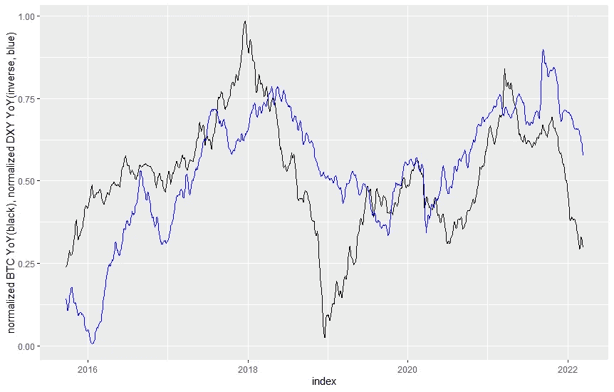
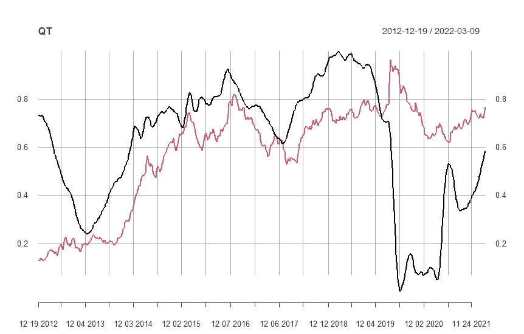
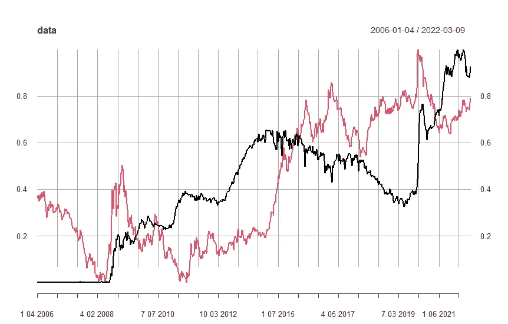
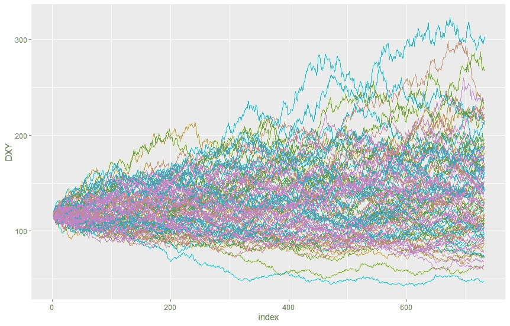
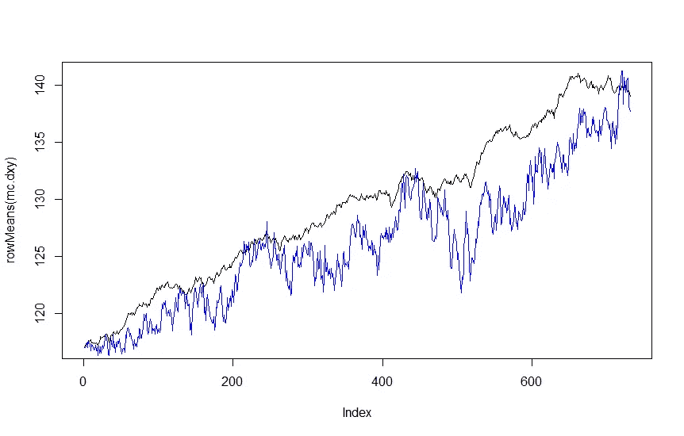
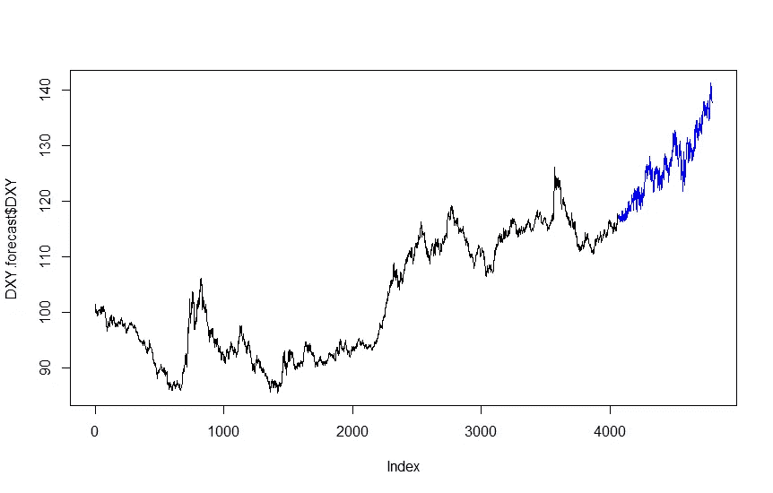
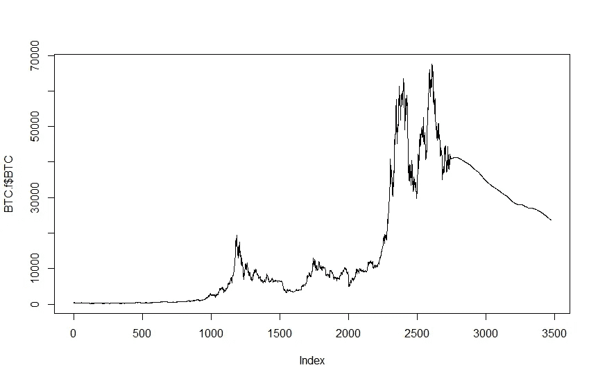
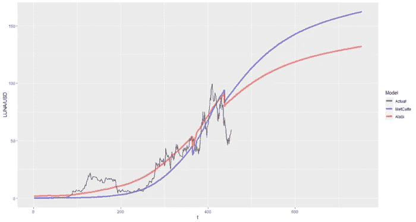
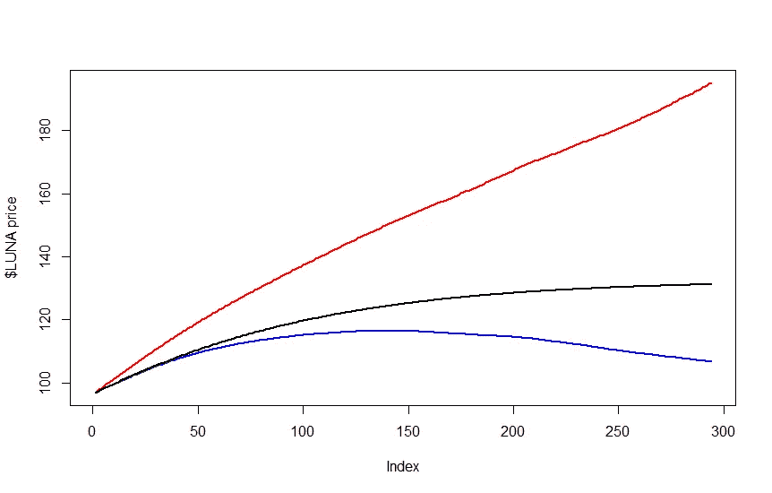

# QT 对 BTC 和露娜的影响

> 原文：<https://medium.com/coinmonks/the-impact-of-qt-on-btc-and-luna-3ea0e56f1160?source=collection_archive---------38----------------------->

现在是动荡时期，我们必须为熊市做好准备。但是它能有多熊呢？即使我们知道有什么东西在追我们，如果我们知道什么在追我们，我们也不能做好准备。

TaschaLabs 在她的[精彩文章](https://taschalabs.com/this-is-the-single-most-important-macro-factor-that-affects-crypto/)中指出，美元指数(DXY)是比特币价格(BTC)的最强指标。

normalized BTC YoY Return (black), noramlized DXY YoY Return (inverted, blue)

正如我们所观察到的，“DXY 的倒数”与 BTC 的价格密切相关。更准确地说，DXY 的同比变化与 BTC 价格的同比变化呈负相关。因此，如果我们能够以某种方式预测美元指数，我们就会知道 BTC 价格路径的模糊概念。

现在，给我们带来另一个有趣的情节。

normalized FED holdings of Treasures YoY Change (inverted, black), normalized DXY (green)

上图显示了 QT 对 DXY 的影响，这种影响相当直接:QT 强化了 DXY。

我们知道两种关系。

*   高 DXY =低 BTC
*   QT =高 DXY

然后，如果我们知道 QT 对 DXY 的影响程度，也许我们可以推导出 BTC 的理论价格路径。

normalized FED Treasury Holdings (black), normalized DXY (green)

由于数字是归一化的，该图在幅度方面可能有点误导，但 2014 年 QT 的触发导致 DXY 在两年内增加了约 21%。

# **DXY 模型**

称之为“典范”有点尴尬，但我会处理好的。

通过查看数据，我们可以确定

*   QT 会导致 DXY 在 2 年内增加大约 21%，因此 g = 0.21/730
*   去年 DXY 波动率为 0.014，所以 s = 0.014
*   我们知道，美联储将在今年 6 月启动 QT

现在我们将运行 100 次蒙特卡洛模拟，以查看 DXY 在 g = 0.21/730，s = 0.014 时的可能路径。

The Monte Carlo Simulation for DXY

我们将取每个时间段(指数)的中间值，并将其用作基本 DXY 路径。

averaged value (black), median value (blue)

所以蓝线将是我们的 DXY 值预测。

DXY path (black = actual value, blue = forecasted value)

如果我们对 BTC 的同比变化与 DXY 的同比变化进行简单回归，我们得到-6.5，这意味着 DXY 每年增长 1%会导致 BTC 每年下降 6.5%。

我们已经模拟了 DXY 的每日数据，因此我们将假设 BTC 价格将按照 DXY 的百分比变化而变化* -6.5%/365。

我们将做另一个假设，BTC 的长期趋势是乐观的，所以如果其他条件不变，BTC 将“每年增长 20%”。

现在我们可以计算 BTC 的价格路径。

BTC price path

指数 2700 左右的平滑线是我们两年来模拟的 BTC 价格。

不，现在我们将从我们之前的[帖子](/coinmonks/the-fundamental-valuation-framework-for-cryptoassets-part-1-5-luna-ca5f21e14664)中带来我们的露娜模型。

LUNA price function

对于“阿拉比”案例，我们将通过降低 BTC 价格来调整分子(LUNA 市值),通过增加熊市期间稳定的货币优势来调整分母(LUNA 流通供应量)。

对于分子，我们将通过 BTC * 0.6 的变化来降低它。LUNA 最近已经与 BTC 的价格脱钩，但仍然与 BTC 相关。

方法简单。我们只是把我们的阿拉比模型作为我们的基本情况，并按比例缩小数字，我们有我们的熊市卢纳市值。

目前 LUNA 每天有 100 万次烧伤，但我们可以有把握地假设，今年它的烧伤率将下降到每天 50 万次。

现在我们有了分子和分母，我们可以画出我们的 LUNA 价格路径。

Black = base case (Alabi), Blue = bear market w/ fixed supply, Red = bear market w/ decreasing supply

因此，如果月神的供应量保持不变，月神就会随着 BTC 的衰落而衰落。如果 TFL 能守住 UST 不断增长的需求，或许 LUNA 还有机会跑赢熊市。

这篇文章中的数字确实很模糊，缺乏理论背景，所以任何人都不应该把这篇文章当作投资建议。

但是，我们知道 QT = DXY 上涨= BTC 下跌，QT 对 DXY 的影响持续大约 2 年，我们需要为漫长的熊市做好准备。

LUNA 拥有出色的 stablecoin 设计，如果对 UST 的需求持续增长，它可能有机会在熊市中幸存下来；否则，它会像其他资产一样缩水。

感谢您阅读这篇文章，如果您想为未来的写作提出任何具体的主题/生态系统/令牌，请随时在此回复。

> 加入 Coinmonks [电报频道](https://t.me/coincodecap)和 [Youtube 频道](https://www.youtube.com/c/coinmonks/videos)了解加密交易和投资

# 另外，阅读

*   [氹欞侊贸易评论](https://coincodecap.com/anny-trade-review) | [霍比保证金交易](/coinmonks/huobi-margin-trading-b3b06cdc1519)
*   [分散交易所](https://coincodecap.com/what-are-decentralized-exchanges) | [比特 FIP](https://coincodecap.com/bitbns-fip) | [Pionex 评论](https://coincodecap.com/pionex-review-exchange-with-crypto-trading-bot)
*   [用信用卡购买密码的 10 个最佳地点](https://coincodecap.com/buy-crypto-with-credit-card)
*   [最好的卡达诺钱包](https://coincodecap.com/best-cardano-wallets) | [Bingbon 副本交易](https://coincodecap.com/bingbon-copy-trading)
*   [印度最佳 P2P 加密交易所](https://coincodecap.com/p2p-crypto-exchanges-in-india) | [柴犬钱包](https://coincodecap.com/baby-shiba-inu-wallets)