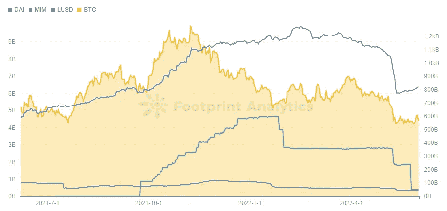
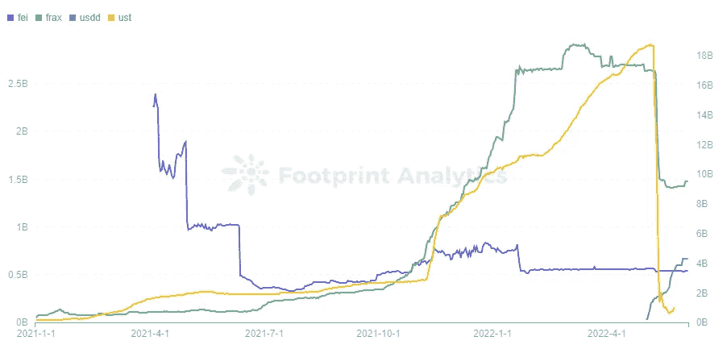

# UST 灾难对稳定的硬币生态系统的影响

> 原文：<https://medium.com/coinmonks/the-impact-of-the-ust-meltdown-on-the-stablecoin-ecosystem-32dac7cf84dc?source=collection_archive---------48----------------------->

# DeFi 市场建立在稳定的基础上，而 Terra-Luna 危机改变了环境，为一些协议提供了新的机会。

继 5 月 9 日崩盘后，曾经的第三大稳定币 UST 泰拉 USD 震动了整个稳定币市场。它没有像成千上万人预期的那样找到算法稳定的解决方案，而是在几个小时内暴跌为零。

正如所指出的，UST 失败是由于突然的大规模抛售，导致了过多的 Terra (LUNA)被铸造。尽管 UST 供应量迅速增加，但随着其价值暴跌，LUNA 未能将其重新锚定在 1 美元。

4 月，UST 的市值超过了币安美元(BUSD)，仅次于泰斯(USDT)和美元硬币(USDC)。尽管如此，崩溃发生得如此之快，以至于许多投资者甚至无法亏本支付。

这一事件引发了 DeFi 历史上最大的信任危机。稳定的玉米已经失去了稳定性。

另一方面，危机也带来了自身的一系列机遇。自 UST 以来，稳定的硬币市场发生了什么变化？

## 人们对系绳很警惕，对美元硬币越来越感兴趣。

整个稳定的货币市场的近 80%由 USDT 和 USDC 组成。

每发行一次 USDT，Tether 的银行账户就会以 1:1 的比例获得美元资金。USDC 是一种类似 USDT 的加密货币，由 Circle 发行。

USDT 是这两个项目中争议最大的一个。2021 年 10 月，它因缺乏公开性和美国监管机构因误导公众而多次罚款而受到媒体的广泛关注。

UST 暴跌后，人们很快想到了 USDT，其市值在不到一个月的时间里下降了 100 多亿美元，至 725 亿美元。

Curve 的 3pool(由戴、、组成)表示围绕这三个主要稳定点的市场情绪。

USDT 的份额此前一直保持在 20%至 30%之间。用户开始将他们的倒入池中，并随着 Terra Luna 的下降而切换到和戴。由于这种疯狂的抛售，USDT 达到了 83%的历史高点。

[caption id = " attachment _ 243627 " align = " align none " width = " 910 "]

足迹分析—以太坊中的曲线 3 池[/caption]

USDT 的价格在崩盘前一直徘徊在 1 美元左右，但跌至 0.996 美元，为近三个月低点。Tether 的 CTO Paolo ardo ino 在 Twitter 上透露，他们已经赎回了 70 亿美元，以帮助它重新获得美元锚，如果市场需要，他对自己在未来这样做的能力充满信心。

[caption id = " attachment _ 243628 " align = " align none " width = " 898 "]

足迹分析— USDT 价格趋势[/caption]

由于这一变化，USDT 在 3pool 中的份额在 6 月 5 日降至 61%，恢复了一些信任。

USDT 的市场资本总额下降了 100 亿美元，而它在整个稳定的货币市场中所占的比例却保持不变。

这就提出了一个问题，UST 的市场份额去了哪里。

根据足迹分析，USDC 受益最大，其市场估值从 483 亿美元跃升至 541 亿美元，市场份额从 27%上升至 34%。

[caption id = " attachment _ 243629 " align = " align none " width = " 785 "]

足迹分析 Stablecoin 的市值[/caption]

## 戴正在取得进展，而神奇的互联网钱是跌跌撞撞。

戴(Dai)、神奇的互联网货币(MIM)和 Liquity (LUSD)是过度抵押的稳定存款的例子，它们是通过将超过 1:1 比例的非稳定存款作为抵押品存入协议而产生的。

UST 的减少对这些过度抵押的货币有间接的影响。戴和 MIM 的市值分别下降了 20 亿美元，但这种负面趋势始于 5 月 6 日，即 UST 崩盘之前。

[caption id = " attachment _ 243630 " align = " align none " width = " 908 "]

足迹分析——超额抵押稳定币与 BTC 市值的对比[/caption]

MIM 由 yvDAI 等有息资产抵押，而 DAI 通常由比特币(BTC)和以太坊(ETH)抵押。当大多数加密货币的价格暴跌时，作为抵押品的过度抵押的稳定货币也会暴跌。

BTC 目前的衰退影响了加密货币的价格，这再次与美国经济联系在一起。为了对抗通货膨胀，美联储提高了利率，导致美股下跌。纳斯达克 100 指数同样显示出强劲的下跌趋势。

根据 Footprint Analytics 的数据，在 2021 年 7 月之前，比特币的价格基本上与纳斯达克 100 指数无关，但这种联系随后变得更强。虽然加密货币最初是用来对冲风险的，但它现在似乎是股票市场的高杠杆对手。

[caption id = " attachment _ 243631 " align = " align none " width = " 897 "]

足迹分析— BTC 股票价格与纳斯达克 100 指数的对比[/caption]

UST 下跌对过度抵押的稳定债券造成了又一次打击，因为 Terra founder Do Know 购买了大量 BTC 作为 UST 的保证金，给市场带来了更大的下行压力，促使更多人出于恐惧卖出 BTC。Do Know 拯救 UST 的策略失败导致比特币价格暴跌至近一年低点，使过度抵押的稳定比特币的清算变得复杂。

另一方面，戴的发行不仅使用瑞士联邦银行和作为抵押，还使用了相当数量的像和这样的稳定银行。因此，戴能够减轻影响。另一方面，MIM 正处于一个糟糕的困境，因为它的市值自 1 月份以来又下跌了 20 亿美元。
用算法稳定货币市场

UST 的脱钩摧毁了 stablecoins 算法刚刚获得的信心，而在 Waves chain 上使用类似方法的 USDN 价格在 5 月 11 日迅速脱钩至 0.8 美元，随后逐渐回升。

截至 6 月 5 日，价格尚未完全固定在 0.989 美元。正如足迹分析公司发现的那样，这不是 USDN 第一次被如此彻底地抛弃。

[caption id = " attachment _ 243632 " align = " align none " width = " 891 "]

足迹分析— USDN 价格趋势[/caption]

直到 5 月 9 日，市值与 UST 相当的 FRAX 也损失了 10 亿美元。FRAX 比完全算法稳定的硬币更稳定，因为它涉及 USDC 和 FXS 的铸造，USDC 作为抵押品，FXS 作为算法元素。尽管 FXS 的价格下跌，但 FRAX 的市场估值下降到 14 亿美元，从而实现了反弹。

[caption id = " attachment _ 243633 " align = " align none " width = " 902 "]

足迹分析——算法稳定币市值[/caption]

FEI 允许用户以 1 美元的资产发行 stablecoins，目前的抵押率为 168%，以太坊约占该协议资产的 70%。拥有 5 亿美元的市值，费的股票并没有受到什么影响。

当其他 stablecoin 失去市值时，Tron 的 USDD stablecoin 截至 6 月 5 日以 6.7 亿美元的市值超过了 FEI，使 Tron 成为继以太坊和 BSC 之后的第三大 TVL 连锁店。

用户根据安全性和盈利能力选择稳定的信用卡，UST 的成功就是明证。尽管 USDD 针对 UST 进行了优化，但 TRON DAO Reserve 管理其发行、燃烧和一级市场活动，普通用户只能在二级市场上交易 USDD。因此，USDD 的稳定性主要取决于 TRON DAO 保留区及其批准的白名单，而不是算法。

结果，用户的信任从算法变成了 TRON DAO 保留。USDD 还提供 30%的固定利率，这对客户很有吸引力。

## 摘要

当 UST 崩溃的时候，稳定的硬币市场遭受了打击，一些协议，如 USDC 和 USDD，现在有了新的生命。

戴在过度圈层化的稳定圈里依然领先，与曾经占据统治地位的 MIM 之间的距离有所拉大。

USDT 仍然是一个令人担忧的问题，但迄今为止它已经渡过了难关。

**日期&作者:**2022 年 6 月 16 日，Simon@footprint.network

**数据来源:** [足迹分析 Stablecoins 后 UST 事件仪表盘](https://www.footprint.network/@DamonSalvatore/Stablecoins-after-the-UST-event?date=past360days&channel=ENG-260)

# 什么是足迹分析？

足迹分析是一个一体化的分析平台，用于可视化区块链数据和发现见解。它清理和整合链上数据，因此任何经验水平的用户都可以快速开始研究令牌，项目和协议。凭借一千多个仪表板模板和一个拖放界面，任何人都可以在几分钟内构建自己的定制图表。发掘区块链数据，利用足迹进行更明智的投资。

[https://thisdaycrypto . com/the-impact-of-the-ust-meltdown-on-the-stable coin-ecosystem/](https://thisdaycrypto.com/the-impact-of-the-ust-meltdown-on-the-stablecoin-ecosystem/)

*   [足迹网站](https://www.footprint.network/?cnl=cryptoslate)
*   [不和](https://discord.gg/3HYaR6USM7)
*   [推特](https://twitter.com/Footprint_DeFi)
*   [电报](https://t.me/joinchat/4-ocuURAr2thODFh)
*   [YouTube](https://www.youtube.com/channel/UCKwZbKyuhWveetGhZcNtSTg)

> 加入 Coinmonks [电报频道](https://t.me/coincodecap)和 [Youtube 频道](https://www.youtube.com/c/coinmonks/videos)了解加密交易和投资

# 另外，阅读

*   [Pionex 双重投资](https://coincodecap.com/pionex-dual-investment) | [AdvCash 审查](https://coincodecap.com/advcash-review) | [支持审查](https://coincodecap.com/uphold-review)
*   [面向开发者的 8 个最佳加密货币 API](https://coincodecap.com/best-cryptocurrency-apis)
*   [7 个最佳零费用加密交易平台](https://coincodecap.com/zero-fee-crypto-exchanges)
*   [最佳网上赌场](https://coincodecap.com/best-online-casinos) | [期货交易机器人](/coinmonks/futures-trading-bots-5a282ccee3f5)
*   [分散交易所](https://coincodecap.com/what-are-decentralized-exchanges) | [比特 FIP](https://coincodecap.com/bitbns-fip) | [宾邦评论](https://coincodecap.com/bingbon-review)