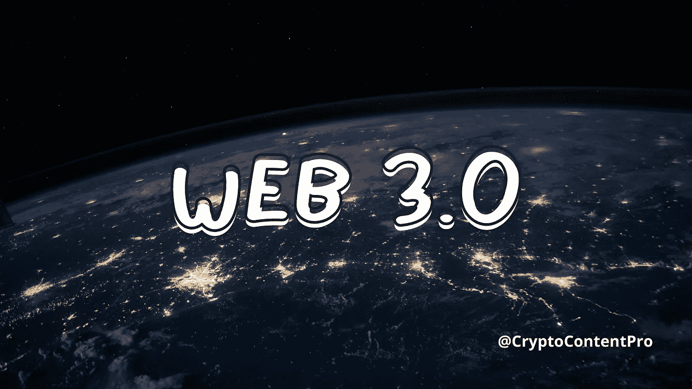

# 采用 Web 3.0 对 DAO 的影响

> 原文：<https://medium.com/coinmonks/the-impact-of-web-3-0-adoption-on-dao-7c6c7c4482f4?source=collection_archive---------5----------------------->

“变化是永恒的”这句话从来没有像现在这样正确过。

这尤其适用于像网络这样不断变化的环境。互联网并不总是像现在这样。

告诉你一个小事实:互联网已经发展了这么多年，而有些人并没有意识到这一点！

互联网的演进从一开始就一直在进行。

从 20 世纪 80 年代开始设计到现在，它已经经历了一些激动人心的变化。这些变化产生了它的新特点。你可能认为它们是标准的网页、社交媒体、电子商务网站，现在是 NFTs。

从 web 1.0 到现在的 web 3.0，网络发生了很大的变化。这就引出了一个至关重要的问题，什么是 web 3.0？

# 什么是 Web 3.0？

每个人，也许还有你，都在想的问题是:什么是 web 3.0，为什么它很重要？

Web 3.0 最初被 Web 的发明者 Tim Berner's-Lee 称为语义 Web。Web 3.0 是互联网的高级和改进版本，它利用了由区块链提供动力的去中心化。

简而言之，它是一个更智能的去中心化版本的网络。

Web 3.0 的想法令人兴奋，因为它是对之前存在的 web 2.0 和 1.0 缺点的改进。这意味着 web 3.0 解决了围绕透明度、隐私和安全性的问题。

Web 3.0 已经能够向我们呈现以前的 Web 所不能呈现的东西:NFTs 和去中心化的自治组织。

也许我应该先做一些关于 Dao 是什么的背景工作。

# 道是什么？

DAO 代表分散的自治组织。分散的意思是不受单一机构控制。

分散自治组织最初是由一组开发人员设计的，他们的主要目标是自动化决策。他们这样做的同时，允许来自世界任何地方的投资者匿名汇款，因此得名分散自治组织。

不多，即使去中心化的自治组织最近越来越受欢迎，但它们自 2016 年以来一直存在。Dao 受欢迎有两个主要原因:他们没有中央权威，他们通过自由和公平的投票做出决策。因此，允许每个人都有发言权。

刀说够了。

让我们深入探讨 web 3.0 的采用将如何影响组织。

# web 3.0 的采用将如何影响 DAO？

Web 3.0 承诺彻底改变用户在互联网上的操作。我将继续讨论 web 3.0 对 DAO 的影响。

## 金融服务业

采用 web 3.0 将对 DAO 产生的主要影响之一是显著改变获取投资机会的方式。web 3.0 的采用使得投资变得更加容易。它使人们有可能在没有合格投资者的情况下获得这些机会，甚至对净资产也没有限制。

web 3.0 和 DAOs 的相互关系为平台和业务的发展带来了一条革命性的道路，无需依赖传统的融资形式。

真的很简单。

Web 3.0 使 DAOs 能够让大规模的社区同步工作，即使没有权威或领导的存在。

现实情况是，web 3.0 对分散自治组织的影响如此之大，以至于它导致了开放、透明和无许可的通信，这意味着它将允许用户进行交互，而无需从管理机构或权威机构寻求许可。

如果你想知道这对金融业意味着什么，我会告诉你。这意味着可用的去中心化金融平台的数量将会激增。

## 非营利组织

Web 3.0 正在彻底改变气候保护的方式。有消息称，地球基金，一个分散的自治组织(由杰夫·贝索斯创建)，最近采用了 web 3.0。

这是一个巨大的飞跃，有助于该组织将每个人都纳入其气候保护的目标中。这样，不让一些人参与重要的讨论就不仅仅是一种规范了。

地球基金会采用 web 3.0 帮助他们实现了民主参与的目标。这使得投票过程透明，有助于"道"资助将产生最大影响的最有价值的项目。

Erath Fund 采用 web 3.0 使他们从其他几个气候保护组织中脱颖而出。

除了它们透明地资助气候保护项目这一事实之外，它们还能够在世界各地聚集成千上万的支持者。我可以大胆地说，它的 web 3.0 和区块链的采用在这一切中发挥了巨大的作用。

## 安全性

还值得注意的是，web 3.0 的采用提高了互联网运营的安全性。

让我解释一下…

你曾经和你不认识的人在网上合作过吗？你的答案很可能是肯定的。

DAOs 采用 web 3.0 的好处是，他们允许与陌生人进行安全的交互。这一点无论怎样强调都不为过，尤其是当它与委托或承诺用于不同目的的资金有关时，就像我强调的关于地球基金的项目资助的那一点。

# 包裹

有两条真理你应该带回家。

1.  web 3.0 对 DAOs 的影响跨越不同的领域/行业
2.  Dao 有爆发的潜力，尤其是在 2022 年。

你可以期待看到更多的 web 3.0 和 DAOs。许多这样的组织，如 Bankless、KilmaDao 和 MakerDao，目前已经非常受欢迎。

如果你已经注意到了，互联网的每个发展阶段都会带来一系列令人兴奋的特性。

Web 1.0 给我们带来了基本的网页，web 2.0 赋予了我们社交媒体平台，现在 web 3.0 又给我们呈现了令人惊叹的 NFTs 和 Dao。

我无法想象 web 4.0 能提供多少未知的东西。你也想知道吗？

> 加入 Coinmonks [电报频道](https://t.me/coincodecap)和 [Youtube 频道](https://www.youtube.com/c/coinmonks/videos)了解加密交易和投资

## 另外，阅读

*   [本地比特币审核](/coinmonks/localbitcoins-review-6cc001c6ed56) | [加密货币储蓄账户](https://blog.coincodecap.com/cryptocurrency-savings-accounts)
*   [什么是融资融券交易](https://blog.coincodecap.com/margin-trading) | [成本平均法](https://blog.coincodecap.com/dca)
*   [支持卡审核](https://blog.coincodecap.com/uphold-card-review) | [信任钱包 vs 元掩码](https://blog.coincodecap.com/trust-wallet-vs-metamask)
*   [Exness 回顾](https://blog.coincodecap.com/exness-review)|[moon xbt Vs bit get Vs Bingbon](https://blog.coincodecap.com/bingbon-vs-bitget-vs-moonxbt)
*   [如何开始用加密贷款赚取被动收入](https://blog.coincodecap.com/passive-income-crypto-lending)
*   [BigONE 交易所评论](/coinmonks/bigone-exchange-review-64705d85a1d4) | [电网交易 Bot](https://blog.coincodecap.com/grid-trading)
*   [氹欞侊贸易评论](https://blog.coincodecap.com/anny-trade-review) | [CoinSpot 评论](https://blog.coincodecap.com/coinspot-review)
*   [新加坡十大最佳加密交易所](https://blog.coincodecap.com/crypto-exchange-in-singapore) | [购买 AXS](https://blog.coincodecap.com/buy-axs-token)
*   [投资印度的最佳加密软件](https://blog.coincodecap.com/best-crypto-to-invest-in-india-in-2021) | [WazirX P2P](https://blog.coincodecap.com/wazirx-p2p)