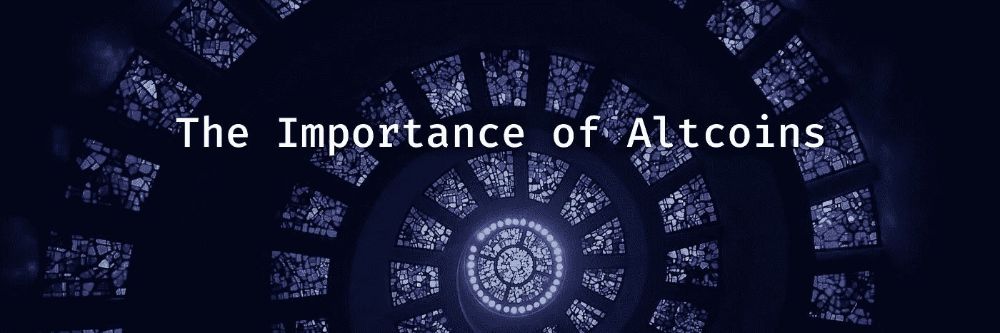
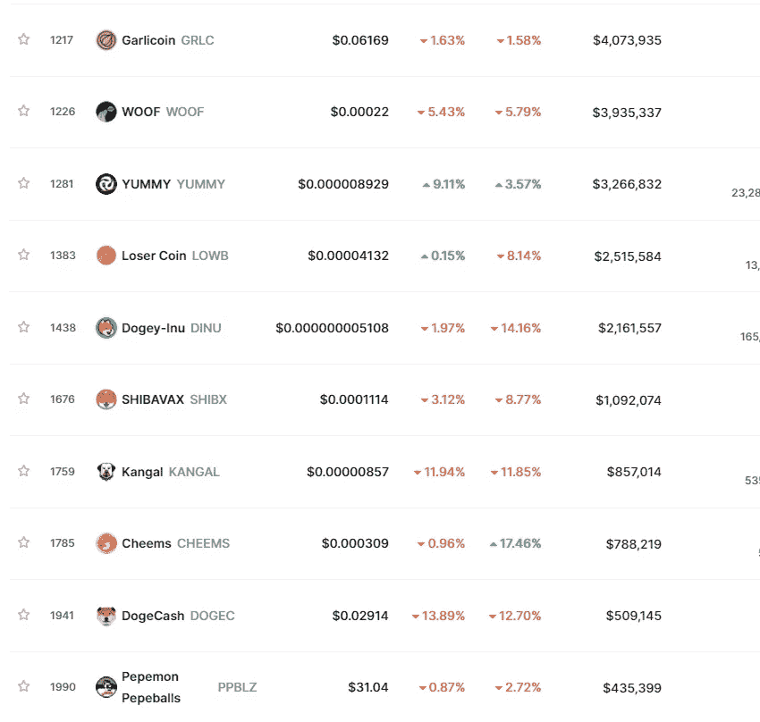

# 替代硬币的重要性

> 原文：<https://medium.com/coinmonks/the-importance-of-altcoins-6acd13081f52?source=collection_archive---------49----------------------->

## 我们知道，加密货币提供了一种新的交易和存储价值的方式。这就像网上银行，但钱是虚构的，代币无关紧要。

许多人不知道，如果他们没有把他们的*脑袋埋在甜蜜女士加密*的两腿之间，有多少加密货币。许多都有自己独特的属性和使用案例，许多都是副本的副本，只是有了新的名称和品牌。你听说过比特币，如果你没有听说过，你不可能在这里，你甚至可能听说过以太坊和 Doge——但 Crono 是什么？马蒂奇？Sus？poo(是)币？

比特币是开放的，这是吸引人的地方——你可以看到发生了什么，以及它是如何工作的。这使得更多的加密货币从 satoshi-vine 发芽，并为我们现在看到的生物多样性做出了贡献。**所有的技术都建立在巨人的肩膀上，而 crypto 则建立在德根斯的肩膀上**。现在任何人都可以用基本的知识和正确或错误的动机来制作一个代币。这就是 cryptos 如此令人兴奋的原因——每个人都有适合自己的东西！

你可以看看数以千计的替代硬币及其支持项目的列表，其中一些是长期沮丧的网站，只有空的电报频道，只有[机器人对着空的](https://www.reddit.com/r/SubredditSimulator/)低语，但许多替代硬币实际上非常重要。他们提供竞争并帮助保持空间的创新，他们为支持者创造支持项目的渠道，他们将迷因转化为金钱，他们允许任何有想法和独特令牌的人分享并获得国际社会的支持。创造代用币的能力使得非功能性交易成为可能。

那么，什么是山寨币呢？替代硬币只是替代加密货币。它们被称为“alt ”,因为它们是第一种也是最知名的加密货币区块链上主令牌的替代品。比特币不是 altcoin。Ether 不是 altcoin(在某一点上它可能是)，但是 SUS token 肯定是。有数以千计的替代币，并且新的替代币一直在被创造出来。

这些替代加密货币都建立在比特币的成功之上，并提供不同的功能或优势。例如，以太坊是构建去中心化应用的流行平台，而莱特币比比特币速度更快，可扩展性更强。

Monero 是最受欢迎的替代货币，因为它提供了其他加密货币所没有的隐私和安全功能。它很快在关注隐私的人群中流行起来。它在黑暗网络上相当大，不需要想为什么。

替代硬币保持加密货币空间的创新性和可访问性。如果没有他们，我们可能会在类似于****[**NFTs**](https://opensea.io/Lunifty)**[**搜索引擎**](https://presearch.org/)**[**赌博**](https://www.cloudbet.com/en/landing/bitcoin-bonus/?af_token=863db68189c0314774e3e584f1b675ea&aftm_landing_url=https://cloudbet.com/en/bitcoin-bonus&aftm_campaign=best-bitcoin-gambling-sites)**供应链追踪甚至 [**国家货币**](https://www.wsj.com/articles/a-global-first-bitcoin-as-national-currency-11623796143) **等事情上看不到多少进展。************

***** * *不要把自己买不起的东西投资在加密货币上。我们使用和支持加密货币是因为它的实用性，我们不是交易者或投资者。
一个 [**项目变得崎岖不平**](https://cointelegraph.com/explained/crypto-rug-pulls-what-is-a-rug-pull-in-crypto-and-6-ways-to-spot-it#:~:text=Rug%20pulls%20happen%20when%20fraudulent,decentralized%20finance%20(DeFi)%20exploit.) 你的资金也拿不回来，几乎没有问责。****

****想了解更多？****

****[不和](https://discord.gg/gAhRtjkAR3)
[推特](https://twitter.com/lunifty)
[insta gram](https://www.instagram.com/luniftyart/)
[luni fy . io](https://www.lunifty.io/)****