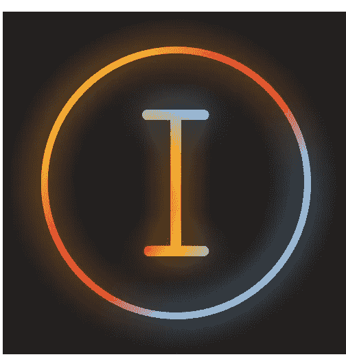
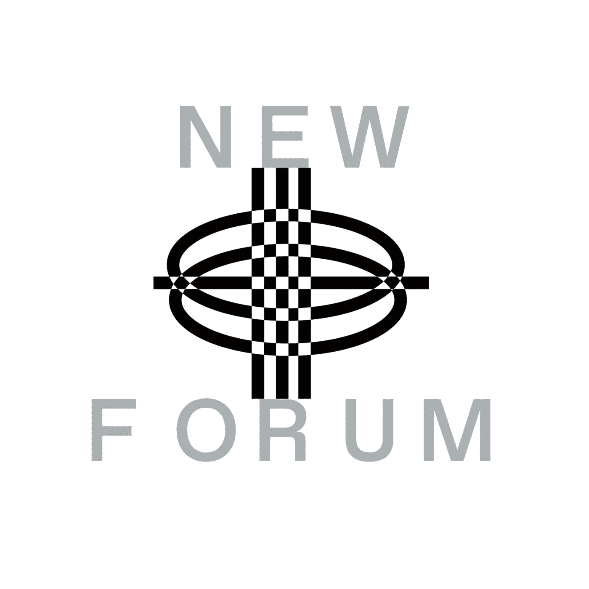

# Web3 中艺术家之间合作的重要性 Iteratoor 项目

> 原文：<https://medium.com/coinmonks/the-importance-of-collaboration-between-artists-in-web3-the-iteratoor-project-and-the-essential-a45dd5dece5f?source=collection_archive---------69----------------------->

我们的社区很高兴能邀请到 Iteratoor 项目的联合创始人 Chris Martz 和 Patrick Phelps-McKeown 参加 NewForum 的另一期节目。Chris 是一名数字 Web3 艺术家、创意总监和设计师；曾在 Uniswap 等 Web3 公司工作过。帕特里克是艺术家、音乐家和设计师。

> “我不确定非功能性测试是否会成为世界上许多问题的解决方案，但我认为它们至少让我们以新的思维方式思考，这可能是我们以前没有考虑过的……”——Chris Martz，Iteratoor

Chris 在 Web3 的经历可以追溯到不久前；他在 2014 年进入 Crypto/Web3，当时他开始从事一些早期的加密项目，即预分散化交易所。

> “回到以太坊和 Ripple 是最大的硬币的时候，当然还有比特币——我有两个阶段；早期阶段是收集和持有硬币，我要说的是，我真正的 Web3 体验始于 FWB 的发布……”—Iteratoor 的 Chris Martz

克里斯称赞 FWB 在 Web3 中第一次愉快的真实体验。早期的社区经历影响并开启了他在公司工作的大门，比如:Uniswap，Bitcoin，目前还有 Rabbit Hole，Prism 等。

另一方面，帕特里克的背景，总的来说，是在视觉艺术，音乐表演艺术。

> “我对 Web3 的世界还很陌生，大约一年前，我和 Chris 开始进行对话，并由此产生了 iterator……”——iterator 的 Patrick Phelps-McKeown

Patrick 将他的 Web3 体验归功于他们的创新和天才项目 Iteratoor，以及他在当地社区的朋友开始对这个空间感到好奇。

> “我希望看到这一领域有更多的发展。就像是将非常抽象、有点脱离“网络 3 的现实世界”的东西，与非常有形的 IRL 问题(如住房和艺术家支持)联系起来的方式……”——帕特里克·菲尔普斯-麦克欧文，迭代器

他们在完整的采访中分享了他们的 Web3 之旅！

**趣闻:**
克里斯和帕特里克一起上高中，相识二十多年；他们甚至在进入 Web3 之前就已经在各种创意项目上合作过。这种建立在信任和对彼此多年工作的欣赏上的友谊对 Iteratoor 项目产生了如此积极的影响。

当你观看他们的完整采访，听到他们清晰地讲述关于项目的一切，展示复杂的手绘设计和色彩，肯定会让你心情激动，你就会明白我们所说的积极影响是什么意思。

最重要的是，它是一个开源项目。Iteratoor 项目的创始人想要实现一个创造性的公共许可证，它改变了创作者和 Iteratoor 社区与 NFT 的交互方式。两人还就未来许可证的潜力展开了对话。

# 那么这两个是如何走到一起共同创建 Iteratoor 的呢？他们希望在 Web3 和创造者经济中实现什么样的愿景、使命、影响和印记？

享受与克里斯和帕特里克的整个插曲，听到所有关于他们的透明和创新的项目！Chris 和 Patrick 也谈到了他们使用 Web3 的体验。他们还分享了他们对去中心化的看法——它如何帮助艺术家分发他们的作品，并找到货币化自动化和机会！最后，他们谈到了 Web3 中艺术家之间合作的重要性以及 NFTs 的基本功能。

[加入社区](https://twitter.com/newforum_nco)了解[@ iterator](https://twitter.com/iteratoor)并发现 web3 社区中的其他创作者！

我是✨follow·迭代器！推特: [@iteratoor](https://twitter.com/iteratoor)

# newforum # web3 # social3 # daos #社区#加密#协作# nfts #创建经济

爱 x 新论坛

# Twitter @newforum_nco

不和[@加入](https://discord.gg/DHepA4WTkN)

# 新论坛

[NEWFORUM](https://newforum.notion.site/newforum/Welcome-to-NEWFORUM-48f9661398ec4ec6a1af37fcc96dc926) 由 [Newcoin Foundation](https://newcoin.org/) 提供支持，专注于促进去中心化社交应用的扩展，也称为 Social 3.0，形成一个生态系统和一个由远见者、创造者和投资者组成的社区。它为思想者提供了一个安全的交流、传播和分享思想的空间，以确保一个新网络的自觉和道德发展，嵌入关怀、自由和创造力的价值观。✨每周新集！在 [Twitter](https://twitter.com/newforum_nco) 、 [Newlife](https://newlife.io/) 、 [Youtube](https://www.youtube.com/channel/UCWvHyau1nIJBffmaaj6FmbQ) 和 [LinkedIn](https://www.linkedin.com/showcase/newforum/) 上关注我们，了解 web3 的更多信息，认识生态系统！加入生态系统[不和](https://discord.gg/DHepA4WTkN)！

> 加入 Coinmonks [电报频道](https://t.me/coincodecap)和 [Youtube 频道](https://www.youtube.com/c/coinmonks/videos)了解加密交易和投资

# 另外，阅读

*   [AscendEx Staking](https://coincodecap.com/ascendex-staking)|[Bot Ocean Review](https://coincodecap.com/bot-ocean-review)|[最佳比特币钱包](https://coincodecap.com/bitcoin-wallets-india)
*   [霍比审核](https://coincodecap.com/huobi-review) | [OKEx 保证金交易](https://coincodecap.com/okex-margin-trading) | [期货交易](https://coincodecap.com/futures-trading)
*   [比特币基地赌注](https://coincodecap.com/coinbase-staking) | [热点评论](/coinmonks/hotbit-review-cd5bec41dafb) | [库币评论](https://coincodecap.com/kucoin-review)
*   购买 Dogecoin 的 7 种最佳方式
*   [iTop VPN 审查](https://coincodecap.com/itop-vpn-review) | [曼陀罗交易所审查](https://coincodecap.com/mandala-exchange-review)
*   [比特币基地 vs 瓦济克斯](https://coincodecap.com/coinbase-vs-wazirx) | [比特鲁点评](https://coincodecap.com/bitrue-review) | [波洛涅克斯 vs 比特鲁](https://coincodecap.com/poloniex-vs-bittrex)