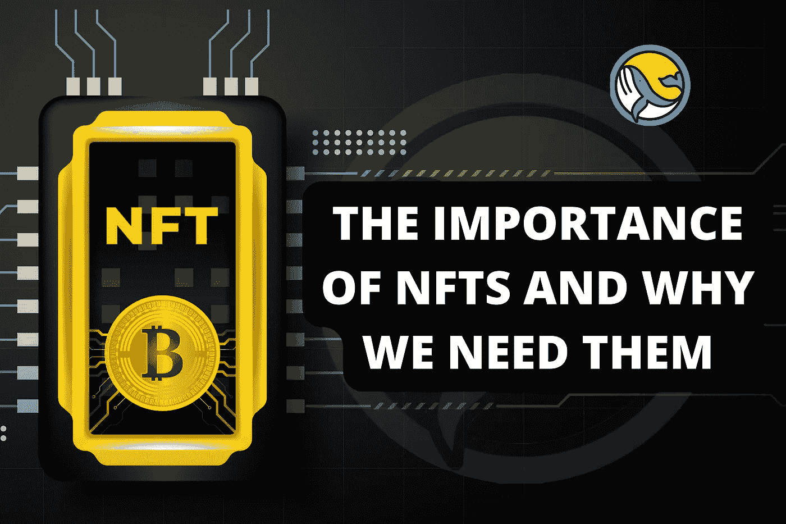
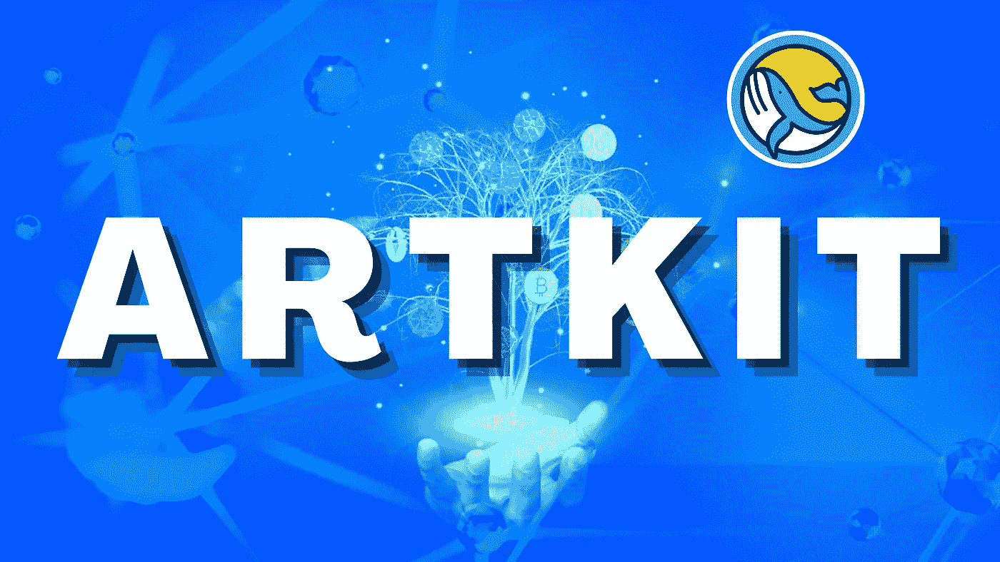
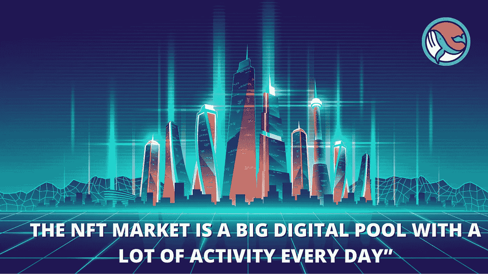

# NFTS 的重要性以及我们为什么需要他们—

> 原文：<https://medium.com/coinmonks/the-importance-of-nfts-and-why-we-need-them-92847647a5a9?source=collection_archive---------33----------------------->

*美术工具箱*

image from artkit

NFT 对你来说无疑是熟悉的。最近，以这样或那样的方式，你一定听说过它或相关的东西。
你可能知道，NFT 代表不可替代的代币。然而，你可能会问这意味着什么，为什么这项新技术对艺术家、制片人和企业如此重要。

你可能也从一则新闻故事中听说过 NFTs，该新闻故事讲述了任何人都可以对其进行截图的纯数字艺术的惊人购买价格。

他们天文数字般的高价无疑让你大吃一惊。但是它们真的值这么高的价格吗？

不可替代的代币正变得越来越流行。事实证明，这些设备是收藏的绝佳数码选择。它们经常反映现实生活中的元素，如音乐、艺术、电影和游戏中的物品。这些加密令牌不能被复制，也不能被交换成等值的任何东西。不过，你可以利用它们进行一系列交易，比如出售数字艺术品和货币。

以下是 NFT 为加密货币行业带来的一些好处的分类。因为它们保存在一个独特的区块链网络上。它们具有不可分发的特性，这意味着用户不会收到假冒的数字资产。

**1。提高真实性**

区块链是制造 NFT 的关键组成部分，这使其区别于其他形式的货币。NFT 制造商通常会限制生产，导致非功能性食品短缺。

NFT 具有更高程度的不变性，这增加了它们的可信度。它们不受删除、替换或更改的影响。

**2。安全性**

每个人都对自己的数字资产变得更加安全感到兴奋。另一方面，NFT 提供了无与伦比的安全性。你可以放心，从长远来看，区块链会保护你免受欺诈。

**3。声望提高**

区块链技术使非功能性测试成为可能。因为很难在公共账本中复制，所以 NFT 是准确、耐用、永恒和安全的。

**4。所有权权利:**

区块链只不过是一个巨大的数据事务数据库，一旦智能合约被编写和部署，就不能被修改。在区块链上运营的 NFT 依靠分类账来记录所有权历史。NFT 最初的“minter”将永久显示交易链。

‍

**数字世界中的资产**

你可能不相信，但 NFT 有无表面层。例如，区块链允许开发者创建虚拟世界，并使用 NFTs 将合法所有权分配给买家。如果你曾经想在希腊买一套房子，NFTs 可以帮你实现！此外，以太坊名称服务)允许您购买基于以太坊的名称，这些名称允许您在区块链上托管网站和交换命名权。

# **未来**

因此，值得注意的是，NFT 领域目前正处于早期阶段。因此，预计将会看到新的平台取代 NFT，支持 Defi、票务、数字艺术、身份识别和其他重要的用例。DApps 将继续在区块链上发展，为日常使用增加新的分散支持水平。

# **NFT 市场的重要性**

*深入革命性的 NFT 新市场*

NFT 市场是一个市场，就像任何其他有形市场一样；唯一的区别是，这是一个数字市场。任何人都可以使用 NFT 密码购买或出售任何数字资产或 NFT 代币。该市场还可以用于制造 NFT 代币或其他数字资产，以及存储、展示或演示交易。你可以在 NFT 市场上出售或购买 NFT。一些加密货币被用于购买和出售数字资产。

请注意，不同 NFT 市场的功能有所不同

投资并从最好的市场购买非功能性食品或任何东西总是明智的。

最好的 NFT 市场可能意味着出售一件新艺术品和发现一个新的收藏项目之间的区别。NFT 市场不仅仅是买卖数字艺术的场所；它们也是联系一群敬业的艺术家和收藏家的一种方式。

为了选择最适合你的 NFT 市场，考虑你将被收取的费用，以及所提供的艺术类型(它是否符合你的风格？，甚至是将要使用的区块链和加密货币。这就是我们的切入点。

# **介绍艺术套件-** 革命性的 NFT 市场。

Artkit 是一个分散的多链 NFT 市场，允许用户快速购买、出售、喜欢、评论或欣赏朋友展示的 NFT。此外，让用户在一个平台上创建、销售、管理和研究 NFT 项目，而不是使用 Twitter、Discord、Telegram 等需要大量精力的平台。ArtKit 不仅是一个 NFT 市场，也是一个社交媒体 NFT 平台，允许用户使用 NFt 创建、分享和参与故事。我们相信所有的 NFT 背后都应该有一个故事。

ArtKit 是领先的分散式多链 NFT 市场，弥合了社交媒体、NFT、元宇宙和步行挣钱之间的差距。ArtKit 平台的用户将获得社交媒体、NFT 市场、元宇宙的综合收益，并通过步行赚取被动收入。

与 Opensea 和其他收取约 2.5%交易费的 nft 市场不同，Artkit 仅为 1%。此外，Artkit 还通过社交媒体功能和数字元宇宙博物馆让 Nft 世界变得更加有趣。

> 加入 Coinmonks [电报频道](https://t.me/coincodecap)和 [Youtube 频道](https://www.youtube.com/c/coinmonks/videos)了解加密交易和投资

**结论:**

NFT 市场是一个交易、销售和购买数字作品的前沿平台。随着加密货币越来越受欢迎，价值越来越高，预测 NFT 市场和整个区块链网络将保持长期需求是现实的，这就是它现在和未来如此重要的原因。

.