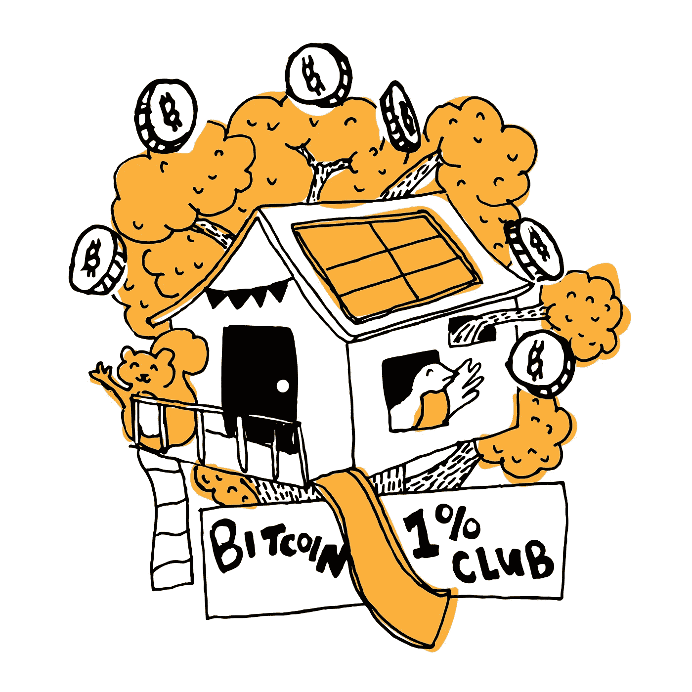

# 臭名昭著的比特币 1%俱乐部

> 原文：<https://medium.com/coinmonks/the-infamous-bitcoin-1-club-8e9c23e54d87?source=collection_archive---------6----------------------->

Illustration: [Paige Speight](http://www.paigespeight.com/)

这种比特币 1%俱乐部的想法已经在 Reddit 和比特币论坛的阴影下流传了多年。进入这个俱乐部的起价是 0.25 还是 10 个整比特币？“比特币 1%俱乐部”指的是全球前 1%的比特币持有者。你在整个比特币食物链中处于什么位置？很难确定你需要多少比特币才能进入 1%俱乐部，因为比特币并不是均匀分布在各个地址中，而且还有 …