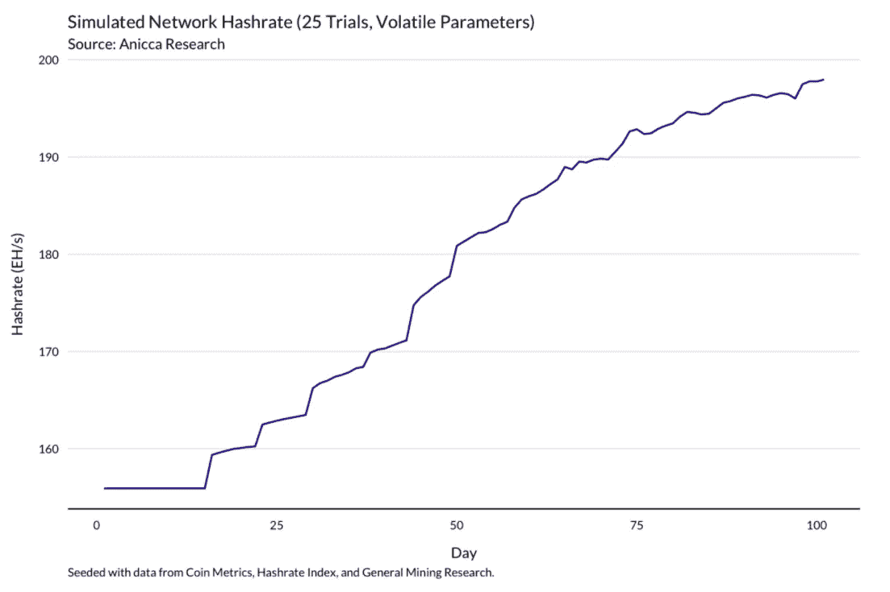

# 智能比特币矿工，第二部分。

> 原文：<https://medium.com/coinmonks/the-intelligent-bitcoin-miner-part-ii-3b3659966a9a?source=collection_archive---------6----------------------->

*本文原载于* [***智能比特币矿工，第二部分。***](https://www.aniccaresearch.tech/blog/the-intelligent-bitcoin-miner-pt-ii)

> *“任何试图通过确定性手段产生随机数的人，当然是生活在罪恶的状态中。”*
> 
> *—约翰·冯·诺依曼*

## **概述**

在没有实验的情况下，我们可以依靠模拟。与其他形式的分析相结合，模拟可以让比特币挖矿的研究变得容易处理，尽管该行业不透明且资本密集度高。在不知道自己将从事何种业务的情况下，建立一项业务的成本很高，但模拟一项业务的成本却很低。

在本系列的第一部分[中，我们建立了一个蒙特卡洛模型来估算采矿钻机的公允价值以及该公允价值对不同市场参数的敏感度。我们表明，hashpower 的市场价格经常偏离其理论公允价值，部分原因是该工具的非流动性。](https://www.aniccaresearch.tech/blog/the-intelligent-bitcoin-miner-part-i)

在我们的上一篇文章中，我们用跳跃扩散过程模拟了未来的价格轨迹，并使用线性函数来描述 global hashpower 对价格变化的反应。正如我们的几篇文章中所讨论的，hashrate 和价格之间的动态超越了简单的线性关系。**为了提高我们框架的代表性，我们必须超越将 global hashpower 描述为一个单元，而是从自下而上的角度建模。**

在本文中，我们根据机器类型、总运营成本和开采策略将采矿者分为几个原型。每个矿工原型都有不同的利润率和风险考虑。随着采矿收入的波动，每个矿工都会产生利润或亏损，这反过来又会促使他们决定增加或减少运行的机器数量。

在这个框架下，网络哈希值的变化不仅仅是价格变化的函数，而是具有不同经济和风险特征的所有矿工的集体产出的集合。

**模型的代码库是完全开源的，在这里** **可以得到** [**。**](https://github.com/khelmy/intelligent-bitcoin-miner)

用户可以插入他们自己的假设，并查看他们的采矿作业在最终条件下将如何执行。在本文中，我们将详细介绍这个模型，提供如何使用它的说明，并通过对五个场景的分析展示一些有趣的发现。

**康威的人生游戏**

我们将网络建模为单个矿工产量总和的方法是基于一种叫做*基于代理的模拟*的技术。[基于代理的建模](https://en.wikipedia.org/wiki/Agent-based_model)起源于 20 世纪 50 年代约翰·冯·诺依曼对细胞自动机的早期研究，并因约翰·康威的[生命游戏](https://playgameoflife.com/)而得到推广。

*(*[*Source: Teb’s Lab*](/tebs-lab/optimizing-conways-game-of-life-12f1b7f2f54c)*)*

这是一个基于回合的模拟，发生在二维单元网格上。有预先指定的、确定性的规则来管理相邻小区之间的交互。在每一轮中，细胞的状态都会根据其邻居的状态发生变化:如果细胞正好有三个活着的邻居，细胞就会活下来，如果有两个或三个活着的邻居，细胞就会活下来，否则就会死亡。

《生命的游戏》是一个基于主体的模型的原始例子，这是一种模拟，在这种模拟中，参与者共享一个全局状态来做出决策。在生命的游戏中，细胞是代理人，它们的决策围绕着是生是死。结果完全取决于棋盘的初始状态，而棋盘的状态可以不直观地演变。

基于代理的建模已经大大超越了康威的生活游戏。如今，基于主体的模拟广泛应用于[生态学](https://academic.oup.com/cz/article/66/1/1/5477426)、[经济学](https://books.google.com/books?hl=en&lr=&id=Na5J44IBaHkC)、[量化金融学](http://www.datascienceassn.org/sites/default/files/Agent-based%20Computational%20Finance.pdf)、[智能合约分析](https://arxiv.org/pdf/2001.00919.pdf)。

比特币挖矿的盈利能力取决于比特币的价格、整个网络的价格，以及在较小程度上的交易费用(到目前为止)。**该盈利能力计算中的第二个组成部分，网络散列率，取决于其他矿工决定运行或关闭他们的机器。**因此，对矿工盈利能力的预测必须是迭代的，这个问题非常适合于基于主体的建模。

假设比特币价格完全独立于网络散列，我们可以将价格建模为独立的[几何布朗运动](https://en.wikipedia.org/wiki/Geometric_Brownian_motion)。同样，我们将每日费用建模为独立的[对数正态分布](https://en.wikipedia.org/wiki/Log-normal_distribution)，假设固定的 10 分钟阻塞时间。

**我们把时间序列中的每一天都看作一个转折点；在每个回合开始时，价格、费用和全局哈希值都作为输入输入到矿工代理的决策过程中。**

根据他们的利润率，每个矿工通过改变他们运行的机器数量来扩大或缩小他们的经营规模，并公布他们的经营情况。每个矿工的哈希表输出的总和依次成为新的全局哈希表:

**作为代理商的矿工**

**将矿工建模为代理本质上是将采矿经济学中的输入变量参数化。**在[hash power 的炼金术](https://www.aniccaresearch.tech/blog/the-alchemy-of-hashpower-part-i)中，我们引入了*hash power 的反身性*的概念:每项采矿作业都受到物理条件和经营者对市场的主观感知的严重影响。

虽然不可能涵盖所有决策因素，但我们认为**机器类型**、**成本基础**和**战略**是矿工行为的主要决定因素。我们将这些因素形式化为我们的 miner 类中的参数。

*   **机器类型:** 在现实世界中，一个采矿作业通常有多台不同类型的机器。为了简单起见，我们让每个矿工原型在整个分析中使用一个机器类型。在这个版本的模拟中，我们支持以下机器:

*   **成本基础:** 1 .**电**2
    包干。**能源消耗** 在整个模拟过程中，每个矿工都被分配了一个平均统包电价。能量消耗是矿工的:
    ***机器数量*** *** ***机器 _ 类型 _ 消耗*** *。* 矿工每天发生的作业费用等于:
    ***能耗****/1000 *****电费包干*** ** 24。* 我们还指定了一个全包电价分配，该分配在初始化时确定了相关矿工原型的**台机器的数量**。
    在此版本中，我们默认提供以下分层。用户可以在运行模拟之前对此进行自定义。

*(Based on best-effort estimate)*

*   **策略:
    1。龙 BTC
    2。每日卖出** 每个矿工在初始化时都会被分配一个策略。实际上，矿商可以使用多种策略，只要他们对市场状况的看法发生变化，他们就可以在这些策略之间切换。
    为简单起见，我们将每个矿工建模为在整个模拟过程中遵循相同的策略。我们在 [The Intelligent Bitcoin Miner，Part I.](/@alkimiya_io/the-intelligent-bitcoin-miner-part-i-d6ddbfd01419)
    **中介绍了这两种策略，并评估了它们在不同市场周期中的表现。多头 BTC** 是指矿商每天出售的比特币只够支付运营支出，其余收入仍为比特币。
    **每日卖出**是指矿工马上把所有东西都卖出去换成美元。
    一个矿工的策略决定了他们的**美元头寸**和 **BTC 头寸**如何传播。使用**多头 BTC** 策略计算矿工利润时，需要考虑未实现收益。未实现收益的计算方法为 *BTC 头寸*比特币价格*。

基于这三个变量的组合，我们将矿工领域分解为 11 个机器类型、7 个电力成本层和 2 个策略，总共 154 个原型。

初始化时，我们根据来自 [Hashrate Index](https://hashrateindex.com/) 和 [General Mining Research](https://www.gmr.xyz/) 以及其他一些来源的数据，提供市场上机器的默认分层和价格数据。用户可以在模拟之前进行自定义:

*(Price data:* [*Hashrate Index*](https://hashrateindex.com/)*,* [*General Mining Research*](https://www.gmr.xyz/)*. Hashrate percentage: best-effort estimate based on various sources)*

**电价分配**和**机器分层**是每个矿工的**机器数量**的输入。这表示矿工操作的机器数量。值得注意的是，在实践中，这两种分布并不像模型中假设的那样在统计上是独立的，例如，S9s 等较旧的机器更有可能由能够获得较便宜电力的矿工操作。

在模拟开始时，所有矿工的**数量的机器** * **散列值**的总和被缩放到大约等于当前网络散列值水平，该值是从[硬币度量](https://charts.coinmetrics.io/network-data/)收集的。

为了跟踪 miner 性能，我们在 miner 类中包含了一个简单的帐户余额和历史利润计算器。

*   **账户余额:** -美元头寸
    - BTC 头寸
    - Hashpower 头寸
    初始 Hashpower 头寸为矿工的**机器数量* Machine_Type_Hashrate。**
*   **盈利能力:** -盈利 _ 每日
    -盈利 _ 最后 _ 30 _ 日
    -盈利 _ 全部
    盈利能力随着市场的演变决定了矿工的行为。我们将在下一节讨论这个机制。 **Profit_30_Days** 和 **Profit_All** 是跟踪利润的总和。

下面是一个示例 miner 类中的所有数据条目。miner 类的代码可以在 [*agents.py*](https://github.com/khelmy/intelligent-bitcoin-miner/blob/main/agents.py) 文件中找到。

**矿工的实用功能**

当预期盈利能力较高时，矿工可能希望购买更多的机器，而当预期未来盈利能力为负时，他们可能会关闭一些机器以降低运营费用。我们需要准确地定义矿工如何增加或减少他们的哈希值。

事实上，有许多外部因素会促使矿工决定购买更多设备或关闭机器，例如外部融资的可用性和睡眠质量。**为简单起见，我们将矿工的历史利润建模为矿工决策过程中的主要输入。**

决策过程将**利润 _ 最后 _ 30 _ 天**作为其输入，并计算一个用于产生行动的结果。计算过程如下:

1.  *如果* ***利润 _ 最后 _ 30 _ 天*** *为零或负数，矿工将* ***机器数量*** *减少 x，直到收支平衡。计算方法很简单:
    损失(* ***利润 _ 最后 _ 30 _ 天*** *)除以* ***每台机器的能源成本*** *。*
2.  *如果****Profit _ Last _ 30 _ Day****为正且超过一定阈值，矿工会增加* ***台机器数量*** *。
    2a)阈值为:* ***利润 _ 最后 _ 30 _ 天*** *>所有的总和(* ***费用*** *)
    2b)增加的机器数量计算为:(* ***利润 _ 最后 _ 30 _ 天*** *—所有的总和(***【T59)**
3.  ***机器价格*** *在模拟过程中是动态的，并被定义为:
    初始机器价格*(当前比特币价格*初始网络哈希值)/(初始比特币价格*当前网络哈希值)*

**机器价格是自适应的，对价格和价格的变化做出反应。每种机器类型也有反映其相对增长率的增长率。**由于制造商缺乏继续生产的意愿，老一代机器的生产率较低。我们还加入了增加新机器的反应延迟。新订单的生产和交付通常需要一段时间。

在我们的模型中，这意味着在触发了增加 *x* 台机器的操作后，这些机器不会立即被添加到矿工的账户中。

我们为每种机器类型设置一系列常数作为反应时间。反应延迟是一个静态近似值，应该定期刷新以反映供应链能力的变化。

*(Based on best-effort estimates)*

总之，触发函数输出矿工正在购买或出售的机器数量。

用户可以用他们认为合适的常数来更新生长因子和反应时间。调整的代码可以在 [*Simulator.py*](https://github.com/khelmy/intelligent-bitcoin-miner/blob/main/Simulator.py) 中找到。

**设置模拟**

第一部分中的[。，我们使用随机过程来预测模拟生命周期内的比特币价格和每日费用收入。价格的几何布朗运动模型和费用的对数正态分布的基础支持来自从](/@alkimiya_io/the-intelligent-bitcoin-miner-part-i-d6ddbfd01419)[硬币度量](https://charts.coinmetrics.io/network-data/)中提取的历史价格数据。

综合所有因素，我们使用下图来说明该过程是如何工作的:

**场景分析**

为了测试该模型，我们模拟了不同的市场条件，并分析了由此产生的矿工行为。**我们评估了一家*用户挖掘公司*的盈利能力，该公司获得了 100 万美元的前期资金用于购买机器，但无法进一步扩大运营规模。**模拟运行 100 天，取 25 次试验的平均结果。

用户盈利能力是在我们所有机器类型的几种不同电力成本下测量的。亮点如下所示。

**所使用的参数绝不是确定的，用户可以根据自己的假设重新运行分析。**场景分析的代码可以在 [*main.py*](https://github.com/khelmy/intelligent-bitcoin-miner/blob/main/main.py) 中找到。

*   **场景 1。牛市情景**

我们的第一个测试模拟了看涨条件。鉴于撰写本文时的牛市行情，我们简单地将几何布朗运动模型与历史数据进行拟合。在这种情况下，价格逐渐上涨到 100，000 美元以上，在此过程中经历了几次修正。

网络哈希率稳步上升，经历了一些轻微滞后修正，以应对价格下调。

在这种情况下，即使电费很高，保持比特币头寸也比每天卖出更有利可图。鉴于比特币价格的快速升值，这是有道理的。

在每千瓦时 4 英镑的情况下，只有使用 S9s 并在比特币中保持头寸的矿工才能在百日模拟期内实现盈亏平衡。

*   **场景二。动荡的市场**

对于我们的第二个场景分析，我们通过将历史拟合 GBM 模型中的波动率项增加 25%并将漂移设置为 0 来模拟波动市场。价格最初上涨到近 80，000 美元，然后暴跌到略高于 40，000 美元。

Hashrate 开始时增长很快，但随着价格的下降开始趋于平稳。由于响应延迟，hashrate 继续增加，尽管是逐渐增加。

最初，这两种策略表现相当，比特币多头略胜日常卖家。随着价格下跌，拥有比特币敞口的矿商因其承担的额外风险而受到惩罚，其所持资产的市值也在下降。

*   **场景 3。熊市**

第三个模拟通过将 GBM 拟合到历史数据并翻转漂移项的符号来模拟熊市。价格从目前的水平大幅下降，接近 30，000 美元。

作为对价格下跌的回应，network hashrate 在最初的上涨后进入了调整期。这是从**库存激增**到周期的**震荡**阶段的过渡，正如[权力的炼金术中所介绍的。](https://www.aniccaresearch.tech/blog/the-alchemy-of-hashpower-part-ii)

在熊市中，每个人都遭受损失。比特币多头尤其受到影响:在每千瓦时 4 英镑的价格下，拥有比特币敞口的最高效操作甚至无法在模拟期内收回最初投资的一半。

每日卖家的表现明显更好，但由于他们的收入仍然取决于比特币的价格，他们的表现比牛市中更差。

*   **场景 4。牛市中，跑旧机好还是跑新机好？**

第四种情况使用与情况 1 相同的历史参数，目的是比较运行新旧硬件的矿工与竞争性电价的绩效。

这一次，价格飙升至 14 万美元以上，一路加速上涨。Hashrate 也快速增加。

鉴于牛市的激烈程度，即使是每天卖出的矿工也能在百日模拟期内实现盈亏平衡，前提是他们运行 S9。S19 矿商的利润明显较低，但仍能在每日销售的同时收回大部分初始投资。

在这种情况下，做多比特币的矿工利润惊人。运行 S9 的矿工在模拟期间的投资几乎翻了一番，S19 矿工也设法获得了可观的利润。

*   **场景 5。在熊市中，降低运营支出有多重要？**

第五个也是最后一个模拟再次在熊市中运行，这次的目标是分析电力成本在盈利能力中所起的作用。为此，我们评估了 S9 和 S19 矿工在熊市条件下的表现，电力成本为每千瓦时 3、4 和 5 美分。

环境类似于场景 3:价格暴跌，hashrate 经历了一次浅而长的调整。

对于 S9 矿工来说，电力成本有很大的不同。尽管所有电力成本水平的矿工在这些条件下表现不佳，但拥有 3/千瓦时电力的比特币长期矿工能够收回近 40%的初始投资，而拥有 5/千瓦时电力的同行只能收回略低于 32%的投资。

这种对电价的敏感性有助于解释 S9 矿商为何倾向于在电价较低的边境地区运营。

对于 S19 矿工来说，差别不太明显。尽管电价较低的矿商仍比电价较高的矿商赚得更多，但这一变量对利润率的影响要小得多。

**结论**

维度是统计学家的敌人，比特币挖掘是一个很难建模的问题。**即使是我们的模型，做了几个简化的假设，也设法变得比我们最初预期的要复杂得多。**像所有基于蒙特卡罗的工具一样，它的预测能力从根本上受到用户偏差的限制，这种偏差会从初始种子条件波及到任何结果。

我们的模型明确假设价格和 hashrate 之间的关系是单向的。隐含地，它假设可能相关的机器模型和电力成本分布之间的独立性。所有的模型都是错的，[但有些是有用的](https://en.wikipedia.org/wiki/All_models_are_wrong)。

我们认为，这种模式是有用的。它应该能够进入智能比特币矿工的工具箱。

**致谢**

*感谢* [*钱币指标*](https://charts.coinmetrics.io/network-data/)*[*散列指标*](https://hashrateindex.com/)*[*通用挖掘研究*](https://www.gmr.xyz/) *获取数据。***

***感谢*[*Guzman Pintos*](https://twitter.com/guzmanpintos)*帮助访问和处理钻机价格数据。***

> **加入 Coinmonks [电报频道](https://t.me/coincodecap)和 [Youtube 频道](https://www.youtube.com/c/coinmonks/videos)了解加密交易和投资**

## **也阅读**

** [## 加密交易机器人——19 款最佳免费加密交易机器人

### 2022 年币安、比特币基地、库币和其他密码交易所的最佳密码交易机器人。四进制，位间隙…

medium.com](/coinmonks/crypto-trading-bot-c2ffce8acb2a)  [## 最佳 4 个加密交易信号电报通道

### 这是乏味的找到正确的加密交易信号提供商。因此，在本文中，我们将讨论最好的…

medium.com](/coinmonks/best-crypto-signals-telegram-5785cdbc4b2b)  [## Bitsgap 评论-交易机器人加密信号和套利 2022

### 这篇文章的重点是 Bitsgap 审查，这是一个最终的交易解决方案，并提供交易机器人，信号…

coincodecap.com](https://coincodecap.com/bitsgap-review)  [## 40 个最佳电报频道，用于加密、电影、表演和演讲| CoinCodeCap

### 免费下载所有电影。德国免费加密信号。下载讲座。CoinCodeCap 经典，网飞电影等。是……

coincodecap.com](https://coincodecap.com/best-telegram-channels)  [## Keevo 钱包点评:是最安全的硬件钱包吗？2022 | CoinCodeCap

### 在这篇 Keevo Wallet 评论中，我们将讨论他们如何改变我们看待硬件钱包的方式。基沃是…

coincodecap.com](https://coincodecap.com/keevo-wallet-review)  [## 2022 年 5 大最佳社交交易平台

### 5 个最佳社交交易平台阅读加密产品评论和比较，了解比特币交易和…

coincodecap.com](https://coincodecap.com/best-social-trading-platforms)  [## BlockFi 评论:2022 年的利弊和利率

### 今天，我们提出了一个全面的 BlockFi 评论，这是一个成立于 2017 年的加密贷款平台，拥有其…

coincodecap.com](https://coincodecap.com/blockfi-review)  [## 如何在印度购买比特币？2021 年购买比特币的 7 款最佳应用[手机版]

### 如何使用移动应用程序购买比特币印度

medium.com](/coinmonks/buy-bitcoin-in-india-feb50ddfef94)  [## 加密税务软件——五大最佳比特币税务计算器[2021]

### 不管你是刚接触加密还是已经在这个领域呆了一段时间，你都需要交税。

medium.com](/coinmonks/best-crypto-tax-tool-for-my-money-72d4b430816b)  [## 9 个 2022 年最值得购买的密码| CoinCodeCap

### 9 个 2022 年最值得购买的加密产品阅读加密产品评论和比较，了解比特币交易和…

coincodecap.com](https://coincodecap.com/crypto-to-buy-in-2022)  [## 存储比特币的最佳加密硬件钱包 2022 | CoinCodeCap

### 硬件钱包是我们存储加密资产的唯一可靠选择。在本文中，我们将讨论 8 个…

coincodecap.com](https://coincodecap.com/best-hardware-wallet-bitcoin)  [## Pionex 评论 2021 |免费加密交易机器人和交换

### Pionex 是为交易自动化提供工具的后起之秀。Pionex 上提供了 9 个加密交易机器人…

medium.com](/coinmonks/pionex-review-exchange-with-crypto-trading-bot-1e459d0191ea)  [## 2022 年密码交易员的三大电报渠道

### 加密信号是来自专业交易者的交易想法，以特定的价格或价格买卖特定的加密货币

medium.com](/coinmonks/top-3-telegram-channels-for-crypto-traders-in-2021-8385f4411ff4)  [## 2022 年 5 个最佳免费加密投资组合追踪器

### 在这篇文章中，我们将带你通过一些最好的免费加密投资组合追踪器，让你选择最好的…

coincodecap.com](https://coincodecap.com/free-crypto-portfolio-trackers)**