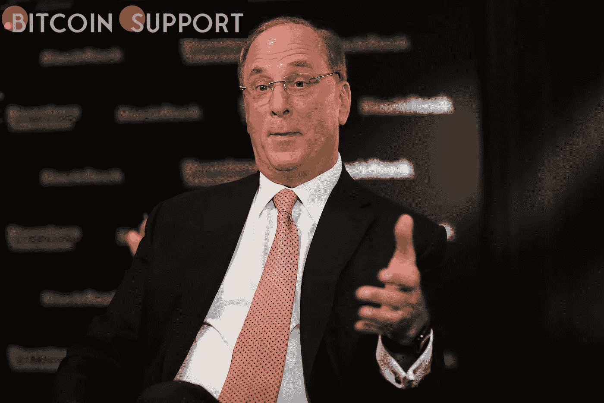
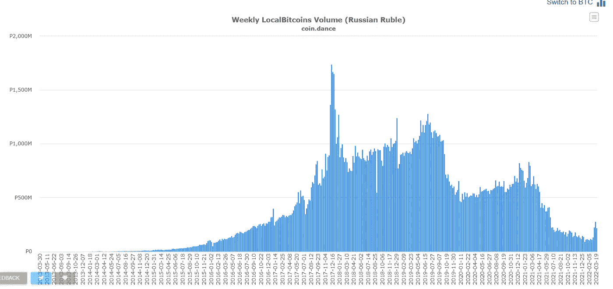

# 据贝莱德首席执行官拉里·芬克称，国际危机可能有助于数字货币

> 原文：<https://medium.com/coinmonks/the-international-crisis-may-help-digital-currencies-according-to-blackrock-ceo-larry-fink-64b79032d3fd?source=collection_archive---------84----------------------->

**Visit our website:-** [**https://bitcoinsupports.com/**](https://bitcoinsupports.com/)

据贝莱德首席执行官称，当前的危机以及不断上升的通货膨胀将导致全球数字支付网络的发展。全球最大的资产管理公司贝莱德(BlackRock)首席执行官拉里·芬克表示，持续的俄乌危机支持了将数字货币作为国际解决手段的观点。

据路透社报道，在一封股东信中，芬克表示，旷日持久的战争将推动各国重新考虑其货币依赖，或许会为全球数字支付网络铺平道路。他声称，这场冲突终结了过去 30 年一直在起作用的全球化力量。

芬克关于数字货币市场崛起的预测完全正确，因为对俄罗斯的贸易限制已经促使几个从俄罗斯进口石油和天然气的国家探索集中式 SWIFT 系统的替代方案。据称，印度正在为购买能源开发一个直接的印度卢比支付渠道，关于数字支付网络的讨论也越来越多。芬克说:“一个设计良好的全球数字支付系统可以改善国际交易结算，同时降低洗钱和腐败的危险。据报道，据报道，Ripple 的合作伙伴清算所正在与富国银行(Wells Fargo)就建立一个 SWIFT 替代品进行谈判。

[https://Twitter . com/natural med 777/status/1503557028949770242](https://twitter.com/Naturalmed777/status/1503557028949770242)

俄罗斯当地比特币交易量在经历了一年的稳步下降后，于 3 月份出现增长。然而，在入侵乌克兰之前，该国试图对比特币行业进行适当的监管。

**Visit our website:-** [**https://bitcoinsupports.com/**](https://bitcoinsupports.com/)

另一方面，在从世界各地获得数百万美元的加密援助后，乌克兰于 2022 年 3 月 16 日将加密货币合法化。这个饱受战争蹂躏的国家已经筹集了超过 1 亿美元的加密货币捐款，用于支持军队和购买物资。

多年来，加密货币已被证明是抵御动荡时期的绝佳对冲工具，但随着乌克兰危机的持续，它已成为国际结算和快速救援的关键工具。

**访问我们的网站:-**[**https://bitcoinsupports.com/**](https://bitcoinsupports.com/)

**免责声明:以上为作者观点，不应视为投资建议。读者应该自己做研究。**

> 加入 Coinmonks [电报频道](https://t.me/coincodecap)和 [Youtube 频道](https://www.youtube.com/c/coinmonks/videos)了解加密交易和投资

# 另外，阅读

*   [SmithBot 评论](https://coincodecap.com/smithbot-review) | [4 款最佳免费开源交易机器人](https://coincodecap.com/free-open-source-trading-bots)
*   [杠杆令牌](/coinmonks/leveraged-token-3f5257808b22) | [最佳密码交易所](/coinmonks/crypto-exchange-dd2f9d6f3769) | [Paxful 点评](/coinmonks/paxful-review-4daf2354ab70)
*   [加密套利](/coinmonks/crypto-arbitrage-guide-how-to-make-money-as-a-beginner-62bfe5c868f6)指南| [如何做空比特币](/coinmonks/how-to-short-bitcoin-568a2d0b4ae5)
*   [币安期货交易](https://coincodecap.com/binance-futures-trading)|[3 comas vs Mudrex vs eToro](https://coincodecap.com/mudrex-3commas-etoro)
*   [如何购买 Monero](https://coincodecap.com/buy-monero) | [IDEX 评论](https://coincodecap.com/idex-review) | [BitKan 交易机器人](https://coincodecap.com/bitkan-trading-bot)
*   [尤霍德勒 vs 科恩洛 vs 霍德诺特](/coinmonks/youhodler-vs-coinloan-vs-hodlnaut-b1050acde55a) | [Cryptohopper vs 哈斯博特](https://coincodecap.com/cryptohopper-vs-haasbot)