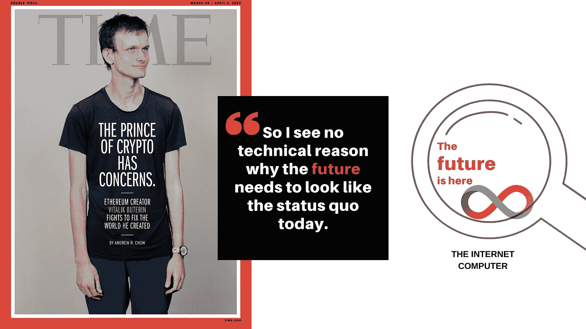
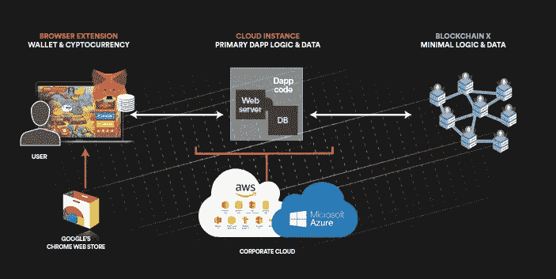
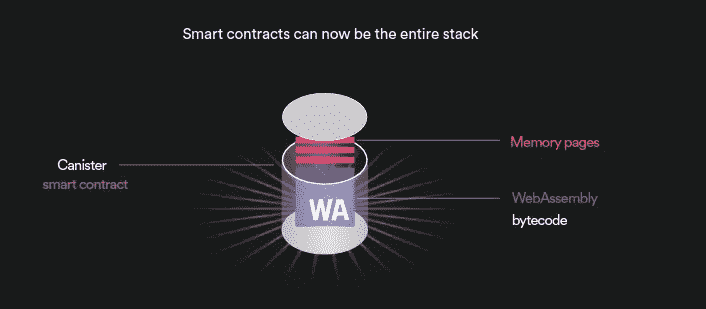
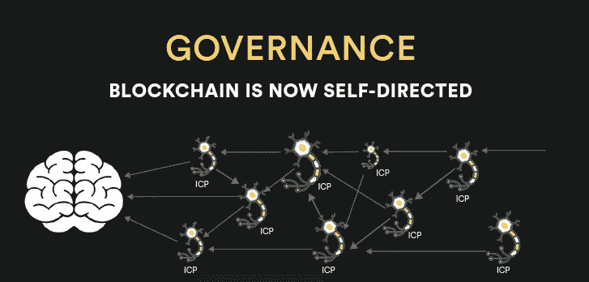
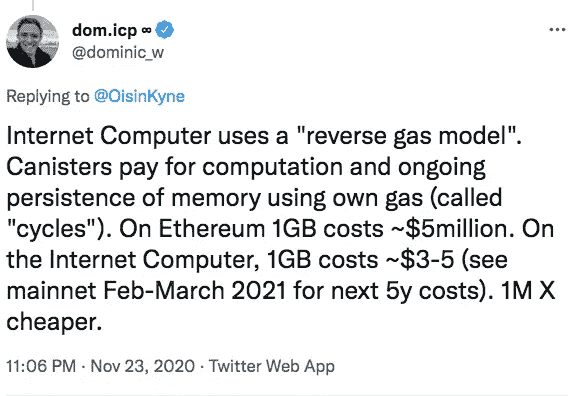

# 互联网计算机——维塔利克·布特林正在谈论的未来。

> 原文：<https://medium.com/coinmonks/the-internet-computer-the-future-that-vitalik-buterin-is-talking-about-97e21ab842fe?source=collection_archive---------9----------------------->

以太坊的创始人 Vitalik Buterin 登上了 2022 年 3 月《时代》杂志的封面，这对整个 Crypto & Web3 社区来说是一件好事，因为这表明了主流世界对空间的重视和接受。然而，这篇文章的标题是[以太坊背后的人担心 Crypto 的未来](https://time.com/6158182/vitalik-buterin-ethereum-profile/?utm_source=twitter&utm_medium=social&utm_campaign=editorial&utm_term=business_cryptocurrency&linkId=156905886)令人费解——为什么创造了整个智能合约革命的人会担心它？与此相关的是[对 Web3](https://moxie.org/2022/01/07/web3-first-impressions.html) 的批评[莫邪](https://twitter.com/moxie)，一位密码专家&Signal App 的创始人。他非常尖锐地打破了 Web3 目前的工作方式以及他所看到的问题。对此，维塔利克给出了一个[深思熟虑的回答](https://www.reddit.com/r/CryptoCurrency/comments/s1h750/vitalik_buterin_response_to_moxie_marlinspike/)，他总结道:

## “我认为正确认证的去中心化的区块链世界即将到来，而且比许多人想象的要近得多。我看不出未来需要像今天这样的技术原因。” —维塔利克·布特林

这篇文章的目的是强调他们提出的一些重要观点&建议我们不需要等待未来，随着 2021 年 [**互联网计算机**](https://youtu.be/YWHTNr8RZHg) 的推出，未来已经可以实现了。目的绝对不是错误引用或挑战这两个技术中坚分子的信仰，而是展示技术先进的替代方案，即**经过适当认证的& 100%去中心化的区块链。是时候让世界发现它了&利用它的力量来解决分散技术真正能解决的问题。**

## **1。认为 Web3 不是完全“分布式”的观点&分散化**

Typical Blockchain DApp infrastructure

这些应用程序本身并没有什么特别的“分布式”:它们只是普通的 react 网站。“分布式”是指状态和更新状态的逻辑/许可位于何处:在区块链上，而不是在“集中式”数据库中 **莫邪争辩道。**作为回应，**维塔利科同意**以太坊和其他连锁店可能还没有 100%到位，但他声称时间成本&是我们继续前进时应该解决的障碍。他还说*“如今用户拒绝的分散选项(例如运行一个完整的节点)真的很难，所以可以理解用户坚持更集中的选项，至少他们可以轻松使用。”*

[**互联网计算机**](https://dfinity.org/) 建立了一个无限的公共技术平台，这个平台本来就不存在这些问题。这是唯一一个整个协议栈都在区块链上的协议，因此是分布式的。因此，有了 IC，开发者不需要云、服务器、web 服务器&数据库来运行 web 服务或 DApp。这意味着区块链 DApps、系统和服务可以在不将运行在 AWS 等企业云托管服务上的网站整合到其架构中的情况下创建。这提供了真正的*端到端 Web 3.0 去中心化、审查阻力和卓越的安全性。*

## **2。复杂的问题&不是无缝的基础设施**

当前 DApps 的基础结构相当复杂。有服务器、钱包和 API 在不同层次与区块链对话，以促进使用智能合约的交易。**莫邪说** *“几乎所有的 dApps 都使用*[*in fura*](https://infura.io/)*或者* [*炼金术*](https://www.alchemy.com/) *来与区块链互动。事实上，即使当你将 MetaMask 这样的钱包连接到 dApp，并且 dApp 通过你的钱包与区块链交互时，MetaMask 也只是在调用 Infura！这些客户端 API 不使用任何东西来验证区块链状态或响应的真实性。结果甚至都没有签名…就像我的 dApp 一样，MetaMask 通过对在该领域进行整合的三家公司进行 API 调用来实现这一点。”*

**Vitalik** 说“*已经有团队在努力”*实现 API 终结代码&直接连接到 p2p 网络之类的东西，并且正在积极研究协议的其他问题，但是没有给出这些开发的时间表。

The Internet Computer Canister Smart Contracts

**互联网计算机**已经找到了一个独特的解决方案来简化基础设施，不需要任何 API 和外部服务器。互联网计算机拥有强大的智能合约，称为*。罐是防篡改的、自治的、链上托管的，并且可以并发运行和相互交互。罐允许用户直接与网络体验互动，无需任何第三方中介。智能合约的所有功能都在一个地方，使用一个身份使其无缝&安全。*

## ***3。变化的速度和对硬分叉的需求。***

***莫邪指出**——“*web 3 协议发展缓慢”，因此“在集中式平台上快速迭代已经超过了分布式协议，并将控制整合到平台上*” **Vitalik 对这个问题的观点**是“……*新项目的启动速度很慢，而集中式的解决方案已经领先多年。使上升速度更慢的一个因素是依赖链:为了拥有轻客户端，我们需要一个轻客户端友好链，这是对协议的一个深刻改变，因此实现它的唯一现实机会是切换到 PoS…"**

**

*The NNS based Governance System of the ICP*

*相反，互联网计算机已经在一个无许可的算法*管理系统**“网络神经系统”(或 NNS)** 的控制下运行，该系统驻留在其协议内。NNS 处理任何人提交的提案，要么拒绝，要么自动采纳并执行。投票由获得“投票奖励”的“神经元”执行，该“投票奖励”可以通过在 NNS 内标记 ICP 实用程序令牌来创建。通过 NNS，互联网计算机在没有硬分叉的情况下实时自我指导和进化。**

## ****4。堵塞的网络和不断上涨的天然气费用的问题。****

**为了说明这个问题，**莫邪谈到了**NFT 的使用案例，他说*“交易费为所有出价设置了一个人为的底价，否则你会因为接受低于汽油费的出价而赔钱。”*由于网络拥塞，这些费用现在相当高。**布特林指出**一个相关的问题——“*按照现在的收费方式，金融衍生品和 gambley 之类的东西真的已经到了开始对一些很酷的东西定价的地步。“有像 Solana 和 Cardano 这样的协议试图解决这个问题，但是他们面临着其他挑战。以太坊可能会通过“合并”到股份证明来解决这个问题，但我们需要等待推出。***

****

**Dominic Williams on Twitter**

**与目前的汽油费模型不同，**互联网计算机包含了一个*【逆向汽油】模型****，其中智能合同为它们自己的计算付费，并且必须预先充电才能循环运行，就像电动汽车必须预先充电才能行驶一样。这确保了 DApps、系统和服务的最终用户可以通过网络与它们交互，而不需要令牌来支付它们发起的计算。实际上，作为用户，不需要支付任何气费，费用由服务提供商承担，其本身低至约 5 $ GB/年。***

## ***此外，还有关于钱包、用户名和密码以及身份等主题的其他对话，这些问题由 ICP 使用的互联网身份(II)解决。***

***[互联网身份(II)](https://identity.ic0.app) 是互联网计算机支持的区块链认证框架。用户现在可以在他们的设备上使用安全功能，如手机&笔记本电脑，如 Face Id，来注册和验证运行在互联网计算机上的 DApps。这消除了对用户名&密码&的需要，提供了高度的便利，同时也受益于高度的安全性，并且不需要直接管理或处理密钥材料本身。***

***反对去中心化的论点，如“对大多数人来说缺乏直接的实际或紧迫的重要性”或“去中心化的好处正落在少数贪婪的人手里的事实”是不成熟的，整个生态系统需要发展，以使其真正的力量不言而喻。 **Buterin 很好地抓住了这一点——**“*过去三周的情况有一点令人欣慰，那就是它提醒了加密领域的许多人，加密的最终目标不是用价值百万美元的猴子图片玩游戏，而是做一些在现实世界中实现有意义效果的事情”*。***

**当整个 Web3 世界都在等待以太坊合并来解决上面提到的一些问题时，重要的是他们的注意力转移到在这些问题上遥遥领先的互联网计算机上，并使用去中心化智能合同的力量向怀疑者展示真正无信任、透明的协议可以在没有中介的情况下运行。**

****关于国际比较方案的更多细节，下面是由 d infinity 基金会创始人**[**Dominic Williams**](https://dominic-w.medium.com/)**对互联网计算机的工作原理&的一个简要介绍****

> **加入 Coinmonks [电报频道](https://t.me/coincodecap)和 [Youtube 频道](https://www.youtube.com/c/coinmonks/videos)了解加密交易和投资**

# **另外，阅读**

*   **[Bookmap 评论](https://coincodecap.com/bookmap-review-2021-best-trading-software) | [美国 5 大最佳加密交易所](https://coincodecap.com/crypto-exchange-usa)**
*   **[如何在 FTX 交易所交易期货](https://coincodecap.com/ftx-futures-trading) | [OKEx vs 币安](https://coincodecap.com/okex-vs-binance)**
*   **[CoinLoan 审查](https://coincodecap.com/coinloan-review) | [YouHodler 审查](/coinmonks/youhodler-4-easy-ways-to-make-money-98969b9689f2) | [BlockFi 审查](https://coincodecap.com/blockfi-review)**
*   **《XT.COM 评论》的|**
*   **[SmithBot 评论](https://coincodecap.com/smithbot-review) | [4 款最佳免费开源交易机器人](https://coincodecap.com/free-open-source-trading-bots)**
*   **[比特币基地僵尸程序](/coinmonks/coinbase-bots-ac6359e897f3) | [AscendEX 审查](/coinmonks/ascendex-review-53e829cf75fa) | [OKEx 交易僵尸程序](/coinmonks/okex-trading-bots-234920f61e60)**