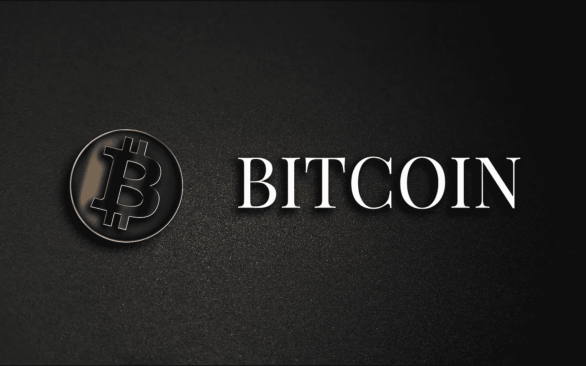

# 货币互联网

> 原文：<https://medium.com/coinmonks/the-internet-of-money-993c129f78f?source=collection_archive---------22----------------------->

[Image by Ilya Deryabin from Pixabay](https://pixabay.com/images/id-2894068/)

货币互联网的概念是在物联网的基础上构思出来的。

在这种情况下，我们都是一个拥有自己设备/财产的网络社会。

货币互联网旨在在这一系统内工作，这一切可能意味着我们如何利用支付系统的巨大差异。

这场革命将金融系统从依赖第三方(银行)记录交易转变为通过使用互联网的分散模式。

这种去中心化的系统通过使用去中心化的分类账和数字货币正在改变这个行业。

货币互联网的两大特点是:

1.允许高速度的交易。
2。允许高度保密的交易。

比特币正在成为这种货币互联网

货币互联网要发挥其全部潜力，所需要的只是一个广泛的拥抱，而这已经在发生了。

接受这种创新并学习，我们都会从中受益。

WAGMI！

非常感谢您的阅读。