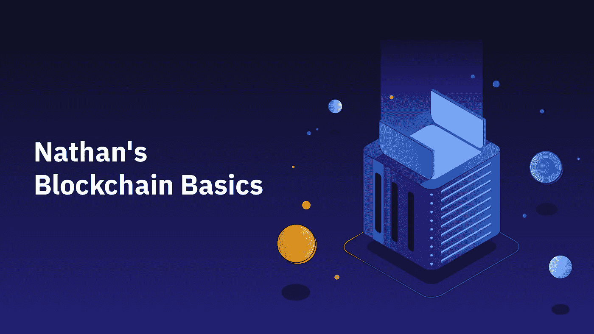

# 星际文件系统

> 原文：<https://medium.com/coinmonks/the-interplanetary-file-system-84c01fa27b26?source=collection_archive---------53----------------------->

星际文件系统(IPFS)是一个不可变的数据存储和归档系统，类似于区块链。文件保存在分布式网络中，网络中的每个成员保存整个缓存的一部分。

通常，文件存储在由数百万台计算机组成的中央服务器群中，这些计算机存储着谷歌上的所有可用数据。由于数据是集中的和受控的，请求得到了极快的响应，这也是网页和 YouTube 视频加载如此迅速的部分原因。然而，这些农场容易受到停电和审查的影响。

另一方面，IPFS 在广泛的计算机网络上保存数据。如果用户请求一个文件，它从一个网络成员发送过来，如果几个成员都有该文件，可以将不同来源的数据组合起来创建副本。

自然，越多的人贡献硬盘空间给 IPFS 网络，它就越有效，因为文件将被更广泛地分发，将有更多的副本可用。为了做到这一点，IPFS 发明了 Filecoin，这是一种建立在 IPFS 之上的区块链，它发出 Filecoin 加密货币，以奖励为网络贡献文件空间的人。

现在就在 Bybit 上购买 Filecoin！

> 加入 Coinmonks [电报频道](https://t.me/coincodecap)和 [Youtube 频道](https://www.youtube.com/c/coinmonks/videos)了解加密交易和投资

# 另外，阅读

*   [TraderWagon 回顾](https://coincodecap.com/traderwagon-review) | [北海巨妖 vs 双子星 vs BitYard](https://coincodecap.com/kraken-vs-gemini-vs-bityard)
*   [如何在 FTX 交易所交易期货](https://coincodecap.com/ftx-futures-trading) | [OKEx vs 币安](https://coincodecap.com/okex-vs-binance)
*   [OKEx vs KuCoin](https://coincodecap.com/okex-kucoin) | [摄氏替代品](https://coincodecap.com/celsius-alternatives) | [如何购买 VeChain](https://coincodecap.com/buy-vechain)
*   [ProfitFarmers 点评](https://coincodecap.com/profitfarmers-review) | [如何使用 Cornix 交易机器人](https://coincodecap.com/cornix-trading-bot)
*   [如何匿名购买比特币](https://coincodecap.com/buy-bitcoin-anonymously) | [比特币现金钱包](https://coincodecap.com/bitcoin-cash-wallets)
*   [瓦济里克斯 NFT 评论](https://coincodecap.com/wazirx-nft-review)|[Bitsgap vs Pionex](https://coincodecap.com/bitsgap-vs-pionex)|[Tangem 评论](https://coincodecap.com/tangem-wallet-review)
*   [如何使用 Solidity 在以太坊上创建 DApp？](https://coincodecap.com/create-a-dapp-on-ethereum-using-solidity)