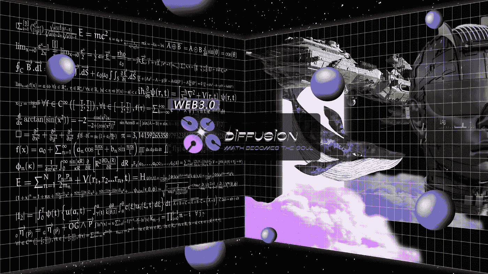

# 传播的内在价值——道《疯狂的多元宇宙》

> 原文：<https://medium.com/coinmonks/the-intrinsic-value-of-diffusiondaos-crazy-multi-meta-verse-cb75cc5dcfec?source=collection_archive---------30----------------------->

扩散道是一个颠覆性的项目，集成了 Defi、Web 3.0、、、道。它首次在加密领域将“元宇宙”的概念引入“多元宇宙”，旨在创建一个未来的 Web 3.0 超级英雄家园。因此，扩散道，这个疯狂的多元宇宙(此后被称为多元宇宙)意味着一个新乌托邦的诞生。我们一直在思考如何将“元宇宙哲学”赋予道本身。在扩散道的疯狂多元宇宙中，将有 IP、故事、虚拟、现实、文化、环境和道密码社区，所有这些都将给人一种非常强烈的 Web 3.0 的感觉。

从马斯洛的需求层次理论来分析扩散道的疯狂多元宇宙的实用主义意义，马斯洛的需求层次包括人类需求的五个层次模型，通常被描绘为金字塔内的层次。从层次的最底层向上，需求依次是:生理需求(温饱)、安全感(工作保障)、社交需求(友谊)、尊重、个人发展。这个五阶段模型可以分为赤字需求和增长需求。前四个层次通常被称为缺陷需求(D 需求)，而最高层次被称为增长需求(B 需求)。如果说扩散道的疯狂多元宇宙是马斯洛需求理论中的上层需求，那么用户购买的不仅仅是需求，你沉浸在疯狂的多元宇宙中玩金融，体验游戏，暴露人性，成为大矿主，参与慈善。这是一个理想主义世界的文化。年轻人应该实现精神自由、财富自由和人格自由。自由是扩散道疯狂多元宇宙中的王道。这似乎是扩散道的人生信条。

扩散道的《疯狂的多元宇宙》作为新多元宇宙的原型，从经济体系、沉浸式体验、开放自由的创造、虚拟身份、强社会性等多个维度体现了多元宇宙带给人们的真实价值。对外，对内，它实现了人们精神世界的真实财富，对外，它实现了人们对财富的渴望和追求。

让我们看看元宇宙目前的发展状况。目前，在元宇宙领域，我们将看到与 Web 3.0、NFT、DAO 和 Defi 相关的各种项目，但我们将发现在各种领域之间实际上没有实现。各种角力之间的强烈关联，也可以理解为当前元宇宙呈现出一种“弱融合”，这是不可理解的，也是阻止元宇宙迅速脱离这个圈子的原因。

扩散道疯狂的多宇宙真的实现了不同领域之间的零交叉。你可以在金融大都市、星星的黄金王国、自私的空间、绿色的地球、孩子们的笑脸、我的计算能力的世界等等之间自由旅行。就像现实世界一样，你可以安排休息、娱乐、健身、旅游等时间。，并可根据需要自由切换。每个领域的参与方式是不同的，它给你带来的经验也将是不同的。

与此同时，我们将把多元宇宙的所有权交给社区，我们将为生态系统做一切事情。另一方面，这亦符合区块链的分权精神及 DAO 组织的自主性。我们尊重每个社区成员，尊重多元宇宙的理念，我们帮助社区成员创造和实现多元宇宙。

还有一个很重要的方面，我们的特点，我们已经多次提到。也就是说，我们发现现行的加密资产发行规则是不人道的。请原谅我此刻的愤怒。然而，加密本身需要动态调整方案。我们拒绝粗鲁和不羁的代币发行规则，拒绝逻辑和漏洞。所以扩散岛正在挖掘加密资产本身的价值内涵，而这一切都将通过扩散岛的本地令牌 DFS 来实现。请准备好欢迎 DFS 上线的时刻，DFS 将被用作在这个专断的多元宇宙中流通的主要媒介。

在《盗梦空间》中，伊姆斯说:“做个大梦吧，亲爱的！”。人们往往被思想所束缚，即使在完全虚幻的梦里，也仍然很容易遵循现实的规律，自觉或下意识地受到它们的影响。只有真正认识到思维的本质或世界的本质的人才能实现超脱，即更大的自由。你的思想是你的牢笼，请加入我们的扩散道，疯狂的多元宇宙，从中挣脱！

> 加入 Coinmonks [电报频道](https://t.me/coincodecap)和 [Youtube 频道](https://www.youtube.com/c/coinmonks/videos)了解加密交易和投资

# 此外，请阅读

*   [加密复制交易平台](/coinmonks/top-10-crypto-copy-trading-platforms-for-beginners-d0c37c7d698c) | [五大 BlockFi 替代品](https://coincodecap.com/blockfi-alternatives)
*   【Crypto.com 评论】|[|](/coinmonks/crypto-com-review-f143dca1f74c)|[信用交易](/coinmonks/huobi-margin-trading-b3b06cdc1519)
*   [Bybit vs 币安](https://coincodecap.com/bybit-binance-moonxbt)|[stealth x 回顾](/coinmonks/stealthex-review-396c67309988) | [Probit 回顾](https://coincodecap.com/probit-review)
*   [顶级付费加密货币和区块链课程](https://coincodecap.com/blockchain-courses)
*   [CBET 评论](https://coincodecap.com/cbet-casino-review) | [库科恩 vs 比特币基地](https://coincodecap.com/kucoin-vs-coinbase) | [拜比特 vs 比特币基地](https://coincodecap.com/bybit-vs-coinbase)