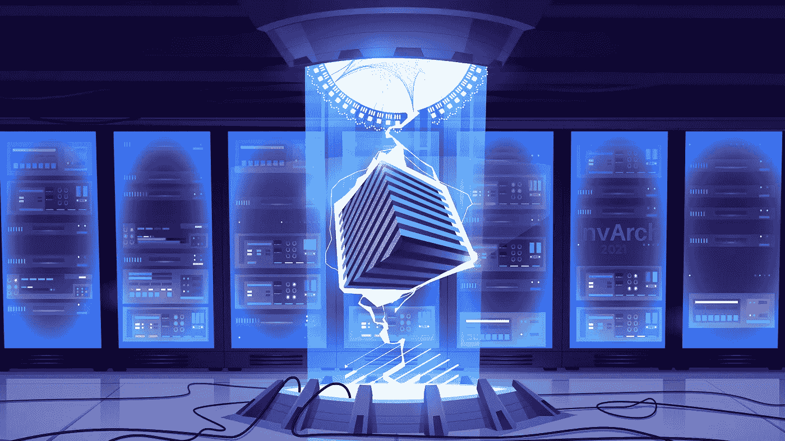

# 因瓦赫协议——愿景、效用、唯一性

> 原文：<https://medium.com/coinmonks/the-invarch-protocol-vision-utility-uniqueness-a58a225827ba?source=collection_archive---------6----------------------->

InvArch 将自己定义为 Polkadot 和 Web3 的知识产权(IP)所有权、效用和跨链认证协议。本文将探讨该项目的愿景、实用性和独特性。

# 视力

因瓦奇背后的团队有着改变世界的远见，一次一个想法。因此，如果我们回顾一下因瓦赫项目第一个想法诞生的 2017 年，我们会更好地理解它。因瓦奇的创始人达科塔·巴尼特在一次 AMA 上透露了这一点。
他的一个朋友向他推荐了一款听起来不可思议并且会改变世界的新型汽车。于是达科塔问他的朋友:“你为什么不能让它发生？”
“我没有钱或工程技术来实现它”这个答案会在达科塔的脑海中闪现出最初的想法和最初的概念，即殷瓦奇会发展成今天的样子。即一个解决这个众所周知的问题的项目:每个人都充满了伟大的想法；不幸的是，大多数人往往缺乏实现创新的技能和资源，他们的想法也逐渐消失。但是时机还不成熟。
快进到几年后，当区块链技术处于上升阶段，Web3 处于领先地位时，Dakota 发现了 Polkadot，因为他对区块链技术的能力着迷。他看到了 NFT 令人兴奋的力量以及它们目前是如何被使用的，并意识到 NFT 正是因瓦奇所需要的缺失部分。将任何文件标记和存储为知识产权的能力。第二个想法是当他问自己:“为什么不把 NFTs 应用到艺术以外的领域？”
现在我们在这里，距离因瓦奇的发明已经过去了几个月，成为一个更加突出和需要的解决方案，以保护你的知识产权，并赋予你对你的想法的权力。
项目名称“InvArch”代表发明、建筑、技术。想象一下他们和想法之间的桥梁，加速创新并允许个人使用他们的想法使世界变得更美好，一次一个想法！那是因瓦奇的设想！

# 效用

InvArch 允许用户永久存储和保护他们的知识产权文件(IPF ),验证他们的所有权和数据的真实性。

InvArch 使用户有可能将他们的文件组合成可互换的集合，并利用与这些集合挂钩的可替换和可编程的令牌。

InvArch 将在整个 Polkadot 生态系统中扩展这一功能，并创建世界上第一个跨链认证协议。那可不是小事；将有可能细分任何东西的所有权，并鉴定任何东西的原创性。

还有其他与 InvArch 的本机令牌 vArch 相关的特殊用例。首先，它是通过使用该协议构建的应用程序产生的网络费用所需的货币。它代表对协议治理的投票权重**；**它用于创建和认证知识产权文件(IPF)。最后，它不仅用于 collator staking，还用于一个叫做 IP Staking 的奇妙的融资机制。

# 独特性:

没有其他广泛的 IP 实用程序协议。至少没有可定制的实用程序。InvArch 的独特之处，除了在设计上的独创性，还在于可互操作 IP 的力量。

InvArch 是独一无二的，因为 1)IP 文件是可互操作的，2)因为 InvArch 引入了世界上第一个跨链认证机制，这是世界上没有其他项目关注的。实际上确保了文件的唯一性。

想法是我们最丰富的自然资源，可以说是我们最强大的，但讽刺的是，也是我们最无用的。就像《达科塔的生活》开头的轶事显示的那样，如果没有一个繁荣、受保护和用于合作的环境，大多数想法都会死去。

InvArch 希望将我们的想法变成现实，让它们变得有价值和可互操作。因瓦奇制造知识产权数字资产。

访问因瓦赫官方渠道:
[**网站**](https://invarch.network/)[**推特**](https://twitter.com/InvArchNetwork)[**不和**](https://discord.gg/J5Qwcb7tbN)】[**子社会**](https://app.subsocial.network/5857)】[**中**](https://invarch.medium.com/)[**电报**](https://t.me/InvArch)[**Github**](https://github.com/Invarch)

# web 3 # NFTs # DAOs # Polkadot # Innovation # Technology # Startups # Crypto # Crypto currency # gems # IP # intellectual property # art # ideas # dev # Devs # Developers # Git # Github # Parachain

> 加入 Coinmonks [电报频道](https://t.me/coincodecap)和 [Youtube 频道](https://www.youtube.com/c/coinmonks/videos)了解加密交易和投资

# 另外，阅读

*   [如何购买 Monero](https://coincodecap.com/buy-monero) | [IDEX 评论](https://coincodecap.com/idex-review) | [BitKan 交易机器人](https://coincodecap.com/bitkan-trading-bot)
*   [CoinDCX 评论](/coinmonks/coindcx-review-8444db3621a2) | [加密保证金交易交易所](https://coincodecap.com/crypto-margin-trading-exchanges)
*   [红狗赌场评论](https://coincodecap.com/red-dog-casino-review) | [Swyftx 评论](https://coincodecap.com/swyftx-review) | [CoinGate 评论](https://coincodecap.com/coingate-review)
*   [Bookmap 点评](https://coincodecap.com/bookmap-review-2021-best-trading-software) | [美国 5 大最佳加密交易所](https://coincodecap.com/crypto-exchange-usa)
*   [如何在 FTX 交易所交易期货](https://coincodecap.com/ftx-futures-trading) | [OKEx vs 币安](https://coincodecap.com/okex-vs-binance)