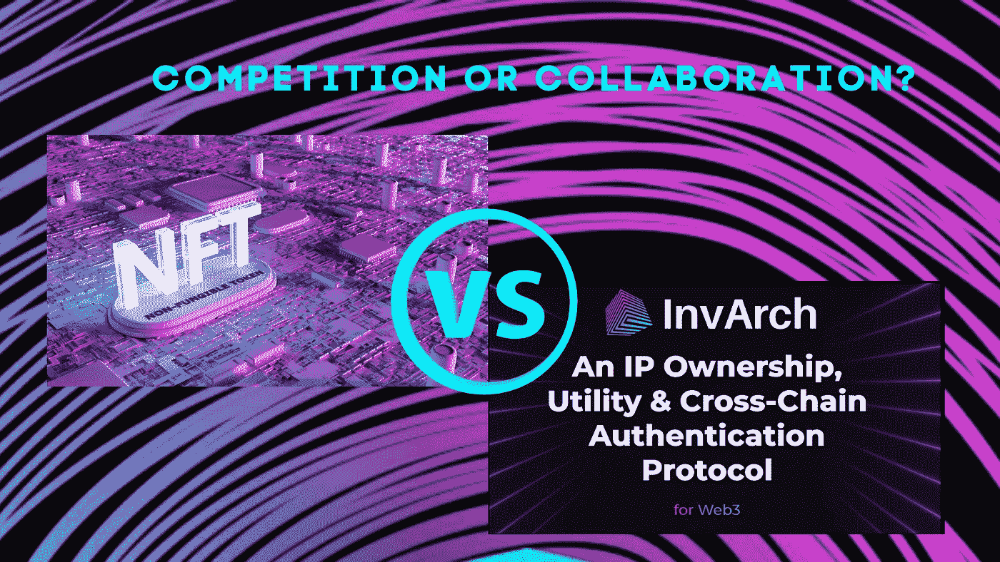

# InvArch 协议 x NFTs

> 原文：<https://medium.com/coinmonks/the-invarch-protocol-x-nfts-24e5b67c6b2?source=collection_archive---------67----------------------->

## 竞争还是合作？

## **NFT 技术**

NFT 代表一种不可替代的象征。这意味着隐藏在这些非常规艺术品中的一个独特且不可互换的数据单元存储在一个数字账本上，使用区块链技术来建立所有权的证明。因此，NFT 已经成为具有收藏价值的数字资产。

NFTs 类型很多:摄影、美术、音乐、视频文件；甚至推特和迷因。基本上，你可以从几乎任何独特的数字存储和持有价值。它们就像油画、老式动作玩偶或任何其他收藏家的物品。然而，你购买的不是实物，而是一份文件和证明你拥有原版的证据。不幸的是，许多人误解了这一点，认为它们没有任何价值，因为任何人都可以通过右键单击并保存一幅罕见的 NFT 的图像来成为百万富翁。然而，保存的图像将仅仅是原始作品的 JPG 形式的拷贝；它不是 NFT 本身，因为文件不包含使其成为区块链的一部分并将其识别为原件的信息。

NFT 在所有领域的艺术家、游戏玩家和品牌中都有一席之地。例如，音乐人将他们的作品和短视频的版权和原件出售给他们的音乐片段。从技术上来说，任何人都可以创作一件艺术品，把它变成区块链上的 NFT(这个过程被称为“铸造”)，并在自己选择的市场上出售。然而，隐藏的费用可能是巨大的，特别是在以太坊区块链，网站对每笔交易收取汽油费(完成交易所需的能源价格)，以及买卖费。这意味着费用的成本可能会高于你出售 NFT 的价格。

## 应用于知识产权的 NFT 技术

InvArch 创始人 Dakota Barnett 注意到了 visional always 2017 令人兴奋的 NFT 功能以及它们目前的使用情况。他意识到 NFT 正是因瓦奇所需要的缺失部分。InvArch 的联合创始人和高级防锈工程师 Gabriel Facco de Arruda 加入达科他州正是为了给 NFT 提供他们应得的效用。

现在他们和优秀团队的其他成员一起走过了那段路。他们真的为区块链工业创造了一个全新的领域！

因瓦奇利用了 NFT 的令人兴奋的力量，并将其应用于艺术之外的领域；该协议允许用户标记和存储知识产权。

知识产权(IP)是思想的创造，如发明、文学作品和艺术作品。也就是说，知识产权可以是任何东西，从 JPEG、音频文件、蓝图、商业秘密、源代码、项目草图、视频、一段音乐，到由大量相互依赖的文件组成的计算机程序。只要 IP 存在或者能够以文件和/或文件夹的形式存在，就可以使用 InvArch 对其进行标记化。该团队希望 IP 令牌化的障碍尽可能低，过程尽可能平稳！

InvArch 以增强的 NFTs 形式标记和存储知识产权，现在称为知识产权文件(IPFs)。

## 作为增强的 NFT 的知识产权文件(IPF)

谈到 NFTs，InvArch 并没有试图重新发明轮子。IPF 是 NFT。该协议采用了 NFT 技术，并在几个重要方面建立在它的基础上。因瓦奇推动了 NFT 技术的发展，开启了实用性，并为一些现实世界的破坏提供了一种机制。

IPF 是不可替代的资产，用于证明数字文件的存在和真实性(与所有权相比)，保护资产的唯一性，并简化其管理权限。IP 文件元数据包括唯一且自动分配的链上 id、可互换的集合 id、可选的分类标签、版权许可协议、托管文件的链接和跨链身份验证(XCA)状态。

与 IP 文件相比，有两种不同的直接查看 NFT 的方法。首先，IP 文件以一种分散、不可信和透明的方式得到身份验证和主动保护。

其次，由于 Web3 中已经存在大量的 NFT，InvArch 也可以在 NFT 标准中实现，作为支持这些标准的核心托盘:相同的 NFT，增加了一层基于散列的标识符和新的功能。通过这种方式，InvArch 可以直接通过与其他链的模块集成来扩展其本地 IP 技术，并为预先存在的 NFT 提供资产认证。InvArch 旨在与 NFT 项目共存，但不仅仅被视为另一个项目。

IPF 在 InvArch 协议中并不是孤立的，它们本质上与知识产权集(IPS)、知识产权令牌(IPTs)和跨链认证协议相关联。

**知识产权令牌(IPTs)——IPFs 的共享所有权**

ip 地址确认对 IP 地址集的所有权或权利，它可以在多个地址或所有者之间划分。它们是完全可编程的，IP 集的创建者定义 IP 令牌的效用和用例。

每个 IP 集的 IP 令牌数量由其创建者定义，但它可以由 IPT 持有者通过投票进行更改。

与知识产权集挂钩的知识产权协议可以提供一系列不断发展的功能，如简化的版税分配和版权协议、链接知识产权的访问权、部门所有权、管理项目的投票权重、组内准入、与知识产权集挂钩的货币。

通过 IPTs，创建“百分比所有权”允许用户拥有特定份额的不同 IP/IP。

**全球首个 IP 跨链认证协议& NFTs**

互操作性对于实现 InvArch 将 IPF 视为增强型 NFT 的愿景至关重要。因瓦奇比 NFT 平台要深得多。波尔卡多特之于其他副链，就像因瓦奇之于 NFTs。InvArch 允许认证任何文件，甚至是其他集成链上的其他 NFT。互操作性、跨链消息(XCM)是 Polkadot 中继的关键特征。通过展示这项技术的重要性，通过自己的设计，通过验证跨 Parachains 的 IP，InvArch 将突出这些属性。通过其他 Parachains 引入 IP 托盘模块将使 InvArch 成为世界上第一个 IP 跨链认证(XCA)协议。XCA 是一种跨链协议，用于索引、引用和验证不可替换的数字资产，并保护它们免受未经授权的复制、拷贝或任何其他访问。

XCM 是共识系统之间的数据交叉共识通信的格式，可以在链、智能合约、托盘、桥和分片飞地之间进行。

这种跨链交叉引用机制不同于今天在任何其他 NFT 平台上看到的任何东西。同样值得注意的是，InvArch 并不打算取代其他 NFT 平台。假设有一天，RMRK NFT 可以被铸造成 IPF，在另一条副链上使用 InvArch 或我们的 IP 托盘模块。在这种情况下，RMRK NFT 创作者将在生态系统内获得安全，防止其他内容创作者实质上复制他们的作品，无论是作为 JPEG 格式还是作为元宇宙中的一部分游戏内容。此外，另一个很大的区别是，IPF 所属的 IP 集或集合可以互换，这意味着它可以自由地转移和应用到其他 IP 集。对于开发人员来说，这非常强大，因为它简化了可组合的、可互操作的和跨实用程序的用例。

我们的目标是在所有的 Web3 InvArch 上建立一个协议，为每个文件创建一系列基于散列的标识符，如 CID 散列和 SimHashes，为每个存在的文件创建一个真实的、自动的、不可信的数字指纹。指纹将被索引并相互交叉引用，无需应用程序用户的任何通知。几秒钟后，文件自动更新为“已验证”状态或“已标记”状态(尽管对于其他用例及实例，还存在其他状态)。最后，所有未经许可而被标记、复制或使用的文件都自动失效。在这个世界里，开源知识产权和社交协作可以携手共存，而没有信任的负担。那是因瓦奇的任务。

## 结论

NFT 技术是实现不变视觉的关键。然而，该协议不仅仅是另一个 NFT 项目。在加密领域，人们认为项目之间有太多的对立。InvArch 遵循 Polkadot 的精神，并希望与其他项目合作，以加快创新。InvArch 利用 NFT 的潜力，将其应用于任何知识产权，将其存储为称为 IPF 的增强型 NFT，允许它们以 IPSs 的形式组合，并使用 IPTs 简化版税共享。最后，InvArch 将其神奇的技术与 Polkadot 的安全性和互操作性相结合，为 Web3 创建了世界上第一个 IP 所有权、效用和跨链认证协议。

访问因瓦赫官方渠道:
[**网站**](https://invarch.network/)】[**推特**](https://twitter.com/InvArchNetwork)**不和**】[**亚社会**](https://app.subsocial.network/5857)】[**中社会**](https://invarch.medium.com/)[**电报**](https://t.me/InvArch)[**Github**](https://github.com/Invarch)】

— — — — — — — — — — — — — — — — — —

> 加入 Coinmonks [电报频道](https://t.me/coincodecap)和 [Youtube 频道](https://www.youtube.com/c/coinmonks/videos)了解加密交易和投资

# 另外，阅读

*   [币安 vs FTX](https://coincodecap.com/binance-vs-ftx) | [最佳(SOL)索拉纳钱包](https://coincodecap.com/solana-wallets)
*   [比诺莫评论](https://coincodecap.com/binomo-review) | [斯多葛派 vs 3Commas vs TradeSanta](https://coincodecap.com/stoic-vs-3commas-vs-tradesanta)
*   [Capital.com 评论](https://coincodecap.com/capital-com-review) | [香港的加密借贷平台](https://coincodecap.com/crypto-lending-hong-kong)
*   [如何在 Uniswap 上交换加密？](https://coincodecap.com/swap-crypto-on-uniswap) | [A-Ads 审查](https://coincodecap.com/a-ads-review)
*   [WazirX vs coin dcx vs bit bns](/coinmonks/wazirx-vs-coindcx-vs-bitbns-149f4f19a2f1)|[block fi vs coin loan vs Nexo](/coinmonks/blockfi-vs-coinloan-vs-nexo-cb624635230d)
*   [本地比特币评论](/coinmonks/localbitcoins-review-6cc001c6ed56) | [加密货币储蓄账户](https://coincodecap.com/cryptocurrency-savings-accounts)