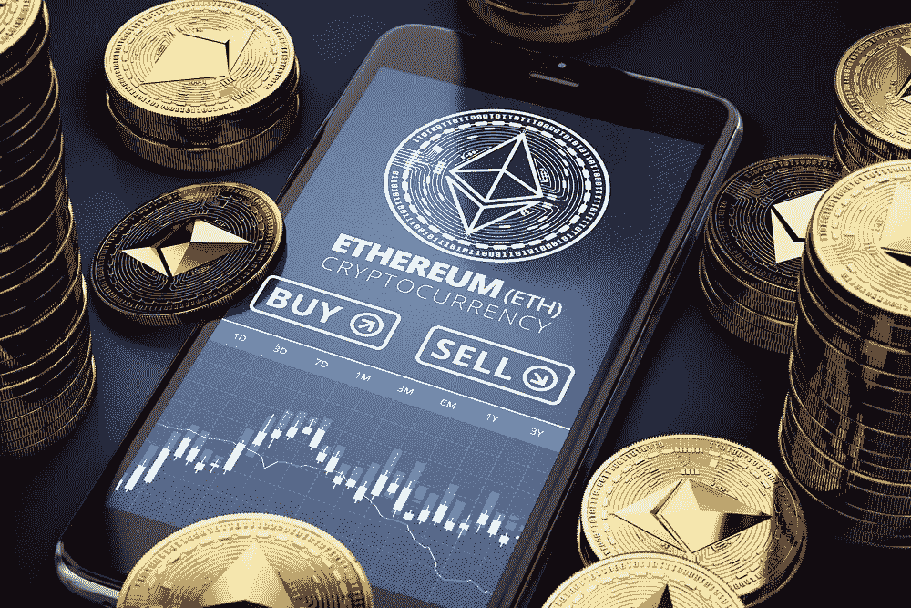
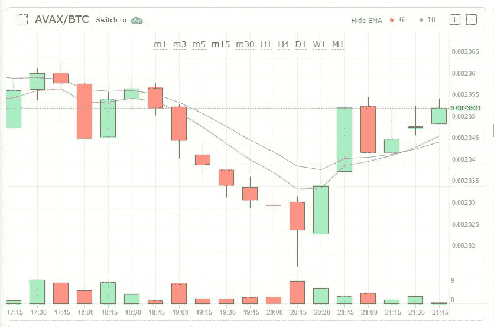

# 永远改变了我生活的投资建议

> 原文：<https://medium.com/coinmonks/the-investing-advice-that-changed-my-live-forever-594a19117451?source=collection_archive---------45----------------------->

你有没有听过一点投资建议，一直萦绕在你的脑海里，你就是无法把它说出来？越想越觉得有道理。然后你决定采取行动，它会改变你投资的方式，并有可能永远改变你的生活。

我就是这样。这是我的故事。

# “富爸爸”的故事

你知道在投资界谁会受到很多指责吗？罗伯特 T 清崎。他是畅销书《富爸爸，穷爸爸》的作者。如果你不喜欢略显陈旧的金融书籍，那么你可能很难读懂他的一些作品。我承认，他是如何通过出售印有世界自然基金会(WWF)字样的尼龙运动钱包赚了数百万美元的详细例子很难理解。

但是他的一本书有着难以置信的价值，我一遍又一遍地听他的书:*富爸爸投资指南* ( [亚马逊](https://amzn.to/355vLDi)——赚取佣金)。

在书中，他打破了一个单一的概念。世界上富有且经济独立的人投资于一件事:

> 创收资产

好的，这很简单。但这意味着什么呢？

# 什么是创收资产？

有大量的创收资产。以下是书中的一些例子(以及我自己的生活经验——我拥有所有这些例子)。

## 1.租赁房地产(出租的财产)

如果你拥有一处出租的房产(即有人付钱让你居住或用于其他目的，如做生意)，那就是一项创收资产。你可能希望租金能覆盖任何运营成本或债务偿还，但否则就会赔钱而不是赚钱。

Investing in Crypto isn’t really income generating and day trading is a quick way to lose money.

## 2.支付股息的股票或基金

您知道现在有超过 7000 只 ETF(交易所交易基金)吗？这些几乎涵盖了世界上的每一个领域——房地产、大宗商品、市场指数等等。许多这类交易所交易基金每年都会向你返还一部分利润。这就是所谓的“红利”，你可以用它来投资更多的钱。如果你也持有许多公司的股票，它们也会这么做。可口可乐公司(Coca Cola)多年来一直在增加股息。

## **3。你自己的生意**

如果你把钱投资到一个企业，然后赚取利润，那么你就有了另一项创收资产。你可以拥有哪种类型的企业属于这一类别？理想情况下，企业应该是可扩展和可销售的。

Stock graphs are cool but you don’t have to understand what all the numbers mean. It took me a while to figure this out.

# 不产生收入的资产

你知道什么不是创收资产吗？乐高。

咄！但在我解释的时候，请听我解释。我最近发现一些乐高真的很有收藏价值。侏罗纪世界主题的乐高尤其受追捧。零售价为 20 至 50 英镑的电视机售价高达数百英镑。

如果你买了那些电视机，不拆封，然后卖掉，你会有一笔可观的利润。但是这些资产并没有产生收入。释放资金的唯一方法是将其变现(即出售)。黄金、你住的房子、艺术品、现金都是不产生收入的资产。

所以想一想——你可以改变什么来投资创收资产？有什么经验(给我留个评论)。

*(本帖出于娱乐目的，非投资建议。就这样。)*

> *加入 Coinmonks* [*电报频道*](https://t.me/coincodecap) *和* [*Youtube 频道*](https://www.youtube.com/c/coinmonks/videos) *了解加密交易和投资*

# 另外，阅读

*   [3 商业评论](/coinmonks/3commas-review-an-excellent-crypto-trading-bot-2020-1313a58bec92) | [Pionex 评论](https://coincodecap.com/pionex-review-exchange-with-crypto-trading-bot) | [Coinrule 评论](/coinmonks/coinrule-review-2021-a-beginner-friendly-crypto-trading-bot-daf0504848ba)
*   [莱杰 vs n rave](/coinmonks/ledger-vs-ngrave-zero-7e40f0c1d694)|[莱杰 nano s vs x](/coinmonks/ledger-nano-s-vs-x-battery-hardware-price-storage-59a6663fe3b0) | [币安评论](/coinmonks/binance-review-ee10d3bf3b6e)
*   [Bybit Exchange 审查](/coinmonks/bybit-exchange-review-dbd570019b71) | [Bityard 审查](https://coincodecap.com/bityard-reivew) | [Jet-Bot 审查](https://coincodecap.com/jet-bot-review)
*   [3 commas vs crypto hopper](/coinmonks/3commas-vs-pionex-vs-cryptohopper-best-crypto-bot-6a98d2baa203)|[赚取加密利息](/coinmonks/earn-crypto-interest-b10b810fdda3)
*   最好的比特币[硬件钱包](/coinmonks/hardware-wallets-dfa1211730c6) | [BitBox02 回顾](/coinmonks/bitbox02-review-your-swiss-bitcoin-hardware-wallet-c36c88fff29)
*   [BlockFi vs 摄氏度](/coinmonks/blockfi-vs-celsius-vs-hodlnaut-8a1cc8c26630) | [Hodlnaut 点评](/coinmonks/hodlnaut-review-best-way-to-hodl-is-to-earn-interest-on-your-bitcoin-6658a8c19edf) | [KuCoin 点评](https://coincodecap.com/kucoin-review)
*   [Bitsgap 评审](/coinmonks/bitsgap-review-a-crypto-trading-bot-that-makes-easy-money-a5d88a336df2) | [Quadency 评审](/coinmonks/quadency-review-a-crypto-trading-automation-platform-3068eaa374e1) | [Bitbns 评审](/coinmonks/bitbns-review-38256a07e161)
*   [加密复制交易平台](/coinmonks/top-10-crypto-copy-trading-platforms-for-beginners-d0c37c7d698c) | [Coinmama 审核](/coinmonks/coinmama-review-ace5641bde6e)