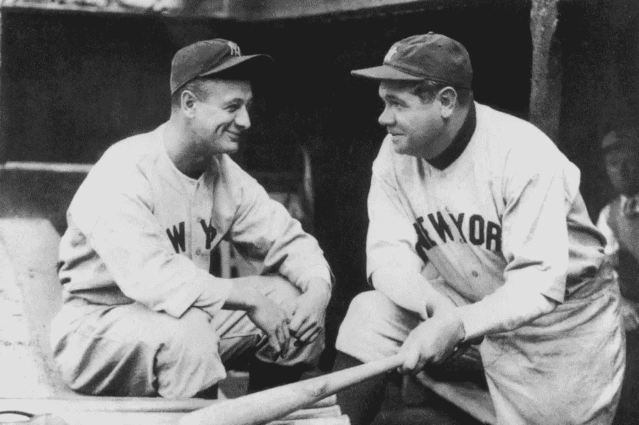

# 铁马和伟大的班比诺

> 原文：<https://medium.com/coinmonks/the-iron-horse-and-the-great-bambino-409a04a8db25?source=collection_archive---------35----------------------->

## 1930 年，纽约扬基队以 17 比 2 击败克利夫兰印第安人队

如果你问任何一个不是棒球迷的人，他们会提到贝比·鲁斯和卢·格里克。他们甚至可能知道他们的绰号(“伟大的班比诺”、“斯瓦特的苏丹”和“铁马”)，但从未见过他们演奏。

贝比·鲁斯和卢·格里克如此出名是有原因的。毕竟，“铁马”的绰号不是白得的。在他的职业生涯中，格赫里希连续打了 2130 场比赛，没有错过一场比赛，这个记录保持了 56 年。如果他没有在那么年轻的时候被迫退役，他可能会打得更多(并且至今仍保持着记录)。格赫里希还连续七次入选全明星，赢得了三冠王(在击球率、本垒打和击球得分方面领先于大联盟)，两次成为美国联盟最有价值球员，并且是六支赢得世界大赛的球队的成员。

格赫里希的职业生涯数据几乎每一个命中统计都是超凡脱俗的。他的职业生涯平均打击率为 0.340，这个数字如果你只达到一次就能让你成为全明星，更不用说整个职业生涯了。他总共打出了 493 支全垒打，1，995 分打点，0.632%的击球率和 0.447%的上垒率，所有这些都是在他短暂的职业生涯中完成的。直到今天，格赫里希每 100 次出场和每 100 场比赛的得分和击球次数都是名人堂中最高的。在被打破之前，他还保持了近一个世纪的职业生涯大满贯纪录。

如果你能想象的话，乔治·赫尔曼·“宝贝”·鲁思甚至更出名。鲁斯是公认的棒球史上最伟大的球员，他不仅是无可争议的棒球之王，也是对现代棒球运动影响最大的人。在露丝的职业生涯之前，棒球通常像一场草地和泥土上的国际象棋比赛。击球手会试着上垒，然后通过牺牲高飞球、短打、保送球和滚地球逐渐前进，直到挤出一分。大多数经理认为本垒打是一种新奇的东西，而不是一种策略。贝比·鲁斯改变了这一切。他的力量是如此引人注目，以至于他使力量打击成为一种合法的策略，这种策略至今仍是游戏的一个重要(和取悦大众)部分。在统计层面上，露丝 12 次赢得棒球的本垒打冠军，(包括一次作为投手)，并且是第一个在一个赛季中获得 20，30，40，50，最终 60 个本垒打的球员。他不仅仅是一个击球手，他也很稳定，职业生涯的击球率为 0.342，打击率为 0.690%。他还打出了创纪录的 714 支全垒打，2，873 支安打，506 支二垒打，得分 2，174 分，2，214 分打点，以及 0.474 的上垒率，获得了 12 个全垒打冠军，6 个打点冠军和 7 个世界大赛冠军。这只是他的打击。在今天的比赛中闻所未闻的壮举，他也是这项运动中最好的投手之一，后来成为最伟大的击球手，保持着左手投手最高胜率的记录。

但是露丝的影响超出了领域。他可以说是体育界的第一个名人运动员。他的名气为现代体育名人铺平了道路，并为当今世界体育明星的奉承和大亨级薪酬创造了典范。

格赫里希和露丝都是纽约扬基队著名的“杀人犯行列”阵容的一部分，这一阵容的特点是未来名人堂的一大群骨干，他们是如此令人害怕，以至于没有投手愿意面对他们中的任何一个，更不用说全体了。不管他们是第一名还是第四名，他们都是没人想面对的球队。

一般来说，棒球是出了名的缓慢和低得分的运动。得分很难获得，比赛往往以最小的差距获胜。事实上，3-2 是棒球历史上最常见的比分。但是 20 世纪 20 年代末和 30 年代初的扬基队不是一支普通的球队。特别是在 1930 年 6 月 15 日的一场比赛中，扬基队彻底击败了克利夫兰印第安人队，这更像是一场足球比赛的比分。在那场比赛中，扬基队对一个倒霉的印第安队得了 17 分。刚刚从两天前的伤痛中恢复过来的印第安人队进入克利夫兰的联盟公园，希望能有一个更好的结果。但是 1930 年的扬基队再一次让凡人印第安人难以招架，扬基队连续第二场比赛得了 17 分，以 17 比 2 获胜，格赫里希 6 投 4 中有 4 分打点，得了 3 分，露丝自己又添了一支安打，两次保送和两次跑垒得分。此外，未来的名人堂成员厄尔·库姆斯五投四中，得了四分，并在另一场比赛中击球。

然而，值得注意的是，当洋基队在第五局已经以 10 比 2 领先时，当卢·格里克在两人出局和两人在垒的情况下上场时，他们还没有击出全垒打。观众全神贯注地看着“铁马”站出来面对投手丘上的肯·霍洛威。格赫里希凝视着霍洛韦，击出了一个越过右外野墙的本垒打，这将是这场比赛中唯一的一个本垒打。对今天的体育迷来说，幸运的是，四岁的泰勒·斯派德和他的祖父 g·泰勒·赖特那天在右看台观看了比赛。当格赫里希的本垒打越过右外野栅栏时，敏捷的爷爷接住了球，把它交给了泰勒。但是他们在公园观看历史上最伟大的球队之一的一天还远远没有结束。比赛结束后，他们在更衣室门外等待，最终不仅得到了本垒打手格赫里希本人的签名，还得到了贝比·鲁斯、厄尔·库姆斯和其他未来名人堂成员乔·休厄尔和赫伯·彭诺克等人的签名。这个球代表了格赫里希在 1930 年赛季的第 18 个本垒打，也是他名人堂生涯的第 164 个本垒打。球上还有比赛日期，以及赖特写在球上的分数。

这个时代幸存下来的本垒打非常罕见。而被“铁马”本人打中的，出处经过核实的，一只手就能数出来。格赫里希，露丝和其他名人堂成员的签名验证的添加使这一历史意义重大，博物馆质量的资产真正独一无二。该球附有一份完整的 PSA/DNA 真品证书和一份 JSA 真品证书。它还附有一封辛迪·赖特的来信，辛迪·赖特是泰勒·斯派德的女儿，g·泰勒·赖特的曾孙女辛迪·莫耶，讲述了那个非常特殊的日子的故事。

RareMint 正在发行一款高度限量的 NFT 系列，以这支独特难忘的全垒打和历史悠久的扬基队为基础。将发行一张 12k 拍摄的“极其罕见”的 NFT 照片，以 3D 形式描绘每个细节，将独一无二的签名本垒打球的所有权授予其持有者。此外，还将推出基于这一标志性收藏品的“限量版”纪念 NFT。这是一个拥有自己的棒球历史的机会，也是拥有卢·格里克、贝比·鲁斯、厄尔·库姆斯和 20 世纪 30 年代初强大的纽约扬基队的不朽遗产的机会。

在[RareMint.com](http://raremint.com)亲自看看这件非凡的作品

## 保持联系✨

在 [twitter](https://twitter.com/RareMint_nft) 和 [Discord](http://discord.gg/raremint) 上关注我们最新的稀有更新。

请务必在 [RareMint](http://raremint.com/) 查看我们最新的市场列表！

请务必在 [RareMint](http://raremint.com/) 查看我们最新的市场列表！