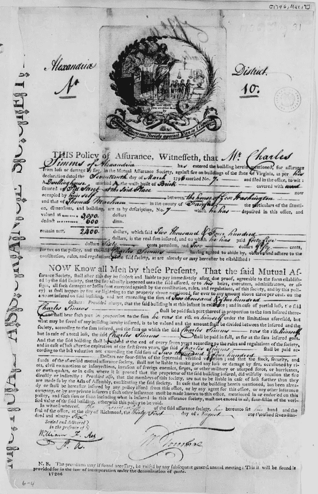

# 集中化的问题是快速增长的加密保险业所关心的问题

> 原文：<https://medium.com/coinmonks/the-issue-of-centralization-is-a-concern-for-the-rapidly-growing-crypto-insurance-industry-2a4289e2957c?source=collection_archive---------74----------------------->

**For full blog visit:-**[**https://bitcoinsupports.com/the-expanding-crypto-insurance-business-is-confronted-with-the-issue-of-centralization/**](https://bitcoinsupports.com/the-expanding-crypto-insurance-business-is-confronted-with-the-issue-of-centralization/)

加密货币保险预计将是一项大业务:它将是分散的还是集中的？随着更多高级参与者涉足年轻的生态系统，近年来对加密保险解决方案的需求不断增长。

据 Investopedia 报道，加密货币保险被视为一个“巨大的机会”，全球最大的保险公司之一安联保险公司的发言人表示，随着加密货币在实体经济中变得“更加相关、重要和普遍”，该公司已经研究了产品和覆盖范围选项。

即使在著名的加密货币交易所，加密货币生态系统仍被视为危险和不稳定的，资金并不完全安全。虽然一些平台，如比特币基地，已经披露他们通过特定的保险公司提供热门钱包保险，但大多数平台都没有明确表示放在那里的资金是否有保险。

保险公司在这个行业面临独特的障碍。一方面，保险费经常使用历史数据来确定，这在加密货币业务中非常稀缺，在非伪造代币(NFT)等新领域则完全缺失。

尽管如此，在密码交易市场上还是有保险需求的。基于分散自治组织(Dao)的分散解决方案已经形成，如 Nexus Mutual，Crypto.com 已将其保险政策增加到 2021 年覆盖 7 . 5 亿美元。

数字支付平台 Wirex 的首席产品官托尼·李斯(Tony Lees)告诉记者，加密货币领域“真正大规模采用”的主要障碍之一是人们认为它“不可信、不安全”。

根据李斯的说法，大多数用户认为他们的储蓄处于危险之中，投资加密资产比投资普通股票风险更大。据李斯称，行业标准合规性和其他法律帮助平台展示了消费者的现金是如何得到保护的。李斯表示，

> “有了 Fireblocks 这样的保管平台，Wirex 这样的组织可以证明严格的程序和控制已经到位，可以让用户放心。”

Coinstream 的首席执行官兼加拿大加密交易所 Netcoins 的创始人迈克尔·沃格尔(Michael Vogel)呼应了李斯的观点，他说加密代表了一种与投资者习惯的“非常不同的风险范式”，因为没有人会担心“他们的特斯拉股票从在线经纪账户中消失。”

根据 Vogel 的说法，许多用户对于为他们的货币安全负责感到不安。因此，市场正在开发“托管型解决方案”，由一家声誉卓著的机构作为加密银行运营。

他认为，保险公司可能会制定明确的规则，让托管人遵循，以便在这个国家获得保险资格。此举可能会给该领域的投资者带来一些安慰。据李斯说，大多数人都知道金融服务赔偿计划，该计划在英国覆盖高达 104，000 美元，在美国覆盖 85，000 英镑，在美国覆盖高达 100，000 美元的联邦存款保险公司。

根据李斯的说法，这些策略让投资者更容易把钱存在银行里。用户在集中平台上的资产将受到加密保险的保护，这将提供“那种熟悉的、传统的针对黑客或网络攻击的保险”

进入像安联这样的中央集权机构的领域只会增强熟悉感。根据加密货币交易所 KuCoin 首席执行官 Johnny Lyu 的说法，虽然加密生态系统需要保险，但大多数参与将来自处于早期发展阶段的中央机构。

根据 Lyu 的说法，随着该行业的成熟，分散化选项正在日益改善。他说，“整个加密环境的发展和改善”将决定这些平台是否能够真正去中心化。集中式和分散式实体目前都面临着问题。

**For full blog visit:-**[**https://bitcoinsupports.com/the-expanding-crypto-insurance-business-is-confronted-with-the-issue-of-centralization/**](https://bitcoinsupports.com/the-expanding-crypto-insurance-business-is-confronted-with-the-issue-of-centralization/)

# 使用加密货币的信心

克服这些障碍可以鼓励更多投资者参与加密货币，并获得新兴资产类别的风险敞口。

沃格尔表示，欺诈是比特币行业保险公司的一大担忧。沃格尔指出，“保险的具体好处是，如果你的房子被烧毁，它可能会被重建，”作为一个例子。他声称，总的结果是，个人最终仍会有一个家。另一方面，区块链的混淆可能导致特定类型的欺诈。沃格尔继续说道:

> 一个秘密保险骗子可能会在获得保险利益的同时，将他们的硬币双浸、隐藏或模糊化

根据李斯的说法，比特币行业迄今为止最大的问题是“向一个新的未知领域提供既定服务，特别是在技术方面。”Lees 同意 Vogel 的观点，指出在区块链追踪资金的困难“引起了保险公司的担忧”他指出，近年来，强大的了解你的客户(KYC)检查已成为“加密提供商的必要条件”，他们与 Chainalysis 和 Elliptic 等区块链取证公司的合作使“加密地址之间的交易更容易跟踪”

李斯现在预计，该行业的整体风险将进一步降低，这使得“保险公司更容易理解和承保。”他说，最终，保险公司将“通过为消费者和企业提供在这个领域运营的信心，在未来实现完全数字化的经济中发挥关键作用。”

这种保证首先来自集中的保险公司，因为分散的替代方案尚未广泛使用，在变得普遍之前可能需要进一步改进。

# 智能合同的风险

在过去的几个月里，分散的保险解决方案一直在使用。Nexus Mutual 是一家受欢迎的分散保险提供商，目前在多个项目中承保约 4 亿美元的以太网(ETH ),而 InsurAce 声称已承保超过 3.4 亿美元。

区块链安全初创公司 GK8 的首席执行官兼联合创始人 Lior Lamesh 告诉记者，加密生态系统需要为分散的协议和最终用户提供保险。Wile Lamesh 指出“自动化、分散化的保险工具确实会派上用场”，他们自己可能也需要保险。

去中心化的保险工具可能会有“可供黑客利用的漏洞”，因为它们是协议层的一部分，并且依赖于智能合约，而智能合约可能会因人为错误而失败。根据拉梅什的说法，该协议的一个重大弱点可能是，它在给用户造成损失后掩盖了自己的失败，“为新用户创造了有利可图的卖点。”他继续说道

> “理论上，我们可能会陷入一个为其他智能合约提供保险的智能合约圈，但我预计中央保险公司会在某个时候参与进来。”

因此，crypto 首席执行官预计，随着他们对区块链技术的理解不断加深，并保持其市场领先地位，更多集中化的保险公司将进入市场，“而分散化的保险解决方案可能需要一些时间来发展，并找出行业的最佳方法。”

他接着说，去中心化金融(DeFi)领域的黑客攻击“每周，如果不是每天”都会发生，这使得去中心化保险协议很难运作，因为它们可能成为黑客的有利可图的目标。他预测，一旦业务成熟，分散式保险“将会起飞”。

# 发展中的工业

随着时间的推移，比特币保险行业已经发展壮大。根据拉梅什的说法，目前的挑战是专业人员“让他们的头脑了解相关的技术”，因为区块链“对于没有计算机科学学位的人来说可能足够令人困惑”

需要“大量专业知识”的 DeFi 协议被加密保险所覆盖。然而，拉梅什认为加密保险市场前景光明，他说:

> **“随着区块链进入主流保险业，去中心化的协议访问人工智能驱动的数据神谕，为我们提供定制的保险计划和我们需要的任何东西，未来可能会令人惊叹。”**

传统公司已经进入加密保险领域，根据李斯的说法，提供“特定数字资产的保险，这取决于它们的维护方式和钱包提供商的合规要求”。李斯认为，随着更广泛的加密领域的发展，“鉴于每个月都有大量新的加密钱包被打开，加密保险市场只会紧随其后。”根据李斯的说法，加密业务必须满足的规则将有一种“传统的感觉”，为保险公司提供他们可以承保控股的信心。

加密保险公司面临的困难可能是保险业务的一个重要资金来源，因为集中化的运营商可能会带着排除该领域特定类型的常见风险(如黑客攻击或智能合同失败)的套餐进入市场。

虽然大多数消费者担心这些风险，但为他们提供可靠保险的集中平台所提供的安心可能足以说服他们进入加密市场。

**完整博客访问:-**[**https://bitcoinsupports . com/the-expanding-crypto-insurance-business-is-facing-the-issue-of-the-issue-of-the-centralization/**](https://bitcoinsupports.com/the-expanding-crypto-insurance-business-is-confronted-with-the-issue-of-centralization/)

**免责声明:这些是作者的观点，不应被视为投资建议。读者应该自己做研究。**

> 加入 Coinmonks [电报频道](https://t.me/coincodecap)和 [Youtube 频道](https://www.youtube.com/c/coinmonks/videos)了解加密交易和投资

# 另外，阅读

*   [3 商业评论](/coinmonks/3commas-review-an-excellent-crypto-trading-bot-2020-1313a58bec92) | [Pionex 评论](https://coincodecap.com/pionex-review-exchange-with-crypto-trading-bot) | [Coinrule 评论](/coinmonks/coinrule-review-2021-a-beginner-friendly-crypto-trading-bot-daf0504848ba)
*   [莱杰 vs Ngrave](/coinmonks/ledger-vs-ngrave-zero-7e40f0c1d694) | [莱杰 nano s vs x](/coinmonks/ledger-nano-s-vs-x-battery-hardware-price-storage-59a6663fe3b0) | [币安评论](/coinmonks/binance-review-ee10d3bf3b6e)
*   [Bybit 交易所评论](/coinmonks/bybit-exchange-review-dbd570019b71) | [Bityard 评论](https://coincodecap.com/bityard-reivew) | [Jet-Bot 评论](https://coincodecap.com/jet-bot-review)
*   [3 commas vs crypto hopper](/coinmonks/3commas-vs-pionex-vs-cryptohopper-best-crypto-bot-6a98d2baa203)|[赚取加密利息](/coinmonks/earn-crypto-interest-b10b810fdda3)
*   最好的比特币[硬件钱包](/coinmonks/hardware-wallets-dfa1211730c6) | [BitBox02 回顾](/coinmonks/bitbox02-review-your-swiss-bitcoin-hardware-wallet-c36c88fff29)