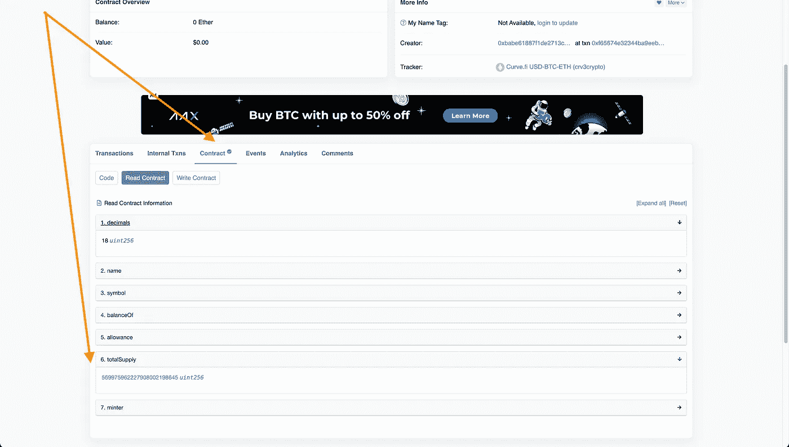

# 定价曲线 LP 代币的乐趣

> 原文：<https://medium.com/coinmonks/the-joys-of-valuing-curve-lp-tokens-4e4a148eaeb9?source=collection_archive---------9----------------------->

我正在做的一个项目是 [Yearner.fi](https://yearner.fi) ，这是一个简单的 PWA 应用程序，旨在使在 Yearn 平台上跟踪投资变得容易。我最近不得不应对的一个挑战是报告将曲线 LP 代币作为可投资资产的渴望金库的收益。

当我们试图确定一个投资金库的收益时，我们需要确定一个投资者的金库代币的价值在一段时间内增加了多少(这可以是整个投资期间，或者任何其他任意期间)。

对我们来说幸运的是，每个渴望金库的智能合同代码都有一个名为“pricePerShare”的功能。顾名思义，这个函数返回单个 vault 令牌的价格。但是，价格是以保险库的基础资产计价的。对于接受常规加密资产(如 ETH、或 DAI)的金库来说，这不成问题，因为我们可以轻松确定这些资产的美元或欧元价格，因此可以用任何货币表示每股价格。

然而，这不适用于将曲线 LP 代币作为可投资资产的金库。曲线 LP 令牌不在主要交易所交易，因此获取这些令牌的价格数据比获取 ETH、或 DAI 等加密资产的价格数据更复杂。

# 曲线 LP 代币？

[曲线](https://curve.fi)是一个去中心化的交易所，最初是为稳定的硬币提供流动性。Curve 的主要目的是让一种稳定的硬币兑换成另一种硬币变得简单而便宜。例如，你会发现有两个或两个以上的稳定硬币固定在同一个法定货币上。当您向其中一个池提供流动性时，您将获得曲线池代币作为回报，这使您有权获得该池中的一部分交易费。

## 曲线与渴望的关系

一些渴望金库会让你存放上述曲线池代币。然后将部署产量耕作策略，以将这些曲线池令牌转化为更多的曲线池令牌。具体如何实现这一点不在本文讨论范围之内(关于高产农业策略的更多信息，请查看[这里](/yearn-state-of-the-vaults/the-vaults-at-yearn-9237905ffed3))，但这确实是神奇的！

## 确定曲线 LP 记号的值

正如我们已经确定的，获取曲线 LP 令牌的价格数据并不简单，因为这些令牌不在典型的加密交易所交易。所以我们不能简单地去查看这些代币的价格。

我们需要采取稍微不同的方法。如果我们可以确定存放在曲线池中的所有资产的总价值，并确定未偿池代币的数量，那么我们可以通过将池的总价值除以未偿代币的数量来确定单个代币的价值。

让我们看一个例子来说明上面的内容。我将使用[曲线 tricrypto 池](https://curve.fi/tricrypto2)来说明这个过程。该池包含三种不同的加密资产:

1.  泰达币
2.  wBTC
3.  以太币

每个曲线池都有两个独立的智能合约与之相关联:一个是促进池中资产之间交易的池合约，另一个是向曲线池中提供流动性(即存款资产)的人发行池代币的代币合约。

# 步骤 1:确定整个曲线池的值

对于这第一步，我们将需要仔细看看池合同。Curve 在其网站上提供了每个曲线池的所有相关数据。当我们打开 tricrypto 池的[曲线页面，并一直滚动到底部时，我们看到曲线为池和令牌合同提供了以太网扫描链接。](https://curve.fi/tricrypto2)

当我们点击页脚中的“池合同”链接时，我们会被带到该合同的 Etherscan 页面。在与智能合约和以太坊钱包、交易等相关的大量有用数据中，以太扫描允许我们直接与智能合约的部分进行交互。要访问智能合同“读取”功能(仅返回数据，但不更改任何区块链数据的功能)，我们单击“合同”按钮，然后单击“读取合同”按钮，如下图所示。

## 曲线池中的资产

我们首先想知道池中有哪些资产。具体来说，我们需要知道他们的智能合同地址，这样我们就可以通过 Etherscan 检索这些资产的数据。

我们将用来检索资产智能合同地址的函数是“coins”。

“硬币”函数采用一个自变量/参数，定义为 *i* (代表*索引*)。通常，这些索引从 0 开始，因此为了获得这个曲线池中的第一个资产，我们输入“0”作为参数，并单击“查询”按钮。然后，该函数将返回第一个资产的智能合同地址；在我们的示例中，这将是[0x d 51 a 44 D3 FAE 010294 c 616388 b 506 acda 1 BFA AE 46](https://etherscan.io/address/0xD51a44d3FaE010294C616388b506AcdA1bfAAE46)。

我们现在可以单击返回的智能合约地址，这将打开一个新的浏览器选项卡，其中包含该智能合约的以太网扫描页面。正如您将看到的，该地址是 USDT 智能合同(Tether)的地址。

接下来，我们想知道这个资产(在这个例子中是 Tether)有多少位于曲线池中。为此，我们将与名为“balances”的“read”功能进行交互。

“balances”函数采用一个名为*的变量/参数，地址为*。在我们的示例中，这将是曲线池的智能合约地址。当我们输入所述地址并点击“查询”时，该函数将返回与曲线 tricrypto 池中的系绳令牌数量相对应的值。

## 关于“balances”(或“balanceOf”)函数的更多信息

USDT 智能合约(Tether)是一种所谓的 ERC20 令牌，这是一种遵循特定规范的智能合约。该规范的一部分是“balances”功能，它允许我们计算某个地址持有多少令牌(请注意，该地址可以是另一个智能合同或“常规”或外部拥有的帐户、地址)。不幸的是，我们不能简单地采用“balances”函数返回的数字，并假设这就是曲线池中 USDT 令牌的确切数量。为了从函数返回的数字得到正确的数字，我们需要确定小数点放在哪里。当查看 USDT 合约的“读取”函数时，我们会看到另一个名为“小数”的函数，它告诉我们在哪里放置小数点。在我们的例子中,“decimals”函数显示的是数字“6”。这意味着我们现在可以获取“balances”函数返回的数字，并将小数点向左移动 6 位:282231824397814(由“balances”函数返回)就变成了 282，231，824.397814。

因此，我们现在知道，在截图拍摄时，曲线 tricrypto 池持有 **282，231，824.397814** (282.23 万)USDT 代币。

到目前为止，一切顺利。剩下的工作就是确定这些代币的美元价值。因为我们知道 USDT 是一个稳定的钉住美元的硬币，我们可以切换到懒惰模式，简单地假设 1 USDT = 1 美元。这是一种方法，而且大多数时候你都是对的。然而，没有人能保证 USDT 是否会永远保持联系汇率制。因此，可以肯定的是，最好在主要交易所或加密价格追踪器上检查加密资产的美元价值。使用 [CoinGecko](https://www.coingecko.com/en/coins/tether) ，我们确定在撰写本文时，1 USDT 确实是 1.00 美元。因此，我们现在知道曲线 tricrypto 池的 USDT 部分价值高达 282，231，824.40 美元(2.8223 亿美元)。

对于曲线池中剩余的两个资产，我们可以遵循相同的过程:wBTC 和 wETH。

回到曲线池智能合约的 Etherscan 页面，我们再次调用“coins”函数，这次使用参数“1 ”,它将返回包装 BTC (wBTC)的智能合约地址。

然后，我们发现 tricrypto 池总共持有 **7130.56588602** wBTC 令牌(请注意，wBTC 令牌契约使用略有不同的 ERC20 版本，因此 balance 函数被称为“balanceOf”而不是“balances”)。在撰写本文时，根据 [CoinGecko](https://www.coingecko.com/en/coins/wrapped-bitcoin) ，wBTC 价格为 39，937.82 美元。7130.56588602 乘以 39，937.82 美元等于 284，779，256.85 美元(2.8478 亿美元)，这是曲线 tricrypto 池中所有 wBTC 代币的美元总值。

这样我们就有了第三个也是最后一个资产。我们。我们再次调用曲线池智能合约中的“硬币”函数，这次使用参数“2”。然后我们可以确定曲线 tricrypto 池中 wETH 令牌的总数，在写这篇文章的时候，这个池中的令牌数为**9111 个**。48661.68668686661CoinGecko 告诉我们，目前 1 wETH 值 2993.27 美元。这使我们得出 Curve tricrypto 池中所有 wETH 令牌的美元总价值为 283，598，424.42 美元(2.836 亿美元)。

## 曲线 tricrypto 池的总值

现在我们有了 tricrypto 池中所有三项资产的美元价值，我们只需简单地将各项资产的价值相加，就可以得到该池的美元总价值:282，231，824.40 美元+284，779，256.85 美元+283，598，424.42 美元=**；850，609，505.67 美元**。

# 步骤 2:确定已颁发的池令牌总数

让我们简单回顾一下最终目标:我们试图确定单个 Curve tricrypto 池令牌的 USD 值。我们通过将整个池的美元价值除以已发行的池代币数量来计算。我们有前者，现在让我们得到后者。

回到 tricrypto 池的[曲线页面](https://curve.fi/tricrypto2)，我们单击页脚中标有“Token contract”的链接。这将打开另一个 Etherscan 页面，这一次是智能合约，处理 tricrypto 池的池令牌的发行和余额(这些是在将资产存入 Curve 池时收到的令牌)。

我们导航到合同“读取”函数，并查找名为“总供应”的函数。这个函数告诉我们颁发的池令牌的总数。

在我们的示例中，发行的令牌总数等于 **569975.96** (记住，我们必须为这个特定的合约移动小数点后 18 位)。

# 池的象征性价格，以美元计

好吧。我们现在有了整个资金池的美元价值，以及已发行代币的总数。

如前所述，我们将池的美元价值除以发行的代币数量，得到单个代币的价值:

**$ 850609505.67/569975.96 = $ 1492.36**

因此，在撰写本文时，单一曲线 tricrypto 池令牌的美元价值等于 1，492.36 美元。

# 使用资金池代币价值确定收益(美元)

当我们试图计算对一个投资的收益时，我们使用智能合约的函数“pricePerShare”来确定两个不同时间点的股价。

由于我们还知道特定投资者在两个时间点持有多少个渴望金库代币，因此我们可以简单地确定他们在两个时间点的总投资价值。

正如我们已经建立的，由于“pricePerShare”函数告诉我们以金库的基础资产命名的价格，在我们的情况下，曲线 tricrypto 池代币，当我们想知道投资于菲亚特(如美元或欧元)的收益时，这不是很有帮助。

但是，由于我们知道基础资产的固定价值，即曲线 tricrypto pool token，我们可以很容易地计算出以美元(或欧元或任何其他货币)计价的收益。

让我们来看最后一个例子:1 月 1 日，我将 100 个 Curve tricrypto pool 代币存入一个渴望金库，作为回报，我收到了渴望金库代币。在 2 月 1 日，我看到我的渴望金库代币现在价值 102 Curve tricrypto pool 代币，而不是我最初存入金库的 100。换句话说，我有 2 个曲线 tricrypto 池令牌的(未实现)收益。

因为我们知道 1 tricrypto pool token 值 1，492.36 美元，所以我们也知道我有 2 x 1，492.36 美元= 2，984.72 美元的(未实现的)收益。

我们找到了。定价曲线的 LP 令牌像一个专业人士，以确定美元价值的收益投资渴望金库。

> 加入 Coinmonks [电报频道](https://t.me/coincodecap)和 [Youtube 频道](https://www.youtube.com/c/coinmonks/videos)了解加密交易和投资

# 另外，阅读

*   [BigONE 交易所评论](/coinmonks/bigone-exchange-review-64705d85a1d4) | [电网交易机器人](https://coincodecap.com/grid-trading)
*   [氹欞侊贸易评论](https://coincodecap.com/anny-trade-review) | [CoinSpot 评论](https://coincodecap.com/coinspot-review)
*   [新加坡十大最佳加密交易所](https://coincodecap.com/crypto-exchange-in-singapore) | [购买 AXS](https://coincodecap.com/buy-axs-token)
*   [投资印度的最佳加密软件](https://coincodecap.com/best-crypto-to-invest-in-india-in-2021) | [WazirX P2P](https://coincodecap.com/wazirx-p2p)
*   [7 大最佳零费用密码交易平台](https://coincodecap.com/zero-fee-crypto-exchanges)