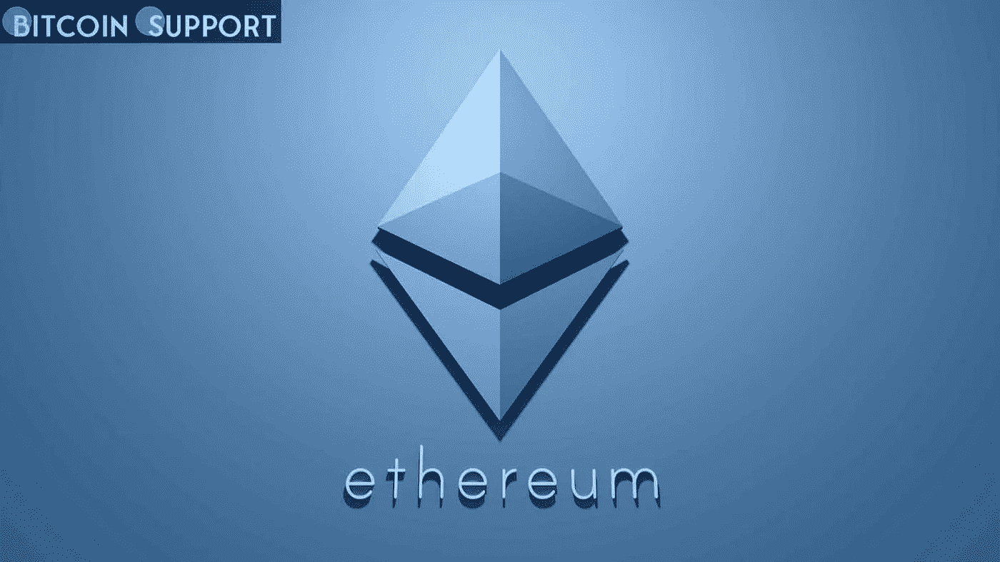
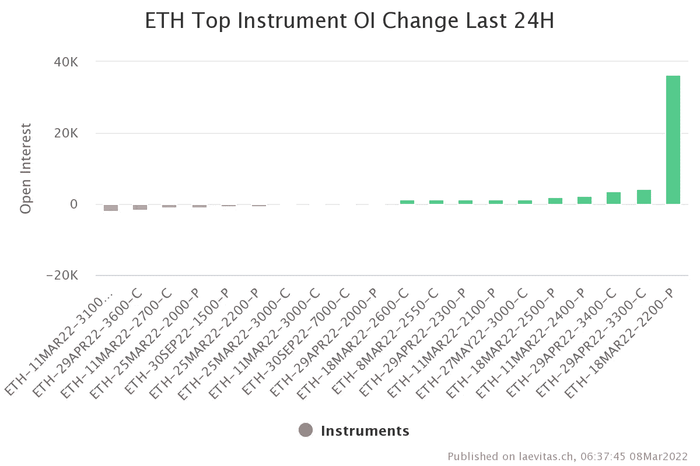
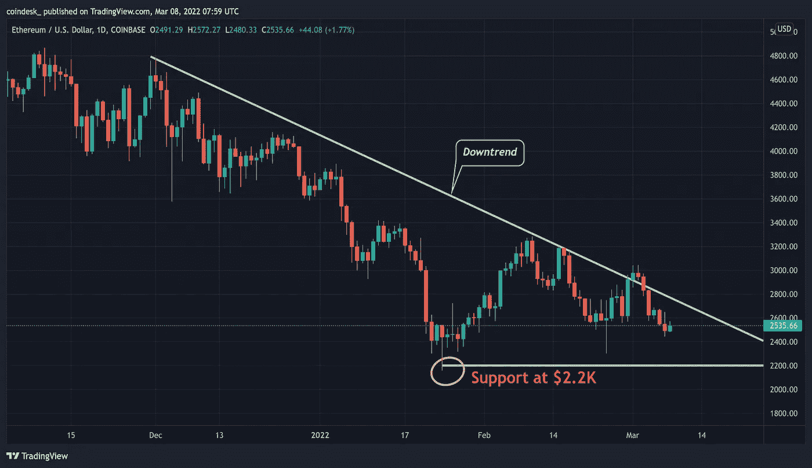
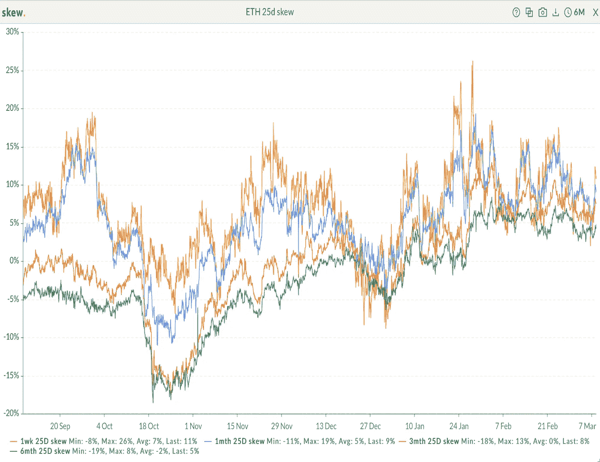

# 大以太网期权流保护价格不跌破 22k 美元

> 原文：<https://medium.com/coinmonks/the-large-ether-options-flow-protects-the-price-from-falling-below-2-2k-852a96907c72?source=collection_archive---------57----------------------->

**Visit our website:-** [**https://bitcoinsupports.com/**](https://bitcoinsupports.com/)

一位目击者称，老练的交易员获得了看跌期权，以防范价格继续下跌。

**Visit our website:-** [**https://bitcoinsupports.com/**](https://bitcoinsupports.com/)

周一，随着以太网跌至 10 天低点，市场参与者押注这种第二大加密货币不会进一步下跌。

根据总部位于瑞士的数据跟踪公司 Laevitas 的数据，一名交易员或多名交易员购买了 3 月 18 日到期的逾 3.6 万份 Deribit 上市的以太看跌期权合约，其中逾 2 万份合约在专注于机构的场外交易技术平台 Paradigm 上被禁。如果乙醚价格在 3 月 18 日跌破 2200 美元，看跌期权买家将获利。这比目前每股 2514 美元的市场价格下降了 13%。

场外交易技术平台 Paradigm 的机构销售和交易总监 Patrick Chu 表示，**“我们昨天看到对 3 月 18 日 2200 点期权的大量需求，因为玩家试图在 ETH 重要的 2200 点支点水平获得短期保护。”**

三年前，全球交易量和持仓量最大的加密期权交易所 Deribit 和 Paradigm 推出了面向机构的大宗交易服务。Paradigm 协助的交易在 Deribit 自动完成、保证金和清算。大宗交易是双方私下协商并在场外完成的大批量交易。

一个 ETH 由 Deribit 上的一个 ETH 期权合约代表。看跌期权为买方提供了在特定日期或之前以确定的价格出售标的资产的权利，但没有责任。看跌期权的买方在市场上是隐含地消极，而看涨期权的买方是隐含地积极。当在现货或期货市场长期持有的交易者担心资产价格会暂时下跌时，他们会买入看跌期权。然而，一些交易者使用期权作为投机的工具，通过在当前市场价格附近买入看跌期权并在低于市场价格的情况下卖出同等数量的看跌期权，或者通过创造价差(在当前市场价格附近买入看跌期权并在低于市场价格的情况下卖出同等数量的看跌期权)来表达他们的看跌偏见。根据 Laevitas 的说法，周一报告的 2200 美元看跌期权中的大多数交易都是简单的多头，似乎不是复杂期权计划的一部分。在一次 Twitter 聊天中，莱维塔斯补充道，“大多数都是直接交易，可能是短期对冲。”

**Visit our website:-** [**https://bitcoinsupports.com/**](https://bitcoinsupports.com/)

自 11 月以来，乙醚一直呈下降趋势。1 月下旬，卖家在 2200 美元左右失去动力，巩固了作为关键支撑的心理水平。

自 1 月下旬以来，期权市场一直处于熊市状态，一周、一周、三个月和六个月的看跌期权都显示出正值。看跌期权相对于看涨期权的成本是通过看跌期权偏态来衡量的。

**访问我们的网站:**[**https://bitcoinsupports.com/**](https://bitcoinsupports.com/)

**免责声明:以上均为作者个人观点，不应视为投资建议。读者应该做自己的研究。**